# Blueprint completo — CRM agent-native independente

Gerado a partir dos cinco volumes autorais e anexos. Data da pesquisa: 2026-09-09. Comece pelo [índice técnico](technical-index.md), pelo [registro de evidências](evidence-ledger.md) e pelos [limites da validação](validation.md). Este documento não é implementação nem certificação; aquisição integral de arquivos não equivale a auditoria semântica integral.

## Sumário das 90 seções

### Volume I — Evidence and Reverse Engineering

- [1. Research methodology](#section-1)
- [2. Repository inventory](#section-2)
- [3. Dependency topology](#section-3)
- [4. Architectural map](#section-4)
- [5. Entrypoints](#section-5)
- [6. Agent internal model](#section-6)
- [7. Agent lifecycle](#section-7)
- [8. Execution runtime](#section-8)
- [9. Prompt construction](#section-9)
- [10. Context assembly](#section-10)
- [11. Tools](#section-11)
- [12. Skills](#section-12)
- [13. agents-skills](#section-13)
- [14. Cross-repository relationships](#section-14)
- [15. Models and providers](#section-15)
- [16. State](#section-16)
- [17. Memory](#section-17)
- [18. Persistence](#section-18)
- [19. Events](#section-19)
- [20. Async and concurrency](#section-20)
- [21. Error handling](#section-21)
- [22. Security](#section-22)
- [23. Observability](#section-23)
- [24. Extension architecture](#section-24)
- [25. Tests and behavioral validation](#section-25)
- [26. Contradictions and uncertainties](#section-26)

### Volume II — Product and UI Analysis

- [27. CRM-Modelo product model](#section-27)
- [28. Public surface inventory](#section-28)
- [29. Information architecture](#section-29)
- [30. Visual design system observations](#section-30)
- [31. Navigation](#section-31)
- [32. Dashboard](#section-32)
- [33. Inbox](#section-33)
- [34. Conversations](#section-34)
- [35. CRM](#section-35)
- [36. Agents](#section-36)
- [37. Agent configuration](#section-37)
- [38. Tools](#section-38)
- [39. Skills/workflows](#section-39)
- [40. Integrations](#section-40)
- [41. Analytics](#section-41)
- [42. Settings](#section-42)
- [43. UX principles](#section-43)
- [44. Access limitations](#section-44)

### Volume III — Architectural Synthesis

- [45. Essential principles discovered](#section-45)
- [46. Implementation-specific decisions](#section-46)
- [47. Strengths of analyzed architecture](#section-47)
- [48. Weaknesses](#section-48)
- [49. Coupling](#section-49)
- [50. Scaling considerations](#section-50)
- [51. Reusable abstractions](#section-51)
- [52. Concepts to avoid copying](#section-52)

### Volume IV — New CRM Agent Platform

- [53. Product boundaries](#section-53)
- [54. System context](#section-54)
- [55. Domain architecture](#section-55)
- [56. Identity and tenancy](#section-56)
- [57. CRM](#section-57)
- [58. Messaging](#section-58)
- [59. Agent control plane](#section-59)
- [60. Agent execution plane](#section-60)
- [61. Agent data model](#section-61)
- [62. Model provider layer](#section-62)
- [63. Tool platform](#section-63)
- [64. Skill platform](#section-64)
- [65. Knowledge](#section-65)
- [66. Memory](#section-66)
- [67. Workflow engine](#section-67)
- [68. Automation engine](#section-68)
- [69. Event architecture](#section-69)
- [70. Realtime](#section-70)
- [71. Storage](#section-71)
- [72. Search](#section-72)
- [73. Integrations](#section-73)
- [74. Frontend](#section-74)
- [75. Security](#section-75)
- [76. Observability](#section-76)
- [77. Billing and metering](#section-77)
- [78. Deployment](#section-78)

### Volume V — Engineering Plan

- [79. Architecture decisions](#section-79)
- [80. MVP](#section-80)
- [81. MVP exclusions](#section-81)
- [82. Phase 2](#section-82)
- [83. Phase 3](#section-83)
- [84. Dependencies](#section-84)
- [85. Technical risks](#section-85)
- [86. Security risks](#section-86)
- [87. Scaling risks](#section-87)
- [88. Open questions](#section-88)
- [89. Implementation sequence](#section-89)
- [90. Acceptance criteria](#section-90)


---

# Volume I — Evidence and Reverse Engineering

Arquitetura observada em **A: Fazer Agents** e **repositório agents-skills**. Nada neste volume descreve a implementação privada do CRM-Modelo. Consulte primeiro o [índice técnico](technical-index.md), depois o [ledger](evidence-ledger.md). Links E identificam registros completos de evidência.

<a id="section-1"></a>

## 1. Research methodology

O procedimento utilizado foi: hipótese → definição → implementação → referências → caller → callee → configuração/schema → teste → posição no runtime → interpretação delimitada. Exemplos e README só entraram depois do caminho executável. Para ausência, a conclusão é restrita ao snapshot e aos caminhos pesquisados: não encontrar `Skill` em um schema não prova sozinho que nenhum plugin possa existir; foi necessário verificar também montagem de prompt, montagem de ferramentas, imports, manifest e integração MCP.

Precedência aplicada: implementação > testes > tipos > schema/config > exemplos > documentação > README > marketing. Um comentário de código também é texto documental, não comportamento executável. As linhas citadas são do commit fixado; os snapshots podem diferir da implantação atual dos mantenedores.

HIGH: definição, construção e cadeia principal inspecionadas, frequentemente com teste. MEDIUM: mecanismo parcialmente rastreado ou inferência com limites claros. LOW: apenas cobertura estrutural ou alternativa não validada; o motivo deve acompanhar. Não se atribui confiança alta a ausência universal de feature em deploy privado.

Aquisição completa não significa leitura profunda uniforme. Foram excluídos do estudo semântico vendor, artefatos gerados sem função arquitetural e assets decorativos. Lockfile, client Prisma gerado e código instalado de ToolNode foram usados onde delegação mudava a resposta. O registro `reads.jsonl` mede arquivos processados pelo leitor, **não** prova leitura humana de todos os bytes: saídas podem ter sido filtradas ou truncadas.

<a id="section-2"></a>

## 2. Repository inventory

| Aspecto | agents | agents-skills |
|---|---|---|
| Arquivos versionados | 1.605 | 66 |
| Linhas textuais aproximadas | 577.698, incluindo lock/generated/docs | 6.994 |
| Arquivos `*.test.*` no inventário | 664 | 0 |
| Manifesto | `package.json`, `bun.lock`, `.bun-version`, `bunfig.toml` | manifests de plugin/marketplace; não há package runtime |
| Entradas | `src/index.ts`, `src/app.ts`, cliente SPA | três `SKILL.md`; scripts de operação |
| Dados | `prisma/schema.prisma`, migrations SQL, bootstrap de papéis | samples JSON de importação, templates Compose |
| Runtime relevante | `src/graph`, `src/modules`, API, features, lib | scripts Python/TS executados pelo operador/assistente externo |
| Build/CI | Bun build, TypeScript, Tailwind, OpenAPI, testes, publicação de imagem, worker CDN separado | distribuição de pacote de instruções; não há suíte de runtime própria |

[CODE] A possui frontend React 19, servidor Elysia sobre Bun, Prisma/PostgreSQL, pgvector, LangChain/LangGraph e QuickJS. O lock adquirido fixa, entre outros, LangGraph 1.4.12, core 1.2.9 e checkpoint-postgres 1.0.5. A versão do executável especificada é Bun **1.4.2**; os testes locais usaram **1.3.14**, divergência registrada. Manifest version `0.0.0` não identifica release implantado. [Manifest](sources/agents/package.json), [lock](sources/agents/bun.lock), [runtime pin](sources/agents/.bun-version).

[CODE] CI de testes configura PostgreSQL com pgvector e quatro shards; preload DOM precede setup. O `bunfig.toml` limita descoberta a `tests`, portanto arquivo de teste sob `src` não é automaticamente parte da execução usual. Build verifica tipos, worker e sincronização de OpenAPI/i18n; a existência dessas etapas não prova que o commit esteja verde em CI — resultado remoto não foi usado. [test workflow](sources/agents/.github/workflows/test.yml), [build workflow](sources/agents/.github/workflows/build-check.yml), [bunfig](sources/agents/bunfig.toml).

O índice enumera migrations, exemplos, prompts, templates, configuração, CI e scripts, além dos módulos de aplicação. Fontes permaneceram sem modificações da pesquisa; instalação e geração de dependências ocorreram na cópia temporária.

<a id="section-3"></a>

## 3. Dependency topology

[CODE] Diagrama 1 — dependências observadas, não infraestrutura proposta. E01, E11, E19, E21, E30.

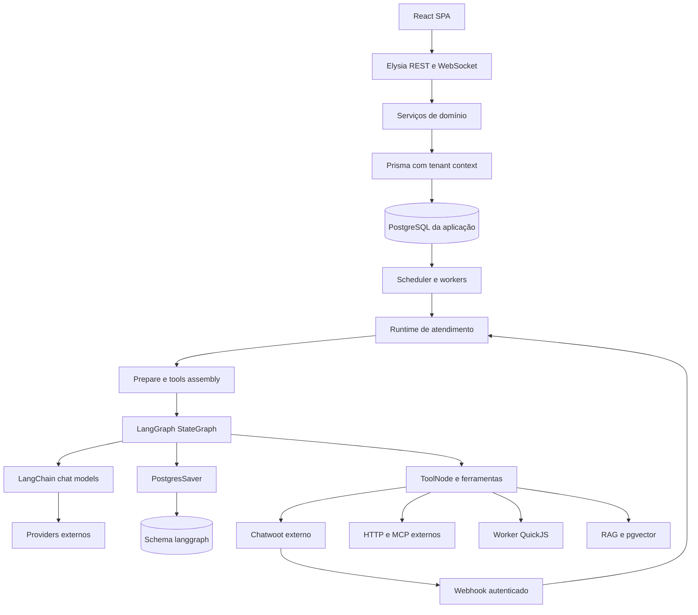

Não há Redis/Kafka/Temporal no grafo de execução descrito acima. Templates que implantam **outros serviços**, como Chatwoot e Langfuse, podem conter outras dependências; não transportá-las para o runtime Agents por associação. Estado de aplicação e checkpoints podem compartilhar servidor PostgreSQL, mas são stores e clientes diferentes.

<a id="section-4"></a>

## 4. Architectural map

O [índice técnico](technical-index.md) contém Module, Path, Responsibility, Public/Internal API, Dependencies, Dependents, Runtime relevance e Confidence. São 103 agrupamentos estruturais de A, mais os três pacotes e a distribuição de B; os módulos críticos têm responsabilidade reconstruída e referência E. Para agrupamentos não profundamente rastreados, `UNKNOWN` impede que uma lista de arquivos se transforme em conclusão de runtime.

| Papel arquitetural comprovado | Implementação | Quem constrói / usa |
|---|---|---|
| Composição | `src/index.ts`, `src/app.ts` | processo Bun → app/handlers/workers |
| Orquestrador conversacional | `runAgentTurn`, `runLoadedTurn`, `runTurnBody` | webhook/debounce → prepare/grafo/entrega |
| Objeto persistido | Prisma `Agent` | serviço CRUD → loader de turno |
| Configuração carregada | `LoadedAgentConfig` em prepare | loader → builders |
| Factory de modelo | `createChatModel` | builder primary/fallback → SDK provider |
| Registry de jobs | handlers de scheduler | boot registra; tick despacha |
| Adapters de ferramentas | native/HTTP/MCP/CODE/RAG/document/toolpacks | grants → buildToolset → ToolNode |
| Storage de diálogo | PostgresSaver | compile → invoke/getState/updateState |
| Storage operacional | Prisma scoped + SQL específico | serviços → banco com RLS |
| Pub/sub local | realtime publisher | boot injeta Bun.publish; serviços emitem |

[INFERENCE, HIGH] A é um monólito modular com runtime de atendimento especializado e workers internos. A conclusão deriva de boot + chamadas + bancos, não da organização de diretórios. Não há necessidade de imaginá-lo como coleção de microsserviços para explicar o código. [E01](evidence-ledger.md#e 01), [E05](evidence-ledger.md#e 05), [E21](evidence-ledger.md#e 21).

<a id="section-5"></a>

## 5. Entrypoints

[CODE] Há dois tipos que não devem ser confundidos:

- Controle: REST de agentes e ferramentas; MCP para autoria/operação; console SPA. Persistem configuração, sem necessariamente executar modelo. POST `/v1/agents` exige papel administrativo de tenant e delega ao serviço. [E02](evidence-ledger.md#e 02).
- Execução: webhook Chatwoot; processamento diferido/debounce; nudges/follow-ups e recuperação por jobs; playground. Compartilham partes do prepare/grafo, mas não todos os gates e side effects. [E03–E07](evidence-ledger.md#e 03), [playground](sources/agents/src/modules/playground/service.ts), [debounce handler](sources/agents/src/modules/debounce/handler.ts).

O receiver valida rota e assinatura antes do parse JSON. O controller retorna ACK após iniciar processamento assíncrono não aguardado. A claim durável acontece em `recordAndProcessChatwootDelivery`, não em `receiveChatwootWebhook`. Recuperação de deliveries já persistidas não elimina, por si, a janela anterior à persistência. [CODE + INFERENCE, HIGH no ordering / MEDIUM no risco de crash] [controller:23–72](sources/agents/src/api/v1/chatwoot.controller.ts), [E03](evidence-ledger.md#e 03).

Playground não deve ser vendido como sandbox universal: natives de conversa e documentos têm simulação; mocks do operador podem substituir tools; outras categorias podem executar de verdade. O código monta o toolset, aplica mocks e só então constrói o grafo. [CODE, HIGH] [playground:237–450](sources/agents/src/modules/playground/service.ts).

<a id="section-6"></a>

## 6. Agent internal model

[CODE] Representação observada primeiro — Diagrama 2:

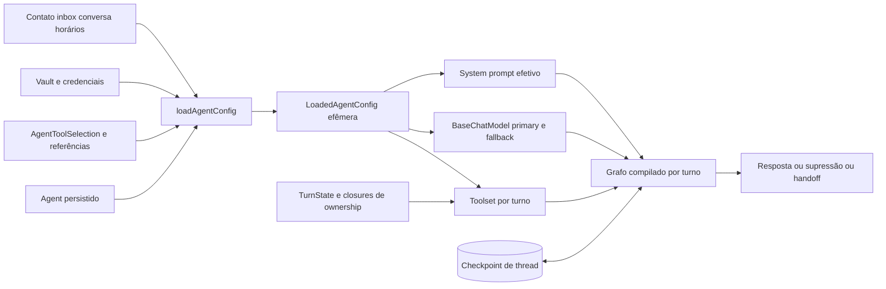

Não há uma classe única que reúna toda a anatomia. `Agent` no schema é registro editável; `LoadedAgentConfig` é snapshot efêmero; o grafo é objeto executável; o thread e a conversa têm vida própria. [E02](evidence-ledger.md#e 02), [E05](evidence-ledger.md#e 05), [E08](evidence-ledger.md#e 08), [E19](evidence-ledger.md#e 19).

Comparação posterior com o modelo conceitual pedido:

| Item | Existe / localização | Estado ou config; mutabilidade / persistência | Runtime |
|---|---|---|---|
| Identity | Agent.id, tenantId, name | configuração editável persistida | seleção e audit |
| Instructions | systemPrompt, variantes, overrides | prompt editável; override efêmero | assembly → SystemMessage |
| Model | modelConfig JSON | config persistida; SDK por turno | LLM invoke |
| Provider | discriminante + vault ref | config/credencial separadas | factory e transporte |
| Context | attrs, tempo, history, mensagem | mistura de config e estado | prompt + mensagens |
| Memory | AttendanceSummary + memory head | derivado persistido, compactável | thread em turns futuros |
| Knowledge | KB/chunks/documents | persistido fora de Agent | ferramenta RAG |
| Skills | não há entidade/carregador no caminho analisado | `SKILL.md` de autoria fora do runtime | alteração indireta de config, não execução |
| Tools | selections e defs/connections | config mutável persistida; objetos efêmeros | bind/invoke/result |
| Permissions | IAM de autor, grants, preconditions, tenancy | políticas em múltiplas camadas | edição e chamada; não uma ACL universal de Agent |
| Hooks | callbacks/status/flowlog | código e contexto efêmero | LLM/tools/entrega |
| Triggers | webhook, jobs, follow-up | bindings/settings + estado durável de jobs | antes do turno |
| Guardrails | settings + analyzer | config persistida, veredicto efêmero | input/output; erro analisador fail-open |
| Runtime | StateGraph + runtime.ts | estado efêmero e checkpoint persistido | orquestração completa |

[CODE] Não se localizou AgentVersion/AgentDeployment/AgentRun como modelos Prisma. `updatedAt`, auditoria, experimento de prompt e formato de exportação não são equivalentes a versionamento imutável de dependências. Isso limita replay exato após alterações. [INFERENCE, HIGH] [schema Agent](sources/agents/prisma/schema.prisma), [E18](evidence-ledger.md#e 18).

<a id="section-7"></a>

## 7. Agent lifecycle

[CODE] Criação: controller valida forma → serviço strict Zod valida valores/config e referências visíveis → transação cria Agent → audit → eventual armamento de follow-up. Default do serviço `mode=test` difere do default de banco `production`; o import explicitamente cria desabilitado e em teste. São caminhos distintos, não contradição automática. Cliente que escreve direto no banco contornaria semântica do serviço. [E02](evidence-ledger.md#e 02), [importAgent](sources/agents/src/modules/agents/transfer.ts).

Configuração de tools: normalização → locks de nomes e Agent → optimistic concurrency opcional → validação de alvos → substituição delete/create dentro da mesma transação → timestamp/audit → broadcast fora dela. A relação referencia IDs de definições, não cópias imutáveis. [E18](evidence-ledger.md#e 18).

Execução: binding de inbox encontra Agent → enabled/mode/monitoring e gates operacionais → load → tool/model/grafo por turno → invocação/checkpoint → entrega/supressão → cleanup. Desabilitar ou transferir atendimento durante um turno não desfaz efeitos já produzidos; fences tentam impedir próximas ações/entregas. [E04–E07](evidence-ledger.md#e 04).

<a id="section-8"></a>

## 8. Execution runtime

Os [oito casos rastreados](execution-cases.md) explicitam caller, input, validação, transformações, construção, invoke, mutação, persistência, eventos, saída, erro e cleanup. Diagrama 3 — caminho reativo observado:

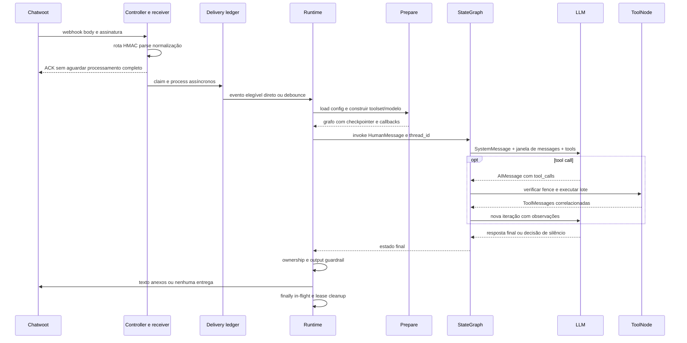

[CODE] O estado base é `MessagesAnnotation`; grafo possui nós `agent` e `tools`. Com tools, `toolsCondition` decide continuar ou END; sem tools, ligação agent→END. `ToolNode` de dependência instalada executa lote por `Promise.all`, portanto não serializa efeitos entre ferramentas do mesmo lote. Essa parte foi verificada no código da dependência, não inferida da documentação LangGraph. [E09](evidence-ledger.md#e 09), [ToolNode instalado, snapshot auxiliar](dependency-runtime.md).

[CODE] Limite soft antecipa o fim; hard normalmente invoca modelo sem ferramentas. Exceção: protocolo de silêncio com `skip_reply` e ferramentas companheiras pode deixar apenas `skip_reply` disponível. Não basta observar uma tool call com esse nome: resultado efetivo e possíveis recusas importam. Os testes verificam que narrativa lateral é apagada sem destruir metadados/tool_calls assinados. [agent-node tests](sources/agents/tests/graph/agent-node.test.ts).

<a id="section-9"></a>

## 9. Prompt construction

[CODE, HIGH] O prompt efetivo não é só `Agent.systemPrompt`:

1. Escolhe `override.systemPrompt ?? experimentPrompt ?? agent.systemPrompt`.
2. `composeSystemPrompt` aplica trim e acrescenta grounding se `search_knowledge` foi concedida.
3. Constrói variáveis de contato/agente/canal/tempo/horários; dados textuais são sanitizados e limitados.
4. Interpola placeholders reconhecidos. Chaves desconhecidas permanecem literais.
5. Acrescenta seção de atributos e, quando disponível, agenda.
6. `buildModelAndGraph` acrescenta contexto/instruções de servidores MCP.
7. A cada chamada, `agentNode` usa **um novo SystemMessage**, eliminando system messages antigos do histórico; instruções de limite podem alterar esse texto nesse hop.

[E08](evidence-ledger.md#e 08), [E10](evidence-ledger.md#e 10), [E16](evidence-ledger.md#e 16), [E09](evidence-ledger.md#e 09).

Concatenação não implementa uma hierarquia de segurança. Estar mais tarde no mesmo SystemMessage não produz precedence determinística de autorização. Descrições de tools recebem base + orientação do operador + vocabulário contextual em certos natives; são transmitidas no contrato de tools do provider, não necessariamente no texto do system. [native:246–253](sources/agents/src/graph/tools/native.ts).

<a id="section-10"></a>

## 10. Context assembly

[CODE] Diagrama 4 — Context Assembly Pipeline:

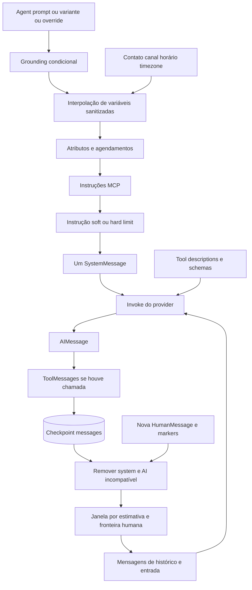

| Fonte | Canal real / política |
|---|---|
| Instrução de sistema/agente/runtime | fundidas no SystemMessage corrente |
| Skill instructions | ausentes como fonte runtime direta; autoria pode gravar Agent.systemPrompt |
| Memória | memory head no histórico como HumanMessage, não banco vetorial universal |
| Conversa | checkpoint + ingest + entrada corrente + markers de attendance/handback |
| Conhecimento | resultado de search_knowledge, só quando invocado |
| Metadata | attrs interpolados/seções; additional_kwargs para stamps; callbacks para audit |
| Tool result | ToolMessage correlacionada ao tool_call_id |
| User message | HumanMessage renderizada; mídia pode passar por STT/vision e virar contexto textual |

[CODE] `selectHistoryWindow` estima tokens por `tokenx`, inclui JSON de tool_calls e overhead de mensagem, recorta prefixo antigo sem partir a última unidade humana. Não inclui system nem schemas de ferramentas no orçamento e mantém último turno mesmo maior que o teto. Consequentemente `maxHistoryTokens` não é `maxRequestTokens`. Nenhuma remoção de checkpoint acontece nessa seleção. [E31](evidence-ledger.md#e 31), [token-count](sources/agents/src/graph/token-count.ts).

Serialização para o wire é do adapter provider; uma lista abstrata de BaseMessage não demonstra bytes finais uniformes. Request ilustrativo e suas limitações estão no anexo de casos. Não foi capturado tráfego de produção ou token secreto.

<a id="section-11"></a>

## 11. Tools

### Definição até resultado

[CODE] Native é código + schema Zod; HTTP é definição persistida com campos de entrada e request template; CODE é definição persistida com corpo JavaScript; MCP vem do servidor externo; integrations expõem toolpacks; RAG e documentos têm builders próprios. `AgentToolSelection` relaciona o agente aos recursos e subsets permitidos. [E11–E17](evidence-ledger.md#e 11).

Diagrama 5 — end-to-end:

```mermaid
flowchart LR
  Def[Definição ou servidor MCP] --> Grant[AgentToolSelection]
  Grant --> Build[Builder por origem]
  Build --> Merge[Merge e dedupe de nomes]
  Merge --> Pre[Wrapper de precondições]
  Pre --> Bind[Model.bindTools]
  Bind --> Call[AIMessage.tool_calls]
  Call --> Fence[Fence do turno]
  Fence --> Node[ToolNode por nome]
  Node --> Parse[Zod via StructuredTool]
  Parse --> Exec[Função real e efeitos]
  Exec --> TM[ToolMessage com tool_call_id]
  TM --> LLM[Próxima chamada do modelo]
```

[CODE] Ordem de merge em prepare: native → document → HTTP → CODE → MCP → toolpacks → RAG. Nomes reservados de nativas desligadas também participam da proteção contra colisão. Dedupe mantém uma definição e informa perdas em log/flow; regras de precondição por nome que não encontram ferramenta geram aviso, mas não protegem outra coisa automaticamente. [E11](evidence-ledger.md#e 11).

[CODE] Schema HTTP é uma DSL de campos convertida a Zod — não aceitar como provado suporte irrestrito a todo JSON Schema. Campos `source=ai` vão ao modelo; valores de contexto/config/segredo são resolvidos no servidor. Path params são codificados; alterações indevidas de origem e hostname são verificadas; redirects não são seguidos livremente. Headers/body passam por transformações específicas e response template limita texto. [E14](evidence-ledger.md#e 14).

Argumentos são validados dentro de `StructuredTool` antes de `_call`; nome inexistente e parse error podem virar observação de erro via `ToolNode`. `failableTool` converte falha declarada para `ToolMessage.status=error`; exceções ordinárias são capturadas por ToolNode, com exceção de interrupções especiais da biblioteca. O modelo pode tentar corrigir argumentos na próxima iteração. Isso é raciocínio do modelo, não retry automático garantido da operação. [E15](evidence-ledger.md#e 15), [dependência](dependency-runtime.md).

### Governança realmente encontrada

| Controle | Observado | Limite |
|---|---|---|
| Grants | subsets, refs tenant-scoped, enabled | ausência de grant NATIVE permite defaults; [] desliga |
| Preconditions | wrapper relê attrs/conversa a cada chamada | erro de leitura recusa; não equivale a IAM completo |
| Turn fence | consulta stillWanted antes do lote | erro nesse check deixa tools executar nesse ponto |
| Credenciais | vault refs resolvidas servidor, scoped | modelos/providers recebem segredo; retorno/log exigem redaction |
| HTTP | URL/host/SSRF, timeout/body limits | nenhuma promessa exactly-once ou rollback remoto |
| CODE | Worker+QuickJS, 1 s, 32 MiB, stack 256 KiB, fila8 | não é isolamento universal de HTTP/MCP; teste de timing variável |
| MCP | conexão/OAuth, allowlist, namespace, cache por tenant | servidor externo é parte da trust boundary; stdio depende config |
| Aprovação | fila de sugestão de conhecimento | não há aprovação humana geral para toda write tool |

[CODE] Handoff é exemplo concreto de parcialidade: nota → abrir status → marcar handoff concluído → tentar assignment. Falha no assignment pode ser registrada sem reverter status nem transformar toda operação em falha. Teste afirma sucesso de handoff apesar da falha de assignment. [E37](evidence-ledger.md#e 37), [tests:840–870](sources/agents/tests/graph/tools.test.ts).

<a id="section-12"></a>

## 12. Skills

[DOC + CODE, HIGH] Neste ecossistema observado, skill é **pacote de assistência para um agente de desenvolvimento/operação externo**, contendo instruções, referências e eventualmente scripts/templates/samples. Não é sinônimo de tool do cliente final e não é uma entidade `Skill` persistida pelo Agents.

Diagrama 6 — significado operacional:

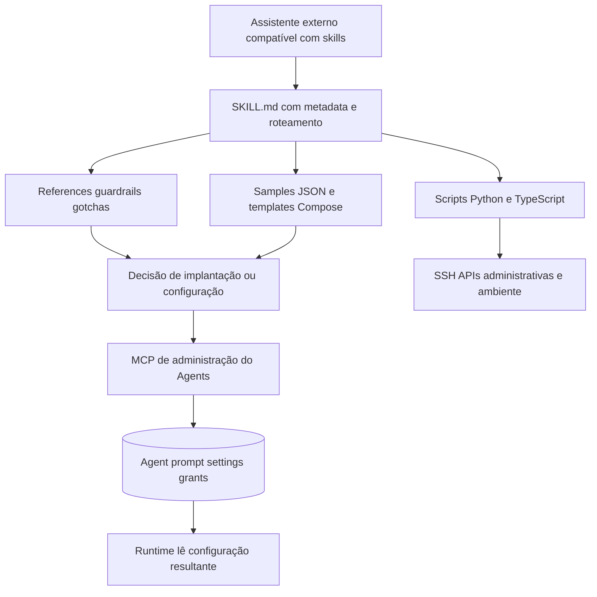

Setas Host→Entry e instrução→ação representam uso prescrito pelo pacote; o código do host que seleciona/lê SKILL.md não está nos repositórios, portanto esse mecanismo interno é UNKNOWN. O efeito final via configuração possui implementação verificável no Agents. [E34](evidence-ledger.md#e 34), [E36](evidence-ledger.md#e 36).

<a id="section-13"></a>

## 13. agents-skills

| Pacote | Intenção prescrita e conteúdo | Efeito material possível | Limite de evidência |
|---|---|---|---|
| agents-onboarding | instalação, tiers, DNS/SSH, Chatwoot, Agents, Langfuse, setup/MCP/import/bind/e 2e | scripts administram infraestrutura; JSON define agente/tools/settings | instrução não demonstra deploy bem-sucedido |
| agents-dev | obter código, layout/check, invariantes/edições, implementar e publicar imagem | orienta alteração de fonte de A | nenhum compilador de skill ou agente dev residente em A |
| agents-operation | segurança de produção, diagnosticar/reproduzir/ajustar/validar, simular carga | MCP muda config; script gera tráfego Chatwoot de teste | script de carga não é suíte automatizada de assertions |

[DOC] Os três entrypoints têm metadata e roteamento progressivo para referências. Recursos são caminhos relativos no pacote. Dependências operacionais são declaradas em instruções/templates: acesso SSH, APIs de implantação, Chatwoot e MCP, não dependências importadas por runtime Agents. [onboarding](sources/agents-skills/skills/agents-onboarding/SKILL.md), [dev](sources/agents-skills/skills/agents-dev/SKILL.md), [operation](sources/agents-skills/skills/agents-operation/SKILL.md).

[CODE] Scripts são código de verdade: `remote.py` valida argumentos, prepara ssh e envia conteúdo por stdin; helpers chamam APIs administrativas; `simulate-load.py` usa concorrência por threads e chamadas HTTP para gerar contatos/conversas/mensagens. Não foram executados: poderiam administrar instalações ou emitir mensagens externas. Código auxiliar não implica ferramenta concedida ao agente de atendimento. [E36](evidence-ledger.md#e 36), [load script](sources/agents-skills/skills/agents-operation/scripts/simulate-load.py).

[DOC] Samples importáveis demonstram a meta-layer: uma configuração de clínica extensa e outra de transportadora com HTTP/CEP. O import lê formato versionado do arquivo, remapeia recursos/credenciais e cria Agent; não instala um pacote Skill no banco. A versão do formato JSON e a versão do plugin não são versões imutáveis de Agent. [samples](sources/agents-skills/skills/agents-onboarding/samples/agents), [import procedure](sources/agents-skills/skills/agents-onboarding/references/08-agent-import.md), [transfer runtime](sources/agents/src/modules/agents/transfer.ts).

Lifecycle do pacote: distribuição → leitura seletiva por host externo → operação guiada → alteração de infraestrutura/configuração → runtime normal. Dependências semver de skills, resolver de conflitos entre skills instaladas, compatibility matrix e loader de skills em cada turno: **UNKNOWN/não encontrados nesse runtime**. A instalação pelo CLI citado na documentação tem implementação externa não adquirida; não se reconstrói esse CLI a partir do comando anunciado.

<a id="section-14"></a>

## 14. Cross-repository relationships

[CODE + DOC, HIGH] A inclui cópias de três skills em `.claude/skills`; comparação de conteúdo com B encontrou correspondência dos arquivos compartilhados, com quatro recursos adicionais em B (gerador de ambiente e três templates de implantação de Agents). Isso prova distribuição/vendoring de material de autoria; não package dependency de runtime. A não importa `agents-skills` em package.json, e os caminhos prepare/graph/tools não leem SKILL.md.

Diagrama 8 — arquitetura cruzada:

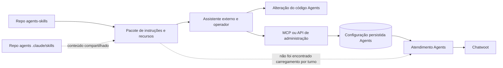

Respostas: A conhece material de B por vendoring/autoria, não import runtime; B conhece A por procedimentos, MCP, templates e samples; ligação direta de package runtime não; ligação por filesystem no host de skills sim, prescrita; CLI externo anunciado mas implementação UNKNOWN; runtime loading no atendimento não encontrado. A seta pontilhada final representa explicitamente **ausência de mecanismo encontrado**, não uma integração opcional comprovada.

<a id="section-15"></a>

## 15. Models and providers

[CODE] `ModelConfig` valida provider/model/baseURL/credential refs e parâmetros; factory resolve OpenAI, compatible, OpenRouter, Anthropic, Google e DeepSeek. O objeto comum é BaseChatModel, usado por `.invoke` e `.bindTools`; comportamento de transporte continua específico. [E30](evidence-ledger.md#e 30).

| Abstração | Genérico no app | Vazamento concreto |
|---|---|---|
| Invocação | BaseMessage → BaseChatModel.invoke → AIMessage | response metadata e content blocks variam |
| Tools | lista de StructuredTools | Gemini recebe conversão de schemas |
| Reasoning | campo configurável | OpenAI decide Responses vs Chat Completions e effort; monkey-patch de bindTools |
| Temperature | configuração comum | omitida em modelos OpenAI reasoning; Anthropic não a recebe nessa factory |
| Timeout | tentativa de orçamento por chamada/fallback | Google não recebe timeout no construtor mostrado; wrapper também controla prazo |
| Endpoint | baseURL possível | compatible exige baseURL; OpenRouter default específico |
| Structured output | usado em caminhos como guardrails | modo/parse específicos; resposta conversacional não é sempre JSON estruturado |
| Multimodal | STT/vision/TTS em módulos dedicados | isso não prova imagem/áudio bruto no invoke principal |
| Streaming | status/callbacks/realtime existem | principal caminho rastreado usa invoke, não stream de tokens ao cliente |

[CODE] Fallback não é load balancer multi-modelo: recurso configurado separadamente, credencial resolvida separadamente, estados transitórios/timeout/empty completion elegíveis; primary recebe retries0 e timeout 45 s quando fallback utilizável. Após fallback, esse modelo continua no restante do turno. 401/403/404 e conexão genérica sem classificação adequada não recebem retry cego por outro provider. [E32](evidence-ledger.md#e 32), [fallback tests](sources/agents/tests/graph/model-fallback.test.ts).

<a id="section-16"></a>

## 16. State

[CODE] Existem pelo menos cinco planos de estado, com donos diferentes:

| Plano | Dados | Local / duração | Não confundir com |
|---|---|---|---|
| LLM context | SystemMessage, janela de mensagens, schemas | request de um hop | histórico persistido completo |
| Runtime | pendingAttachments, resolveRequested, handoffState, fallback flag | closures do turno | registro durável AgentRun |
| Conversation state | owner/status/watermarks/test activation | mirror Prisma e Chatwoot | memory head |
| Persistent application state | Agent/config/tools/jobs/vault/KB/audit | tabelas PostgreSQL | checkpoint de raciocínio |
| Agent memory derivada | AttendanceSummary e memory head | banco + mensagens checkpoint | base de conhecimento vetorial |

Diagrama 7 — estado/memória:

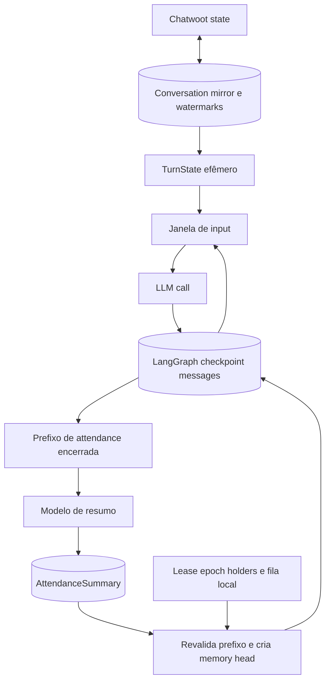

<a id="section-17"></a>

## 17. Memory

[CODE] Memória existe, mas precisa de nome preciso: histórico persistido por thread, resumos de atendimentos e head de memória. Thread preferencialmente usa `contactInboxId`, permitindo reunir atendimentos da mesma relação; fallback usa conversation id, sempre com tenant/instance no identificador. Isso não significa compartilhamento geral entre todos os contatos/inboxes. [E19](evidence-ledger.md#e 19).

Compactação: job decide elegibilidade, espera grace de atendimento encerrado quando aplicável, drena ingest pendente, recusa thread ocupado, encontra prefixo fechado, reutiliza resumo existente ou invoca summarizer, salva AttendanceSummary, entra em fila, relê state, valida IDs do prefixo, reúne até 20 resumos e reescreve somente trecho confirmado. Mensagens novas fora do prefixo sobrevivem. [E20](evidence-ledger.md#e 20).

[CODE] Resumo filtra mensagens técnicas, diferencia cliente/humano, limita transcript e utiliza modelo com instruções específicas. Erro retorna resultado de falha sem reescrever thread. É transformação lossy: notas em tools e detalhes excluídos não reaparecem por mágica. Histórico de resumos salvo pode ser maior que o head apresentado. [E38](evidence-ledger.md#e 38).

[UNKNOWN] Não foi localizado sistema geral de memória semântica autobiográfica, CRUD de fatos com confiança/expiração ou retrieval de lembranças por relevância. Campos de contato e knowledge retrieval existem, mas classificá-los como essa memória seria contaminação conceitual.

<a id="section-18"></a>

## 18. Persistence

[CODE] Store transacional: Prisma + SQL manual para locking/RLS/vetor. Store de graph: PostgresSaver/pg.Pool no schema langgraph; inicialização memoiza a promise e chama setup. Se a primeira inicialização rejeitar, o código mostrado não limpa essa promise para reconstrução — [INFERENCE, MEDIUM] recuperação pode depender de restart; não testada com falha real. [E19](evidence-ledger.md#e 19).

Checkpoint não torna todo turno atomicamente durável com Chatwoot. Modelo pode terminar e checkpoint existir antes de envio; ferramenta pode mudar CRM remoto antes de local log; resumo pode ser salvo antes de rewrite. O código contém fences, watermarks, filas e recovery justamente para administrar essas fronteiras. [E07](evidence-ledger.md#e 07), [E20](evidence-ledger.md#e 20), [E37](evidence-ledger.md#e 37).

Jobs possuem status, claim token/sequência, tentativas e timestamps em `SchedulerJob`; deliveries possuem seus próprios ledgers. Arquivos/documentos e mídia têm storage e lifecycle específicos, não são todos blobs de Agent. Retention é job separado. [scheduler schema](sources/agents/prisma/schema.prisma), [scheduler service](sources/agents/src/modules/scheduler/service.ts), [document modules](sources/agents/src/modules/documents).

<a id="section-19"></a>

## 19. Events

[CODE] Há eventos de várias naturezas: flowlog operacional; callbacks LLM/tools; publicação WebSocket local; deliveries outbound duráveis para assinantes; scheduler jobs. Isso não forma automaticamente um event bus universal com ordenação/replay de todos os domínios. [E23–E25](evidence-ledger.md#e 23).

`emitOutbound(tx, event)` consulta assinaturas e cria rows PENDING por destinatário; worker tenta entrega e agenda backoff. A atomicidade com a mudança de negócio depende da transação passada pelo caller. Flowlog escreve assíncrono com erro capturado; realtime publica localmente e pode perder eventos se cliente desconectado. Não se deve usar nenhuma dessas três coisas como sinônimo das outras.

<a id="section-20"></a>

## 20. Async and concurrency

[CODE] Boot inicia loops/timers. Scheduler usa seleção `FOR UPDATE SKIP LOCKED`, claim_seq e estados persistidos; tick executa lotes via `Promise.allSettled`, com lanes/semaphores. Tools no mesmo AIMessage são paralelas via dependência ToolNode. CODE usa Worker e fila; script de carga B usa threads Python. São quatro mecanismos distintos. [E21](evidence-ledger.md#e 21), [dependency](dependency-runtime.md), [E17](evidence-ledger.md#e 17), [load script](sources/agents-skills/skills/agents-operation/scripts/simulate-load.py).

`markTurnOwning` usa lease, epoch e **contagem de holders**; não é mutex exclusivo de turnos. Queue local, fencing de episódio, watermarks e claims de entrega tratam outras races. Chamar tudo de “lock de conversa” ocultaria qual parte protege compactação e qual protege envio. [E33](evidence-ledger.md#e 33).

Cancelamento é cooperativo e em camadas: ainda desejado? agente ainda fala? mensagem mais nova? dono humano? Nem todos os checks têm a mesma política em erro. Tool boundary deixa prosseguir se sua consulta falha; precondition não consegue ler estado e recusa. Shutdown para timers e sai, sem prova de drain de todos os requests/LLMs. [E09](evidence-ledger.md#e 09), [E01](evidence-ledger.md#e 01).

<a id="section-21"></a>

## 21. Error handling

| Erro / camada | Representação e propagação | Visibilidade / recovery |
|---|---|---|
| CRUD inválido | validators → AppError/status HTTP | operador recebe erro; não executa LLM |
| Token/HMAC inválido | 401 uniforme no receiver | remetente; sem turno |
| Model config/credencial inválida no load | indisponibilidade/null ou erro conforme ramo | health/log/operador; não presumir mensagem ao cliente |
| Provider transitório | classificação runModelCall/fallback | tenta fallback quando elegível; senão relança |
| Tool args/schema | parsing exception capturada por ToolNode | ToolMessage de erro ao modelo; pode corrigir |
| HTTP status esperado | texto de resultado | não necessariamente erro |
| HTTP/status inválido ou execução declarada falha | toolFailure → ToolMessage error | modelo e tool flowlog |
| Exceção tool | ToolNode normaliza erro; interrupção especial pode propagar | próxima iteração ou falha do grafo |
| Precondition false/unreadable | recusa textual correlacionada | sem executar função; turno pode continuar |
| Guardrail analyzer indisponível | unanalyzed e warning | fail-open nesse ponto |
| TTS falha | catch → fallback texto | cliente pode receber texto |
| Envio parcial | outcome parcial e registros de erro | não repetir cego o burst completo |
| Summarizer falha | resultado de erro, sem rewrite | job/log e retry conforme scheduler |
| Job lança | worker fail/reschedule/dead-letter conforme estado | operacional, recuperação limitada por budget |
| Flowlog/realtime falha | warning/catch | pode não chegar ao usuário; não reverte operação |

Fontes: [E03](evidence-ledger.md#e 03), [E07](evidence-ledger.md#e 07), [E14–E15](evidence-ledger.md#e 14), [E21](evidence-ledger.md#e 21), [E25](evidence-ledger.md#e 25), [E28](evidence-ledger.md#e 28), [E32](evidence-ledger.md#e 32). Notas privadas de failed-turn têm caminho próprio e dedupe; não alegar que toda exceção sempre vira mensagem pública.

<a id="section-22"></a>

## 22. Security

[CODE] Existem controles reais: tenant context transacional, políticas RLS nas migrations, bootstrap de papel sem superuser/BYPASSRLS, vault, scopes/grants, SSRF, precondições, assinatura webhook e sandbox CODE. Não se conclui segurança apenas por presença. [E26](evidence-ledger.md#e 26), [E27](evidence-ledger.md#e 27), [E17](evidence-ledger.md#e 17).

| Superfície | Evidência | Risco delimitado, não exploit confirmado |
|---|---|---|
| MCP server instructions no SystemMessage | E16 | [INFERENCE, HIGH] fonte remota influencia instruções privilegiadas |
| Resultado de HTTP/RAG/MCP reinjetado | E14/E22/ToolNode | [INFERENCE, HIGH] indirect injection e conteúdo malicioso |
| Tool descrições editáveis | E11/E18 | [INFERENCE, MEDIUM] poisoning por autor com poder de configurar |
| Check ainda desejado falha aberto | E09 | [INFERENCE, HIGH] execução pode ocorrer sob incerteza de cancelamento |
| Guardrail falha aberto | E28 | [INFERENCE, HIGH] classificador indisponível não bloqueia |
| SSRF lookup separado da conexão | E27 | [INFERENCE, MEDIUM] DNS TOCTOU a investigar, sem exploração |
| Playground externo real | serviço playground | [INFERENCE, HIGH] operador pode supor dry-run indevidamente |
| Checkpointer pool separado | E19/E26 | [UNKNOWN] equivalência de RLS ao store Prisma não demonstrada |
| Handoff parcial | E37 | [INFERENCE, HIGH] UI/modelo pode interpretar sucesso maior que efeito efetivo |

Sem pentest, sem garantia de ausência de vulnerabilidade e sem alegação de vazamento efetivamente ocorrido. Propostas de correção de arquitetura estão exclusivamente nos Volumes III/IV.

<a id="section-23"></a>

## 23. Observability

[CODE] FlowContext carrega correlação de turno/agente/tenant/conversa; callbacks ligam chamadas de modelo e ferramenta a status, uso e flowlog. `withFlowStage` mede e registra sucesso/erro, relançando falha da operação. Langfuse é opcional; LlmUsage e ExecutionLog são persistidos no app por seus caminhos. O próprio logging pode falhar e ser capturado. [E25](evidence-ledger.md#e 25), [usage](sources/agents/src/graph/usage.ts), [observability](sources/agents/src/graph/observability.ts), [callbacks](sources/agents/src/graph/prepare.ts).

Não há razão para denominar ExecutionLog de AgentStep transacional: ele registra observação, não controla commit de efeito. Tampouco um trace prova custo faturável exato em todos os providers; metadados de uso dependem do adapter e de persistência bem-sucedida. [INFERENCE, HIGH].

<a id="section-24"></a>

## 24. Extension architecture

[CODE] Pontos efetivos: nova definição HTTP ou CODE; novo servidor MCP com subset; integração/toolpack registrada; documento/KB selecionado; provider branch; novo handler scheduler; configuração e prompts via REST/MCP; edição de código assistida por agents-dev. [E11](evidence-ledger.md#e 11), [E21](evidence-ledger.md#e 21), [E30](evidence-ledger.md#e 30).

Extensões por configuração podem mudar o comportamento de próximos turnos sem release do binário. Extensões por código alteram builder/registry/serviços e dependem de release. Skills de autoria não criam automaticamente um registry de skills no cliente. Esquema de plugin do assistente externo não é o schema de ToolDefinition.

<a id="section-25"></a>

## 25. Tests and behavioral validation

Ambiente: Bun 1.3.14 versus pin 1.4.2; dependências do lock instaladas sem scripts de lifecycle; Prisma client gerado; `NODE_ENV=test`, `ALLOW_NO_DB=1`; nenhum segredo real de provider. Não foi configurado PostgreSQL. Logs preservados integralmente, inclusive erros esperados dos testes.

| Execução | Resultado verificado | Interpretação |
|---|---|---|
| `bun test` no sandbox | exit 1; 7.118 linhas `(pass)`, 6.395 `(skip)`, 36 `(fail)` | contagem de ocorrências do log, **não total único de testes**; parte de skips pode reaparecer no resumo; falhas de DNS/bind/processo e duas verificações estáticas exigem reprodução |
| 9 arquivos centrais fora da restrição de bind local | 352 testes, 351 pass, 1 fail, 801 assertions | runtime com modelos/ferramentas de teste; nenhum e 2e real |
| Falha CODE repetida isoladamente | 1 pass, 0 fail; 69 filtered | falha não reproduzida isoladamente; timing/ambiente são hipótese, não causa provada |
| Dois arquivos de verificações estáticas repetidos | 62 testes, 61 pass, 1 fail | i18n passou; scanner de fixtures novamente excedeu timeout de 5 s; não falhou por assertion nesse resultado |

[log geral](evidence/tests-suite.log), [metadados gerais](evidence/tests-suite.json), [log focused](evidence/tests-focused.log), [repeat](evidence/tests-sandbox-repeat.log). A lista de argumentos incluía arquivo em `src`, mas Bun usa root `tests`: o resumo informa nove arquivos, não dez. Não inflar cobertura.

| Funcionalidade | Implementation says | Tests demonstrate | Documentation claims / interpretação final |
|---|---|---|---|
| System prompt | remove system histórico e prepende novo | `agent-node`: exatamente um system, conteúdo novo | [TEST] corroborado; não acumula system antigos |
| Silêncio | resultado skip efetivo controla término/narrativa | tests cobrem recusa, companhia, limite, metadados | [TEST] protocolo não reduzível ao nome da chamada |
| Tool error | failableTool conserva texto e status error | `tool-failure` verifica id/nome/status/plain invocation | [TEST] erro pode voltar ao LLM sem matar turno |
| Precondition | reconsulta estado e recusa se unreadable | `tool-precondition` testa recusa e continuação no ToolNode | [TEST] não confundir com tool exception |
| Histórico | recorte de input por unidade humana | `history-window` e `agent-node` verificam janela | [TEST] não é delete do checkpoint |
| Fallback | classificação seletiva, sticky | tabela de errors e modelos scripted em `model-fallback` | [TEST] não fallback para qualquer 4xx/rede |
| CODE | limits e Worker+QuickJS | testes de loops, stack, memory, async unsupported; um falhou no recorte | [TEST] contrato parcialmente corroborado, não certificação de sandbox |
| Handoff parcial | assignment error capturado depois de abrir | `tools.test.ts:840–870` asserts sucesso+sideeffect error | [TEST] fonte inspecionada; execução geral não substitui e 2e Chatwoot |
| NATIVE [] | filtro Set vazio remove tudo | builders e testes de seleção inspecionados | [DOC] B diz todas; prevalece código |
| RLS/claims/checkpoint | SQL e wrappers tenant/epoch | muitos testes existentes exigem DB e foram skipped | [UNKNOWN] validação dinâmica local pendente |

Erros de rede observados não autorizam classificar todas as 36 linhas fail como “só ambiente”. `i18n-extract conflict detection` passou na repetição isolada; o scanner `scheduler fixture` voltou a exceder5 s. [Repetição estática](evidence/tests-static-repeat.log). Uma nova execução com 20 s está documentada na [revisão final](validation.md); alterar o budget do teste é diagnóstico, não correção do produto nem aprovação da suíte completa. Não se alterou o produto para fazer testes passarem.

<a id="section-26"></a>

## 26. Contradictions and uncertainties

| ID | Inconsistência / risco de leitura | Resolução |
|---|---|---|
| C01 | B `03-adjust.md` diz allowlist vazia = todas; A native builder usa Set([]) | [CODE] [] explícito = nenhuma; ausência = default. [E13](evidence-ledger.md#e 13), [E35](evidence-ledger.md#e 35) |
| C02 | Schema Agent.mode default production; create service default test; import disabled/test | não conflito de runtime: três contratos/caminhos diferentes; não escrever direto no schema |
| C03 | Comentário de lane serial pode sugerir execução totalmente serial | worker usa Promise.allSettled; ToolNode Promise.all. Isso não elimina a disciplina single-replica mencionada para outros workers; paralelismo de lote não prova segurança multi-replica |
| C04 | “memória” poderia significar todo estado | separar histórico, runtime, mirror, summaries e KB |
| C05 | “skills” poderia significar pacote instalado no agente de atendimento | B é meta-layer de autoria; não loader runtime encontrado |
| C06 | “teste/playground” poderia significar zero side effect externo | algumas tools são reais sem mock explícito |
| C07 | Eventos/logging poderiam sugerir replay durável universal | outbound delivery ≠ flowlog ≠ realtime local |
| C08 | Limits poderiam sugerir teto rígido de tokens e chamadas | histórico ignora system/tools; lote paralelo precede recheck |
| U01 | Execução DB/RLS/concurrency sob múltiplos processos | UNKNOWN; testes existentes não rodados com DB |
| U02 | Request real de todos providers/streaming de tokens | UNKNOWN; principal invoke é observado, não tráfego real |
| U03 | Garantias do host que instala/lê skills | UNKNOWN; host/CLI fora das fontes |
| U04 | Manual audit de todos os módulos de A | parcial; inventário completo, tracing seletivo e explícito |
| U05 | Deploy privado CRM-Modelo ou compatibilidade com A | UNKNOWN; zero inferência por semelhança visual |

### Checkpoint antes da síntese

| Gate | Estado |
|---|---|
| Agent lifecycle | rastreado CRUD → load → execute → cleanup |
| LLM call path | rastreado invoke + factory + fallback; sem provider real |
| Tool path | rastreado definição → grant → schema → ToolNode → efeito → observação |
| Skill model | compreendido como pacote de autoria; host internals UNKNOWN |
| Prompt assembly | rastreado, incluindo MCP/context/window |
| State model | separado em cinco planos |
| Persistence | app/checkpoint/job/summary identificados; DB tests pendentes |
| Failure behavior | código e testes centrais inspecionados; limites registrados |
| Tests | geral tentou, focused executou, skips/fails preservados |
| Relação entre repos | vendoring/autoria/config; sem loading runtime encontrado |
| Unknowns | registrados, sem completar por plausibilidade |

A síntese a seguir usa somente esses achados delimitados. Pontos não validados entram como riscos/requisitos de teste da proposta, não como garantias herdadas.

---

# Volume II — Product and UI Analysis

Camada **B: produto/UX público do CRM-Modelo**. Não há código-fonte privado do produto nesta pesquisa. `[UI]` comprova o que aparece na tela ou em demonstração pública; não comprova backend, persistência, segurança, qualidade do modelo ou disponibilidade para todo plano.

<a id="section-27"></a>

## 27. CRM-Modelo product model

[UI, HIGH] A superfície pública permite observar uma organização de trabalho que aproxima atendimento, contato, negócio e assistência de IA. A evidência mais forte não é o slogan: é a [imagem de conversa](https://crm-modelo.local/brand/crm-full.png), onde filtros de filas, lista, conversa, responsabilidade humana/IA e negócio vinculado estão simultaneamente visíveis. O [pipeline](https://crm-modelo.local/brand/pipeline-full.png) e as [tarefas](https://crm-modelo.local/brand/tasks-calendar.png) completam a visão comercial.

[UI, HIGH] Animações mostram operações demonstradas de copiloto e edição de automação; foram abertas no navegador, capturadas em quadros e interpretadas, não apenas citadas por nome. [Automação](https://crm-modelo.local/brand/automacao.gif), [copiloto](https://crm-modelo.local/brand/copilot.gif).

[DOC] O site anuncia CRM omnichannel com agentes e integrações. Esses anúncios contextualizam a oferta; **não** são prova de que cada integração/modelo anunciado funciona, de que há isolamento tenant ou de como o engine executa. [Site público](https://crm-modelo.local/).

[UNKNOWN] Não existe evidência nesta pesquisa de que CRM-Modelo usa Fazer Agents, agents-skills ou Chatwoot como backend. Semelhança de controles não autoriza essa conclusão. CRM observado visualmente e arquitetura técnica privada continuam separados.

<a id="section-28"></a>

## 28. Public surface inventory

Captura em Chromium headless, viewport1440×1000. Página inicial respondeu e o DOM foi preservado. Assets foram baixados dos URLs encontrados no DOM, sem autenticação. “Entrar”, “Teste Grátis” e “Agendar demo” foram clicados; nessa sessão os três abriram o mesmo primeiro passo de cadastro no URL raiz. Não houve preenchimento/envio de formulário, criação de conta ou tentativa de contornar login. [DOM](evidence/crm-modelo/surface.json), [ações](evidence/crm-modelo/actions.json).

| SCREEN-ID | Evidência | Nível de acesso | Tipo de prova |
|---|---|---|---|
| SYN-01 | home-viewport/home-full + DOM | público navegável | render real da landing |
| SYN-02 | action-0/1/2-viewport + actions.json | público navegável | modal acionado por clique |
| SYN-03 | crm-full/pipeline-full/tasks-calendar | asset público | shell de app retratado |
| SYN-04/05 | crm-full | asset público | inbox e conversa |
| SYN-06 | pipeline-full | asset público | kanban comercial |
| SYN-07 | crm-actions | asset público | seletor de ações/tools |
| SYN-08/09 | automacao.gif, quadros0 e 2 | demonstração pública | canvas e configuração de nó |
| SYN-10 | copilot.gif, quadros0 e 2 | demonstração pública | copiloto sobre conversa |
| SYN-11 | tasks-calendar | asset público | calendário de tarefas |
| SYN-12 | equipes | asset público | formulário de papel/permissões |
| SYN-13 | notifications | asset público | preferências de notificação |
| SYN-14 | disparos | asset público | etapa de configuração de envio |
| SYN-15 | lead-temp | asset público | indicador de temperatura do lead |
| SYN-U* | áreas autenticadas restantes | não acessível | UNAVAILABLE - DO NOT INFER |

Capturas full-page podem conter espaços de lazy loading; não foram usadas para concluir ausência de funcionalidades. Screenshots das páginas longas não substituem leitura dos assets em resolução original. Nomes de arquivos não foram tratados como classificação de tela.

### SYN-01 — landing pública

URL: [https://crm-modelo.local/](https://crm-modelo.local/). Access level: público. Visual evidence: [viewport](evidence/crm-modelo/home-viewport.png), [DOM](evidence/crm-modelo/surface.json). Layout: header, hero, demonstrações e seções verticais. Navigation: âncoras e CTAs do site; não é navigation autenticada. Components: texto, badges, imagem de produto, cards e logos. Primary CTA: Teste Grátis. Secondary actions: Agendar demo, Entrar. Displayed entities: conceitos de produto, não registros interativos de CRM. Interaction model: navegar landing/abrir modal. CRM implications: comunica conexão entre vendas e atendimento. Agent implications: IA apresentada junto à operação. Reusable UX principle: demonstrar resultado no contexto de trabalho. Confidence: HIGH para render e cliques; LOW para funcionalidades apenas anunciadas, pois não exercitadas.

### SYN-02 — entrada/cadastro

URL: raiz, sem navegação autenticada observada. Access level: público. Visual evidence: [modal em viewport](evidence/crm-modelo/action-0-viewport.png), [ações registradas](evidence/crm-modelo/actions.json). Layout: overlay escurecido/desfocado, modal central, header gradiente, progresso, seleção em dois cards e CTA inferior. Navigation: fechar; continuar visível, não acionado. Components: título Cadastro, indicador Etapa 1 de 6, pergunta de objetivo. Primary CTA: Continuar. Secondary actions: fechar, escolher implementação na empresa ou criação própria. Displayed entities: preferência de onboarding. Interaction model: etapa inicial de wizard; etapas posteriores UNKNOWN. CRM implications: segmenta intenção antes de pedir setup. Agent implications: nenhuma configuração de agente observada. Reusable UX principle: onboarding adaptativo por objetivo, com custo futuro de deixar claro o caminho de login. Confidence: HIGH.


Não concluir que “CRM-Modelo não possui login”: só que o botão Entrar acionou esse modal **nesta captura**.

<a id="section-29"></a>

## 29. Information architecture

[UI] Diagrama 9 — IA visível e limites. Ligações indicam agrupamento visual, não rotas técnicas inferidas:

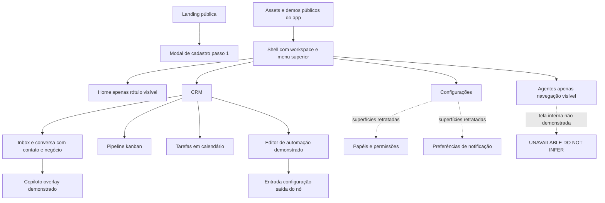

[INFERENCE, MEDIUM] O produto parece tratar a conversa como superfície de trabalho principal e CRM como contexto adjacente. A inferência é apoiada pelo espaço, conteúdo e ações da imagem, não por analytics de uso. Não se conhece a navegação completa por click-through; atalhos e menus fechados podem ocultar destinos.

<a id="section-30"></a>

## 30. Visual design system observations

### SYN-03 — shell retratado

URL: [crm-full](https://crm-modelo.local/brand/crm-full.png), [pipeline](https://crm-modelo.local/brand/pipeline-full.png). Access level: assets públicos, app não autenticado. Visual evidence: imagens abertas em resolução legível. Layout: faixa superior horizontal com marca/workspace, Home, Agentes, CRM, Configurações e utilidades à direita; área de conteúdo abaixo varia por domínio. Navigation: menus com caret; não foi possível abrir menus do asset. Components: separadores finos, ícones, contadores, avatars, tabs e campos compactos. Primary CTA: depende do domínio; não há CTA universal comprovado. Secondary actions: utilidades/topbar. Displayed entities: workspace e módulos. Interaction model: shell persistente sugerido por repetição visual. CRM implications: contexto de workspace permanece visível. Agent implications: Agentes é área de primeiro nível visível no menu. Reusable UX principle: operações humanas e IA acessíveis na mesma aplicação. Confidence: HIGH para layout; MEDIUM para persistência entre rotas, pois baseada em imagens distintas.

[UI] Há variantes clara e escura nos materiais. A conversa clara usa linhas sutis, fundos claros, texto escuro e acentos roxos/azuis; alertas/estado humano em tom verde-azulado; notas privadas amarelas. Canvas/copiloto/papéis/disparos aparecem escuros. Isso comprova variantes nos assets, **não** mecanismo de tema, tokens, fonte exata, escala de espaçamento ou contraste WCAG medido.

[INFERENCE, MEDIUM] Densidade favorece operador desktop com múltiplas informações simultâneas; pode comprometer espaço de conversa e legibilidade em telas menores. Não foram obtidas telas mobile, focus rings, navegação por teclado ou auditoria de acessibilidade. Não copiar paleta/marca; adaptar hierarquia e função dos estados.

<a id="section-31"></a>

## 31. Navigation

[UI] A topbar diferencia módulos globais de filtros locais. Inbox possui filtros verticais de status/canais/setores/atendentes/marcadores; lista de conversas acrescenta tabs Todas/Minhas/Não atribuídas/AI. Pipeline possui seletor próprio de funil e controles locais. [Inbox](https://crm-modelo.local/brand/crm-full.png), [pipeline](https://crm-modelo.local/brand/pipeline-full.png).

[INFERENCE, MEDIUM] Essa separação reduz troca de contexto: entrar em CRM não exige abandonar agente/atendimento. Porém sobreposição de filtros e tabs pode tornar a causa de um item ausente difícil de explicar. Adaptação proposta no Volume IV: filtros ativos explícitos, contagem após filtro e “limpar tudo”; autorização nunca deduzida de uma tab.

Menu Agentes está visível, mas seu conteúdo/rotas internas são **UNAVAILABLE - DO NOT INFER**. Não atribuir caminhos `/app/agents/...` ao CRM-Modelo.

<a id="section-32"></a>

## 32. Dashboard

SCREEN-ID: SYN-U-DASH. URL: rota autenticada desconhecida. Access level: indisponível. Visual evidence: nenhum dashboard completo legível foi obtido. Layout/Navigation/Components/CTA/Displayed entities/Interaction model: **UNAVAILABLE - DO NOT INFER**. CRM/Agent implications: não extraídas. Reusable UX principle: nenhum derivado de tela não vista. Confidence: HIGH sobre a limitação da coleta, não sobre ausência no produto.

[UI] O arquivo público chamado [dashboard.png](https://crm-modelo.local/brand/dashboard.png) mostra uma inbox em perspectiva. Não foi classificado como dashboard de KPIs. Um frame minúsculo embutido na conversa não permite reconstruir analytics. Este é um caso explícito de firewall contra inferência por nome de asset.

<a id="section-33"></a>

## 33. Inbox

### SYN-04 — central de atendimento

URL: [crm-full.png](https://crm-modelo.local/brand/crm-full.png). Access level: asset público. Visual evidence: [cópia local](evidence/crm-modelo/crm-full.png). Layout: quatro zonas — filtros, lista, conversa, contexto do contato. Navigation: filtros de status/canais/setores/atendentes/marcadores; tabs de ownership na lista. Components: busca, botão novo, preview de mensagem, canal/avatar, contadores, seleção destacada. Primary CTA: abrir/atender uma conversa; botão “+” para iniciar ação visível. Secondary actions: filtrar, buscar, alternar fila. Displayed entities: conversas, contatos, canais, responsáveis e etiquetas. Interaction model: master-detail sugerido pela seleção; cliques no app não executados. CRM implications: fila operacional organizada por atributos reais do atendimento. Agent implications: tab AI torna trabalho de agentes inspecionável ao operador. Reusable UX principle: workload de IA deve ser visível junto ao humano, não escondido em console técnico. Confidence: HIGH visual, MEDIUM interação inferida.


Força: histórico e contexto comercial lado a lado. Fraqueza: largura de conversa concorre com três regiões auxiliares. Adaptação: painéis recolhíveis e layout responsivo com foco preservado. Não inferir virtualização de lista, estratégia realtime ou origem dos counts.

<a id="section-34"></a>

## 34. Conversations

### SYN-05 — conversa e composição

URL/access: mesmo asset público SYN-04. Visual evidence: centro e painel direito de [crm-full](https://crm-modelo.local/brand/crm-full.png); detalhe [agent-suggestion](https://crm-modelo.local/brand/agent-suggestion.png). Layout: header de contato/status, faixa de ownership, timeline central, composer inferior. Navigation: contato selecionado na lista; tabs Responder/Nota Privada/Copilot Sugestão. Components: bolhas de mensagem, datas, mídia, status, transferir/concluir; composer com formatação/anexo/microfone/envio. Primary CTA: enviar resposta; no header concluir atendimento. Secondary actions: transferir, devolver à IA, nota privada. Displayed entities: Message, Attachment, Contact, Conversation e responsável visíveis conceitualmente, sem afirmar nomes de tabelas. Interaction model: atendimento misto com responsabilidade explícita. CRM implications: contato e negócio relacionados no mesmo contexto. Agent implications: banner indica humano atendendo e ação para devolver à IA. Reusable UX principle: ownership deve ser inequívoco antes do envio. Confidence: HIGH visual.

[UI] A imagem agent-suggestion mostra nota privada e a opção de copiloto, mas não uma sugestão já aprovada nem um botão “aprovar e enviar” demonstrado. Não atribuir esse fluxo à imagem. Separar draft interno de mensagem ao cliente é proposta, ainda que inspirada na separação visível de canais de composição.

<a id="section-35"></a>

## 35. CRM

### SYN-06 — pipeline

URL: [pipeline-full.png](https://crm-modelo.local/brand/pipeline-full.png). Access level: asset público. Visual evidence: [local](evidence/crm-modelo/pipeline-full.png). Layout: seletor e toolbar sobre colunas horizontais; cada coluna tem count e cards. Navigation: funil selecionado, busca/filtros/view controls; scroll horizontal sugerido pelo corte. Components: importar, editar, colunas/estágios, criar negócio, amount, contato, tempo na etapa; ícone de raio por etapa. Primary CTA: novo negócio. Secondary actions: importar/editar/filtrar. Displayed entities: negócios e estágios com campos comerciais. Interaction model: kanban visual; drag-and-drop não foi executado, portanto mecanismo de movimento UNKNOWN. CRM implications: estágio e valor são dimensões nativas da operação. Agent implications: ícone de automação sugere acesso contextual, mas seu comportamento não foi clicado. Reusable UX principle: automação próxima do objeto/estágio que a motiva, com status explícito. Confidence: HIGH para elementos; LOW para gesto de movimentação, pois não testado.

### SYN-11 — tarefas

URL: [tasks-calendar.png](https://crm-modelo.local/brand/tasks-calendar.png). Access level: asset público. Visual evidence: calendário mensal aberto em resolução original. Layout: toolbar superior, tabs minhas/equipe e grade mensal; legendas inferiores. Navigation: mês, seletores de visão e busca. Components: novo task, alternância lista/grade/calendário, opções mês/semana/dia/roteiro, eventos com cores e badge de atraso. Primary CTA: nova tarefa. Secondary actions: mudar período/visão e filtrar. Displayed entities: tarefas vinculáveis a geral/conversa/negócio, conforme legenda. Interaction model: agenda mensal demonstrada; outras visões só rótulos. CRM implications: follow-up humano tem lugar próprio além da inbox. Agent implications: autoria por agente ou agendamento automático não comprovados pela imagem. Reusable UX principle: tarefas ligadas ao objeto e responsabilidade. Confidence: HIGH visual.

### SYN-15 — temperatura

URL: [lead-temp.png](https://crm-modelo.local/brand/lead-temp.png). Access level: asset público. Visual evidence: [local](evidence/crm-modelo/lead-temp.png). Layout: card compacto; título Lead, temperatura e barra0–100. Navigation: seção recolhível visível. Components: escala colorida, valor numérico, rótulo qualitativo e referência abaixo. Primary CTA: nenhum comprovado. Secondary actions: expandir/recolher sugerido pelo chevron. Displayed entities: score do lead e estado relacionado. Interaction model: resumo de qualificação; algoritmo/editabilidade UNKNOWN. CRM implications: score é distinguível de estágio do negócio. Agent implications: tool de score aparece no catálogo, mas ligação automática a este card não foi exercitada. Reusable UX principle: mostrar valor e rótulo, acrescentando explicação/proveniência na proposta. Confidence: HIGH visual; LOW mecanismo de cálculo.

Listas/formulários completos de contacts e companies: **SYN-U-CONTACTS / SYN-U-COMPANIES — UNAVAILABLE - DO NOT INFER**. O painel de contato não prova página de gestão cadastral completa.

<a id="section-36"></a>

## 36. Agents

Tela de listagem de agentes: **SYN-U-AGENTS — UNAVAILABLE - DO NOT INFER**. Menu superior e tab AI na inbox são evidências de produto, não prova de modelo de versionamento, deployment, memórias ou permisos por agente.

### SYN-10 — copiloto contextual

URL: [copilot.gif](https://crm-modelo.local/brand/copilot.gif). Access level: demonstração pública animada. Visual evidence: [quadro inicial](evidence/crm-modelo/copilot.gif-0.png), [quadro posterior](evidence/crm-modelo/copilot.gif-2.png), ambos vistos. Layout: janela sobreposta à direita da inbox, mantendo contexto por trás; header e composer próprios. Navigation: fechar/maximizar e botões superiores visíveis. Components: welcome state, mensagem do operador, resposta estruturada de resumo, composer e seletor de papel “Dono”. Primary CTA: enviar instrução ao copiloto. Secondary actions: controles do painel e anexos. Displayed entities: conversa consultada, contato e resumo de atendimento. Interaction model: animação passa de painel vazio para pergunta e resposta com seções; não foi uma consulta enviada pela pesquisa. CRM implications: assistência contextual sem abandonar o trabalho. Agent implications: distingue assistência ao operador de resposta autônoma ao cliente. Reusable UX principle: canais interno/externo e capacidade efetiva devem permanecer claros. Confidence: HIGH para sequência visual; UNKNOWN para execução real do modelo/tool.


[INFERENCE, MEDIUM] Vários resultados de contato aparecem antes do resumo; risco de ambiguidade de identidade merece cuidado. Não se conclui que a demonstração acessou contato errado. Adaptação proposta: fixar contexto atual e exigir seleção explícita quando homônimos forem buscados.

<a id="section-37"></a>

## 37. Agent configuration

SCREEN-ID: SYN-U-AGENT-CONFIG. URL: rota autenticada desconhecida. Access level: indisponível. Visual evidence: nenhuma tela completa de configuração de Agent. Layout/Navigation/Components/CTA/Displayed entities/Interaction model: **UNAVAILABLE - DO NOT INFER**. CRM implications/Agent implications/Reusable UX principle: não derivados. Confidence: não aplicável a comportamento; HIGH para limitação.

Não reconstruir tabs de prompt/modelo/memória/tools a partir dos requisitos do novo produto ou das rotas do Fazer Agents. No Volume IV, essas tabs são `[PROPOSAL]` e têm justificativa própria.

<a id="section-38"></a>

## 38. Tools

### SYN-07 — seletor de ações

URL: [crm-actions.png](https://crm-modelo.local/brand/crm-actions.png). Access level: asset público. Visual evidence: imagem aberta e lida. Layout: seletor com sidebar de categorias e grade de cards em duas colunas. Navigation: busca e categorias. Components: counts por categoria; cards com ícone, nome e descrição curta. Primary CTA: selecionar ação. Secondary actions: buscar/filtrar categoria. Displayed entities: ações como criar/mover/ganhar/perder negócio, qualificar lead, labels, notas, transferir conversa e devolver à IA. Interaction model: seleção de capacidade; configuração/executar ação não observados nesse asset. CRM implications: vocabulário da automação coincide com tarefas do operador. Agent implications: catálogo revela ações orientadas a domínio, não só endpoints. Reusable UX principle: apresentar efeito e entidade alvo, acrescentando risco/escopo/aprovação na proposta. Confidence: HIGH visual.

O count “Todos81” é snapshot da interface, não confirmação de 81 implementações funcionais. Categorias “APIs HTTP”, “Banco de Dados”, “Integrações” e outras não provam tecnologias internas. A imagem não demonstra schemas, credenciais, sandbox, versão de tools ou autorização; tudo isso é UNKNOWN para CRM-Modelo.

<a id="section-39"></a>

## 39. Skills/workflows

### SYN-08 — canvas de automação

URL: [automacao.gif](https://crm-modelo.local/brand/automacao.gif). Access level: demonstração pública. Visual evidence: [quadro0](evidence/crm-modelo/automacao.gif-0.png). Layout: canvas escuro pontilhado, nós/arestas, minimap, zoom, toolbar inferior; aviso superior de modo preview. Navigation: selecionar nó, zoom e canvas; somente animação observada. Components: gatilho de entrada no funil, ação de mensagem, término de tentativas, nota explicativa, indicador salvo/preview, adicionar nó, simular, atividade e publicar. Primary CTA: Publicar. Secondary actions: Simular, Adicionar nó, Atividade. Displayed entities: fluxo, nós, gatilho e ações. Interaction model: edição visual com passagem a modal de nó no quadro posterior. CRM implications: evento comercial é início de automação. Agent implications: campo posterior distingue template e prompt para IA; não provar agente autônomo aqui. Reusable UX principle: draft/simulação/publicação separados e observáveis. Confidence: HIGH visual; UNKNOWN durabilidade do engine.

### SYN-09 — nó de mensagem

URL/access: mesma animação pública. Visual evidence: [quadro2](evidence/crm-modelo/automacao.gif-2.png). Layout: modal quase fullscreen em três colunas — entrada/variáveis, configuração, saída/dados produzidos. Navigation: seleção de nó vem do canvas; fechar e Simular no topo. Components: busca de variáveis, árvore de evento/contato/negócio/organização/pipeline/stage; nome do nó, canal, destinatário, modo de conteúdo e template; saída JSON com marca de teste. Primary CTA: Simular. Secondary actions: fechar, selecionar canal/destinatário e copiar variável conforme rótulo. Displayed entities: evento de entrada, schema de nó e resultado de teste. Interaction model: ferramenta de inspeção de dados input→config→output; execução real privada não exercitada. CRM implications: dados comerciais são contexto de automação visível. Agent implications: modo de conteúdo menciona template literal ou prompt IA. Reusable UX principle: autor deve enxergar dados que a automação recebe e produz; preview precisa explicitar ausência/presença de efeitos. Confidence: HIGH visual.


Skills como biblioteca instalável/versionada: **SYN-U-SKILLS — UNAVAILABLE - DO NOT INFER**. O canvas não prova que “skill” seja uma entidade no CRM-Modelo; não importar nomenclatura dos repositórios.

<a id="section-40"></a>

## 40. Integrations

Tela de catálogo/conexão/OAuth: **SYN-U-INTEGRATIONS — UNAVAILABLE - DO NOT INFER**. Logos no site e categorias no seletor são exposição comercial/visual, não fluxos de conexão comprovados. Não afirmar escopo de credenciais, sincronização bidirecional ou health checks com base neles.

### SYN-14 — configuração de disparo

URL: [disparos.png](https://crm-modelo.local/brand/disparos.png). Access level: asset público. Visual evidence: screenshot escuro aberto e analisado. Layout: etapas/checklist à esquerda, configuração central e preview/timeline à direita. Navigation: etapas visíveis e progresso40%; sequência completa não executada. Components: enviar agora/agendar, cadência lenta/média/rápida/personalizada, opção de dedupe, prévia dos dados. Primary CTA: conclusão/envio não totalmente demonstrado no recorte; não inventado. Secondary actions: escolher timing, cadência e dedupe. Displayed entities: lote, destinatários/dados, canal e agenda. Interaction model: preparação por etapas; resultados do envio UNKNOWN. CRM implications: comunicação em lote requer checklist antes de execução. Agent implications: nenhuma chamada de agente comprovada nesse recorte. Reusable UX principle: preview, volume, dedupe e status de agendamento antes de confirmar envio. Confidence: HIGH visual.

[PROPOSAL] No novo produto, cadência não será apresentada como meio de contornar regras do provedor. Envios dependem de consentimento/base de tratamento adequada, regras atuais do canal, quotas e política de conta. Este documento não valida regras legais ou de canal do CRM-Modelo.

<a id="section-41"></a>

## 41. Analytics

SCREEN-ID: SYN-U-ANALYTICS. URL: desconhecida. Access level: não acessível. Visual evidence: contagens operacionais em listas e pipeline, mas nenhuma tela analítica completa. Layout/Navigation/Components/CTA/Interaction model: **UNAVAILABLE - DO NOT INFER** para analytics. CRM implications: counts visuais ajudam triagem, não medem conversão/custo/atribuição. Agent implications: custo/token/eficácia não observados. Reusable UX principle: não derivado de tela ausente.

Não converter count de conversas, valores nos cards e textos do site em dashboard de ROI real.

<a id="section-42"></a>

## 42. Settings

### SYN-12 — papéis e permissões

URL: [equipes.png](https://crm-modelo.local/brand/equipes.png). Access level: asset público. Visual evidence: tela escura com contadores e formulário. Layout: resumo superior e tabs; área central de criação. Navigation: papéis/atribuições conforme tabs visíveis. Components: nome de papel, busca/seletor de permissões, estado vazio, counts. Primary CTA: criar papel, conforme formulário. Secondary actions: buscar/adicionar permissão, trocar tab. Displayed entities: papéis/permissões/usuários/equipes como conceitos da tela. Interaction model: configuração de acesso, não permissão backend testada. CRM implications: diferentes operadores precisam de responsabilidades distintas. Agent implications: não há prova de vínculo Agent→Role nessa imagem. Reusable UX principle: tornar autoridade configurável/legível; no novo produto explicar alcance e testar enforcement. Confidence: HIGH visual; UNKNOWN enforcement.

### SYN-13 — preferências de notificação

URL: [notifications.png](https://crm-modelo.local/brand/notifications.png). Access level: asset público. Visual evidence: matriz de eventos/canais. Layout: linhas por evento, colunas in-app/email/canal externo. Navigation: seleção local; rota pai desconhecida. Components: checkboxes, dropdowns e labels de eventos. Primary CTA: alteração de preferência; botão de salvar não comprovado no recorte. Secondary actions: selecionar canal externo. Displayed entities: preferências para nova conversa/mensagem/transferência/handoff AI→humano e outros eventos. Interaction model: matriz configurável retratada. CRM implications: limitar ruído por evento e canal. Agent implications: handoff é evento relevante para humanos. Reusable UX principle: notifications têm política por evento, não um toggle global. Confidence: HIGH visual.

A imagem não é feed de notificações: é tela de preferências. Não deduzir delivery guarantees, WebSocket, fila ou storage pela tabela.

<a id="section-43"></a>

## 43. UX principles

Princípios extraídos somente das telas observadas; adaptações são explicitamente propostas.

| Padrão observado | Problema resolvido | Força | Fraqueza/limite | Recomendação de reutilização | Adaptação proposta |
|---|---|---|---|---|---|
| Quatro regiões de inbox (SYN-04) | alternância entre fila, conversa e CRM | contexto simultâneo | densidade/largura | reutilizar organização, não pixels | painéis recolhíveis, teclado, modo foco |
| Ownership humano/IA (SYN-05) | dúvida sobre quem deve responder | estado visível + ação de devolver | política de race não demonstrada | prioridade alta | owner epoch, indicador de run em voo e confirmação |
| Nota privada vs resposta (SYN-05) | mistura de comunicação interna/externa | modos visualmente distintos | erro de modo ainda possível | prioridade alta | draft com destinatário explícito e atalhos seguros |
| Copiloto overlay (SYN-10) | ajuda sem sair do caso | mantém contexto | sobrepõe área útil; identidade ambígua | reutilizar com ancoragem | painel lateral com contato fixado e plano de ação |
| Catálogo orientado a ações CRM (SYN-07) | operadores não pensam em endpoints | nomes de negócio legíveis | risco/escopo não visíveis | reutilizar vocabulário | cards read/write/destructive e escopo efetivo |
| Canvas preview/publicar (SYN-08) | testar antes de ativar | separa modos na superfície | garantia de dry-run desconhecida | reutilizar conceito | draft imutável publicado; mocks declarados |
| Nó input/config/output (SYN-09) | depurar transformação | dados visíveis nos dois lados | pode expor PII em preview | reutilizar com redaction | proveniência, schema, outputs truncados e permissão |
| Negócio junto à conversa (SYN-05/06) | atendimento sem informação comercial | reduz navegação | múltiplos negócios precisam seleção | reutilizar relação explícita | negócio ativo selecionado, nunca por nome ambíguo |
| Calendário minhas/equipe (SYN-11) | planejar responsabilidade temporal | visão compartilhada | outras visões não demonstradas | reutilizar filtros | SLA e tarefa vinculados a contact/deal/conversation |
| Matriz evento/canal (SYN-13) | ruído de notificações | granularidade | volume real não conhecido | reutilizar | defaults por papel e digest |
| Temperatura numérica+label (SYN-15) | resumir qualificação | leitura rápida | racional ausente | reutilizar com explicação | score, evidências, versão da regra e revisão humana |
| Wizard de intenção (SYN-02) | adequar onboarding | baixa exigência inicial | Entrar abriu cadastro nessa sessão | adaptar com cuidado | login separado; setup progressivo do workspace |

<a id="section-44"></a>

## 44. Access limitations

Não houve acesso autenticado, nem cliques reais dentro de inbox, pipeline, tools ou workflow do app: são imagens/demos públicas. As animações mostram transições gravadas, não respostas a inputs da pesquisa. Quantidades, datas e entidades de demonstração são snapshots e não benchmarks. Nomes/telefones pessoais visíveis não foram transcritos para o blueprint.

Ausências: dashboard analítico legível, lista/configuração de agentes, skill library, conexão de integrações, contacts/companies completas, billing, permissões efetivamente negadas, mobile, accessibility, loading/error/empty de todas as páginas, run timeline do agente, ferramentas executadas com credenciais, rotas privadas. Para cada uma: **UNAVAILABLE - DO NOT INFER**.

Toda rota do Volume IV é desenho novo. Todo mecanismo de segurança, tenancy, workflow durável e realtime do Volume IV é desenho novo. Nenhum desses foi atribuído ao CRM-Modelo com base no seu visual.

---

# Volume III — Architectural Synthesis

Este volume faz a passagem de evidência para decisão. `[CODE]/[UI]` identifica o padrão observado; `[INFERENCE]` interpreta sua consequência; `[PROPOSAL]` redesenha para o produto independente. O índice/testes não autorizam copiar garantias não demonstradas.

<a id="section-45"></a>

## 45. Essential principles discovered

### P01 — configuração não é execução

Observed pattern: [CODE] Agent row → LoadedAgentConfig → modelos/tools/grafo por turno. Problem being solved: reusar uma definição comercial em conversas diferentes. Mechanism: loader resolve referências/contexto, builders instanciam objetos efêmeros. Strength: construção centralizada. Weakness: referências mutáveis dificultam replay exato. Hidden coupling: settings, grants, prompt, modelos e credenciais resolvidos em momentos específicos. Scaling implications: custo de montagem/MCP pode crescer por turno; cache precisa conhecer tenant e versão. Reusable concept: separar definição, snapshot e run. Recommended redesign: [PROPOSAL] AgentVersion imutável + Deployment com revision + dependency lock persistido no Run. [E02](evidence-ledger.md#e 02), [E05](evidence-ledger.md#e 05), [E08](evidence-ledger.md#e 08).

### P02 — geração e entrega são operações distintas

Observed pattern: [CODE] runtime gera, revalida ownership e só então envia; anexos/TTS/handoff têm caminhos próprios. Problem being solved: humano assume conversa enquanto LLM está em voo. Mechanism: flags/fences/watermarks/claims e outcomes parciais. Strength: evita algumas respostas obsoletas. Weakness: checkpoints e envio remoto não são atômicos. Hidden coupling: IDs e semântica Chatwoot. Scaling implications: múltiplos workers exigem fencing persistente, não só closures. Reusable concept: decisão do agente não é comprovante de entrega. Recommended redesign: [PROPOSAL] MessageIntent + MessageDeliveryAttempt + owner epoch, e `run.completed` distinto de `message.delivered`. [E04](evidence-ledger.md#e 04), [E07](evidence-ledger.md#e 07).

### P03 — merge único de ferramentas é ponto de política

Observed pattern: [CODE] várias origens convergem antes de bindTools; precondition aplicada depois de dedupe. Problem being solved: comportamento comum sem duplicar guard por adapter. Mechanism: wrapper de invoke preserva schema e evita callbacks duplos. Strength: ponto único de enforcement. Weakness: regras por nome e dedupe silencioso parcial reduzem clareza. Hidden coupling: nomes em prompt/preconditions/integration instances. Scaling implications: catálogo grande aumenta schemas, tokens e latência de discovery. Reusable concept: normalize → authorize → expose → execute. Recommended redesign: [PROPOSAL] ToolBinding com identidade estável e alias único, validação de conflito antes de publicação e executor com política determinística. [E11](evidence-ledger.md#e 11), [E18](evidence-ledger.md#e 18).

### P04 — uma recusa não é uma falha de infraestrutura

Observed pattern: [CODE] precondition retorna recusa normal; ToolFailure tem status error; handoff pode ser parcial. Problem being solved: não paginar operador por regra funcionando nem mascarar erro real. Mechanism: observações distintas e side-effect phase logs. Strength: separa decisão de falha. Weakness: nem toda tool distingue parcialidade no resultado ao LLM. Hidden coupling: status textual/status técnico e ToolFlowLogger. Scaling implications: retries sem taxonomia duplicam efeitos. Reusable concept: outcome e effect_state separados. Recommended redesign: [PROPOSAL] result discriminado `success/refused/failed/unknown_effect`, com `none/committed/partial/unknown` para efeitos, código estável e orientação de retry. [E15](evidence-ledger.md#e 15), [E37](evidence-ledger.md#e 37).

### P05 — contexto enviado não é todo estado persistido

Observed pattern: [CODE] janela de input não remove checkpoint; compactor faz rewrite separado. Problem being solved: histórico crescente encarece chamadas sem perder todo contexto. Mechanism: estimativa e cortes por fronteira humana; summaries com prefix verification. Strength: preserva protocolo e separa custo de persistência. Weakness: budget ignora system/tools e resumo é lossy. Hidden coupling: markers e timestamps de attendance. Scaling implications: storage cresce independentemente do contexto; compaction concorre com turns/ingest. Reusable concept: context compiler com políticas explícitas por fonte. Recommended redesign: [PROPOSAL] manifest de contexto, budget total por provider, provenance e summaries não destrutivos sobre eventos originais sujeitos à retenção. [E20](evidence-ledger.md#e 20), [E31](evidence-ledger.md#e 31).

### P06 — conhecimento remoto não deve virar autoridade

Observed pattern: [CODE] MCP server instructions são anexadas ao SystemMessage. Problem being solved: fornecer protocolo/contexto de ferramenta ao modelo. Mechanism: discovery + getInstructions + concatenação. Strength: integração descritiva flexível. Weakness: conteúdo de terceiro entra em nível privilegiado. Hidden coupling: confiança no administrador do MCP e no servidor. Scaling implications: alterações remotas mudam prompts sem release de Agent. Reusable concept: metadata de integração é útil, mas precisa de origem/confiança. Recommended redesign: [PROPOSAL] descriptions aprovadas e versionadas; outputs rotulados não confiáveis; políticas nunca podem ser relaxadas pelo texto; não injetar instruções remotas diretamente como system. [E16](evidence-ledger.md#e 16).

### P07 — skill de autoria não precisa ser skill de runtime

Observed pattern: [DOC + CODE] B guia implantação/configuração e possui scripts/templates/samples; A executa a configuração resultante. Problem being solved: repetir setup e operação especializados. Mechanism: pacote de instruções consumido por assistente externo, seguido de MCP/API/script. Strength: reutiliza conhecimento operacional sem acoplar pacote ao atendimento. Weakness: procedimentos podem divergir do código, como allowlist vazia. Hidden coupling: versões do sample, MCP e app. Scaling implications: governança de conteúdo e compatibilidade substitui problemas de throughput. Reusable concept: pacote de capacidade/autoria com artefatos versionados. Recommended redesign: [PROPOSAL] distinguir AuthoringRecipe de RuntimeSkill; no CRM, SkillVersion declarativa compilada em dependências permitidas, sem scripts de SSH como capacidade de atendimento. [E34–E36](evidence-ledger.md#e 34).

### P08 — scheduler não é workflow engine

Observed pattern: [CODE] jobs duráveis, registry e handlers especializados. Problem being solved: debounce/follow-up/memory/recovery fora do request. Mechanism: DB claims+reaper+backoff e dispatcher. Strength: pouca infraestrutura adicional. Weakness: lógica de dependência/espera fica nos handlers; runtime app e job lifecycle crescem juntos. Hidden coupling: tipos de job, gates de conversa e configuração atual. Scaling implications: fairness, polling e hot rows. Reusable concept: tarefas diferidas têm identidade, estado e ownership persistidos. Recommended redesign: [PROPOSAL] iniciar com contratos duráveis mínimos, mas usar engine durável para workflow arbitrário e espera humana; não chamar cron de workflow. [E21](evidence-ledger.md#e 21).

### P09 — realtime é projeção, não fonte da verdade

Observed pattern: [CODE] publisher Bun local; logs assíncronos; outbound deliveries separadas. Problem being solved: atualizar UI e integrar sistemas. Mechanism: três caminhos com garantias distintas. Strength: simplicidade e baixa latência local. Weakness: reconnect/fanout/replay não são resolvidos por publish local. Hidden coupling: processo que recebe mutação e conexões nele. Scaling implications: duas réplicas já mudam a topologia. Reusable concept: evento durável antes de fanout. Recommended redesign: [PROPOSAL] outbox transacional, cursor de delivery, projeção reconciliável no cliente; nunca tratar token de LLM transmitido como mensagem entregue. [E23–E25](evidence-ledger.md#e 23).

### P10 — contexto comercial e ownership precisam estar na UX

Observed pattern: [UI] CRM-Modelo mostra conversa/contato/negócio e humano/IA juntos; automação tem input/config/output. Problem being solved: operador precisa entender quem age e com quais dados. Mechanism: painéis contextuais, banner e preview de nó. Strength: reduz navegação e torna ação situada. Weakness: densidade e ausência visível de autoridade/proveniência em certos assets. Hidden coupling: nomes de contatos podem ser ambíguos; tabs não garantem estado backend. Scaling implications: grandes listas/dados sensíveis exigem paginação e escopo por campo. Reusable concept: IA opera sobre os mesmos objetos do humano, com responsabilidade identificável. Recommended redesign: [PROPOSAL] usar contexto compartilhado e controles de aprovação/timeline; manter design visual próprio. [SYN-04/05/09/10](volume-ii.md).

<a id="section-46"></a>

## 46. Implementation-specific decisions

[CODE] São decisões particulares de A, não propriedades essenciais de agentes: Bun/Elysia; LangGraph de dois nós; PostgresSaver em schema separado; thread derivado de IDs Chatwoot; 13 natives padrão; exports JSON formato1; `vault:<id>`; compactação de attendance em até 20 summaries; CODE QuickJS em Worker; regra específica de reasoning OpenAI; NATIVE ausente concede defaults. [E09](evidence-ledger.md#e 09), [E13](evidence-ledger.md#e 13), [E17](evidence-ledger.md#e 17), [E19](evidence-ledger.md#e 19), [E30](evidence-ledger.md#e 30).

[PROPOSAL] Reutilizar os problemas que essas escolhas resolvem, não os valores/nomes como dogma. O CRM novo não usará IDs externos como PK de domínio nem herdará default permissivo de tools. Limites serão políticas medidas e versionadas.

<a id="section-47"></a>

## 47. Strengths of analyzed architecture

[INFERENCE, HIGH] A demonstra cuidado operacional além do loop LLM: late ingest, handback, ownership, silêncio, partial delivery, tool effects, tenant scope, compaction protegida, classificação de provider errors e numerosos testes regressivos. Essas forças são sustentadas por branches e assertions concretas, não pela existência de pastas “guardrails” ou “memory”. [Volume I, §§8–25](volume-i.md).

[INFERENCE, MEDIUM] B reduz fricção de operação ao associar procedimentos a samples/scripts e ao recomendar preview. A correspondência de arquivos com A pode reduzir drift em parte do conteúdo; a contradição da allowlist prova que esse benefício não é garantia. [§13–14](volume-i.md).

[UI] CRM-Modelo fornece evidência de integração de tarefas comerciais e atendimento numa experiência coerente; não se transforma essa observação em avaliação de confiabilidade ou escalabilidade técnica. [Volume II](volume-ii.md).

<a id="section-48"></a>

## 48. Weaknesses

| Fraqueza delimitada | Evidência | Consequência arquitetural |
|---|---|---|
| Configuração mutável sem dependency snapshot de run | Agent schema + loader | replay e explicação histórica incompletos |
| Runtime de atendimento muito concentrado | runtime.ts + webhook.ts call chains | mudanças em entrega/gates podem repercutir em múltiplos triggers |
| Efeitos distribuídos sem commit único | graph vs Chatwoot vs local state | partial/unknown exige protocolo explícito |
| Controles de falha abertos em pontos sensíveis | tool boundary e analyzer | disponibilidade e segurança têm tradeoff diferente em cada gate |
| Instruções externas elevadas no prompt | MCP section | superfície de injection privilegiada |
| Métrica de token não cobre request inteiro | history-window/token-count | limite operacional não impede context overflow total |
| Workflow de negócio não generalizado | handlers específicos; schema | ampliar casos exige novo código/estado especializado |
| Realtime local e log best-effort | publisher/flowlog | não sustenta replay/fanout sozinho |

Não se afirma que o produto falhe em produção por causa desses pontos. São propriedades observáveis e riscos derivados, com validação pendente onde indicado.

<a id="section-49"></a>

## 49. Coupling

[CODE] Acoplamento dominante: Chatwoot define inbox, contato, conversa, status, ownership, webhook, bot identity e entrega; runtime e native tools materializam essas APIs. Trocar apenas o cliente HTTP não cria CRM independente: é preciso substituir domínio, identity mappings, messaging e gates. [E03–E07](evidence-ledger.md#e 03), [E37](evidence-ledger.md#e 37).

[INFERENCE, HIGH] Outros acoplamentos: nomes de tools atravessam prompt/grant/precondition; provider details atravessam model config/factory/context filtering; markers de mensagens conectam ingest/handback/compactação; PostgreSQL app e checkpoint têm papéis/contratos diferentes. Blueprint precisa explicitar essas fronteiras como contratos, não recriar o mesmo emaranhado com novos nomes.

<a id="section-50"></a>

## 50. Scaling considerations

| Dimensão | Gargalo/race inferível | Medição necessária antes de decidir infraestrutura |
|---|---|---|
| Turns concorrentes | pools Prisma/pg, provider semaphore, MCP discovery | queue delay, pool wait, active calls, p95 por tenant |
| Conversa quente | diversos eventos/ingest/send/compact sobre mesmo thread | conflitos, retries, response superseded, duplicate effect |
| Contexto crescente | tokens/schema/tool outputs | bytes e tokens por fonte; taxa de overflow |
| Jobs | polling/claims/reaper/fairness | oldest job age e starvation por tipo/tenant |
| Múltiplas réplicas | publisher local; filas locais não globais | delivery de evento cross-instance e races de ownership |
| Conhecimento | embedding calls/index e isolamento | retrieval recall e filtros antes de scoring |
| Logs e usage | writes assíncronos e volume | loss rate, backpressure, retenção/custo |

[PROPOSAL] Nenhum desses requisitos obriga Kafka, Redis ou Kubernetes desde o primeiro dia. Primeiro estabelecer consistência, SLOs e métricas; adicionar componente quando seu requisito e sua recuperação estiverem especificados.

<a id="section-51"></a>

## 51. Reusable abstractions

[PROPOSAL] Abstrações mínimas justificadas: immutable definition; deployment binding; run/step/checkpoint; execution principal; context manifest; tool binding/policy/result; delivery intent/receipt; conversation ownership epoch; domain event/outbox; reusable skill package; durable workflow; memory provenance; tenant-scoped resource reference; provider capability descriptor.

Cada uma corresponde a um problema visto: configuration drift, partial effect, ambiguity of ownership, truncated context, mixed tool origins, local realtime ou authoring/runtime mismatch. Não são entidades criadas apenas porque nomes constavam na missão; o dicionário do Volume IV renomeia e elimina redundâncias.

<a id="section-52"></a>

## 52. Concepts to avoid copying

[PROPOSAL] Não copiar:

- domínio CRM subordinado a IDs/status de outro CRM;
- permissão de tools por ausência de registro;
- nomes de tools como identidade única durável;
- `SKILL.md` administrativo/SSH como pacote executável de cliente;
- conhecimento/resultado remoto promovido a system authority;
- um campo `success=true` que esconde partial effect;
- log assíncrono como registro de execução ou ledger financeiro;
- default de retry de workflow que repete writes sem chave/reconciliação;
- “memória” como sinônimo de qualquer dado disponível;
- UI/branding/assets proprietários ou telas não observadas;
- algoritmo de score/política de canal inferidos de marketing;
- garantias de bibliotecas não verificadas na versão instalada.

A partir do próximo volume, toda arquitetura é **proposta para produto novo**, não descrição de A ou B.

---

# Volume IV — New CRM Agent Platform

**[PROPOSAL] Todas as seções e diagramas deste volume definem C, uma plataforma nova e independente.** Não são implementação encontrada em Fazer Agents nem backend deduzido do CRM-Modelo. Evidência inspira requisitos, mas não transfere garantias.

<a id="section-53"></a>

## 53. Product boundaries

O produto é dono de identidade/autorização de aplicação, organizações/workspaces, contatos/empresas/negócios, conversas/mensagens, agentes/versões/runs, ferramentas/skills, workflows, integrações, eventos, realtime e observabilidade. Um serviço externo pode fornecer autenticação federada, infraestrutura ou transporte de canal; **não** será o CRM oculto sob a interface.

O núcleo humano funciona sem LLM: cadastrar contato, mover negócio, responder conversa, atribuir tarefa e consultar histórico. Agentes são principals que usam os mesmos commands de domínio, com autorização mais restrita e comprovação de efeitos. Não há tabela comercial cuja única fonte da verdade seja o histórico do modelo.

Fora do núcleo inicial: infraestrutura de telefonia própria, provedor de e-mail próprio, treinamento de foundation model, browser agent genérico, execução de código arbitrário sem sandbox e ERP/contabilidade completos. Conectores e importadores podem integrar outros sistemas, mas nenhum deve fornecer obrigatoriamente Contacts/Conversations/Deals para que o CRM funcione.

Hipótese de dimensionamento inicial, **não benchmark**: até 50 organizações piloto, 200 operadores simultâneos no conjunto, 50 mensagens recebidas/s sustentadas e bursts de 200/s; capacidade de LLM governada por orçamento e quotas por tenant. Antes de compromisso comercial, teste de carga deve confirmar ou revisar esses números e a distribuição de hot conversations.

<a id="section-54"></a>

## 54. System context

Diagrama 10 — contexto proposto:

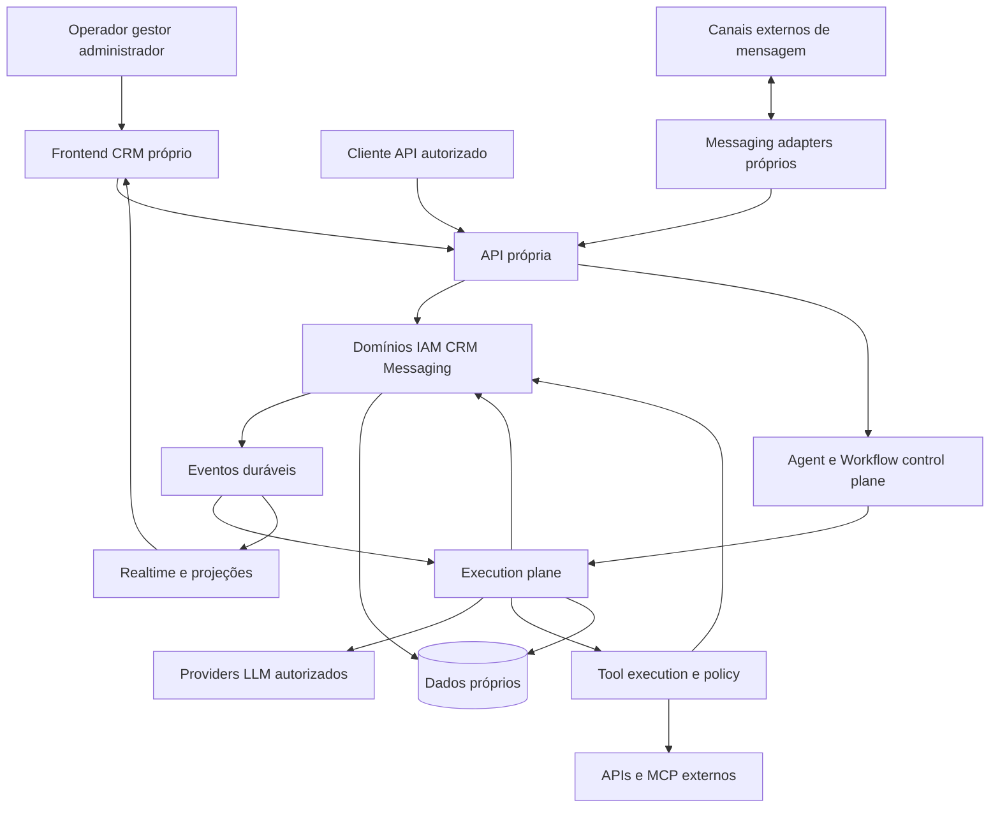

Fronteiras de confiança: browser e webhooks são não confiáveis; model/tool outputs são não confiáveis; workers recebem autoridade limitada por run; credential broker é zona privilegiada; banco e storage aplicam escopo além de validação na API. Observability recebe dados redigidos, não uma cópia irrestrita de tudo.

<a id="section-55"></a>

## 55. Domain architecture

Diagrama 11 — módulos lógicos, inicialmente monólito modular com processos especializados:

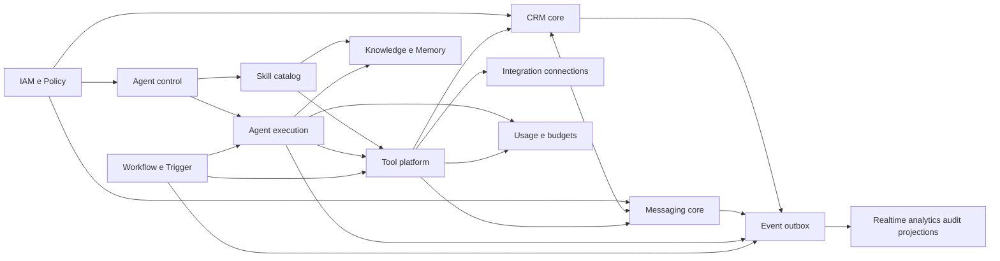

Regras de modularidade: cada módulo é dono de seus commands/queries e tabelas; tools internas invocam commands, não escrevem tabelas de CRM diretamente; controllers não contêm loop de agente; frontend não implementa política autoritativa; consumers não dependem de classes internas do produtor. Cross-domain transações são permitidas no monólito quando necessárias e explicitadas, mas side effects externos ficam fora delas.

API inicial orientada a recursos+commands, com schema único gerando validação e cliente tipado. Writes recebem `Idempotency-Key` onde há criação/efeito e `expectedRevision` onde há edição concorrente. A mesma chave com corpo diferente retorna conflito, não reaproveita resultado silenciosamente. Queries usam paginação por cursor e filtros autorizados. IDs opacos são strings na borda.

Contrato de erro: `code`, `category`, `message_safe`, `correlation_id`, `retry_after?`, `field_errors?`; respostas não revelam existência de recurso fora do escopo. Categorias: validation, forbidden, conflict, quota, dependency_unavailable, timeout, uncertain_effect, internal. Não exportar stack/provider payload ao operador comum.

O [dicionário lógico](domain-model.md) cobre todas as entidades requeridas, substituições justificadas, campos, relações, invariantes, lifecycle, constraints e transações.

<a id="section-56"></a>

## 56. Identity and tenancy

Organization é tenant econômico e de segurança. Workspace é compartimento operacional; usuário pode pertencer a vários, mas contexto ativo explícito só escolhe entre memberships autorizadas. Environment distingue teste/staging/produção dentro do workspace. Catálogo compartilhado em Organization compartilha **definição**, não dados de cliente ou credenciais.

Autenticação aceita identidade local/federada por adapter, mas autorização pertence ao produto. API deriva principal de sessão/token, resolve membership, seleciona scope autorizado e aplica policy. Cookie de sessão precisa proteção de transporte, CSRF quando pertinente, expiração/revogação e política de origem; API keys são hashes+scopes, nunca chave do provider LLM.

Banco compartilhado com escopo em todas as relações como baseline; RLS é defesa adicional, não substituto de policy de ação/campo. Workers também entram em escopo; não usar papel DBA na aplicação. Foreign keys compostas impedem relacionar Deal de A a Contact de B, mesmo com bug no serviço. Consultas administrativas cross-tenant exigem principal fleet separado, razão auditada e superfície fora da sessão normal.

Quando PostgreSQL for usado, owners/superusers/BYPASSRLS exigem cuidado: owners normalmente contornam RLS, a menos que FORCE seja aplicado; runtime deve ter papel restrito e testes de enforcement. Esse comportamento foi verificado na [documentação oficial de row security](https://www.postgresql.org/docs/17/ddl-rowsecurity.html). A proposta exige controles idênticos para checkpoints, não apenas para tabelas do CRM.

Isolamento adicional: bucket/object keys escopados e URLs assinadas após autorização; vetores filtrados por tenant/workspace **antes** de apresentar resultados; memória por subject+scope; caches incluem tenant/workspace/policy revision; credenciais por connection/environment/audience; quotas por org/workspace/agent; audit acessível por escopo e papel. Testes de negativa são obrigatórios para cada store, não só REST.

<a id="section-57"></a>

## 57. CRM

Contact e Company são entidades próprias, relacionadas N:N; ContactIdentity preserva origem/normalização de telefone/e-mail/canal. Dedupe propõe candidatos, não funde homônimos. Merge mantém redirects internos, histórico e mappings externos, reatribui relações em workflow auditado e exige revisão nos conflitos.

LeadProfile representa qualificação; Deal representa oportunidade comercial. Um contato pode ter diversos deals e uma empresa pode ter vários contatos. Pipeline/Stage têm ordem, tipo e política; mover Deal valida pipeline, revision e permissão; escreve history+event na mesma transação. Score não muda estágio sem command/regra explícita. Campos customizados têm definição tipada e política de leitura/escrita, inclusive para agentes.

Task/Note/Tag possuem autoria humana ou service principal e vínculos tipados a objetos. Notas privadas não são mensagens públicas. Um agente que cria tarefa usa `crm.task.create`, não injeta SQL nem escreve uma nota dizendo “criei” sem receipt.

Exemplo transacional de mudança de estágio:

```text
authorize(principal, deal.move, scopedDeal)
validate(expectedRevision, destinationStage belongsTo pipeline)
transaction:
  update Deal(stage, revision+1, stage_entered_at)
  append DealStageHistory(actor, reason, before, after)
  append DomainEvent(deal.stage_changed, aggregate_revision)
  append AuditLog(policy_decision)
commit → outbox delivery → projections/trigger evaluation
```

Relatórios de tempo em etapa vêm do histórico de transições, não de `updated_at`; mudanças cosméticas não alteram a métrica de ciclo comercial.

<a id="section-58"></a>

## 58. Messaging

O produto normaliza canais para um modelo próprio sem reduzir tudo ao denominador comum. Capability descriptor por Channel diz se suporta imagem, áudio, template, edit/delete, delivery/read receipts, threading, tamanho e idempotency key. Estados de canal podem ser diferentes; receipts originais são preservados com mapeamento explícito.

Inbound: resolver conexão confiável → verificar assinatura/timestamp conforme protocolo → gravar InboundReceipt deduplicada → ACK → normalizar/processar de forma recuperável → Message/Conversation → evento. Se normalização puder ocorrer em transação curta, receipt/message/event podem ser escritos juntos; se não, receipt durável garante recuperação. Sem ACK antes de alguma prova durável de recepção.

Outbound: command cria MessageIntent com conteúdo, autor, alvo, idempotency key e expected ownership_epoch; dispatcher revalida política/canal/consentimento/revogação/epoch; registra tentativa antes do I/O; chama adapter; persiste receipt ou uncertain_effect. Receipts tardios reconciliam estado, não geram nova mensagem duplicada. Provider accepted ≠ delivered ≠ read.

Handoff: transação muda owner/epoch e publica evento. Runs em voo passam a obsoletos para enviar/escrever onde policy exigir. Cancellation é pedido, não capacidade de retirar uma requisição já aceita externamente. UI mostra “assumido por humano; execução anterior encerrando” quando necessário.

Debounce é política de Trigger/Conversation, não concatenação sem identidade: burst guarda IDs/sequência das mensagens, deadline máximo, chave e geração; mensagem nova pode superseder draft, mas nunca apagar receipt de entrada. Anexos passam por quarantine, scan, validação MIME/tamanho e conversões em workers isolados. STT/vision geram derivados com provenance; original permanece conforme retenção.

<a id="section-59"></a>

## 59. Agent control plane

Responsável por autoria, versionamento, configuração, teste, publish, deployments, permissões, skills/tools/modelos/knowledge/memory policies/triggers/environments. Não executa diretamente write tool ao salvar uma configuração.

Diagrama 12 — control plane:

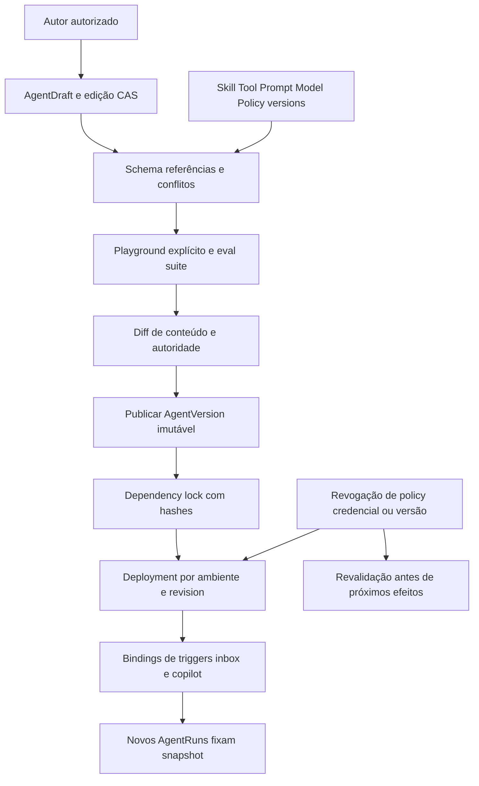

Publicação resolve árvore de dependências e rejeita: ciclo de skills; tool alias duplicado; required credential sem binding permitido; política conflitante; prompt com variável sem schema; provider sem capability requerida; references de outro workspace sem grant; ambiente teste usando credencial produção sem autorização explícita. Resultado inclui effective permissions e custo estimado de contexto.

AgentVersion congela **conteúdo e referências**, não segredo. Credential pode rotacionar sem reescrever AgentVersion, mas run registra geração/handle usado sem valor. Revogação atual sempre vence snapshot antigo. Deployment promotion exige diff de capacidades e dados compartilhados; rollback muda versão de runs novos e não reinterpreta os antigos.

Playground tem três modos explícitos: simulação sem efeitos (default), test connections isoladas, execução real autorizada. O UI lista quais ferramentas estão mockadas/reais antes do run. Testes/evals vinculam AgentVersion candidate + fixtures + esperado; nunca “verde” apenas porque respondeu algum texto.

<a id="section-60"></a>

## 60. Agent execution plane

Diagrama 13 — execução proposta:

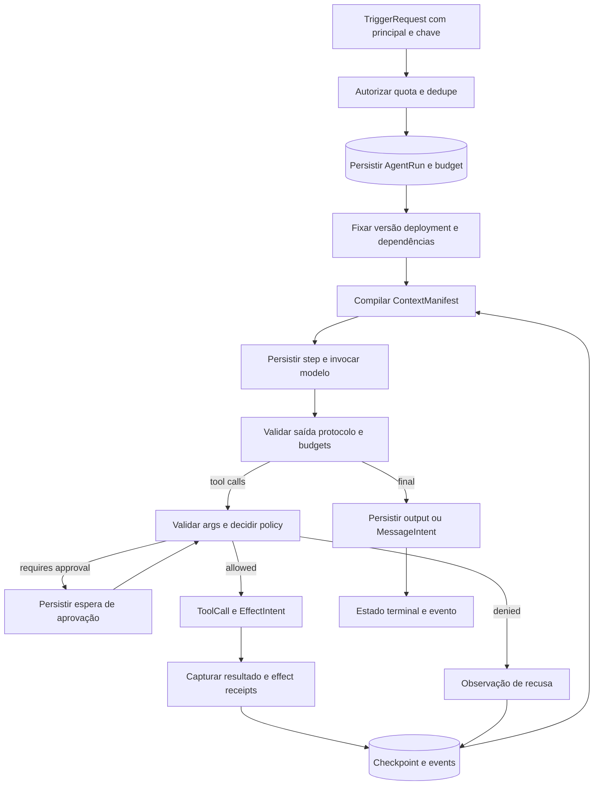

Algoritmo de cada step: adquirir lease/fence → ler checkpoint e estado atual → conferir cancel/revoke/budget/deadline → gravar step planned e tentativa → liberar transação → executar atividade → persistir resultado com CAS/fence → gravar checkpoint e evento. Nenhuma conexão de banco permanece em transação durante LLM/HTTP. Worker que perdeu lease não pode finalizar run nem lançar novo efeito, mas sua resposta tardia vira evidência para reconciliação.

Context compiler reúne políticas confiáveis de plataforma/workspace, AgentVersion, fragmentos de skills aprovados, estado comercial autorizado, memória relevante, retrieval permitido, janela de conversa e entrada corrente. Cada segmento tem origem, trust label, ordem, versão, contagem estimada/real quando disponível, regra de truncation e hash. Tool schemas também entram no orçamento. Conteúdo recuperado nunca pode ampliar privilégios.

Budget total por provider: `context_window - output_reserve - protocol_margin`. Primeiro reservar system/policy e tools mínimas; selecionar memória/retrieval; remover histórico por unidades protocolares inteiras; se mínimos+entrada atual não cabem, falhar com contexto excedido ou pedir redução — **não** apagar instrução de segurança silenciosamente. Schema de tool irrelevante não é exposto só porque existe no catálogo.

Diagrama 14 — state machine de AgentRun:

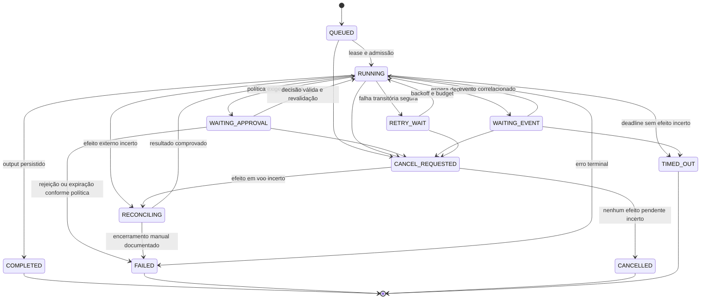

Reconciliation deve lembrar `desired_terminal_state` (cancelled/timed_out/failed). Depois de esclarecer efeito, não retoma loop se cancel foi solicitado; aplica o terminal desejado. Diagrama abstrai essas guardas; tabela de transição no código deverá explicitá-las. “FAILED” com efeito parcial conserva receipts e motivo, nunca declara rollback.

Retries por classe: erro de input/policy não retry; provider transient com cap e jitter; read tool retry limitado; write somente com idempotency contract ou prova de que não aconteceu; unknown write entra RECONCILING. Fallback só para endpoint permitido pelos mesmos requisitos de dados/capacidade. Reexecutar run terminal é novo run com parent/replay_of e autorização, não reset do histórico.

Cancellation propaga sinal e impede novos efeitos; timeout tem deadline do run, do step e do transporte. Checkpoints persistem cursor/input/output hashes, dependências, budgets, pending effects e decisions. Resumability não serializa stack/closure: replay usa resultados gravados; atividades não determinísticas (LLM, tempo, aleatório, HTTP) ficam fora da decisão determinística do workflow.

Streaming: tokens parciais são eventos efêmeros para operador autorizado, marcados draft/unvalidated. Não são a mensagem canônica nem output seguro aprovado. O resultado final validado substitui o draft por run_id/step_id/sequence. Falha/cancel retira ou marca draft sem fingir entrega. Streaming ao cliente externo exige política própria por canal e não faz parte do MVP.

<a id="section-61"></a>

## 61. Agent data model

Agent, Draft, Version, Deployment, Run, Step, Attempt, Checkpoint, RunMessage, ContextManifest e ModelCall têm responsabilidades distintas no [dicionário](domain-model.md). Dependency lock do run registra AgentVersion/SkillVersion/ToolVersion/PromptVersion/ModelPolicy/Knowledge revision/MemoryPolicy/PolicyVersion e runtime engine build.

Chaves de causalidade: `run_id`, `step_id`, `tool_call_id`, `effect_key`, `conversation_id`, `message_intent_id`, `trace_id`, `trigger_event_id`. Nenhuma delas substitui outra: trace identifica observabilidade, effect_key identifica operação idempotente, provider tool_call_id identifica protocolo de uma rodada.

Retenção: texto de prompts/outputs pode conter PII; manter encrypted content refs e prazo configurável, separado dos metadados mínimos para audit/metering. Replay completo pode tornar-se impossível após expurgo; UI informa “conteúdo expirado” e mantém integridade dos hashes/versões, sem prometer reprodução indiscriminada.

<a id="section-62"></a>

## 62. Model provider layer

Interface de domínio mínima: `generate`, `stream?`, `countTokens?`, `capabilities`, `normalizeError`, `normalizeUsage`. O request interno possui messages tipadas, tool specs, response schema opcional, limits, deadline e data policy. Adapters traduzem sem expor SDK classes ao CRM.

Capability matrix versionada por endpoint/modelo: tools, parallel calls, strict schema, structured output, image/audio, streaming, context size, usage reporting, data region e cancel behavior. Alguns campos são declarados pelo provider, outros validados por tests; UI diferencia ambos. Não confiar em regex de nome como único contrato de capacidade.

Resposta normalizada: texto/content blocks, tool calls validadas, finish_reason, usage_quality, provider_request_id, model_effective, raw_ref redigida. Tool calls inválidas são erro de protocolo corrigível com budget, não executadas parcialmente no parser. Structured output requerido que falha validação não entra no CRM como dado confiável.

Credenciais resolvidas just-in-time pelo broker; request sai somente para host permitido no endpoint. Fallback não contorna região/restrição de retenção nem troca para provider mais permissivo por indisponibilidade. Contract tests usam fixtures dos adapters e endpoints locais; canary real com dados sintéticos e limite financeiro precede habilitar modelo novo.

<a id="section-63"></a>

## 63. Tool platform

Contrato end-to-end: Tool → ToolVersion → schemas → ToolBinding → CredentialBinding → PolicyDecision → ToolCall → Attempt → EffectReceipt → ToolResult → audit. Catalogue UI descreve efeito e alvo, não só function signature. Classificação read/write/destructive é validada por executor e revisão, não declarada pelo modelo.

Autoridade efetiva é interseção de: tenant/workspace ativo; principal do deployment; permissões do autor que publicou; PolicyVersion; ToolBinding; credential audience/scopes; seleção de recurso; contexto do usuário/trigger; consentimento/regra do canal quando aplicável. `requested tools` de skill não concede nada. Policy indisponível implica deny/defer, não fail-open para write.

Resultado proposto:

```text
ToolResult {
  outcome: success | refused | failed | unknown_effect,
  effect_state: none | committed | partial | unknown,
  code, safe_message, output_schema_version, output_ref,
  effect_receipts[], retry_class, correlation_id
}
```

Args são parseados/canonicalizados antes de calcular action_digest. ApprovalRequest vincula tool version, args digest, resource revisions, target e policy; mudança de args/alvo/autoridade invalida aprovação. Para destructive, confirmação humana específica, prazo curto e separação de deveres configurável. O humano aprova **a ação**, não uma frase vaga do modelo.

Tool interna chama command de CRM/messaging sob principal e scope; transação grava mutação+effect receipt+event. Tool externa registra intenção antes de I/O e usa idempotency key estável quando provider suporta. Após timeout incerto, consulta status por referência; se API não oferece dedupe/status, bloqueia retry automático e pede reconciliação. Compensação é nova ação autorizada, não rollback fictício.

Pure tools podem executar localmente com limite de CPU/memória. Tools de código de terceiros, quando habilitadas em fase posterior, rodam em processo/container isolado sem mounts de host, sem secrets e com egress negado por default; credenciais por proxy e capabilities. Não conceder shell/SSH do servidor como ferramenta do cliente.

Para MCP: discovery em controle, snapshot/revisão de schemas/descriptions, namespace estável, allowlist explícita, mudança de schema bloqueia publish/exec conforme policy; runtime não aceita servidor mudar silenciosamente a assinatura de tool aprovada. Remote instructions são conteúdo não confiável a revisar, nunca override de política.

<a id="section-64"></a>

## 64. Skill platform

Skill nova é pacote declarativo de capacidade reutilizável, **não** cópia direta das skills administrativas B. Pode conter instructions, tool requirements, knowledge refs, workflow refs, policy constraints, resources e configuration schema. Scripts arbitrários não executam no loader: comportamento executável deve ser ToolVersion revisada/sandboxada ou AuthoringRecipe fora do plano de atendimento.

Versionar e instalar explicitamente. Semver pode comunicar compatibilidade, mas lock usa versão exata+hash. Resolver constrói DAG de dependências, rejeita ciclos e incompatibilidades com runtime/tool/schema. Não há upgrade silencioso de instalação ligada a AgentVersion publicado.

Escopos: organização pode publicar catálogo para workspaces; workspace instala e configura; AgentVersion vincula instalação. Compartilhar SkillVersion não compartilha automaticamente KB privada, workflow run ou CredentialBinding. Import/export remove secrets e exige resolução local das capabilities.

Precedence de conteúdo: plataforma/políticas determinísticas → workspace restrictions → instruções aprovadas do AgentVersion → fragmentos de skill em slots declarados → contexto externo não confiável. Isso organiza prompt, mas **segurança é policy engine**, não ordem textual. Conflitos entre skills (`tool alias`, campos, instruções mutuamente exclusivas) falham publicação ou exigem resolução explícita; não last-write-wins oculto.

Exemplo proposto: skill “qualificar lead” exige leitura de Contact/Conversation, tool `crm.lead.qualify` com schema de evidências, política de score e workflow opcional de tarefa para humano. Não exige mover Deal, enviar mensagem ou criar cobrança; essas capacidades precisariam de grants separados.

<a id="section-65"></a>

## 65. Knowledge

Pipeline: upload/conector → quarantine/scan → parse isolado → classificação/ACL → chunk versionado → embedding → index build → publicação atômica da revisão. Failed ingestion não substitui versão anterior pronta por conteúdo parcial. Objetos armazenam original; chunks mantêm offsets/citações e hash de origem.

Retrieval recebe principal/tenant/workspace/KB grants antes da consulta; combina filtros de acesso e revisão; semantic ranking nunca decide autorização. Limitar query/result size, aplicar score policy e retorno estruturado com citations. Documento externo com instruções hostis é dado, não policy. Cache inclui escopo/revisão/policy.

Modelo de embedding/dimensão fazem parte do perfil; migração usa índice paralelo e teste de recall/custo, não mistura vetores incompatíveis na mesma coluna sem identificação. Deletion/revocation remove acesso imediatamente e agenda expurgo de derivados/caches. Runs registram quais trechos realmente entraram no contexto.

<a id="section-66"></a>

## 66. Memory

Separar: histórico canônico de conversa, resumos de episódio, fatos de memória com evidência e estado operacional. Preferências do contato podem ser MemoryFact ou campo de domínio após validação; saldo, consentimento e permissão vêm de autoridade determinística atual, nunca de lembrança do LLM.

Writes de memória recebem subject/scope/source/confidence/validity/expiry/policy. Regras decidem auto-save, aprovação humana ou rejeição; dados sensíveis proibidos por política não podem ser gravados apenas porque o usuário pediu “lembre”. Contradição cria nova revision e marca anterior superseded, não merge textual sem autoria.

Resumo é derivado com range e source hash; pode ser recompilado após correção/expurgo. Não destruir log canônico como requisito para reduzir tokens: retention e context compression são políticas separadas. Retrieval de memória e KB têm finalidades distintas e filtros próprios. Cross-agent memory só quando mesma finalidade/subject/scope e policy permitirem.

<a id="section-67"></a>

## 67. Workflow engine

WorkflowVersion é spec tipado, validado e imutável; WorkflowRun é execução durável. Canvas é cliente editor desse spec, não engine no browser. Node types iniciais: trigger, condition, transform declarativo, agent invocation, tool invocation, branch, wait, approval, completion. Loops somente explícitos com bound e budget; sem JS livre embutido em expressão de condição no MVP.

Diagrama 15 — workflow proposto:

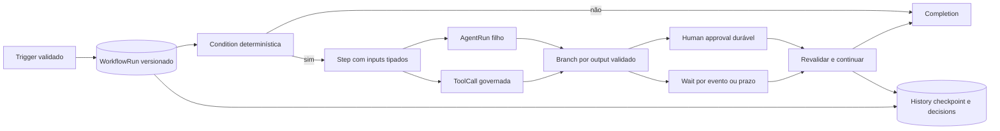

Execução durável é requisito porque waits/aprovações ultrapassam lifetime de processo. Decisões/outputs são persistidos; código de orquestração replayable não faz HTTP nem chama LLM diretamente. Activities representam operações não determinísticas com retry/idempotency próprios. Temporal é candidato forte, não parte do sistema observado: documentação distingue workflows, activities e políticas de retry. Defaults de activity retry não substituem política de side effects; devem ser limitados explicitamente. [Workflow](https://docs.temporal.io/workflows), [Activity](https://docs.temporal.io/activities), [retry policies](https://docs.temporal.io/encyclopedia/retry-policies).

Wait registra subscription tenant-scoped + deadline antes de aguardar. Evento/timeout/cancel disputam CAS, só um resolve. Evento que chega antes de o worker voltar deve ser consumível por histórico/receipt. Child AgentRun tem budget e principal restrito; falha/retry do parent não duplica child porque chave é workflowRun+node+iteration.

Version upgrade: runs antigos continuam versão congelada; migração explícita de run exige mapping de nodes/checkpoint e teste de replay. Publicar novo canvas não muda estrutura sob uma execução suspensa.

<a id="section-68"></a>

## 68. Automation engine

Não construir motor concorrente de “automations”: Trigger e Schedule são ingressos comuns para AgentRun/WorkflowRun. Rule simples compila para workflow pequeno ou solicita agent deployment. Event filter é tipado e auditável, não eval de expressão arbitrária.

Regras anti-loop: event contém causation/correlation/origin; trigger guarda dedupe key; limite de profundidade causal e budget por cadeia; default impede auto-reacionar ao próprio efeito quando não explicitado. Alteração de Deal por agente pode disparar workflow humano, mas não cascata infinita invisível.

Schedule guarda timezone, regra local, instante planejado e política DST/misfire. Produto oferece skip, execute-once ou bounded catch-up. Nunca disparar todo backlog histórico ao ativar regra; effective_at e reprocessamento de histórico são ações separadas com preview de volume e autorização.

<a id="section-69"></a>

## 69. Event architecture

Diagrama 16 — transação e distribuição:

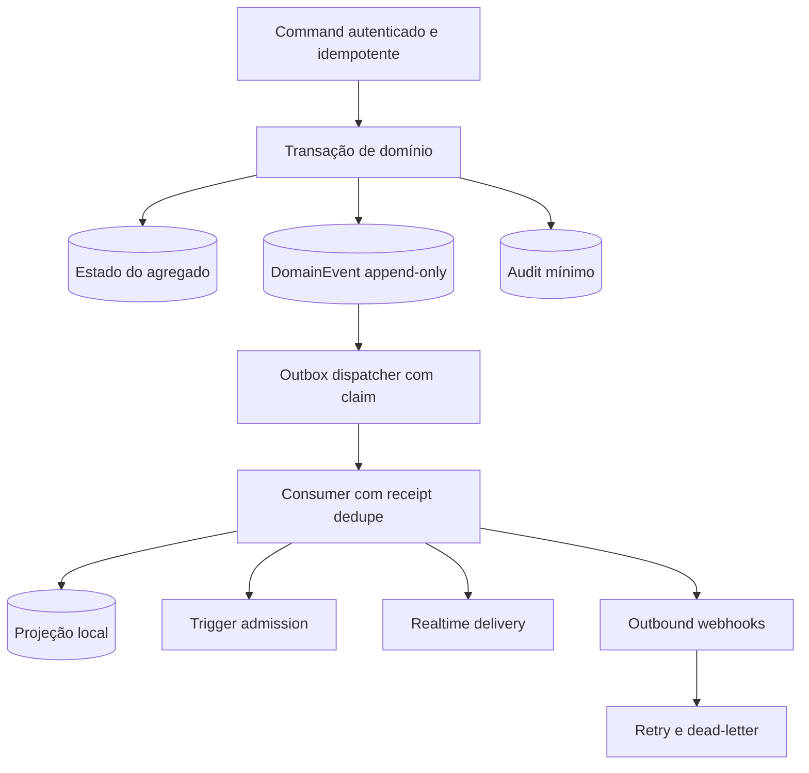

Envelope canônico proposto:

```json
{
  "event_id": "evt_opaque",
  "type": "deal.stage_changed",
  "schema_version": 1,
  "organization_id": "org_opaque",
  "workspace_id": "ws_opaque",
  "aggregate": {"type": "deal", "id": "deal_opaque", "revision": 12},
  "actor": {"principal_id": "principal_opaque", "run_id": "run_optional"},
  "occurred_at": "2026-09-09T15:00:00Z",
  "correlation_id": "corr_opaque",
  "causation_id": "command_or_prior_event",
  "payload": {"from_stage_id": "stage_a", "to_stage_id": "stage_b"}
}
```

Nomes propostos: `message.received`, `message.send_requested`, `message.delivery_updated`, `conversation.created`, `conversation.owner_changed`, `contact.updated`, `deal.stage_changed`, `agent.run.requested/started/completed/failed`, `agent.step.completed`, `tool.call.requested/completed/reconciliation_required`, `workflow.started/completed`, `approval.requested/decided`, `knowledge.revision_published`. Schemas versionados e compatibilidade testada; event “completed” sempre define se refere a execução, efeito ou delivery.

Garantias: at-least-once; ordering por aggregate revision quando necessário; consumidor deduplica por event_id. Outbox não garante exactly-once externo. Event sourcing completo não é obrigatório: estado transacional é canônico; events suportam projeções/integração/audit de mudanças definidas. Replay de analytics não deve redisparar mensagens; consumers de efeitos exigem modo replay explícito e negação por default.

<a id="section-70"></a>

## 70. Realtime

Diagrama 19 — mutation → transaction → event → delivery → reconciliation:

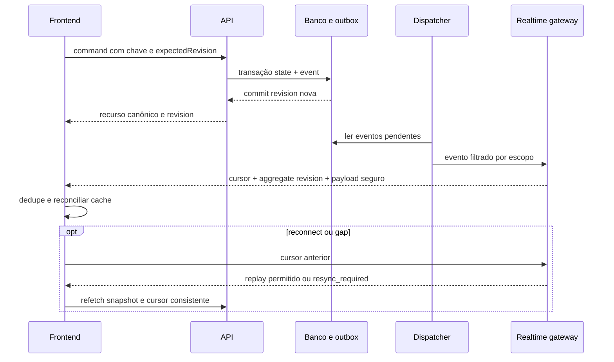

WebSocket é candidato para comunicação bidirecional/presença; SSE basta para feed unidirecional; decidir após requisitos de presença e teste de infra. Contrato não depende do transporte: canal autenticado por workspace e recursos, cursor, event_id, aggregate_revision, versioned payload e limites de backlog.

Client reconciliation: command response e event podem chegar em qualquer ordem; mesma revision não aplica duas vezes; event antigo ignora; gap faz refetch; exclusão remove cache e relações; mudança de workspace fecha conexão e limpa cache scoped; revogação invalida subscribe e mensagens futuras. Não transmitir payload a tópico “tenant” quando permission de campo/recurso é mais restrita.

Messages/conversations/CRM seguem eventos canônicos; runs/tool calls/workflows seguem timeline persistida. Tokens e presença são canais efêmeros separados, sem replay financeiro nem garantia de retenção. Slow client recebe resync em vez de buffer ilimitado. Múltiplas réplicas exigem fanout compartilhado ou consumo durável por gateway; publish em memória isolado não atende requisito.

<a id="section-71"></a>

## 71. Storage

Modelo lógico já definido; agora requisitos de storage:

| Classe | Requisito | Solução candidata inicial / evolução |
|---|---|---|
| Transacional | FKs, CAS, transações, tenancy, índices | PostgreSQL com papel restrito/RLS e migrations revisadas |
| Events/outbox/receipts | append, dedupe, ordenação por agregado, replay limitado | tabelas transacionais particionáveis; transporte externo só se medição exigir |
| Run/checkpoint | atomic step transitions e state refs duráveis | tabelas próprias; engine history separado quando Temporal usado, espelho de domínio reconciliável |
| Files | objetos grandes, quarantine, lifecycle, URLs curtas | object storage compatível com API S3, separado do banco |
| Search | filtros/ACL, texto e consistência eventual | índices de texto inicialmente no banco; motor externo após limites medidos |
| Vectors | dimensão/modelo/revisão, isolamento, nearest neighbors | pgvector como candidato, benchmark antes de produção |
| Cache | acelerar sem autoridade única | cache local scoped inicial; distribuído quando multi-replica exigir coerência |
| Queues | admissão, fairness, leases, retries | outbox/DB jobs mínimos ou task queues do engine durável |
| Analytics | agregações históricas sem bloquear OLTP | projeções/materializações; warehouse separado quando custo/latência justificar |

Diagrama 17 — persistência proposta:

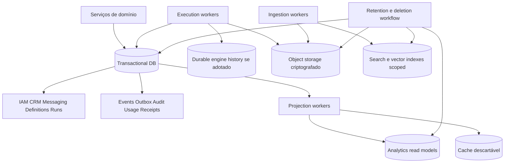

Backups são por store e consistência temporal documentada. Restore drill reconcilia outbox, pending effects e engine history antes de retomar envios. Cache nunca é única fonte de dedupe/approval. Transações não incluem upload/LLM; publicar metadados de arquivo somente depois de objeto confirmado e scan policy.

<a id="section-72"></a>

## 72. Search

Busca operacional de contato/conversa/negócio é distinta de retrieval para LLM. Query API aplica tenant, workspace, resource ACL e field ACL antes de devolver hits/snippets/counts; count de resultado também pode vazar existência. Index update segue outbox; resultado pode carregar revision e link para recurso canônico; recurso removido/revogado é filtrado na leitura mesmo antes de reindexar.

Busca semântica nunca devolve “todos tenants depois filtra no front”. Relevância híbrida pode combinar texto/vetor, mas deve ser medida com dataset representativo e etiquetas de acesso. Evals verificam recall e **zero hits cross-tenant** em consultas maliciosas/ambíguas. Não recomendar banco vetorial dedicado antes de medir dimensão, volume, recall, filtros e custo de operação.

<a id="section-73"></a>

## 73. Integrations

Integration define adapter/capacidades; Connection representa instalação em workspace/environment; ExternalAccount identifica conta real; CredentialBinding guarda autoridade; mappings ligam IDs externos a internos. Esse desenho evita o acoplamento a IDs Chatwoot observado em A.

Conectores têm: auth flow, validação de scopes, token refresh/revoke, assinatura webhook, normalize inbound, dispatch outbound, dedupe, cursor de sync, rate-limit budget, circuit breaker, status reconcile e health. Webhooks duplicados/atrasados/fora de ordem são normais; sync periódico recupera lacunas quando API permitir.

Credencial nunca entra em prompt/log/export. Broker injeta token no destino aprovado; ferramentas não recebem lista geral de secrets. Para HTTP configurável, URL é policy-bound e egress proxy bloqueia redes privadas/link-local/metadata e revalida redirects/DNS na conexão; limites de resposta/tempo/tamanho por binding.

Import de CRM externo é projeto de migração: staging, mapping, dedupe, preview, validação, commit em lotes e rollback lógico/reconciliation. Não transforma sistema externo em requisito para operar após import.

<a id="section-74"></a>

## 74. Frontend

IA proposta prioriza trabalho humano e mantém configuração da plataforma separada. As rotas abaixo **não são rotas observadas no CRM-Modelo**. Org/workspace explícitos no contexto e preferencialmente no caminho eliminam links ambíguos entre workspaces.

```text
/app/:org/:workspace/overview
/app/:org/:workspace/inbox/:conversationId?
/app/:org/:workspace/contacts/:contactId?
/app/:org/:workspace/companies/:companyId?
/app/:org/:workspace/deals               # view=board|table; pipeline=...
/app/:org/:workspace/tasks               # view=list|calendar
/app/:org/:workspace/agents
/app/:org/:workspace/agents/:agentId/overview
/app/:org/:workspace/agents/:agentId/build # prompt/model/context/skills/tools tabs
/app/:org/:workspace/agents/:agentId/test
/app/:org/:workspace/agents/:agentId/deployments
/app/:org/:workspace/agents/:agentId/runs/:runId?
/app/:org/:workspace/library/skills/:skillId?
/app/:org/:workspace/library/tools/:toolId?
/app/:org/:workspace/library/knowledge/:kbId?
/app/:org/:workspace/workflows/:workflowId?
/app/:org/:workspace/automations         # triggers/schedules, sem engine duplicado
/app/:org/:workspace/approvals
/app/:org/:workspace/integrations/:connectionId?
/app/:org/:workspace/analytics
/app/:org/:workspace/settings
/app/:org/settings                      # membros, billing, policies org
```

Pipeline config fica no contexto de deals/settings, não página obrigatória separada que duplica navegação. Agent build usa uma composição com snapshot/diff comum, evitando que tabs de tools/skills/knowledge publiquem versões contraditórias independentemente.

Diagrama 18 — frontend proposto:

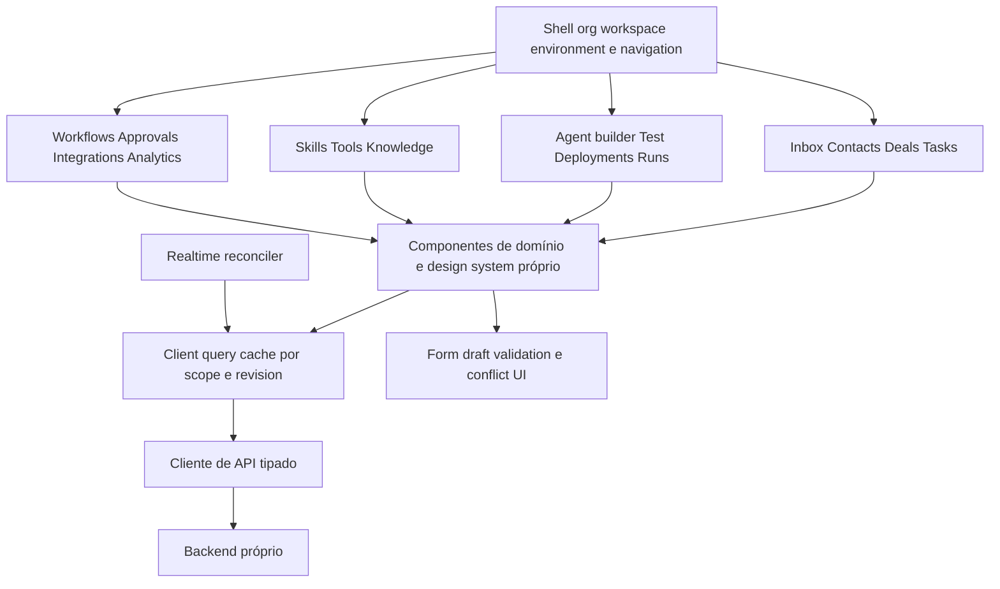

Frontend React é candidato pela composição de UI interativa e possibilidade de reusar componentes de domínio; não resolve sozinho routing/data cache. A documentação oficial alerta para o custo de montar uma aplicação sem framework e assumir essas decisões. Selecionar router/query/form stack em spike com vertical slice de inbox, não por popularidade. [React — tradeoffs de app from scratch](https://react.dev/learn/build-a-react-app-from-scratch).

Estrutura de código proposta: `app/shell`, `features/{inbox,crm,agents,workflows,...}`, `domain-view-models`, `api-client`, `realtime`, `ui`, `test-fixtures`. Componentes visuais não importam ORM; view model preserva distinguir message draft/delivery/state. Server state em cache; form drafts isolados; URL guarda filtros compartilháveis; estado transitório de pane local.

Inbox: lista virtualizável/paginada, timeline com scroll ancorado, composer por conversa, sidebar recolhível de contact/deal, ownership banner, copilot interno. Run detail: timeline de step/call/retrieval/approval, versões, custos, dados redigidos e receipt de efeitos. Tool builder: schema/input sample/output sample, risco, scope, egress e credential binding; versão publicada não editada in-place. Workflow node: input/config/output inspirado em SYN-09, com preview seguro e diferenças entre mock/test/live.

UX de falhas: pending/failed/unknown diferentes; optimistic update reversível só em mudanças locais de baixo risco, nunca fingir send/approval/tool success. 409 oferece diff/reload/merge, não sobrescreve mudanças alheias. Dirty draft avisa ao trocar workspace/versão. Acessibilidade: teclado, focus management, labels, aria-live moderado, contraste medido, redução de movimento e alternativa tabular ao canvas. Mobile usa master-detail sequencial; não espremer quatro colunas.

<a id="section-75"></a>

## 75. Security

Threat model: adversário pode controlar mensagem de cliente, documento recuperado, resposta HTTP/MCP, metadata de arquivo e parte do prompt/config se tiver papel de autor; pode induzir agente a usar credencial privilegiada ou acessar outro tenant. Modelo é planejador não confiável. Autorização e limites são código determinístico fora do prompt.

| Ameaça | Controle preventivo | Detecção/validação | Falha segura |
|---|---|---|---|
| Prompt injection direta | mensagens como dados, policy engine e tools mínimas | adversarial evals com pedidos de elevar escopo | deny de ação, sem depender da recusa textual LLM |
| Indirect injection em RAG/HTTP | trust labels, output schema, não promover a system, conteúdo limitado | fixtures de documentos/results hostis | interromper ação que requer authority ausente |
| Tool poisoning | versão/hash/schema aprovado, discovery no control plane | diff de capability e mudança remota | bloquear binding incompatível |
| Confused deputy | principal do run + resource selector + credential audience | tentativa de trocar target IDs e conta externa | negar cross-scope mesmo com token válido |
| Privilege escalation | interseção de grants, publish rights, deny precedence | testes de autor menos privilegiado e chained skills | publish/exec recusado |
| Secret leakage | broker/proxy, handles, redaction, egress allowlist | canary secrets sintéticos em evals e logs | bloquear output/egress e incidente |
| SSRF | resolver/conectar com política, egress proxy, privados/metadata bloqueados | DNS rebinding, redirects e IPv6 cases em ambiente de teste | nenhuma conexão ao alvo proibido |
| Arbitrary code execution | sem código externo MVP; sandbox process/container depois | escape attempts, resource exhaustion tests | kill isolado, sem mounts/secrets/network |
| Destructive action | classificação, digest approval, dual control quando requerido | invalidar aprovação após mudança de args/revision | não executar sem decisão válida |
| Tenant leakage | FKs compostas, RLS, ACL em search/cache/files/checkpoints | negative tests entre dois tenants em cada store | deny, sem fallback para scope global |
| Event spoofing/replay | assinatura/correlation trusted, receipts e nonce conforme canal | duplicatas/body mismatch/delay | quarantine ou dedupe |
| Exfiltração via observability | payload redigido, acesso restrito, retenção | revisão de atributos e fixture PII | telemetry mínima, sem bloquear audit obrigatório de write |

Approval não é prompt “peça permissão”: é objeto persistido com decision autenticada. Tool scopes não vêm do LLM. Sandbox não substitui autorização. Segurança de conhecimento inclui malware/parser, não só injection textual. Quotas se aplicam antes de reservar modelo/ferramenta, inclusive recursão de workflow.

Revogação: desativar workspace/connection/principal ou negar policy cancela novas execuções e invalida efeitos pendentes após recheck; operações em voo entram reconciliação. Atualização de policy registra motivo e versão, evitando replay que reintroduza privilégio antigo. Logs de segurança são separados de transcript acessível ao autor de prompt.

Privacidade/compliance: classificar dados, finalidade, consentimentos quando aplicáveis, retenção/export/delete e fornecedores; submeter decisões legais ao responsável apropriado. Este blueprint não conclui conformidade LGPD por nome de controle e não fixa prazo legal sem análise específica.

<a id="section-76"></a>

## 76. Observability

Hierarquia lógica proposta:

```text
Trace / correlation chain
└── AgentRun
    ├── context.compile
    ├── llm.call (provider/model/attempt)
    ├── tool.call (binding/version/effect_state)
    ├── retrieval (scope/revisions)
    ├── workflow.step (link ao parent)
    ├── approval.wait
    ├── message.dispatch
    └── event.publish / consume
```

OpenTelemetry é candidato vendor-neutral para spans/context propagation. Spans e links representam causalidade, inclusive trabalho assíncrono que não cabe numa única chamada síncrona; isso é distinto do ledger de domínio. [Traces e span context](https://opentelemetry.io/docs/concepts/signals/traces/).

Atributos mínimos: org/workspace IDs conforme política de cardinalidade, run/step IDs em traces/logs, agent/tool/prompt/model versions, outcome/error_class, duration, queue_wait, tokens_in/out, usage_quality, estimated/confirmed cost, policy decision code, checkpoint_no, external receipt state. Não colocar contato/telefone/prompt/token secreto em labels de métricas.

Métricas: p50/p95/p99 de admissão/context/model/tool/delivery; queue oldest age; retries por classe; percentage unknown_effect; approval wait; cancellation latency; provider fallback; input/output tokens por modelo; cap exceeded; outbox lag; dropped realtime/resync; dead letters; isolation denials; spend e reconciliation gap. Separar falha de modelo, falha de operação e resultado comercial.

SLOs iniciais como alvos a medir: API não-LLM p95≤300 ms em carga piloto; inbound ACK durável p95≤500 ms; run admitido começa p95≤2 s quando há quota; UI recebe evento canônico p95≤1 s após commit em conexão saudável. Tempo de provider e aprovação humana têm SLIs próprios; não prometer resposta total em 2 s.

Timeline de execução usa registros duráveis de run/steps/receipts e pode ser reconstruída mesmo se collector de traces falhar. Audit obrigatório de write deve fazer parte da transação local; telemetry detalhada pode degradar sob backpressure sem perder recibo de efeito. Evals ligam desempenho a versões e datasets, com revisão humana de fatos/recusas apropriadas.

<a id="section-77"></a>

## 77. Billing and metering

Subscription define entitlements por organização; quotas podem subdividir workspace/deployment. UsageRecord registra evento de consumo com origem única (ModelCall ou efeito), unidade, rate_version e qualidade estimated/confirmed. Não faturar log textual nem somar callback duplicado.

BudgetReservation antecede chamada/cadeia; concorrência reserva atomicamente para não permitir vários runs gastarem o mesmo saldo. Ao finalizar, settle com usage real quando disponível, liberar saldo restante; provider timeout com possível cobrança vira provisão estimada/reconciliação, não zero arbitrário. Retry do mesmo modelo pode gerar consumo adicional real; registrar tentativas sem duplicar o mesmo receipt.

UI mostra consumo/custo estimado, atraso de confirmação e limites; admin decide caps/alertas. Billing webhook usa assinatura/receipt/dedupe igual a outros inbound. Mudança de plano cria nova versão de entitlement; cancelamento não apaga usage/audit. Preços não são recomendados aqui: dependem de providers, margens, impostos e validação comercial futura.

<a id="section-78"></a>

## 78. Deployment

Diagrama 20 — implantação lógica proposta:

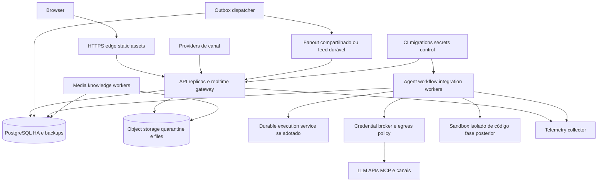

Começar com um código modular e deploys separados para API/realtime, workers de execução e ingestão. Escalar por fila/latência/conexões e limites de provider, não somente CPU. Credential broker/egress é fronteira de privilégio; sandbox de código é pool independente quando existir. Kubernetes não é requisito inicial; containers gerenciados ou VMs podem satisfazer isolamento/health/restart se testes comprovarem.

Health: liveness não depende de provider externo; readiness confirma capacidade de aceitar writes/receipts; drain retira worker da admissão, termina ou checkpointa steps e permite reconciliação de in-flight; não matar processo supondo que abort reverte HTTP. Migrations expand/contract, backfills por lote, compatibilidade de versões antigas do worker e replay tests antes de substituir engine code.

Backups com restore drill periódico, proteção de chaves, testes de expurgo e disaster recovery. Objetivos iniciais a negociar: RPO≤5min para desastre regional e RTO≤60min em piloto; receipt já confirmado deve ter durabilidade coerente com o tier vendido. Se implantação escolhida não entrega esses objetivos, reduzir promessa ou investir em HA antes de produção.

Sem dependência operacional de Fazer Agents, CRM-Modelo ou Chatwoot. Conectores/importadores para qualquer um seriam opcionais, com contratos e autorização próprios.

---

# Volume V — Engineering Plan

**[PROPOSAL] Plano para implementar o produto novo.** Decisões abaixo são propostas técnicas fundamentadas nos requisitos/achados, não alterações realizadas no código-fonte dos projetos pesquisados. Não há autorização implícita para contratar serviços ou implantar produção.

<a id="section-79"></a>

## 79. Architecture decisions

### ADR-01 — domínio próprio, monólito modular e processos especializados

Requirement: CRM/messaging próprios, transações coerentes e equipe capaz de evoluir sem custo inicial de dezenas de serviços. Candidate: um código modular com API/realtime, workers de execução e ingestão em processos/deploys separados. Why: preserva ownership de domínio e simplifica operações transacionais. Tradeoffs: fronteiras precisam de testes para não virar imports/SQL cruzados livres; escala por componente tem granularidade limitada. Alternatives: microsserviços por domínio; monólito único sem workers separados. Lock-in: baixo de infraestrutura, moderado de desenho interno. Operational cost: baixo/médio comparado a malha de serviços. Decision: baseline aprovado como proposta; dividir serviços somente por requisitos medidos de isolamento/carga/equipe, não por nome de módulo.

### ADR-02 — persistência transacional

Requirement: atomicidade de estado+evento, integridade entre tenants, CAS, jobs e consultas comerciais. Candidate: PostgreSQL em versão suportada, com escopo composto, papel runtime restrito e RLS. Why: satisfaz requisitos relacionais e permite outbox sem segundo banco obrigatório. Tradeoffs: RLS exige disciplina de papel/contexto e testes; vetores/jobs/analytics podem competir com OLTP. Alternatives: outro banco relacional com enforcement equivalente; banco separado por tenant em tiers específicos. Lock-in: moderado em SQL/RLS/vector; domínio não exporta ORM. Operational cost: médio com HA/backups, sobe com isolamento dedicado. Decision: PostgreSQL baseline; versão e serviço físico fixados em ADR operacional após restore/load spike. Não assumir que RLS cobre owner/BYPASSRLS. [Documentação primária](https://www.postgresql.org/docs/17/ddl-rowsecurity.html).

### ADR-03 — runtime do backend

Requirement: APIs e adapters assíncronos, ecossistema TypeScript, suporte previsível, CPU pesada fora da API. Candidate: Node.js LTS + TypeScript; HTTP framework escolhido por spike de contratos/observability/streaming. Why: runtime estável de integração, sem necessidade de herdar Bun do projeto observado. Tradeoffs: não presumir vantagem de throughput; parsers/conversões precisam de workers/processos. Alternatives: Bun/Elysia, Go, JVM, Python com workers — exigem avaliação de equipe e bibliotecas. Lock-in: moderado no ecossistema TS, menor se DTOs/domínio não dependerem do framework. Operational cost: baixo/médio; dependente do perfil de I/O e workers. Decision: Node LTS como baseline de referência, sem pin patch neste documento; CI deve fixar release suportada. Em 9/9/2026 a página oficial lista Node 24 como LTS e 26 como Current; produção não deve escolher Current só por ser maior. [Releases oficiais](https://nodejs.org/en/about/previous-releases).

### ADR-04 — durabilidade de agents e workflows

Requirement: sobreviver a restart durante LLM/tool, esperar aprovação/evento e impedir retry cego de efeito. Candidate: Temporal para orquestração durável, com activities finas e ledger de domínio próprio. Why: requisitos de timers/esperas/replay seriam caros de construir integralmente. Tradeoffs: infraestrutura/serviço adicional, disciplina de determinismo, history/versioning e dupla integração com banco. Alternatives: engine DB-backed próprio limitado, sem canvas genérico no MVP; outro engine durável com garantias equivalentes demonstradas. Lock-in: médio/alto no SDK/history, reduzido por spec de workflow e activities de domínio independentes. Operational cost: médio/alto self-hosted; gerenciado depende de cotação e volume, não estimado aqui. Decision: arquitetura de referência prefere engine durável; adoção de Temporal condicionada ao spike de restart/approval/replay/unknown-effect antes de live automation. Se não aprovado, restringir escopo em vez de chamar loop em memória de durável. [Workflows](https://docs.temporal.io/workflows), [activities](https://docs.temporal.io/activities), [retry](https://docs.temporal.io/encyclopedia/retry-policies).

Fronteira de autoridade: engine é dono do cursor/timers de orquestração; aplicação é dona de autorização, effects, approvals, budgets e resultados gravados. AgentRun/WorkflowRun expõem projeção operacional com revision/as_of; sincronização por comandos idempotentes e reconciler. Não dois motores decidindo independentemente o próximo efeito. Uma activity repetida primeiro consulta step/effect_key e retorna resultado já salvo; não chama LLM/HTTP de novo se receipt já existe. Janela “provider respondeu, resultado não salvo” exige tratamento explícito — durabilidade do engine não elimina cobrança/efeito externo incerto.

### ADR-05 — frontend

Requirement: inbox interativa, tabelas/kanban, builder versionado, formulários e realtime reconciliável. Candidate: React/TypeScript com routing e query cache definidos em spike; design system próprio acessível. Why: composição de view models e componentes compartilhados de domínio. Tradeoffs: React sozinho não oferece arquitetura de routing/cache e montar do zero pode criar framework ad hoc. Alternatives: Vue/Svelte ou framework React integrado conforme SSR/routing; nenhum escolhido por popularidade. Lock-in: médio na UI; contratos API e domínio independentes. Operational cost: baixo para assets estáticos, maior se adicionar SSR/BFF sem necessidade. Decision: React é baseline candidato; spike deve provar navegação, cache por tenant, conflitos e reconnect antes de consolidar stack. [Tradeoffs oficiais](https://react.dev/learn/build-a-react-app-from-scratch).

### ADR-06 — eventos e realtime

Requirement: state+event atômicos, consumers idempotentes, dois gateways recebendo mudanças e recuperação de gaps. Candidate: outbox/receipts em PostgreSQL + dispatcher; transporte de fanout escolhido por teste. Why: define garantias antes do broker. Tradeoffs: polling/lag/retention/carga e gerenciamento de cursors; feed por usuário pode custar. Alternatives: CDC ou broker durável dedicado; Redis pub/sub apenas para efêmero/fanout com resync, nunca ledger único. Lock-in: baixo no envelope, moderado no transporte. Operational cost: inicial baixo/médio; broker dedicado só com requisito medido. Decision: outbox obrigatória, broker não obrigatório no primeiro slice; teste cross-replica é gate de produção. API de broker/CDC específica ainda não escolhida, portanto não se prescreve configuração de produto sem pesquisa própria.

### ADR-07 — conhecimento, arquivos e busca

Requirement: arquivos grandes/quarantine, busca autorizada e retrieval vetorial com provenance. Candidate: object storage compatível com API S3; texto transacional inicialmente; pgvector como candidato de índice vetorial. Why: separa bytes, metadados e retrieval e reduz quantidade inicial de stores. Tradeoffs: ACL/retention entre stores, migração de embedding e competição com OLTP. Alternatives: storage cloud nativo, search/vector dedicado depois de benchmark. Lock-in: baixo/médio para objetos e metadata; embeddings são reconstituíveis se origem/versionamento preservados. Operational cost: armazenamento+egress+embedding; custos exatos requerem volume/cotação. Decision: modelo lógico aprovado; escolha de serviço e pgvector condicionadas a recall/isolamento/load spike. Não copiar dimensão 1536 do projeto observado como requisito universal.

### ADR-08 — observabilidade e financeiro

Requirement: tracing distribuído, diagnóstico de causalidade, metering confiável. Candidate: OpenTelemetry para telemetry + ledger UsageRecord próprio. Why: troca de backend de traces sem substituir faturamento. Tradeoffs: cardinalidade/PII, overhead/sampling e collectors; tracing amostrado não pode ser fonte financeira. Alternatives: SDK proprietário para traces; logs apenas (insuficientes para correlação completa). Lock-in: baixo no protocolo de telemetry; financeiro independente. Operational cost: proporcional ao volume/retention/sampling; medir antes de enviar prompts inteiros. Decision: OpenTelemetry baseline para spans/links; payloads sensíveis por referência e controles próprios. [Conceitos primários](https://opentelemetry.io/docs/concepts/signals/traces/).

### ADR-09 — ferramentas e credenciais

Requirement: ferramentas de várias origens sem elevação de privilégio e com efeito auditável. Candidate: catálogo versionado, bindings explícitos, policy engine determinístico e broker de credenciais; zero shell do host ao agente. Why: corrige ambiguidade observada entre grants, nome de tool, precondition e partial success. Tradeoffs: mais objetos/UX de aprovação; setup inicial mais exigente. Alternatives: callbacks ad hoc com token em config; rejeitada para writes externos multi-tenant. Lock-in: baixo no contrato ToolResult/schema, médio no executor. Operational cost: broker/policy e eventual sandbox isolado. Decision: obrigatório; nenhuma write tool externa live sem idempotency/reconciliation contract.

### ADR-10 — skills

Requirement: capacidades reutilizáveis sem confundir pacote administrativo e runtime. Candidate: SkillVersion declarativa compilada no AgentVersion; AuthoringRecipe separada. Why: incorpora aprendizado de B sem carregar scripts de implantação em atendimento. Tradeoffs: compatibility resolver, conflitos e UX de instalação. Alternatives: prompts copiados manualmente; plugins de código irrestrito. Lock-in: baixo se manifest exportável, médio no solver. Operational cost: baixo/médio, principalmente governança/evals. Decision: catálogo básico após Agent Core; marketplace público e código arbitrário excluídos do MVP.

<a id="section-80"></a>

## 80. MVP

MVP é um recorte operacional completo, não todas as telas anunciadas. Deve permitir que uma equipe pilote atendimento/vendas com CRM próprio e um agente governado.

| Vertical slice | Entrega mínima | Evidência de aceite |
|---|---|---|
| Tenancy/IAM | org/workspace, login, membership/papéis, API keys restritas | usuário A nunca lê/escreve B por API, query, file, cache ou realtime |
| CRM | contacts/companies, pipeline/deal, task/note/tag | histórico e evento de mudança; conflitos de edição tratados |
| Messaging | webchat ou um canal oficial selecionado, inbox/conversa, anexos básicos, humano responde | receipt durável/dedupe; send status verdadeiro e recovery |
| Agents | draft/version/deployment, um provider adapter validado, prompt/context assembly, runs/steps | versão fixada, custos/timeline, restart e cancel |
| Tools | read de CRM/KB e writes internos limitados (task/note/handoff) | policy/effect receipt; nenhuma tool irrestrita |
| Humano+IA | takeover/devolver, copilot draft e approval mínima | epoch impede próximo envio obsoleto; sem false delivery |
| Operação | logs/trace, audit, quotas, budgets, backup/restore | incident drill e reconciler de efeitos desconhecidos |

Mesmo MVP precisa do ledger de efeitos; pode adiar canvas genérico, mas não inventar atomicidade onde HTTP não oferece. Primeiro canal não escolhido neste documento porque conta/regra/custo/mercado alvo não foram fornecidos. Webchat próprio é alternativa que permite validar domínio sem credencial externa de messaging.

<a id="section-81"></a>

## 81. MVP exclusions

Sem marketplace público de skills; sem execução de código arbitrário pelo cliente; sem browser automation genérica; sem prospecção em massa; sem dezenas de providers/canais; sem voice telephony nativa; sem multi-agent autônomo aberto; sem custom workflow loops ilimitados; sem treinamento de modelos; sem analytics financeiro/atribuição avançados; sem billing monetário automático antes de usage ledger reconciliado; sem multi-região ativo-ativo.

Exclusão não retira IDs/contratos de extensão: Skill/Workflow podem entrar depois sem redesenhar Message, ToolCall e AgentVersion. Segurança, tenant isolation e receipts não são “hardening opcional de fase final”.

<a id="section-82"></a>

## 82. Phase 2

Agent Platform: SkillVersion/installation/resolver; knowledge ingestion com citations e ACL; MemoryFact/summary policies; workflows com branch/wait/approval; schedules/follow-up e causal loop protection; segundo provider/canal por contract tests; catálogo MCP governado; avaliações comparativas de versões; analytics de run/tool/conversão com causalidade limitada e explícita.

Gate: MVP demonstrou ownership/race/restart e metering. Publicar skill não pode ampliar grant sem revisão; publicar workflow não altera run suspenso; deletion de documento retira retrieval sem esperar expurgo completo. Canvas pode ser introduzido quando spec/engine/API já forem testados, não antes.

<a id="section-83"></a>

## 83. Phase 3

Production Hardening ampliado: SLOs contratuais, HA/restore automatizado, observability de custo e fairness, billing integrado, quotas por plano, retention/deletion export, audit avançado, conectores adicionais, sandbox de código segregado se houver demanda validada, read models analíticos dedicados, opções de isolamento premium e multi-região apenas após requisito real.

Segurança/observability começam na Foundation e são aprofundadas aqui. Nenhum cliente piloto deve depender de “faremos isolamento depois”.

<a id="section-84"></a>

## 84. Dependencies

| Entrega | Depende de | Não deve depender de |
|---|---|---|
| CRM básico | IAM/tenant DB/event contracts | LLM, skill engine ou outro CRM |
| Inbox | Message/Receipt/Channel/Conversation ownership | Agent habilitado |
| AgentRun | Version/Deployment/Principal/Budget/Checkpoint | canvas visual de workflow |
| Tool write interna | commands de domínio/policy/effect ledger | SQL gerado pelo LLM |
| Tool externa | Connection/CredentialBinding/egress/reconciliation | segredo no prompt |
| Skill | versões estáveis de tools/prompts/policies | scripts administrativos de B |
| Workflow | step durability/waits/approvals/idempotency | browser aberto |
| Realtime multi-replica | outbox/envelope/cursors/auth | memória local única |
| Billing | usage source IDs e reconciliação | callback de trace amostrado |
| Analytics de efeito comercial | eventos CRM e autoria | mera contagem de respostas LLM |

Dependências externas a resolver com o responsável do produto: canal/conta piloto, modelo/provider e região de dados, autenticação corporativa desejada, orçamento operacional, SLOs comerciais e política de retenção. Até lá, testes usam dados sintéticos e adapters locais.

<a id="section-85"></a>

## 85. Technical risks

| Risco | Impacto | Probabilidade inicial | Mitigação / experimento de decisão |
|---|---|---|---|
| Activity repetida duplica side effect | alto | alta sem contrato | fault injection antes/depois de provider acceptance e DB commit |
| Config drift em run | alto | alta com refs mutáveis | hash lock e rejeição de versão alterada |
| Dois donos da orquestração | alto | média | engine cursor vs domain effects documentados; reconciler testado |
| Contexto ultrapassa limite | médio/alto | alta com tools/KB | orçamento total e fixtures com tool schemas longos |
| Provider capabilities mudam | médio/alto | média | capability canary e adapter contract tests |
| Workflow loops/causalidade | alto | média | bounded loops, dedupe e limit de cadeia |
| Front cache/realtime mistura scope | crítico | média | switch-workspace/reconnect negative tests |
| Event schema quebra consumidor | médio | média | compat tests e dual-version rollout |
| Migração replay incompatível | alto | média | replay corpus de histories antes de deploy |
| Falhas locais dos testes A mal interpretadas | médio para pesquisa | presente | manter logs; não herdar “suíte verde” nem diagnosticar tudo como ambiente |

<a id="section-86"></a>

## 86. Security risks

Prioridade P0: cross-tenant data, credenciais fora de scope, write sem policy, aprovação reusada com args diferentes, SSRF para metadata, código de cliente no host, takeover sem fencing. P1: malicious tool output, prompt injection com data exfil, leak em traces/previews, duplicação de efeito após timeout, índices/search desatualizados após revoke.

Plano de validação: dois tenants com registros homônimos/IDs semelhantes; principal de agente menos privilegiado que operador; servidor MCP malicioso sintético; HTTP endpoint com redirects/DNS variáveis em rede de teste; docs com instruções adversariais; alteração de policy/credential/owner durante aprovação. Sem pentest ofensivo em serviços de terceiros.

Gate de segurança: nenhuma autorização baseada apenas em prompt; nenhuma credencial em model context; nenhum recurso de outro tenant em resultados/counts/snippets; nenhuma destructive action sem action-specific approval; eventos/logs não carregam segredos. Falha em qualquer gate bloqueia live execution daquela capability.

<a id="section-87"></a>

## 87. Scaling risks

Medir hot conversation contention, queue starvation, fanout de eventos, volume de transcript/tool output, egress de arquivos, cardinalidade telemetry, embedding throughput e tempo de restore. Quota por tenant impede um workflow infinito saturar todos. Backpressure retorna estado queued/throttled e retry_after, não faz memory buffer ilimitado.

Escala horizontal de API exige fanout/reconnect e cache scoped; de workers exige fencing/receipts; do DB exige índices/partições/read models; do knowledge exige filtro ACL eficiente. “Adicionar réplica” sem esses contratos não é plano de escala.

Load test proposto: ramp de 1→50 msg/s, burst200/s, um tenant com 80% da carga, uma conversa recebendo sequência concorrente, provider com latência/picos429/503 e janela de conexão interrompida. Medir SLIs definidos no §76 e validar invariantes, não apenas requests/s.

<a id="section-88"></a>

## 88. Open questions

| Pergunta | Quem deve decidir / evidência faltante | Default provisório |
|---|---|---|
| Segmento comercial inicial e workflow principal | produto/cliente piloto | atendimento e qualificação com task/handoff, sem cobrança autônoma |
| Primeiro canal e fornecedor | acesso à conta/regras/custo | webchat próprio para validação técnica |
| Data region/retention/compliance | responsável de dados e jurídico | não transferir entre regiões sem decisão; dados sintéticos no teste |
| Autenticação corporativa/SSO | clientes alvo | interface de identity adapter, autorização própria |
| Autonomia de writes | negócio/segurança | read e writes internos limitados; externos com aprovação/reconciliation |
| Stack de engine durável | spike operacional/equipe/orçamento | referência Temporal condicionada a gates |
| Ownership de memória entre agentes | produto/finalidade/privacidade | workspace+subject com policy explícita |
| Critério de sucesso da qualificação | cliente/dataset | score com evidências e revisão; nenhuma promessa de conversão |
| Política de efeito desconhecido | integration contract | pausar e reconciliar, não retry cego |
| Cobertura integral dos módulos A | pesquisa adicional/tempo de audit | marcar estrutura vs tracing; não alegar integral manual |
| Testes DB/RLS e providers A | ambiente dedicado e credenciais sintéticas | UNKNOWN dinâmico, fonte estática preservada |
| Áreas privadas CRM-Modelo | acesso autorizado/demo adicional | UNAVAILABLE - DO NOT INFER |

<a id="section-89"></a>

## 89. Implementation sequence

### Foundation

1. ADRs e schema logical review; fixtures de dois tenants; API error/idempotency/event contracts.
2. IAM, membership/principals/policies, banco com isolamento e migrations; object store metadata/quarantine interface.
3. DomainEvent/outbox/receipts e audit; shell frontend org/workspace; query-cache scoping; telemetry mínima.
4. Spike de durabilidade: matar worker em step/approval; replay; effect unknown; escolher engine e congelar contrato.

Exit: tenant negative tests, migration/restore smoke e outbox dedupe passam. Nada externo live.

### CRM Core

5. Contacts/identities/companies e merge controlado; pipelines/stages/deals com history; tasks/notes/tags/custom fields básicos.
6. Conversation/message/participant/attachment/receipt; webchat ou adapter piloto; inbox master-detail e send ledger.
7. Ownership epoch, handoff, delivery reconciliation; realtime cross-replica e reconnect.

Exit: equipe humana opera sem LLM e sem CRM externo; nenhuma mensagem duplicada nos fault cases suportados; unknown cases visíveis.

### Agent Core

8. AgentDraft/Version/Deployment, principals/bindings, provider adapter e ContextManifest.
9. AgentRun/Step/Attempt/checkpoint/budgets, cancel/timeout, model/tool failures.
10. Tool catalogue/read + writes internos delimitados; approval/effect receipts; playground sem efeitos por default.
11. Agent builder/test/deploy/run timeline e copilot interno; eval suite de segurança/contexto/comportamento.

Exit: oito casos análogos ao anexo executados no sistema próprio, incluindo restart/partial/unknown; versões fixadas e custos conciliados.

### Agent Platform

12. Knowledge ingestion/retrieval/provenance; memória versionada/retention.
13. SkillVersion/resolver/install; workflows duráveis/triggers/schedules; canvas input/config/output.
14. Integrações externas versionadas e credenciais; connector contracts; analytics de domínio/agent.

Exit: approved workflow retoma após restart sem duplicar efeito; policy revocation aplicada durante wait; KB deletion elimina acesso.

### Production Hardening

15. SLO/load/isolation drills, HA/restore, DR, rate limits e fairness, audit retention.
16. Billing/usage reconciliation, planos/quotas e alertas; rollout/canary/rollback versionados.
17. Security review independente; operador/documentação de incidentes; piloto controlado antes de autonomia ampliada.

Estimativas de calendário/custo ficam abertas: tamanho/experiência da equipe, canal e infraestrutura não foram informados. A sequência especifica dependências e gates, evitando prazo inventado.

<a id="section-90"></a>

## 90. Acceptance criteria

| ID | Cenário executável no produto novo | Resultado obrigatório |
|---|---|---|
| AC01 | Usuário A tenta ler/write/list/search/file/realtime de B | deny sem existência/PII vazada; audit adequado |
| AC02 | Worker roda sem scope ou com papel privilegiado errado | startup/operation falha segura |
| AC03 | Publicar AgentVersion e editar draft em paralelo | run continua hash original; conflito de draft detectado |
| AC04 | Trocar deployment enquanto run está ativo | só runs novos mudam; antigo registra versão exata |
| AC05 | Mensagem inbound duplicada/reordenada | uma receipt canônica por identidade; ordering/dedupe comprovados |
| AC06 | Crash após ACK inbound | receipt permite recuperar mensagem; zero ACK sem persistência mínima |
| AC07 | Humano assume durante LLM/tool | próximos efeitos/envios revalidam epoch; in-flight incerto exposto |
| AC08 | Tool args inválidos/desconhecida | nenhuma função efetora executada; erro de protocolo rastreado |
| AC09 | Tool read falha transitoriamente | retry limitado com budget; refusal não vira incident indevido |
| AC10 | Tool write aceita e conexão cai antes da resposta | não repetir cego; status unknown/reconcile; receipt confirma efeito |
| AC11 | Worker morre após gravar output antes de engine ACK | replay retorna resultado salvo, não chama provider de novo |
| AC12 | Aprovação muda args/target/policy ou expira | decisão antiga inválida; novo review exigido |
| AC13 | Cancelamento durante wait/LLM/send | sem novos efeitos; terminal só após esclarecer pendências |
| AC14 | Provider429/503/401/schema inválido | classificação correta; fallback só elegível e autorizado |
| AC15 | System/tools/history excedem contexto | budget total respeitado ou falha explícita; política não truncada |
| AC16 | RAG/tool output contém instrução de exfiltração | policy/egress bloqueiam; fixture não recebe secret |
| AC17 | Skill requer grant extra/ciclo/alias duplicado | publicação recusada com explicação de conflito |
| AC18 | Workflow aguarda evento antes/depois de restart | uma resolução; timeout/event/cancel CAS comprovado |
| AC19 | Trigger reage ao próprio efeito em ciclo | limite causal/dedupe contém cadeia e reporta motivo |
| AC20 | Gateway recebe evento duplicado e gap após reconnect | cache converge; resync quando necessário; sem mistura de workspace |
| AC21 | Dois gateways e mutação em réplica diferente | todos clientes autorizados recebem ou ressincronizam |
| AC22 | Delete/revoke de KB/memória com cache/index atrasado | acesso negado imediatamente; expurgo rastreado |
| AC23 | Callback de usage duplicado e retry real de LLM | não duplicar mesmo receipt; contabilizar tentativa extra comprovada |
| AC24 | Collector de trace indisponível | operação degradada conforme policy; ledger/audit obrigatório preservados |
| AC25 | Restore de backup com pending outbox/effects | reconciliação antes de retomar writes; sem replay massivo de envios |
| AC26 | Navegação por teclado/inbox mobile/conflict409 | operação possível e foco correto; draft não perdido silenciosamente |
| AC27 | Nenhum serviço Fazer/CRM-Modelo/Chatwoot disponível | CRM, webchat e Agent Core próprios continuam funcionais |
| AC28 | Operador abre run antigo | versions/context provenance/steps/effects/custo ou expiração explícita, sem interpretação vaga |

Aceite não é checkbox documental: cada AC precisa de teste automatizado ou drill reproduzível com log/receipt, responsável e resultado. Segurança/invariantes bloqueiam release; metas de performance são revistas somente por decisão registrada, não porque teste falhou.

---

# Oito casos de execução — reconstrução por fronteiras reais

Camada A, commits do [ledger](evidence-ledger.md). `[CODE]` indica cadeia inspecionada; exemplos de input são **fixtures ilustrativos**, não captura de tráfego de produção. Linhas dos arquivos originais são preservadas nos permalinks do ledger. Nenhuma skill de pesquisa foi aplicada a uma instalação real.

## Caso 1 — criar/configurar um agente

**Hipótese:** “criar um agente instancia um runtime autônomo”. **Resultado:** refutada no caminho CRUD: cria configuração persistida, não modelo/grafo. [E02](evidence-ledger.md#e 02), [E18](evidence-ledger.md#e 18).

| Etapa exigida | Trajeto observado |
|---|---|
| Initial caller | cliente REST → `src/api/v1/agents.controller.ts`, POST `/v1/agents`; alternativa MCP `agentCreate` em write-agents |
| Input object | body com name, systemPrompt, modelConfig, settings, mode e refs opcionais; tenant/principal vêm da autenticação, não de um pedido arbitrário do LLM |
| Validation | papel TENANT_ADMIN no controller; schema de transporte; `agentCreateSchema` strict; assert de prompt/settings/model/config/refs e credenciais |
| Transformations | defaults e normalização; `mode` não enviado vira test no serviço; horários/credenciais resolvidos dentro do tenant |
| Objects instantiated | objeto persistido Agent; payloads de audit; **nenhum BaseChatModel/StateGraph** |
| Functions invoked | controller → `createAgent` → `assertAgentCreatable`/parse → `runScopedOn` → `tx.agent.create` → audit |
| LLM request | nenhum |
| State mutation | nova linha Agent e audit; configuração de tools é fluxo separado de replace-the-set |
| Persistence | transação Prisma com app.tenant_id; referências tenant-visíveis |
| Events | audit da criação; armamento de follow-up condicional após criação; tools replacement emite broadcast de configuração |
| Output | representação de agente criado; MCP pode oferecer preview antes de aplicar |
| Errors | validação/credencial/referência → AppError; optimistic expectedUpdatedAt em replace pode resultar 409 |
| Cleanup | commit ou rollback da transação; não há loop residente a terminar |

Configurar tools: `replaceAgentToolSelections:2273–2389` normaliza e bloqueia nomes/Agent; valida grants; troca o conjunto em transação; audit e timestamp; depois broadcast. Publicar uma alteração não congela um snapshot imutável para turnos futuros. Import é outro caminho: valida export format, remapeia recursos, cria Agent disabled/test. [transfer.ts:1073–1350](sources/agents/src/modules/agents/transfer.ts).

## Caso 2 — mensagem simples, sem chamada de ferramenta

**Hipótese:** “um webhook vira diretamente um completion”. **Resultado:** há autenticação, ledger, mirror, gates, possível debounce, ingest, checkpoint e entrega protegida. [E03–E10](evidence-ledger.md#e 03).

| Etapa | Trajeto observado |
|---|---|
| Initial caller | Chatwoot → controller → `receiveChatwootWebhook`; `recordAndProcessChatwootDelivery` iniciado assíncrono |
| Input object | body assinado normalizado; depois RunAgentTurn com tenantId/instanceId/conversationId/inboxId/message e dependências |
| Validation | route token, HMAC, JSON/event; responder binding/generation; incoming renderizável; agent enabled/mode; ownership/test gates |
| Transformations | mensagem/mídia/quote vira texto; leitura de attrs/timezone; prompt override/variante/base; grants e vault |
| Objects instantiated | LoadedAgentConfig, ferramentas concedidas mesmo que não usadas, modelos primary/fallback, StateGraph, callbacks/status, TurnState |
| Functions invoked | process delivery → runAgentTurn → runLoadedTurn → runTurnBody → buildToolset/buildModelAndGraph → graph.invoke |
| LLM request | SystemMessage corrente + janela do checkpoint + HumanMessage atual; schemas se houver ferramentas disponíveis |
| State mutation | checkpoint agrega entrada e AIMessage; watermarks e ownership; flags de turno; claimed reply burst quando enviará |
| Persistence | saver por graphThreadId; AgentThread/Conversation e flow/usage em caminhos próprios |
| Events | status.started, flow generate, callbacks de uso/status; entrega e cleanup |
| Output | modelo produz texto sem tool_calls; runtime reaplica gates e output guardrail; envia texto/áudio; outcome posted ou supressão |
| Errors | falha de modelo propaga pelo generate; TTS pode cair para texto; falha de envio não é falha idêntica a geração |
| Cleanup | finally limpa mapa in-flight, durable turn ownership e status; rollback seletivo de mensagens em turnos recusados |

Linhas conceituais: `runAgentTurn:2285–2411` elegibilidade/load; `runTurnBody:644–1022` construção; `1258–1563` ingest/fence/checkpoint/gate; `1675–1699` invoke; `1792–2187` decisão/entrega; `2188–2266` finally. Esses intervalos são funções reais, não um fluxograma extraído de README.

## Caso 3 — mensagem que solicita uma ferramenta HTTP

**Hipótese:** “o modelo executa a URL”. **Resultado:** modelo retorna nome+args; runtime seleciona e executa função preparada no servidor, com contexto e credenciais separados. [E11–E15](evidence-ledger.md#e 11).

| Etapa | Trajeto observado |
|---|---|
| Initial caller | mesmo Caso 2; em graph agentNode o modelo retorna AIMessage.tool_calls |
| Input object | exemplo conceitual `{id:'call_1', name:'consultar_cep', args:{cep:'01001000'}}`; schema/name reais vêm da definição selecionada |
| Validation | seleção de tool autorizada na config; dedupe; fence do lote; precondition antes do inner invoke; Zod valida args dentro StructuredTool |
| Transformations | ai fields + fixed/context fields; path interpolation codificada; headers/body/query; credencial injetada servidor; URL/origin/host/SSRF |
| Objects instantiated | tool closure no build; ToolNode no graph; runtime config com toolCallId; request e ToolMessage |
| Functions invoked | agentNode → toolsCondition → toolsNode → ToolNode.run/runTool → guarded.invoke → inner.invoke → failableTool callback → fetchBounded |
| LLM request | primeiro request anuncia description/schema via bindTools; segundo inclui AI tool call e ToolMessage correlacionada |
| State mutation | AIMessage/ToolMessage entram no checkpoint; ferramenta pode alterar sistema externo; optional appointment tracking/local flow |
| Persistence | checkpoint separado de side effect; não há ToolCall row genérico transacional neste fluxo |
| Events | tool callbacks start/end/error; flowlog; ack opcional antes da operação; efeitos auxiliares específicos |
| Output | response template ou corpo limitado, prefixado por HTTP status; status esperado pode ser resultado normal |
| Errors | missing arg corrigível vs missing secret/config; timeout/DNS/status; ToolFailure status error; exceção ordinary normalizada por ToolNode |
| Cleanup | fetch bounded/timer cleanup nas helpers; tool scope termina; runtime continua até decisão final/failure; nenhum rollback HTTP genérico |

Ordem crítica: a precondition envolve `invoke`, então ela pode recusar antes de a validação inner executar; o builder ainda expõe o schema original. Se precondition permite, `StructuredTool` parseia **antes** da função que faz efeito. Dizer simplesmente “o LLM valida” é incorreto. [precondition:49–94](sources/agents/src/graph/tools/precondition.ts), [dependência](dependency-runtime.md).

Para CODE, substitua transporte pela fila → Worker → QuickJS → corpo armazenado; limites 20k chars código, 32k input, 64k contexto, 1 s, memória 32 MiB, stack 256 KiB. Para MCP, servidor oferece tools, subset e namespace são aplicados, invocation passa pelo adapter; OAuth e cache são por conexão/tenant. Credenciais e permissões do servidor externo são fronteira adicional, não herança automática das do usuário humano.

## Caso 4 — “executar um agente com skill”

**Hipótese:** “agents-skills é carregado ao iniciar o turno”. **Resultado:** não há esse caminho nas fontes inspecionadas. O caso deve ser reformulado como **autoria guiada por skill, seguida de execução normal**. [E34–E36](evidence-ledger.md#e 34).

| Etapa | Evidência / limite |
|---|---|
| Initial caller | assistente de implantação/desenvolvimento/operação externo; seleção automática do host é UNKNOWN |
| Input object | SKILL.md e referências + dados fornecidos pelo operador; sample JSON opcional |
| Validation | instruções prescrevem preview/aprovação; MCP runtime valida args/schema/role/scopes; host cumprimento da instrução não comprovado |
| Transformations | assistente adapta configuração/prompt; `agentImport` traduz export; `promptSet` altera prompt; grants por agentToolsSet |
| Objects instantiated | no Agents, Agent/config e componentes importados; não Skill runtime |
| Functions invoked | instrução B → cliente MCP externo → servidor MCP A → write-agents.agentImport/agentCreate ou write.promptSet → serviços de domínio |
| LLM request | eventual LLM do assistente externo é UNKNOWN; após configuração, request do atendimento segue Caso 2 |
| State mutation | prompt/settings/tools gravados por API/MCP; scripts podem administrar infraestrutura se executados pelo operador |
| Persistence | configuração Agents; arquivos do pacote no host externo; ausência de Skill row observada |
| Events | audit das mutações e eventuais eventos normais de configuração |
| Output | agente configurado/importado ou código/infra alterados; nenhuma saída runtime atribuível a skill_id |
| Errors | import inválido/refs/credenciais/scopes; procedimentos descrevem cuidados, mas não engine de retry de skill |
| Cleanup | transações dos serviços; lifecycle do host/CLI externo UNKNOWN |

Código de ponte real: [mcp/write-agents.ts:316–387](sources/agents/src/modules/mcp/write-agents.ts) valida export, faz rehearsal e aplica import; [server.ts](sources/agents/src/modules/mcp/server.ts) registra tools e transport; [write.ts](sources/agents/src/modules/mcp/write.ts) implementa promptSet. As palavras “dry-run” no pacote B são corroboradas por ramos de código do MCP, mas não constituem aprovação geral de ferramentas de atendimento.

## Caso 5 — múltiplas etapas

**Hipótese:** “há workflow porque há várias chamadas”. **Resultado:** há loop agent/tools no turno e automações específicas via jobs, mas não se demonstrou engine de workflow de negócio genérica/versionada. [E09](evidence-ledger.md#e 09), [E21](evidence-ledger.md#e 21).

| Etapa | Trajeto observado |
|---|---|
| Initial caller | runtime cria grafo; graph START → agent |
| Input object | estado MessagesAnnotation, tools, limits, stillWanted, callbacks, fallback |
| Validation | cada hop normaliza histórico; cada tool valida próprios args; fence antes do lote |
| Transformations | janela/contexto; tool-call count desde último Human; instrução soft/hard; protocolo skip_reply |
| Objects instantiated | grafo/ToolNode por turno; ToolMessages por resultado; mesmas closures compartilhadas por hops |
| Functions invoked | agent → toolsCondition → tools → agent, até END/cancel/error |
| LLM request | em cada hop, novo SystemMessage + observações acumuladas; depois do hard limit, binding reduzido/sem tools |
| State mutation | sequência de AI/Tool messages; flag fallback sticky; cancel tool boundary; handoff/attachments por efeito |
| Persistence | checkpoints entre supersteps; efeitos externos já executados não são revertidos por erro posterior |
| Events | geração/tools/usage/status por iteração |
| Output | resposta final, silêncio ou stand-down; limite não define plano de negócios versionado |
| Errors | falha em hop posterior pode deixar hop anterior persistido e side effect concluído |
| Cleanup | runtime finally; política de scheduler caso caller seja job; sem compensação genérica |

`ToolNode` pode executar chamadas do mesmo hop em paralelo. O teto é verificado contando resultados depois da chamada anterior: não reservar antecipadamente quota atômica por tool. [INFERENCE, MEDIUM] Um lote maior que o saldo pode exceder o teto de efeitos antes do próximo check; a conclusão de algoritmo não é teste de side effect de produção.

## Caso 6 — recuperar/persistir contexto e compactar memória

**Hipótese:** “o banco guarda a mesma lista que foi enviada ao modelo”. **Resultado:** falso quando janela limita input; compactação é operação persistente distinta. [E19](evidence-ledger.md#e 19), [E20](evidence-ledger.md#e 20), [E31](evidence-ledger.md#e 31).

| Etapa | Trajeto observado |
|---|---|
| Initial caller | turno: buildModelAndGraph → getCheckpointer; compactação: scheduler MEMORY_COMPACT |
| Input object | graph thread tenant:instance:ci:contactInbox, fallback tenant:instance:conversation; job informa escopo/atendimento |
| Validation | tenant-prefix nos entrypoints pertinentes; enabled/reopened/busy; IDs do prefixo antes do rewrite |
| Transformations | turno só recorta input; compactor seleciona attendance fechada, filtra transcript, resume, gera head com summaries |
| Objects instantiated | PostgresSaver/pool singleton; graph state accessor; modelo summarizer; HumanMessage head + RemoveMessage |
| Functions invoked | getState/invoke; runMemoryCompact → summarizeAttendance → upsert summary → fila → getState → updateState |
| LLM request | turno recebe head histórico; summarizer recebe SystemMessage específico + transcript limitado |
| State mutation | summary novo; substituição seletiva de prefixo; mensagens novas preservadas; watermarks/leases administrados separadamente |
| Persistence | AttendanceSummary antes de rewrite de checkpoint; commits diferentes |
| Events | job/flowlog/memory stages; error de resumo deixa thread intacto |
| Output | memória compactada para próximos turns; não precisa produzir mensagem pública |
| Errors | model fail, busy, prefix changed, reopened, DB fail; adia/falha conforme ramo; reutiliza resumo já salvo quando aplicável |
| Cleanup | fila/lease termina; job completa/reagenda/falha; não se inventa atomicidade entre stores |

Sem DB, testes de rewrite distribuído não foram executados nesta pesquisa. Testes de seleção de histórico e summarizer com modelos scripted foram executados no recorte. Isso sustenta contrato local, não elimina risco de race persistente.

## Caso 7 — falha de LLM

**Hipótese:** “qualquer erro dispara fallback e o cliente sempre recebe resposta”. **Resultado:** fallback é seletivo e pode falhar; entrega depende de estado da conversa. [E32](evidence-ledger.md#e 32), [E06–E07](evidence-ledger.md#e 06).

| Etapa | Trajeto observado |
|---|---|
| Initial caller | agentNode → runModelCall |
| Input object | closure invoke primary, labels, callbacks; fallback opcional utilizável |
| Validation | providerFailure/statusOf/empty completion; disponibilidade de credencial de fallback |
| Transformations | erro normalizado; classificação timeout/transient; labels/uso passam a indicar modelo efetivo |
| Objects instantiated | erro/ProviderFailure; fallback model já preparado quando configurado; closure sticky do turno |
| Functions invoked | primary.invoke → classifier → fallback.run se elegível; onFallback/onFallbackFailed; else throw |
| LLM request | primary; possivelmente fallback para mesmo contexto com adaptação de provider; não retry irrestrito de 401/config |
| State mutation | checkpoint de hops anteriores pode permanecer; fallbackHasTheTurn=true após failover |
| Persistence | runtime catch examina checkpoint para saber se inputMessageId já foi folded in; callbacks registram falha/uso |
| Events | flow generate error, fallback/retry callbacks, logs; nota privada/failed-turn por caminhos específicos |
| Output | fallback pode produzir resultado; se falha, turno pode terminar sem resposta pública; handoff pendente pode ter sido entregue |
| Errors | fallback relança se falhar; caller delivery/job administra retry/failed state; não repetir como se nenhum efeito tivesse ocorrido |
| Cleanup | finally termina status/inflight/lease; erro de cleanup é warning conforme ramo |

É importante separar **retry do transporte/modelo**, **retry de turno pelo job** e **reentrega de webhook**. São budgets e identidades diferentes; um único contador genérico esconderia duplicação de efeitos.

## Caso 8 — falha de ferramenta

**Hipótese:** “erro de ferramenta aborta sempre o grafo”. **Resultado:** normalmente vira observação ao LLM; alguns efeitos podem ter ocorrido antes. [E15](evidence-ledger.md#e 15), [E37](evidence-ledger.md#e 37).

| Etapa | Trajeto observado |
|---|---|
| Initial caller | ToolNode.runTool após AI tool_calls |
| Input object | name/id/args; tool runtime config; estado de conversa nas closures |
| Validation | desconhecida → erro; schema inválido → ToolInputParsingException; precondition pode recusar sem executar |
| Transformations | ToolFailure vira ToolMessage error; exceção ordinária vira texto `Error...` pelo ToolNode; recusa de precondition é normal ToolMessage |
| Objects instantiated | erro ou marker ToolFailure; ToolMessage correlacionada |
| Functions invoked | tool.invoke → wrapper/func → falha; catch ToolNode ou retorno failableTool; graph próximo agent |
| LLM request | próxima rodada inclui erro/recusa; modelo escolhe corrigir, tentar outra ação ou responder |
| State mutation | ToolMessage persistida; side effect remoto talvez já concluído; handoff pode já ter mudado status |
| Persistence | checkpoint e logs; sem rollback genérico de operação externa |
| Events | tool error vs refusal info/warn; side-effect phase log em handoff |
| Output | resultado de erro ao modelo ou resultado parcial apresentado como sucesso por ferramenta específica |
| Errors | GraphInterrupt especial é relançado pela biblioteca; isto não prova uso de human-approval interrupt pelo app |
| Cleanup | função/tool recursos locais; runtime continua ou finally se erro propaga |

Contrato demonstrado por `tool-failure.test.ts`: mesma mensagem, status error, id/nome preservados; chamada plain args retorna string. Contrato de handoff em `tools.test.ts`: assignment pode falhar depois de status aberto, ainda retornando handoff e registrando fase assign. Esse achado exige `effect_state` explícito na proposta.

## Reconstrução do request — o que sabemos e o que não sabemos

[CODE] Forma abstrata real do input de grafo em runtime.ts:1675–1699:

```text
graph.invoke(
  { messages: [optional HumanHandbackMessage,
                HumanMessage(id=inputMessageId,
                             content=renderedText,
                             additional_kwargs=conversationStamp)] },
  { configurable: { thread_id: graphThreadId },
    callbacks: [usage/langfuse..., status, toolLogger] }
)
```

[CODE] Forma abstrata real do request do agentNode após ler state:

```text
modelWithSelectedTools.invoke([
  SystemMessage(compiledPromptForThisHop),
  ...normalizedAndWindowedCheckpointMessages
])
```

[INFERENCE, HIGH] Exemplo didático compatível, **não dump de rede**, segundo hop de uma consulta:

```text
system: <prompt efetivo + grounding se habilitado + attrs/agenda + MCP + budget>
human: Qual é o endereço para este CEP?
assistant: tool_calls=[{id: call_1, name: consultar_cep, args: {cep: ...}}]
tool: tool_call_id=call_1, status=success, content="HTTP 200\n..."
tools: [schemas e descriptions previamente selecionados]
```

Metadata de conversationStamp é usada pelo app/checkpointer; sua tradução exata para cada wire não deve ser presumida. Model adapters podem remover/transformar campos, mudar endpoint e tratar content blocks. Somente execução instrumentada por provider permitiria produzir payload HTTP real completo e comparar bytes sem expor segredos. Isso permanece UNKNOWN, não substituído pelo exemplo acima.

---

# Modelo lógico — dicionário e invariantes do produto novo

**[PROPOSAL] Todo este arquivo descreve C, o novo CRM.** Não é schema observado no Fazer Agents nem backend inferido do CRM-Modelo. O modelo lógico antecede escolha de ORM/banco. Campos abaixo são núcleo necessário para iniciar design físico; índices, constraints e operações críticas são especificados, sem fingir que isto já é migration pronta.

## Convenções transversais

`ID` = identificador interno opaco; não telefone/email/id do canal. `OrgID` = tenant de segurança e cobrança. `WorkspaceID` = compartimento operacional dentro da organização. `Revision` = inteiro monotônico de controle otimista. Dinheiro = quantia decimal exata + moeda; tokens/bytes = inteiros não negativos; timestamps armazenam instante UTC, agendas conservam também timezone IANA e intenção local.

Toda entidade tenant-scoped carrega `organization_id`; entidades operacionais carregam também `workspace_id`. Toda FK operacional referencia chave candidata composta `(organization_id, workspace_id, id)`; cross-workspace só por relação de compartilhamento explicitamente autorizada, nunca FK acidental sem escopo. IDs enviados pelo cliente são referências a resolver, não autoridade de acesso.

Campos transversais em entidades mutáveis: `id, organization_id, workspace_id?, revision, created_at, updated_at, created_by_principal_id`. Soft-delete somente onde reativação faz sentido; remoção/anonimização obedece política de retenção. Registros financeiros/audit/attempts são append-only com correções compensatórias. Conteúdo publicado de versões é imutável e endereçável por hash; rascunhos são separados.

### Matriz de substituições das hipóteses originais

| Hipótese | Decisão lógica | Motivo |
|---|---|---|
| Lead | `LeadProfile` de Contact, separado de Deal | contato pode ser lead qualificado sem negócio e ter múltiplos negócios |
| AgentMessage | `RunMessage` | mensagem interna do modelo não é mensagem pública de canal |
| AgentEvent | projeção filtrada de `DomainEvent` + timeline | evita dois logs concorrentes de verdade |
| Prompt | `PromptTemplate` + `PromptVersion` | reuso e rendering versionáveis; conteúdo do AgentVersion pode embutir versão |
| ToolCredential | `CredentialBinding` para ToolBinding | evita duplicar segredo por ferramenta |
| Memory | `MemoryFact` + `ConversationSummary` + policies | fato explícito e resumo lossy têm contratos diferentes |
| WorkflowStep | `WorkflowNode` (definição) + `WorkflowStepRun` | uma definição pode ter várias execuções/iterações |
| Automation | `Trigger`/`Schedule` que acionam Agent ou Workflow | não criar segundo motor de execução com garantias diferentes |
| Event | `DomainEvent` + `OutboxDelivery` | fato ocorrido e tentativa de entrega não são a mesma coisa |
| User como autor de agente | `Principal` humano ou service principal | agente deve ter autoridade própria, não simular usuário admin |
| Skill scripts livres | `AuthoringRecipe` fora do runtime ou ToolVersion sandboxada | separar implantação de infraestrutura de capacidades do cliente |

## IAM e organização

| Entidade | Campos específicos essenciais / relações | Invariantes e lifecycle |
|---|---|---|
| Organization | name, slug, status, data_region, retention_policy_id, billing_account_id | tenant raiz; suspension bloqueia novos efeitos e preserva leitura autorizada/exports; deletion vira workflow rastreado |
| Workspace | organization_id, name, slug, timezone, status | unique(org,slug); não movimentar registros de workspace via update cego |
| User | identity_subject, normalized_email, display_name, status | identidade global; não contém permissões tenant implícitas; email não é PK |
| Principal | kind=user/service/agent, user_id?, organization_id?, status | um agente executor não recebe sessão humana; service principal pertence a uma org |
| Membership | user_id, organization_id, workspace_id?, status, invitation_id? | FK workspace da mesma org; membership de org não concede todos workspaces automaticamente |
| Role | organization_id, scope_kind, name, system_template? | papéis locais podem derivar template; alterações auditadas e revisionadas |
| Permission | key, resource_kind, action, constraints_schema | catálogo de capacidades sem grants por texto livre do LLM |
| RolePermission | role_id, permission_id, constraints | unique(role,permission,constraints hash); constraints só restringem |
| RoleAssignment | principal/membership_id, role_id, scope_ref | autorização efetiva depende de principal ativo e membership válido |
| APIKey | principal_id, key_hash, prefix, scopes, expires_at, revoked_at | segredo mostrado uma vez; lookup por prefix, comparação segura; nunca usar key como tenant selector |
| Session | user_id, hashed_token, expires_at, revoked_at, auth_strength | revoke/rotation; acesso workspace revalidado em operações e reconnect |
| Invitation | organization/workspace, email, role_ids, token_hash, expiry | aceite não ultrapassa direitos de quem convidou; uso único |
| Environment | workspace_id, name, kind=test/staging/production | credenciais/deployments/quotas distinguem ambiente; dados reais só por permissão explícita |
| PolicyVersion | scope_ref, policy_document, hash, created_by | conteúdo imutável; publicação aponta versão efetiva; deny vence allow |

Command examples: inviteMember, assignRole, revokeApiKey, suspendWorkspace. Events: membership.activated, access.revoked, workspace.suspended. **Nenhum evento inclui token/secret.** Auditoria registra autor, delegação e alvo.

## CRM

| Entidade | Campos específicos essenciais / relações | Invariantes e lifecycle |
|---|---|---|
| Contact | name, locale, owner_principal_id?, status, consent_summary_ref | pessoa/contato interno; merge é operação com lineage, não delete+recreate |
| ContactIdentity | contact_id, kind=phone/email/channel, normalized_value, verified_at, external_account_id? | identidade por fonte/canal; unicidade definida por escopo, não globalmente por nome; conflitos exigem resolução |
| Company | name, legal_identifier?, domain?, owner | identificadores opcionais com origem; entidades homônimas não fundidas automaticamente |
| ContactCompany | contact_id, company_id, relationship, is_primary | N:N; no máximo uma primária por contact onde política exigir |
| LeadProfile | contact_id, lifecycle, qualification_score?, score_policy_version?, evidence_refs, qualified_at | unique(workspace,contact); score não muda estágio de Deal implicitamente |
| Deal | contact_id?, company_id?, pipeline_id, stage_id, title, value, currency, owner, status, stage_entered_at, won_at?, lost_reason? | stage pertence ao pipeline; pelo menos contato ou empresa; won/lost exige regra de transição e histórico |
| Pipeline | name, currency_policy, archived_at | arquivar preserva negócios; ordenação de stages transacional |
| Stage | pipeline_id, name, position, kind=open/won/lost, probability? | position única no pipeline; mover Deal gera event com before/after |
| DealStageHistory | deal_id, from_stage?, to_stage, actor, reason, event_id | append-only; fonte de duração/conversão, não inferir pelo updated_at |
| Task | title, assignee_principal_id, due_at?, timezone?, status, related_contact/deal/conversation refs | lifecycle open/in_progress/done/canceled; alvo relacionado deve estar no mesmo workspace |
| Note | author_principal_id, body_ref/body, visibility, related_entity_ref | note interna não é mensagem pública; edits têm revision/audit |
| Tag | name, color_token, archived_at | unique(workspace,normalized_name); cor não representa política |
| TagAssignment | tag_id, typed_target_id, assigned_by | unique(tag,target); FK tipada ou tabelas join por recurso para preservar escopo |
| CustomFieldDefinition | target_kind, key, type, validation, visibility_policy, indexed | key estável; mudança de tipo exige migração; segredo não vira custom field |
| CustomFieldValue | definition_id, typed_target_id, typed_value | validação determinística servidor; projection JSON possível, mas não bypass de schema |
| ConsentRecord | contact_id, channel/purpose, status, source, captured_at, evidence_ref, expires_at? | revogação invalida próximo envio quando aplicável; não deduzir consentimento de existência do contato |

Commands: upsertContactIdentity, mergeContacts, qualifyLead, createDeal, moveDeal, closeDeal, assignTask. Toda write de agente usa os mesmos serviços de domínio e validações do humano. Event consumer não pode mover novamente o Deal sem novo command idempotente.

## Messaging

| Entidade | Campos específicos essenciais / relações | Invariantes e lifecycle |
|---|---|---|
| Channel | type, capability_version, connection_id, external_account_id | adaptador de transporte; enum de capacidades inclui texto/mídia/template/ack/order; id interno |
| Inbox | name, channel_id, routing_policy_version, team_id?, status | unidade de fila; canal pode servir múltiplas regras/inboxes se adapter permitir explicitamente |
| Conversation | inbox_id, contact_id?, status, owner_kind, owner_principal_id?, ownership_epoch, episode_no, last_message_seq | status e dono separados; takeover incrementa epoch; agente só envia se epoch autorizado |
| Participant | conversation_id, principal_id/contact_identity_id, role, joined_at, left_at? | autor precisa participar ou ter permissão server-side; snapshots de nome não substituem identidade |
| Message | conversation_id, sequence, author_ref, direction, visibility, content_blocks, client_message_id?, source_delivery_id? | unique(conversation,sequence); interna/pública explícita; edição/remoção via revision/event; recebido não é gerado |
| Attachment | message_id?, object_ref, content_hash, media_type, size, scan_status, visibility | quarantine antes de servir; signed URL curta; metadados não dão acesso por si |
| InboundReceipt | channel_id, provider_event_id, body_hash, received_at, verified_signature, processing_status | unique(connection,event_id); ACK somente após receipt durável; mesmo id/body divergente vira incidente |
| MessageIntent | conversation_id, requested_by, run_id?, content_ref, expected_ownership_epoch, state, idempotency_key | intenção persistida antes do envio; cancelamento antes de dispatch possível; não equivale a Message entregue |
| MessageDeliveryAttempt | intent_id, attempt_no, provider_message_id?, request_hash, status, response_code, started_at, ended_at | transporte at-least-once com dedupe/reconciliação; timeout após send pode ser unknown |
| MessageReceipt | message_id/provider_message_id, kind=accepted/delivered/read/failed, provider_time, receipt_id | receipts podem chegar fora de ordem; state monotônico por contrato de canal, preservar fatos tardios |
| ConversationAssignmentHistory | conversation_id, from_owner, to_owner, epoch, reason, actor | append-only; audita humano→IA e IA→humano |
| NotificationPreference | principal_id, event_kind, delivery_channel, enabled, digest_policy | não é grant de acesso; payload filtrado pela autorização atual |
| Notification | recipient_principal_id, event_id, redacted_payload, read_at? | unique(recipient,event,purpose); acesso revalidado ao abrir |

Commands: receiveMessage, requestSendMessage, claimConversation, handoffConversation, resolveConversation. Um agent run pode terminar e seu MessageIntent ainda estar queued ou unknown; UI deve exibir ambos. Mudar ownership não cancela retroativamente mensagens já aceitas pelo provedor.

## Agentes e modelos

| Entidade | Campos específicos essenciais / relações | Invariantes e lifecycle |
|---|---|---|
| Agent | name, purpose, owner, archived_at, default_environment_id | identidade estável; não contém config mutável usada sem snapshot |
| AgentDraft | agent_id, revision, editable_spec, validation_report | mutável por autor autorizado; publicação exige testes/políticas |
| AgentVersion | agent_id, version_no, content_hash, instructions_ref, model_policy_ref, dependency_lock, context_policy, limits, created_by | unique(agent,version); conteúdo imutável; sem segredo; dependencies fixadas por id/version/hash |
| AgentDeployment | agent_id, agent_version_id, environment_id, status, deployment_revision, routing/trigger_binding, effective_at | ativação CAS; cada run fixa versão e revision; rollback altera ponteiro para nova execução, não run passado |
| AgentPrincipalBinding | agent/deployment_id, service_principal_id, policy_version | execução tem principal próprio e escopo por ambiente; publish não pode elevar além do autor |
| AgentRun | deployment_id, agent_version_id, dependency_lock_hash, trigger_ref, input_ref, conversation_id?, expected_epoch?, state, status_revision, budget_reservation_id, lease_epoch, cancel_requested_at?, parent_workflow_run_id? | identidade durável; unique(workspace,request_key); transição CAS; terminal imutável, reexecução vira novo run com link |
| AgentStep | run_id, sequence, kind, state, input_ref, output_ref?, started_at?, ended_at?, error_code? | unique(run,sequence); planejamento persistido antes de efeito; tentativa não substitui step |
| StepAttempt | step_id, attempt_no, worker_id, fence_epoch, deadline, result_ref, error_class | unique(step,attempt); completion aceita só fence atual; resultado tardio preservado para reconciliação |
| RunCheckpoint | run_id, checkpoint_no, cursor, state_ref, manifest_hash, pending_effect_refs, engine_version | append-only; somente estado necessário para continuar; não serializar conexão/secret/closure |
| RunMessage | run_id, step_id?, role, ordered_index, content_ref, tool_call_ref?, provenance, visibility_policy | transcript interno; não emitir como Message pública sem command explícito |
| ContextManifest | run_id, step_id, prompt_version, ordered_sources, source_revisions, token_estimates, truncations, hashes, trust_labels | reprodutibilidade da montagem; conteúdo sensível pode expirar, hash/proveniência seguem política |
| PromptTemplate | name, schema, scope, description | template reutilizável, não comando de sistema que ignora política |
| PromptVersion | template_id, version, body, variable_schema, content_hash | immutable; rendering escaping/validation definidos; unknown variable em publish falha |
| ModelEndpoint | provider_kind, model_id, connection_ref, capabilities, capability_verified_at, region | capacidade declarada precisa teste de contrato; não prometer uniformidade por nome |
| ModelPolicyVersion | preferred_endpoint, fallback_rules, output_schema?, timeout, max_tokens, data_policy | allowlist de endpoint/região e fallback; fallback nunca amplia dados autorizados |
| ModelCall | step_id, endpoint_snapshot, attempt_no, request_ref, response_ref, tokens_in/out, usage_status, latency, provider_request_id? | request/response redigidos/encriptados; custo estimado e confirmado separados |
| ApprovalRequest | run/step/tool_call_id, action_digest, target_refs, policy_version, approver_constraints, expires_at, state | aprovação vincula digest+versão+escopo; alteração invalida; concessão expirada/revogada não executa |
| ApprovalDecision | approval_id, principal_id, decision, reason, decided_at, authentication_context | append-only; proibir autoaprovação onde política exigir separação de deveres |

Eventos de run ficam em DomainEvent (agent.run.started/completed etc.) e timeline derivada. Não criar AgentEvent com outra numeração/verdade. Transcript de modelo pode conter raciocínio de ferramenta e observações, mas o produto não requer nem presume acesso a chain-of-thought privado do provider.

## Ferramentas e credenciais

| Entidade | Campos específicos essenciais / relações | Invariantes e lifecycle |
|---|---|---|
| Tool | name, owner, category, visibility_scope, archived_at | identidade estável; não assumir nome LLM como ID |
| ToolDraft | tool_id, revision, spec, tests | mutável; publishing valida schema, efeitos, credenciais e egress |
| ToolVersion | tool_id, version, input_schema, output_schema, executor_kind, artifact_digest, effect_class, resource_requirements, timeout, idempotency_contract | immutable; efeito classificado e executor fixado; migration incompatível exige nova versão |
| ToolBinding | agent_version/skill_version_id, tool_version_id, alias, allowed_operations, resource_selector, policy_ref, credential_binding_id? | alias único no dependency lock; grants só reduzem; selector não vem livre de output LLM |
| Credential | owner_scope, secret_handle, encryption_key_ref, type, status, expires_at?, rotation_generation | banco guarda handle/ciphertext protegido; nenhum segredo no prompt/export; revogação consulta atual |
| CredentialBinding | connection/tool_binding/environment, credential_id, allowed_audience, allowed_scopes, resource_selector | mesma org; compartilhamento entre workspaces é grant explícito e auditado; não copia valor |
| ToolCall | run_id, step_id, tool_binding_snapshot, action_digest, canonical_args_ref, effect_key, policy_decision_ref, outcome, effect_state | unique(scope,effect_key); retries usam a mesma identidade de operação; args alterados criam nova operação |
| ToolCallAttempt | tool_call_id, attempt_no, worker/fence, request_hash, response_ref?, started/ended_at, status | append-only; tentativa uncertain não vira success sem receipt/reconcile |
| ToolResult | tool_call_id, output_ref, schema_version, outcome_code, effect_receipts, safe_model_view, observed_at | output validado/limitado; texto não eleva permissão; PII filtrada por consumer |
| PolicyDecision | principal, action_digest, evaluated_policy_versions, allow/deny/approval, reason_codes, evaluated_at | auditável; decisão vencida é reavaliada antes de efeito; negações não expõem recurso oculto |
| EffectReceipt | effect_key, target_system, external_id?, before_revision?, after_revision?, proof_ref, status | prova operacional, não somente texto LLM; external ambiguous exige reconciliation |

Classes: pure sem I/O externo; read sem mutação declarada; write reversível/compensável quando possível; destructive com impacto irreversível; external/internal são **eixos ortogonais** a efeito, não enum mutuamente exclusivo. Tool interno write continua sujeito ao mesmo domínio/política; ferramenta read pode vazar dados e exige escopo.

## Skills e conhecimento/memória

| Entidade | Campos específicos essenciais / relações | Invariantes e lifecycle |
|---|---|---|
| Skill | name, description, owner_scope, visibility | pacote reutilizável de capacidade, não identidade que executa sozinha |
| SkillDraft | skill_id, revision, manifest, validation | mutável; authoring separado de instalação |
| SkillVersion | skill_id, version, instructions_ref, tool_requirements, knowledge_refs, workflow_refs, policy_constraints, resources, config_schema, compatibility, hash | conteúdo imutável; dependencies acíclicas ou rejeitadas; sem segredo/código arbitrário implícito |
| SkillInstallation | skill_version_id, organization/workspace, approved_by, config, state | instalar não concede tools/credenciais automaticamente; upgrade explícito |
| AgentSkillBinding | agent_version_id, installation_id, configuration_snapshot, precedence_slot | scope efetivo = interseção de políticas; conflitos sem resolution explícita impedem publish |
| KnowledgeBase | name, owner_scope, access_policy, embedding_profile, retention_policy | isolamento por workspace e grants; modelo/dimensão/index versionados |
| KnowledgeDocument | kb_id, source_ref, source_version, content_hash, object_ref, status, classification, published_revision | pending→quarantined/processing→ready/failed; documento removido precisa sair de busca e caches |
| KnowledgeChunk | document_id, revision, ordinal, text_ref, embedding_ref, citation_offsets, visibility | retrieval só usa chunks da revisão publicada/permitida; provenance até fonte |
| KnowledgeIngestionRun | document_revision, parser_version, chunker_version, embed_model, cursor, status | idempotente por document hash+pipeline version; retries não duplicam chunks |
| RetrievalRecord | run/step, query_ref, kb_scope, document_revisions, scores, filter_policy, result_hash | registra o que foi considerado/apresentado, sem expor resultados não autorizados |
| MemoryPolicyVersion | scope_kind, sources_allowed, write_approval, retention, relevance, redaction | separa memória de contato/conversa/agente; nenhuma expansão cross-tenant |
| MemoryFact | subject_ref, predicate, value_ref, evidence_refs, confidence, valid_from/to, expires_at, status, policy_version | fato é assertion revisável; confirmação/contradição/revogação explícitas; origem tool/user identificada |
| ConversationSummary | conversation/episode_id, range_start/end, source_hash, summary_ref, model/prompt_version, quality_state | derivado lossy com cobertura temporal; não é verdade autoritativa de saldo/permission |
| MemoryRevision | memory_fact_id, revision, reason, author, previous_ref | correção auditável; delete/retention propagam aos índices dependentes |

SkillVersion pode recomendar tools, conhecimento ou workflow, mas o compilador resolve **grants efetivos**, não concatena privilégios. `requires` não é `allowed`. Org library compartilha definição, não dados nem secrets do workspace produtor.

## Workflows e automações

| Entidade | Campos específicos essenciais / relações | Invariantes e lifecycle |
|---|---|---|
| Trigger | target=deployment/workflow_version, event_kind?, filter_spec, principal_binding, enabled, debounce/dedupe_policy, causal_limit | evento só solicita execução; não carrega autoridade livre; self-trigger loops limitados |
| Workflow | name, owner, archived_at | identidade; engine não embutido no front |
| WorkflowDraft | workflow_id, revision, graph_spec, validation | edição com CAS; canvas é projeção do spec |
| WorkflowVersion | workflow_id, version, typed_graph, input/output_schema, dependency_lock, limits, hash | immutable; nodes/edges/schemas validados; loops somente explícitos e limitados |
| WorkflowNode | version_id, node_key, kind, config, input_bindings, next_edges | componente lógico da versão; node key estável dentro da versão, não ID de execução |
| WorkflowRun | version_id, trigger_receipt, input_ref, state, cursor, budget, parent/correlation, engine_ref | durável, unique(trigger identity,version,target); output imutável terminal |
| WorkflowStepRun | workflow_run_id, node_key, iteration, state, input/output_ref, agent_run/tool_call_ref? | unique(run,node,iteration); waits e branch decisions persistidos |
| WaitSubscription | workflow_step_run_id, correlation_key, expected_event_kind, deadline, consumed_event_id? | event match tenant-scoped; só uma resolução vence timeout/event/cancel |
| Schedule | target_ref, timezone, local_rule, next_fire_at, misfire_policy, catchup_limit, enabled | DST explícito, exec key schedule+planned_instant; atraso não dispara backlog ilimitado |
| ScheduleOccurrence | schedule_id, planned_instant, trigger_request_id, state | unique(schedule,instant); mudança de timezone não duplica ocorrência existente |

Não criar tabela AutomationRun paralela: automação por regra inicia AgentRun ou WorkflowRun. Schedule dispara TriggerRequest com principal/policy bind, não executa ferramenta diretamente sem ledger.

## Integrações

| Entidade | Campos específicos essenciais / relações | Invariantes e lifecycle |
|---|---|---|
| Integration | key, adapter_version, capability_manifest, auth_methods | catálogo de código/contrato do conector, não conta conectada |
| Connection | integration_id, workspace_id, environment_id, state, config, credential_binding_id, health | identidade de instalação; scope health e credential atuais; revoked impede novas chamadas |
| ExternalAccount | connection_id, provider_account_id, display_name, capabilities | unique(connection,external id); vínculo não confere acesso a outra org |
| ExternalObjectMapping | connection_id, object_kind, external_id, internal_id, provider_revision, sync_cursor | unique(connection,kind,external id); preserva nossa PK ao trocar provider |
| WebhookEndpoint | connection/subscription_ref, route_token_hash, signature_scheme, signing_key_handle | rota opaca + verificação; secrets fora de logs |
| WebhookSubscription | event_kinds, endpoint_ref, signing_credential, filter, status | entrega outbound por assinatura e escopo; não receber eventos ocultos |
| WebhookDelivery | subscription_id, event_id, attempt_no, status, next_attempt_at, response_summary | dedupe e DLQ; HMAC timestamp/nonce quando protocolo permitir; replay autorizado |
| SyncRun | connection_id, cursor_before/after, direction, status, counts/errors | checkpoint só avança após persistir lote; reconciliação periódica separada de webhook |

## Plataforma e dados financeiros

| Entidade | Campos específicos essenciais / relações | Invariantes e lifecycle |
|---|---|---|
| DomainEvent | event_id, organization/workspace, aggregate_type/id/revision, type, schema_version, actor, correlation_id, causation_id, occurred_at, payload | append-only; transaction junto da mutação; sem segredo; ordem por agregado, não global |
| OutboxDelivery | event_id, destination, state, attempts, next_attempt_at, claim_epoch | unique(event,destination); at-least-once; publisher pode reenviar |
| ConsumerReceipt | consumer_id, event_id, processed_at, result_ref | unique(consumer,event); dedupe na mesma transação da projeção/ação local |
| AuditLog | actor/effective_principal, scope, action, target, before/after hashes, reason, policy_decision, trace_id | trilha não usada para replay de negócio; append-only, retenção e acesso restritos |
| UsageRecord | source_effect/model_call_id, metric, quantity, unit, rate_version, quality=estimated/confirmed, occurred_at | unique(source,metric,revision); correções novas linhas/reversal; sem double billing por retry |
| BudgetReservation | scope, run_id, reserved_units/cost, expires_at, state | reserva atômica impede overspend concorrente; reconcile de uso incerto |
| Subscription | organization_id, plan_version, period, status, external_billing_ref | entitlements versionados; revogação/suspensão não apaga evidência financeira |
| Entitlement | subscription/override, capability, limit, effective_range | produto aplica servidor; cliente apenas apresenta; overrides auditados |
| BillingAdjustment | usage_ref, amount_delta, currency, reason, actor | compensação explícita, nunca alterar consumo histórico em silêncio |

## Índices, constraints e transações mínimas

| Operação | Constraints/índices lógicos | Unidade transacional |
|---|---|---|
| Receber evento de canal | unique(connection,provider_event_id); lookup body_hash | receipt+message+conversation revision+domain event; ou receipt durável antes de normalize assíncrono |
| Mover negócio | stage FK composta do pipeline; index(workspace,pipeline,stage,status) | valida revision → update deal → stage history → event → audit |
| Assumir conversa | compare revision/ownership_epoch; index(inbox,status,owner,last_activity) | update owner+epoch → assignment history → event |
| Criar run | unique(workspace,request_key), index(state,next_wakeup) | fixar versions/lock+budget reserve+run+event |
| Aprovar efeito | digest+policy+target revision; unique decisão efetiva por request | approval decision → step runnable+event; executor revalida antes de efetuar |
| Executar tool interna | unique(effect_key); resource revision | policy → mutation do domínio+effect receipt+event; tool result vincula receipt |
| Entregar evento | unique(consumer,event) | consumer receipt+projeção/command local; commit antes de ACK |
| Ingerir documento | unique(document_hash,pipeline_version,scope) | publish revision após chunks prontos; busca não lê meia ingestão |
| Metering | unique(model_call/effect,metric,revision) | append usage+settle reservation; retries não repetem lançamento |

## Autoridade e retenção por classe

Definições/versionamento: autores/publicadores separados conforme plano; dados sem segredo; histórico preservado enquanto runs referenciam. Execução: service principal do deployment com escopo mínimo; transcript protegido e expurgável por política sem corromper metadados de auditoria. CRM/messaging: usuários e tools autorizadas via mesmos serviços; anexos e conteúdo podem ter retenção diferente de IDs/eventos. IAM/credenciais: apenas administradores apropriados e broker; segredo não é recurso legível pelo LLM. Financeiro/audit: acesso restrito, retenção própria definida com responsáveis de compliance; não afirmar prazos legais universais neste blueprint.

Esse modelo sustenta requisitos de CRM completo sem tornar memória ou workflow pré-condição para cadastrar um contato ou receber uma mensagem. Agentes usam o domínio; não são donos exclusivos do domínio.

---

# agents-skills — composição, execução auxiliar e integração

Fonte: repositório B no commit `3d11c5ff7333dee51b1b764f9e67f407b818684a`. [Inventário integral de arquivos](evidence/skills-inventory.json), [índice por pacote](technical-index.md#índice-do-repositório-agents-skills). `[DOC]` indica intenção prescrita; `[CODE]` indica operação existente nos scripts ou no consumidor Agents. Os scripts administrativos **não foram executados**.

## Definição empírica

Skill é pacote com metadata/instruções e recursos relativos para um assistente externo de autoria/operação. Os três pacotes possuem SKILL.md, guardrails.md, gotchas.md e referências; onboarding acrescenta scripts/templates/samples; operation acrescenta simulação de carga; dev orienta edição de código. Manifest de distribuição declara plugin `agents`, versão1.1.24 e três skills. Não contém engine que transforma esses arquivos em turnos de atendimento. [plugin](sources/agents-skills/.claude-plugin/plugin.json), [marketplace](sources/agents-skills/.claude-plugin/marketplace.json).

| Componente investigado | Existe? | Contrato observado / não presumido |
|---|---|---|
| Metadata | sim | name/description de skill e metadata de pacote; não Agent identity |
| Instructions | sim | procedimentos de setup/dev/operação, inclusive gates de aprovação prescritos |
| Resources | sim | referências, gotchas, guardrails, templates, samples |
| Scripts | sim | Python/TS auxiliares executáveis pelo operador/host |
| Tools | referências a MCP/CLI | não são ToolDefinition concedidas ao agente por instalar skill |
| Examples | sim | exports JSON de agente/import e comandos de operação |
| Dependencies | operacionais/documentais | acesso a serviços/CLI/host; sem dependency resolver runtime de skills encontrado |
| Lifecycle | prescrito | instalar/distribuir → ler → agir via ferramentas externas → validar; host internals UNKNOWN |
| Version | pacote de distribuição | não versão AgentRun nem dependency lock de agente |
| Memória própria | não encontrada | instrução de contexto de trabalho não é store de memória de cliente |

## Caminhos de execução dos recursos auxiliares

### remote.py — exemplo completo, não só nome do script

[CODE, HIGH] CLI `main` parseia flags e chama `read_script`, `remote_command` e `build_argv`. Conteúdo é lido em bytes; fallback traduz caminho MSYS/WSL para Windows; BOM inicial é removido; script vazio é recusado. Nome de container e comando in-container são validados antes da montagem. `build_argv` retorna lista direta para ssh; payload segue stdin de `subprocess.run`, não interpolado no comando local. Capture/stream e timeout/exit code mudam apresentação/controle da saída. [remote.py:47–199](sources/agents-skills/skills/agents-onboarding/scripts/remote.py), [E36](evidence-ledger.md#e 36).

Caller: assistente/operador externo. Input: destino SSH, opções, script-file/stdin e modo container/sudo opcional. Callee: cliente SSH → bash ou comando remoto que lê stdin. State/side effects: **os definidos pelo payload remoto**; podem ser administrativos/destrutivos. Failure: validação local/arquivo/timeout/process exit. Cleanup: processo subprocess e término do helper; não existe rollback universal do script remoto. Segurança: reduzir erro de quoting não faz o payload virar seguro; caller possui autoridade de administração. Não recomendar esse helper como sandbox de tool do CRM.

### gen-onboarding-env.ts — meta-configuração material

[CODE, HIGH] `buildOnboardingEnv` valida prefixo HTTP(S), nomes de papéis e dados adicionais; gera valores aleatórios, constrói URL de migração com papel administrativo e URLs de runtime/checkpointer com papel de aplicação. `main` obtém flags, recusa sobrescrever arquivo existente sem `--force`, serializa e grava o ambiente. Não executado pela pesquisa. [gen-onboarding-env.ts](sources/agents-skills/skills/agents-onboarding/scripts/gen-onboarding-env.ts).

Detalhe importante: o ambiente gerado define `SETUP_TOKEN_REQUIRED=false`; isso é configuração produzida para onboarding, não o default universal do app. [INFERENCE, MEDIUM] Reutilizar esse output fora de uma implantação inicial controlada pode mudar a superfície de setup; sucesso/segurança do deploy não foram validados. Duas URLs/roles provam que scripts de skill podem afetar limites de execução futuros sem ser carregados durante uma conversa.

### Outros auxiliares — catálogo de operações, não certificação de cada branch

| Script | Definição/chamadas inspecionadas | Dependências/efeitos | Cobertura |
|---|---|---|---|
| sshkey.py | cmd_generate/cmd_wait_access → subprocess | ssh-keygen, arquivo de chave e polling SSH | [CODE] entrypoints/subprocess; host real não executado |
| docker-status.py | cmd_status → remote_command → ssh → parse_json_output | consulta de estado de containers remotos | [CODE] caminho de comando/parse; não comprova deploy |
| harbor-login.py | cmd_login → arquivo/segredo → ssh/docker login | persiste autenticação de registry no destino | [CODE] caminho de subprocess; segredo real não fornecido |
| langfuse-verify.py | cmd_ingestion → Request POST → urlopen | teste de ingestão envia lote ao serviço; **não puramente read-only** | [CODE] request/status; não executado |
| langfuse-set-password.py | resolve_password/build_remote_script/run_remote/parse_result | alteração administrativa de senha via script remoto | [CODE] composição/subprocess; branches completos não auditados |
| coolify.py | http/urlopen, run_ssh, cmds token/API/config/create-service | leitura e mutação de serviço/configuração; token administrativo | [CODE] helpers e dispatch localizados; cobertura semântica seletiva |
| chatwoot-admin.py | run_ssh + provision/refresh/id/kanban handlers | inspeção/alteração administrativa de Chatwoot via comandos remotos | [CODE] chamadas e handlers; não usado no runtime Agents |
| portainer-brownfield.py | script adquirido/inventariado | [UNKNOWN] tracing de todos os branches não concluído | cobertura estrutural, não inferir efeitos só pelo nome |
| simulate-load.py | main → pool de threads → run_persona → Chatwoot HTTP → wait_for_reply | cria contatos/conversas, envia mensagens de teste e observa respostas | [CODE] concorrência/I/O; não teste de assertions do pacote |

Os nomes de comandos usados pelo pacote não são recomendação de executar administração de produção. Scripts podem exigir secrets/acessos; o novo CRM deve mantê-los fora do execution plane dos clientes.

## Samples, templates e a ponte real para Agent

[DOC] Sample de clínica demonstra instruções extensas e componentes de integração/conhecimento/mídia; sample de transportadora demonstra HTTP com campos/schema e status esperados. [Samples](sources/agents-skills/skills/agents-onboarding/samples/agents). Exemplos dizem o que autor pretende, não substituem comportamento do import/runtime.

[CODE] Ponte corroborada em A: servidor MCP registra tool administrativa → `agentImport(principal,args)` valida gate e export → default dry-run chama **o próprio import com dryRun:true** → rehearsal revertido fornece warnings reais → aplicar com `dry_run:false` chama import → Agent disabled/test e componentes remapeados → próximos turns passam pelo loader normal. [write-agents.ts:307–387](sources/agents/src/modules/mcp/write-agents.ts), [transfer.ts](sources/agents/src/modules/agents/transfer.ts).

[DOC + CODE] Skill recomenda `prompt_set`; servidor tem `promptSet` em write.ts; resultado altera Agent.systemPrompt. Não há operação equivalente “attach runtime skill file and run” encontrada. Rehearsal de import é implementação observada; aprovação humana exigida pelo pacote continua dependendo de quem opera a tool administrativa — não é prova de aprovação genérica de write tools durante atendimento.

Templates Compose são configuração de implantação de Agents e serviços adjacentes; imagens/ports/volumes expressam topologia pretendida. Não se descreve Redis/ClickHouse ou outros serviços de templates adjacentes como runtime interno de Agents sem caller correspondente.

## Grafo de dependência: conclusão e limites

Files compartilhados entre `.claude/skills` de A e `skills` de B coincidem no snapshot inspecionado; B contém quatro arquivos extras em relação a esses diretórios de skills de A. Não há package dependency runtime de A para B. B referencia APIs/MCP/código de A e infraestrutura externa; integração é autoria/configuração e convenções do host. Importação em runtime de skills do cliente final não foi localizada nos manifests, loader de config, assembly de prompt/tools ou graph.

Não demonstrados: código do CLI distribuidor, política automática do host ao selecionar skill, execution ordering entre várias skills no host, compatibilidade real com todos os assistentes anunciados, garantia de rollout, aprovação efetiva humana em cada operação. Todos permanecem UNKNOWN.

## Discrepância confirmada

[DOC] Operation diz que NATIVE ausente **ou allowlist vazia** habilita todas. [CODE] A constrói Set para lista fornecida e filtra por membership; [] resulta em nenhuma. Conclusão: documentação desatualizada/divergente nesse ponto; não adaptar blueprint com default permissivo por cópia. [B03-adjust:28](sources/agents-skills/skills/agents-operation/references/03-adjust.md), [A native:1389–1391](sources/agents/src/graph/tools/native.ts).

## Reuso independente

[PROPOSAL] Reusar a separação entre autoria guiada, configuração validada e runtime. Não importar instruções de setup, nomes comerciais, prompts de samples nem recursos de marca. Um pacote de capacidade do novo CRM deve compilar para versões/grants/policies explícitos; receitas administrativas permanecem recurso da equipe, com credenciais e autorização fora do atendimento.

---

# Registro de evidências críticas

Cada registro é uma descoberta delimitada, não uma certificação de segurança. HIGH = código/call chain inspecionado; não significa deploy validado. Registros documentais B provam instrução de autoria, não execução do consumidor externo. Dependências instaladas têm evidência separada no Volume I.

<a id="e01"></a>
## E01

ID: E01  
Claim: API, websocket publisher e workers são compostos no processo; signals param timers e encerram processo.  
Status: [CODE] observado no snapshot  
Confidence: HIGH para o comportamento delimitado; inferências/unknowns não herdam prova de execução  
Repository: A — agents@f1194d4dfd069982752a12f812e82a188f7dd898  
Path: [src/index.ts](https://github.com/fazer-ai/agents/blob/f1194d4dfd069982752a12f812e82a188f7dd898/src/index.ts#L34-L255)  
Symbol: `bootstrap`  
Lines: 34-255  
Caller: Bun process  
Callee: app.listen; registerJobHandler; start workers; stop workers  
Evidence: implementação referenciada; validação cruzada na seção 25 e no anexo de casos  
Interpretation: Não é comprovado drain integral de chamadas externas em voo.  
Open questions: Quem garante término dos writes antes de process.exit?

<a id="e02"></a>
## E02

ID: E02  
Claim: Agente é criado como registro tenant-scoped; defaults do serviço enabled=true e mode=test; modelo não instanciado nesse passo.  
Status: [CODE] observado no snapshot  
Confidence: HIGH para o comportamento delimitado; inferências/unknowns não herdam prova de execução  
Repository: A — agents@f1194d4dfd069982752a12f812e82a188f7dd898  
Path: [src/modules/agents/service.ts](https://github.com/fazer-ai/agents/blob/f1194d4dfd069982752a12f812e82a188f7dd898/src/modules/agents/service.ts#L1184-L1356)  
Symbol: `createAgent`  
Lines: 1184-1356  
Caller: agents.controller POST /v1/agents; MCP authoring  
Callee: parseInput; assertAgentCreatable; runScopedOn; tx.agent.create; audit  
Evidence: implementação referenciada; validação cruzada na seção 25 e no anexo de casos  
Interpretation: Configuração persistida é distinta da instância de modelo/grafo por turno.  
Open questions: Não há snapshot imutável de AgentVersion no schema.

<a id="e03"></a>
## E03

ID: E03  
Claim: Receiver verifica token/HMAC, parseia e normaliza; controller inicia registro/processamento sem await antes de ACK.  
Status: [CODE] observado no snapshot  
Confidence: HIGH para o comportamento delimitado; inferências/unknowns não herdam prova de execução  
Repository: A — agents@f1194d4dfd069982752a12f812e82a188f7dd898  
Path: [src/modules/chatwoot/webhook.ts](https://github.com/fazer-ai/agents/blob/f1194d4dfd069982752a12f812e82a188f7dd898/src/modules/chatwoot/webhook.ts#L1234-L1338)  
Symbol: `receiveChatwootWebhook; recordAndProcessChatwootDelivery`  
Lines: 1234-1338  
Caller: src/api/v1/chatwoot.controller.ts:23-72  
Callee: resolveRouteToken; verifySignature; claimDelivery; processChatwootDelivery  
Evidence: implementação referenciada; validação cruzada na seção 25 e no anexo de casos  
Interpretation: [INFERENCE] Existe janela de crash entre ACK e claim persistido, apesar de recuperação dos registros já existentes.  
Open questions: Crash nessa janela não foi injetado; cache/refresh de rota podem consultar banco.

<a id="e04"></a>
## E04

ID: E04  
Claim: Mensagem renderizável e binding elegível são necessários; checks de mensagem mais nova e watermark influenciam entrega.  
Status: [CODE] observado no snapshot  
Confidence: HIGH para o comportamento delimitado; inferências/unknowns não herdam prova de execução  
Repository: A — agents@f1194d4dfd069982752a12f812e82a188f7dd898  
Path: [src/graph/runtime.ts](https://github.com/fazer-ai/agents/blob/f1194d4dfd069982752a12f812e82a188f7dd898/src/graph/runtime.ts#L2285-L2498)  
Symbol: `runAgentTurn`  
Lines: 2285-2498  
Caller: processChatwootDelivery  
Callee: loadAgentConfig; runLoadedTurn; advanceHandledWatermark  
Evidence: implementação referenciada; validação cruzada na seção 25 e no anexo de casos  
Interpretation: Responder não equivale a simplesmente invocar o modelo.  
Open questions: Races cross-process não validadas com DB neste ambiente.

<a id="e05"></a>
## E05

ID: E05  
Claim: Turno constrói estado mutável de anexos/handoff, closures de fencing, ferramentas e grafo.  
Status: [CODE] observado no snapshot  
Confidence: HIGH para o comportamento delimitado; inferências/unknowns não herdam prova de execução  
Repository: A — agents@f1194d4dfd069982752a12f812e82a188f7dd898  
Path: [src/graph/runtime.ts](https://github.com/fazer-ai/agents/blob/f1194d4dfd069982752a12f812e82a188f7dd898/src/graph/runtime.ts#L579-L1022)  
Symbol: `runLoadedTurn; runTurnBody`  
Lines: 579-1022  
Caller: runAgentTurn; debounce handler  
Callee: buildToolset; buildModelAndGraph; buildCallbacks; status reporter  
Evidence: implementação referenciada; validação cruzada na seção 25 e no anexo de casos  
Interpretation: Não é instância de uma classe Agent autônoma persistente.  
Open questions: Cobertura dos outros entrypoints é seletiva.

<a id="e06"></a>
## E06

ID: E06  
Claim: Histórico existente/attendance boundaries e guardrails precedem invoke com HumanMessage e thread_id.  
Status: [CODE] observado no snapshot  
Confidence: HIGH para o comportamento delimitado; inferências/unknowns não herdam prova de execução  
Repository: A — agents@f1194d4dfd069982752a12f812e82a188f7dd898  
Path: [src/graph/runtime.ts](https://github.com/fazer-ai/agents/blob/f1194d4dfd069982752a12f812e82a188f7dd898/src/graph/runtime.ts#L1258-L1798)  
Symbol: `graph invocation path`  
Lines: 1258-1798  
Caller: runTurnBody  
Callee: drain ingest; markTurnOwning; graph.getState; graph.updateState; graph.invoke  
Evidence: implementação referenciada; validação cruzada na seção 25 e no anexo de casos  
Interpretation: Checkpoint e entrada atual são combinados pelo grafo; transação SQL não permanece aberta no LLM.  
Open questions: Sem provider real e sem DB, caminho completo não foi executado aqui.

<a id="e07"></a>
## E07

ID: E07  
Claim: Saída pode ser suprimida, entregue parcialmente ou transferida; finally limpa in-flight e ownership.  
Status: [CODE] observado no snapshot  
Confidence: HIGH para o comportamento delimitado; inferências/unknowns não herdam prova de execução  
Repository: A — agents@f1194d4dfd069982752a12f812e82a188f7dd898  
Path: [src/graph/runtime.ts](https://github.com/fazer-ai/agents/blob/f1194d4dfd069982752a12f812e82a188f7dd898/src/graph/runtime.ts#L1792-L2266)  
Symbol: `delivery and cleanup`  
Lines: 1792-2266  
Caller: graph.invoke result  
Callee: deliverText; guardrails; attachment delivery; clear turn ownership  
Evidence: implementação referenciada; validação cruzada na seção 25 e no anexo de casos  
Interpretation: Efeito externo e checkpoint não são uma transação única.  
Open questions: Exatamente uma entrega externa não é garantia demonstrada.

<a id="e08"></a>
## E08

ID: E08  
Claim: Prompt efetivo escolhe override, variante ou Agent.systemPrompt; acrescenta grounding, variáveis e contexto de atributos/agendamento.  
Status: [CODE] observado no snapshot  
Confidence: HIGH para o comportamento delimitado; inferências/unknowns não herdam prova de execução  
Repository: A — agents@f1194d4dfd069982752a12f812e82a188f7dd898  
Path: [src/graph/prepare.ts](https://github.com/fazer-ai/agents/blob/f1194d4dfd069982752a12f812e82a188f7dd898/src/graph/prepare.ts#L335-L832)  
Symbol: `loadAgentConfig`  
Lines: 335-832  
Caller: runtime; playground; memory  
Callee: agent.findFirst; vault resolution; loadToolSelections; composeSystemPrompt; interpolatePrompt  
Evidence: implementação referenciada; validação cruzada na seção 25 e no anexo de casos  
Interpretation: Descrição de Agent no banco é configuração; LoadedAgentConfig contém credenciais resolvidas por execução.  
Open questions: Conteúdo final varia por tenant/conversa/tempo; não há prompt universal.

<a id="e09"></a>
## E09

ID: E09  
Claim: Grafo agent↔tools itera; normaliza SystemMessage; limite por resultados após último Human; tools boundary pode recusar lote.  
Status: [CODE] observado no snapshot  
Confidence: HIGH para o comportamento delimitado; inferências/unknowns não herdam prova de execução  
Repository: A — agents@f1194d4dfd069982752a12f812e82a188f7dd898  
Path: [src/graph/graph.ts](https://github.com/fazer-ai/agents/blob/f1194d4dfd069982752a12f812e82a188f7dd898/src/graph/graph.ts#L441-L711)  
Symbol: `agentNode; toolsNode; StateGraph`  
Lines: 441-711  
Caller: buildModelAndGraph  
Callee: selectHistoryWindow; bindTools; runModelCall; ToolNode.invoke; toolsCondition  
Evidence: implementação referenciada; validação cruzada na seção 25 e no anexo de casos  
Interpretation: Limite não é scheduler nem workflow de negócio; paralelismo do lote pode ultrapassar teto antes do próximo check.  
Open questions: [INFERENCE] Overshoot não foi medido com side effects reais.

<a id="e10"></a>
## E10

ID: E10  
Claim: Prompt base é concatenado com grounding condicional; variáveis conhecidas interpoladas; desconhecidas permanecem.  
Status: [CODE] observado no snapshot  
Confidence: HIGH para o comportamento delimitado; inferências/unknowns não herdam prova de execução  
Repository: A — agents@f1194d4dfd069982752a12f812e82a188f7dd898  
Path: [src/graph/prompt.ts](https://github.com/fazer-ai/agents/blob/f1194d4dfd069982752a12f812e82a188f7dd898/src/graph/prompt.ts#L23-L304)  
Symbol: `composeSystemPrompt; buildPromptVars; interpolatePrompt`  
Lines: 23-304  
Caller: loadAgentConfig  
Callee: sanitizePromptValue; time/calendar formatting  
Evidence: implementação referenciada; validação cruzada na seção 25 e no anexo de casos  
Interpretation: Texto de skill não é automaticamente inserido neste pipeline.  
Open questions: Dados externos ainda podem conter conteúdo adversarial.

<a id="e11"></a>
## E11

ID: E11  
Claim: Ferramentas convergem em lista única, nome único e wrappers de precondição depois do merge.  
Status: [CODE] observado no snapshot  
Confidence: HIGH para o comportamento delimitado; inferências/unknowns não herdam prova de execução  
Repository: A — agents@f1194d4dfd069982752a12f812e82a188f7dd898  
Path: [src/graph/prepare.ts](https://github.com/fazer-ai/agents/blob/f1194d4dfd069982752a12f812e82a188f7dd898/src/graph/prepare.ts#L943-L1325)  
Symbol: `buildToolset`  
Lines: 943-1325  
Caller: runTurnBody; playground  
Callee: loadMcpTools; native/document/HTTP/code/toolpack/RAG builders; dropDuplicateToolNames; applyToolPreconditions  
Evidence: implementação referenciada; validação cruzada na seção 25 e no anexo de casos  
Interpretation: Grants e unicidade são fronteiras relevantes; nomes ainda são coupling de prompts/precondições.  
Open questions: Colisões removidas com warning podem alterar capacidade esperada.

<a id="e12"></a>
## E12

ID: E12  
Claim: Selections persistidas distinguem NATIVE/HTTP/MCP/RAG/INTEGRATION/DOCUMENT/CODE.  
Status: [CODE] observado no snapshot  
Confidence: HIGH para o comportamento delimitado; inferências/unknowns não herdam prova de execução  
Repository: A — agents@f1194d4dfd069982752a12f812e82a188f7dd898  
Path: [src/graph/tools/assemble.ts](https://github.com/fazer-ai/agents/blob/f1194d4dfd069982752a12f812e82a188f7dd898/src/graph/tools/assemble.ts#L153-L460)  
Symbol: `loadToolSelections`  
Lines: 153-460  
Caller: loadAgentConfig  
Callee: agentToolSelection.findMany; relation mapping  
Evidence: implementação referenciada; validação cruzada na seção 25 e no anexo de casos  
Interpretation: Não são Skill records; são grants/conexões/definições.  
Open questions: Versões das dependências não são congeladas por run.

<a id="e13"></a>
## E13

ID: E13  
Claim: Ausência de seleção NATIVE permite conjunto padrão; enabledTools=[] explicitamente permite nenhum nativo.  
Status: [CODE] observado no snapshot  
Confidence: HIGH para o comportamento delimitado; inferências/unknowns não herdam prova de execução  
Repository: A — agents@f1194d4dfd069982752a12f812e82a188f7dd898  
Path: [src/graph/tools/native.ts](https://github.com/fazer-ai/agents/blob/f1194d4dfd069982752a12f812e82a188f7dd898/src/graph/tools/native.ts#L1370-L1392)  
Symbol: `buildNativeTools`  
Lines: 1370-1392  
Caller: buildToolset  
Callee: 13 native builders; filter by Set  
Evidence: implementação referenciada; validação cruzada na seção 25 e no anexo de casos  
Interpretation: Contradiz instrução operacional de B que equipara allowlist vazia a todas.  
Open questions: Legacy migrations/config podem afetar grants históricos, não esse filtro.

<a id="e14"></a>
## E14

ID: E14  
Claim: Argumentos estruturados viram request com contexto/secret injection; origem/host e SSRF verificados; resultado é texto limitado.  
Status: [CODE] observado no snapshot  
Confidence: HIGH para o comportamento delimitado; inferências/unknowns não herdam prova de execução  
Repository: A — agents@f1194d4dfd069982752a12f812e82a188f7dd898  
Path: [src/graph/tools/http.ts](https://github.com/fazer-ai/agents/blob/f1194d4dfd069982752a12f812e82a188f7dd898/src/graph/tools/http.ts#L522-L931)  
Symbol: `buildHttpTool`  
Lines: 522-931  
Caller: buildHttpTools; ToolNode  
Callee: schema parser; credential resolver; template interpolation; assertSafeOutboundUrl; fetchBounded; toolFailure  
Evidence: implementação referenciada; validação cruzada na seção 25 e no anexo de casos  
Interpretation: HTTP status esperado pode ser resultado normal; ferramenta não é proxy HTTP irrestrito sem governança.  
Open questions: DNS check e fetch não demonstram pinning da resolução; TOCTOU não explorado.

<a id="e15"></a>
## E15

ID: E15  
Claim: Falha marcada retorna ToolMessage status=error quando há tool_call_id; chamada plain args devolve string.  
Status: [CODE] observado no snapshot  
Confidence: HIGH para o comportamento delimitado; inferências/unknowns não herdam prova de execução  
Repository: A — agents@f1194d4dfd069982752a12f812e82a188f7dd898  
Path: [src/graph/tools/failure.ts](https://github.com/fazer-ai/agents/blob/f1194d4dfd069982752a12f812e82a188f7dd898/src/graph/tools/failure.ts#L1-L54)  
Symbol: `failableTool; toolFailure`  
Lines: 1-54  
Caller: HTTP/CODE/RAG builders  
Callee: LangChain tool wrapper; ToolMessage  
Evidence: implementação referenciada; validação cruzada na seção 25 e no anexo de casos  
Interpretation: Erro voltado ao modelo não é necessariamente exceção do turno.  
Open questions: Ver também tratamento de exceções no ToolNode instalado.

<a id="e16"></a>
## E16

ID: E16  
Claim: MCP tools são conectadas, filtradas por allowlist e namespaced; server instructions entram no system prompt.  
Status: [CODE] observado no snapshot  
Confidence: HIGH para o comportamento delimitado; inferências/unknowns não herdam prova de execução  
Repository: A — agents@f1194d4dfd069982752a12f812e82a188f7dd898  
Path: [src/graph/tools/mcp.ts](https://github.com/fazer-ai/agents/blob/f1194d4dfd069982752a12f812e82a188f7dd898/src/graph/tools/mcp.ts#L241-L444)  
Symbol: `buildMcpContextSection; loadMcpTools`  
Lines: 241-444  
Caller: buildToolset; buildModelAndGraph  
Callee: MultiServerMCPClient; getTools; OAuth refresh; namespace filter  
Evidence: implementação referenciada; validação cruzada na seção 25 e no anexo de casos  
Interpretation: [INFERENCE] Instruções remotas nesse nível ampliam risco de injection/poisoning.  
Open questions: Nenhum ataque foi executado; confiança no servidor é requisito externo.

<a id="e17"></a>
## E17

ID: E17  
Claim: Código salvo executa em Worker+QuickJS com limites de tempo/memória/stack e fila; não é ferramenta nativa run_code.  
Status: [CODE] observado no snapshot  
Confidence: HIGH para o comportamento delimitado; inferências/unknowns não herdam prova de execução  
Repository: A — agents@f1194d4dfd069982752a12f812e82a188f7dd898  
Path: [src/graph/tools/code-sandbox.ts](https://github.com/fazer-ai/agents/blob/f1194d4dfd069982752a12f812e82a188f7dd898/src/graph/tools/code-sandbox.ts#L24-L280)  
Symbol: `runSandboxedCode`  
Lines: 24-280  
Caller: buildCodeTool / invokeCodeTool  
Callee: Worker; queue; timer; terminate; QuickJS worker  
Evidence: implementação referenciada; validação cruzada na seção 25 e no anexo de casos  
Interpretation: Sandbox restringe API JS exposta; não equivale a isolamento de processo/VM para todo tipo de ferramenta.  
Open questions: Um teste de orçamento falhou no ambiente; não prova escape.

<a id="e18"></a>
## E18

ID: E18  
Claim: Substituição de grants é transacional com checagem opcional de updatedAt e validação de referências.  
Status: [CODE] observado no snapshot  
Confidence: HIGH para o comportamento delimitado; inferências/unknowns não herdam prova de execução  
Repository: A — agents@f1194d4dfd069982752a12f812e82a188f7dd898  
Path: [src/modules/agents/service.ts](https://github.com/fazer-ai/agents/blob/f1194d4dfd069982752a12f812e82a188f7dd898/src/modules/agents/service.ts#L2273-L2389)  
Symbol: `replaceAgentToolSelections`  
Lines: 2273-2389  
Caller: REST/MCP configuration  
Callee: transaction locks; normalizeGrants; deleteMany; createMany; audit; broadcast  
Evidence: implementação referenciada; validação cruzada na seção 25 e no anexo de casos  
Interpretation: Controle otimista de edição não é versionamento imutável de deployment.  
Open questions: Publicação realtime pode ser best-effort.

<a id="e19"></a>
## E19

ID: E19  
Claim: Histórico do grafo persiste em schema langgraph; thread pode usar contactInbox em vez de conversation id.  
Status: [CODE] observado no snapshot  
Confidence: HIGH para o comportamento delimitado; inferências/unknowns não herdam prova de execução  
Repository: A — agents@f1194d4dfd069982752a12f812e82a188f7dd898  
Path: [src/graph/checkpointer.ts](https://github.com/fazer-ai/agents/blob/f1194d4dfd069982752a12f812e82a188f7dd898/src/graph/checkpointer.ts#L24-L95)  
Symbol: `getCheckpointer; resolveGraphThreadId`  
Lines: 24-95  
Caller: buildModelAndGraph  
Callee: PostgresSaver.setup; pg.Pool; tenant thread prefix  
Evidence: implementação referenciada; validação cruzada na seção 25 e no anexo de casos  
Interpretation: Memória conversacional pode atravessar atendimentos da mesma relação contato/inbox.  
Open questions: Isolamento de langgraph depende de controles de aplicação; não demonstrada RLS igual às tabelas Prisma.

<a id="e20"></a>
## E20

ID: E20  
Claim: Resumo é salvo antes de rewrite; prefixo é revalidado sob fila; até 20 resumos alimentam memory head; mudanças/busy adiam.  
Status: [CODE] observado no snapshot  
Confidence: HIGH para o comportamento delimitado; inferências/unknowns não herdam prova de execução  
Repository: A — agents@f1194d4dfd069982752a12f812e82a188f7dd898  
Path: [src/modules/memory/compact.ts](https://github.com/fazer-ai/agents/blob/f1194d4dfd069982752a12f812e82a188f7dd898/src/modules/memory/compact.ts#L176-L750)  
Symbol: `runMemoryCompact`  
Lines: 176-750  
Caller: MEMORY_COMPACT handler  
Callee: summarizeAttendance; attendanceSummary.upsert; graph.updateState; RemoveMessage  
Evidence: implementação referenciada; validação cruzada na seção 25 e no anexo de casos  
Interpretation: Resumo de atendimento é memória persistida derivada, não vector memory generalizada.  
Open questions: Atomicidade entre stores não existe; recovery/reuse mitigam parte da janela.

<a id="e21"></a>
## E21

ID: E21  
Claim: Jobs persistidos executam com claims e concorrência de lotes; handlers despachados por registry local.  
Status: [CODE] observado no snapshot  
Confidence: HIGH para o comportamento delimitado; inferências/unknowns não herdam prova de execução  
Repository: A — agents@f1194d4dfd069982752a12f812e82a188f7dd898  
Path: [src/modules/scheduler/worker.ts](https://github.com/fazer-ai/agents/blob/f1194d4dfd069982752a12f812e82a188f7dd898/src/modules/scheduler/worker.ts#L231-L370)  
Symbol: `runClaimed; runSchedulerTick`  
Lines: 231-370  
Caller: startup timers  
Callee: claimDue; handlers; complete/fail/reschedule; Promise.allSettled  
Evidence: implementação referenciada; validação cruzada na seção 25 e no anexo de casos  
Interpretation: Scheduler existe; não há motor genérico de workflow versionado demonstrado.  
Open questions: Escala/fairness entre réplicas requer teste de carga com DB.

<a id="e22"></a>
## E22

ID: E22  
Claim: Busca usa KBs autorizadas/modelo compatível e embedding fora da transação SQL.  
Status: [CODE] observado no snapshot  
Confidence: HIGH para o comportamento delimitado; inferências/unknowns não herdam prova de execução  
Repository: A — agents@f1194d4dfd069982752a12f812e82a188f7dd898  
Path: [src/modules/rag/service.ts](https://github.com/fazer-ai/agents/blob/f1194d4dfd069982752a12f812e82a188f7dd898/src/modules/rag/service.ts#L35-L79)  
Symbol: `searchKnowledge`  
Lines: 35-79  
Caller: search_knowledge tool  
Callee: resolve embedding credentials; embed; scoped vector SQL  
Evidence: implementação referenciada; validação cruzada na seção 25 e no anexo de casos  
Interpretation: Conhecimento recuperado é resultado de ferramenta, não toda base injetada automaticamente.  
Open questions: Qualidade de retrieval e vazamento semântico não medidos.

<a id="e23"></a>
## E23

ID: E23  
Claim: Realtime usa conexões/tópicos e publisher local ao processo.  
Status: [CODE] observado no snapshot  
Confidence: HIGH para o comportamento delimitado; inferências/unknowns não herdam prova de execução  
Repository: A — agents@f1194d4dfd069982752a12f812e82a188f7dd898  
Path: [src/api/features/realtime/realtime.service.ts](https://github.com/fazer-ai/agents/blob/f1194d4dfd069982752a12f812e82a188f7dd898/src/api/features/realtime/realtime.service.ts#L22-L200)  
Symbol: `publisher and broadcast helpers`  
Lines: 22-200  
Caller: services; src/index.ts  
Callee: Bun server.publish; JSON.stringify  
Evidence: implementação referenciada; validação cruzada na seção 25 e no anexo de casos  
Interpretation: Não foi localizado fanout cross-replica ou cursor durável de replay nesse caminho.  
Open questions: Infraestrutura externa de produção não está acessível.

<a id="e24"></a>
## E24

ID: E24  
Claim: Cria entregas PENDING por assinatura com envelope persistido.  
Status: [CODE] observado no snapshot  
Confidence: HIGH para o comportamento delimitado; inferências/unknowns não herdam prova de execução  
Repository: A — agents@f1194d4dfd069982752a12f812e82a188f7dd898  
Path: [src/modules/webhooks/outbound/service.ts](https://github.com/fazer-ai/agents/blob/f1194d4dfd069982752a12f812e82a188f7dd898/src/modules/webhooks/outbound/service.ts#L16-L52)  
Symbol: `emitOutbound`  
Lines: 16-52  
Caller: domain callers with scoped tx  
Callee: webhookSubscription.findMany; outboundWebhookDelivery.createMany  
Evidence: implementação referenciada; validação cruzada na seção 25 e no anexo de casos  
Interpretation: Há mecanismo outbound durável; não prova event sourcing de todos os agregados.  
Open questions: Atomicidade depende de caller usar a mesma transação da mutação.

<a id="e25"></a>
## E25

ID: E25  
Claim: Log é write assíncrono rastreado, redigido e com falha capturada; withFlowStage relança erro de operação.  
Status: [CODE] observado no snapshot  
Confidence: HIGH para o comportamento delimitado; inferências/unknowns não herdam prova de execução  
Repository: A — agents@f1194d4dfd069982752a12f812e82a188f7dd898  
Path: [src/modules/flowlog/service.ts](https://github.com/fazer-ai/agents/blob/f1194d4dfd069982752a12f812e82a188f7dd898/src/modules/flowlog/service.ts#L105-L212)  
Symbol: `emitFlowEvent; withFlowStage`  
Lines: 105-212  
Caller: runtime/callbacks/tool handlers  
Callee: writeFlow; runScopedOn; executionLog.create; alert dispatch  
Evidence: implementação referenciada; validação cruzada na seção 25 e no anexo de casos  
Interpretation: Observabilidade não deve ser confundida com commit durável de AgentStep.  
Open questions: Queda de processo pode perder writes pendentes.

<a id="e26"></a>
## E26

ID: E26  
Claim: Create injeta tenant e transação configura contexto para RLS; plano fleet tem contexto separado.  
Status: [CODE] observado no snapshot  
Confidence: HIGH para o comportamento delimitado; inferências/unknowns não herdam prova de execução  
Repository: A — agents@f1194d4dfd069982752a12f812e82a188f7dd898  
Path: [src/lib/tenancy/multi-tenant.ts](https://github.com/fazer-ai/agents/blob/f1194d4dfd069982752a12f812e82a188f7dd898/src/lib/tenancy/multi-tenant.ts#L65-L219)  
Symbol: `runScopedOn; asSuperAdminOn`  
Lines: 65-219  
Caller: domain services  
Callee: Prisma extension; set_config tenant context; transaction  
Evidence: implementação referenciada; validação cruzada na seção 25 e no anexo de casos  
Interpretation: Segurança exige papel runtime correto e migrations RLS, não só filtro TypeScript.  
Open questions: Testes DB/RLS não executados aqui; ver scripts/db-bootstrap.sql.

<a id="e27"></a>
## E27

ID: E27  
Claim: Guard verifica URL e IPs resolvidos; opções de desenvolvimento alteram aceitação de privados/HTTP.  
Status: [CODE] observado no snapshot  
Confidence: HIGH para o comportamento delimitado; inferências/unknowns não herdam prova de execução  
Repository: A — agents@f1194d4dfd069982752a12f812e82a188f7dd898  
Path: [src/lib/ssrf.ts](https://github.com/fazer-ai/agents/blob/f1194d4dfd069982752a12f812e82a188f7dd898/src/lib/ssrf.ts#L209-L267)  
Symbol: `assertSafeOutboundUrl`  
Lines: 209-267  
Caller: HTTP tools and outbound clients  
Callee: URL parse; DNS lookup all addresses; address validation  
Evidence: implementação referenciada; validação cruzada na seção 25 e no anexo de casos  
Interpretation: Controle de configuração importa; não declarar proteção absoluta contra SSRF.  
Open questions: [INFERENCE] Gap entre lookup e conexão precisa teste dedicado.

<a id="e28"></a>
## E28

ID: E28  
Claim: Falha de análise é registrada e retorna unanalyzed: política efetiva é fail-open nesse ponto.  
Status: [CODE] observado no snapshot  
Confidence: HIGH para o comportamento delimitado; inferências/unknowns não herdam prova de execução  
Repository: A — agents@f1194d4dfd069982752a12f812e82a188f7dd898  
Path: [src/modules/guardrails/analyze.ts](https://github.com/fazer-ai/agents/blob/f1194d4dfd069982752a12f812e82a188f7dd898/src/modules/guardrails/analyze.ts#L238-L315)  
Symbol: `analyzeText`  
Lines: 238-315  
Caller: runtime input/output gate  
Callee: structured/raw verdict invocation; runModelCall; readVerdict  
Evidence: implementação referenciada; validação cruzada na seção 25 e no anexo de casos  
Interpretation: Guardrail LLM não substitui autorização determinística fail-closed.  
Open questions: Modos/chamadores podem decidir tratamento adicional; não generalizar para todo gate.

<a id="e29"></a>
## E29

ID: E29  
Claim: SPA possui superfícies de agentes, recursos e operação próprias de A.  
Status: [CODE] observado no snapshot  
Confidence: HIGH para o comportamento delimitado; inferências/unknowns não herdam prova de execução  
Repository: A — agents@f1194d4dfd069982752a12f812e82a188f7dd898  
Path: [src/client/App.tsx](https://github.com/fazer-ai/agents/blob/f1194d4dfd069982752a12f812e82a188f7dd898/src/client/App.tsx#L1-L289)  
Symbol: `App routing`  
Lines: 1-289  
Caller: client entrypoint  
Callee: BrowserRouter; protected layouts; pages  
Evidence: implementação referenciada; validação cruzada na seção 25 e no anexo de casos  
Interpretation: Essas rotas não são evidência das rotas internas do CRM-Modelo.  
Open questions: Detalhes de cada página não auditados linha a linha.

<a id="e30"></a>
## E30

ID: E30  
Claim: Factory tem branches por provider, baseURL e adaptações de reasoning/tools Gemini.  
Status: [CODE] observado no snapshot  
Confidence: HIGH para o comportamento delimitado; inferências/unknowns não herdam prova de execução  
Repository: A — agents@f1194d4dfd069982752a12f812e82a188f7dd898  
Path: [src/graph/models.ts](https://github.com/fazer-ai/agents/blob/f1194d4dfd069982752a12f812e82a188f7dd898/src/graph/models.ts#L178-L285)  
Symbol: `createChatModel`  
Lines: 178-285  
Caller: buildModelAndGraph; fallback builder  
Callee: ChatOpenAI; ChatAnthropic; ChatGoogleGenerativeAI; ChatDeepSeek  
Evidence: implementação referenciada; validação cruzada na seção 25 e no anexo de casos  
Interpretation: BaseChatModel abstrai invoke, mas parâmetros/transportes não são uniformes.  
Open questions: Sem requests autenticados reais; capacidades variam por modelo.

<a id="e31"></a>
## E31

ID: E31  
Claim: Recorta só input por estimativa e preserva última unidade humana mesmo se ultrapassa budget.  
Status: [CODE] observado no snapshot  
Confidence: HIGH para o comportamento delimitado; inferências/unknowns não herdam prova de execução  
Repository: A — agents@f1194d4dfd069982752a12f812e82a188f7dd898  
Path: [src/graph/history-window.ts](https://github.com/fazer-ai/agents/blob/f1194d4dfd069982752a12f812e82a188f7dd898/src/graph/history-window.ts#L49-L110)  
Symbol: `selectHistoryWindow`  
Lines: 49-110  
Caller: agentNode  
Callee: countMessageTokens callback; human-boundary selection  
Evidence: implementação referenciada; validação cruzada na seção 25 e no anexo de casos  
Interpretation: Não é limite estrito do request total e não remove mensagens persistidas.  
Open questions: System prompt e schemas de tools ficam fora desse orçamento.

<a id="e32"></a>
## E32

ID: E32  
Claim: Timeout/estados transitórios/empty completion podem ativar fallback; indiscriminadamente qualquer erro não.  
Status: [CODE] observado no snapshot  
Confidence: HIGH para o comportamento delimitado; inferências/unknowns não herdam prova de execução  
Repository: A — agents@f1194d4dfd069982752a12f812e82a188f7dd898  
Path: [src/graph/model-fallback.ts](https://github.com/fazer-ai/agents/blob/f1194d4dfd069982752a12f812e82a188f7dd898/src/graph/model-fallback.ts#L28-L54)  
Symbol: `isFallbackWorthy`  
Lines: 28-54  
Caller: agentNode/runModelCall handling  
Callee: providerFailure; statusOf; transient classifier  
Evidence: implementação referenciada; validação cruzada na seção 25 e no anexo de casos  
Interpretation: Quando disponível, primary retries=0 e timeout45s; fallback fica sticky no turno.  
Open questions: Transportes diferem em suporte a timeout; Google não recebe timeout nesse factory.

<a id="e33"></a>
## E33

ID: E33  
Claim: Contador de holders+epoch protege uso do thread contra rewrite; fila local é outra camada.  
Status: [CODE] observado no snapshot  
Confidence: HIGH para o comportamento delimitado; inferências/unknowns não herdam prova de execução  
Repository: A — agents@f1194d4dfd069982752a12f812e82a188f7dd898  
Path: [src/graph/thread-claim.ts](https://github.com/fazer-ai/agents/blob/f1194d4dfd069982752a12f812e82a188f7dd898/src/graph/thread-claim.ts#L59-L250)  
Symbol: `markTurnOwning; leases`  
Lines: 59-250  
Caller: runtime; ingest; compaction  
Callee: durable thread columns; epoch; renewal; holder count  
Evidence: implementação referenciada; validação cruzada na seção 25 e no anexo de casos  
Interpretation: Não chamar esse lease de mutex exclusivo de todos os turnos.  
Open questions: Garantia distribuída completa requer examinar fences de cada caller e testes DB.

<a id="e34"></a>
## E34

ID: E34  
Claim: Skill instrui um assistente de implantação a importar JSON e configurar prompt do agente.  
Status: [DOC] observado no snapshot  
Confidence: HIGH para o comportamento delimitado; inferências/unknowns não herdam prova de execução  
Repository: B — agents-skills@3d11c5ff7333dee51b1b764f9e67f407b818684a  
Path: [skills/agents-onboarding/references/08-agent-import.md](https://github.com/fazer-ai/agents-skills/blob/3d11c5ff7333dee51b1b764f9e67f407b818684a/skills/agents-onboarding/references/08-agent-import.md#L1-L66)  
Symbol: `agent import procedure`  
Lines: 1-66  
Caller: SKILL.md route  
Callee: agent_import; prompt_set via external assistant MCP  
Evidence: implementação referenciada; validação cruzada na seção 25 e no anexo de casos  
Interpretation: [DOC] Meta-layer de autoria, não skill executada no atendimento.  
Open questions: Mecanismo de injeção pelo host de coding assistant não consta no repositório.

<a id="e35"></a>
## E35

ID: E35  
Claim: Texto equipara allowlist vazia a todas as nativas, divergente do filtro runtime de A.  
Status: [DOC] observado no snapshot  
Confidence: HIGH para o comportamento delimitado; inferências/unknowns não herdam prova de execução  
Repository: B — agents-skills@3d11c5ff7333dee51b1b764f9e67f407b818684a  
Path: [skills/agents-operation/references/03-adjust.md](https://github.com/fazer-ai/agents-skills/blob/3d11c5ff7333dee51b1b764f9e67f407b818684a/skills/agents-operation/references/03-adjust.md#L1-L48)  
Symbol: `native allowlist guidance`  
Lines: 1-48  
Caller: agents-operation SKILL.md  
Callee: operator MCP configuration  
Evidence: implementação referenciada; validação cruzada na seção 25 e no anexo de casos  
Interpretation: [DOC] Usar código/tests para [] versus ausência.  
Open questions: Confirmar intenção editorial com mantenedores não feito.

<a id="e36"></a>
## E36

ID: E36  
Claim: Script operacional prepara argumento SSH e envia arquivo/comando; não carrega runtime de cliente.  
Status: [CODE] observado no snapshot  
Confidence: HIGH para o comportamento delimitado; inferências/unknowns não herdam prova de execução  
Repository: B — agents-skills@3d11c5ff7333dee51b1b764f9e67f407b818684a  
Path: [skills/agents-onboarding/scripts/remote.py](https://github.com/fazer-ai/agents-skills/blob/3d11c5ff7333dee51b1b764f9e67f407b818684a/skills/agents-onboarding/scripts/remote.py#L1-L199)  
Symbol: `SSH execution helper`  
Lines: 1-199  
Caller: external coding assistant/operator CLI  
Callee: argparse; subprocess.run; ssh  
Evidence: implementação referenciada; validação cruzada na seção 25 e no anexo de casos  
Interpretation: [CODE] Skill pode ter código auxiliar, além de instruções e recursos.  
Open questions: Não executado porque teria efeitos de administração externos.

<a id="e37"></a>
## E37

ID: E37  
Claim: Status pode mudar antes de assignment; assignment failure é registrado e resultado ainda pode indicar handoff.  
Status: [CODE] observado no snapshot  
Confidence: HIGH para o comportamento delimitado; inferências/unknowns não herdam prova de execução  
Repository: A — agents@f1194d4dfd069982752a12f812e82a188f7dd898  
Path: [src/graph/tools/native.ts](https://github.com/fazer-ai/agents/blob/f1194d4dfd069982752a12f812e82a188f7dd898/src/graph/tools/native.ts#L288-L444)  
Symbol: `handoff_to_human`  
Lines: 288-444  
Caller: ToolNode  
Callee: private note; toggleStatus; assignConversation; side effect logger  
Evidence: implementação referenciada; validação cruzada na seção 25 e no anexo de casos  
Interpretation: Efeito parcial exige contrato mais rico no novo produto.  
Open questions: Não demonstrado rollback remoto; tests/tools.test.ts:840–870 corroboram.

<a id="e38"></a>
## E38

ID: E38  
Claim: Resumo separa falas, exclui resultados de tools/markers e limita transcript; erro deixa thread intacto.  
Status: [CODE] observado no snapshot  
Confidence: HIGH para o comportamento delimitado; inferências/unknowns não herdam prova de execução  
Repository: A — agents@f1194d4dfd069982752a12f812e82a188f7dd898  
Path: [src/modules/memory/summarize.ts](https://github.com/fazer-ai/agents/blob/f1194d4dfd069982752a12f812e82a188f7dd898/src/modules/memory/summarize.ts#L143-L285)  
Symbol: `summarizeAttendance`  
Lines: 143-285  
Caller: runMemoryCompact  
Callee: transcript filtering; SystemMessage; HumanMessage; model  
Evidence: implementação referenciada; validação cruzada na seção 25 e no anexo de casos  
Interpretation: Resumos perdem informação por desenho; preservar proveniência é proposta.  
Open questions: Qualidade factual de resumo real não avaliada.


---

# Revisão crítica final e estado da pesquisa

Data: 2026-09-09. Esta revisão distingue **integridade do artefato**, **evidência de código** e **validação dinâmica**. Passar o validador Markdown/Mermaid não comprova comportamento de software nem segurança de produção.

## Resultado objetivo

- Dois snapshots completos adquiridos, com commits, árvores e hashes de todos os arquivos versionados; fontes preservadas sem alterações.
- Cinco volumes com 90 seções numeradas, 20 diagramas Mermaid, oito casos de execução, dicionário lógico, índice técnico e 38 registros críticos de evidência.
- Imagens públicas do CRM-Modelo baixadas, abertas e interpretadas; duas animações analisadas por quadros; três CTAs públicos clicados sem enviar formulário.
- Código central e implementação delegada de ToolNode/StructuredTool inspecionados; contratos testados com limitações descritas abaixo.
- Blueprint próprio de CRM/messaging/IAM/agents/tools/skills/workflows/eventos/realtime/dados/segurança/observability, sem dependência obrigatória de outro CRM.

**Limite de completude:** aquisição/inventário integral foi realizado; auditoria semântica integral de cada módulo/linha de A não foi realizada. O índice marca módulos apenas estruturais como UNKNOWN/LOW. Banco/RLS/checkpoints distribuídos e providers reais não foram exercitados. Áreas autenticadas do CRM-Modelo não foram acessadas. Assim, o entregável está consolidado para revisão e início do design técnico, mas não deve ser apresentado como cumprimento irrestrito de toda exigência de auditoria integral ou como validação de produção.

## Testes: resultado sem arredondar para verde

| Artefato | Resultado |
|---|---|
| [Suíte geral](evidence/tests-suite.log) | exit 1; milhares de casos pass/skipped e 36 ocorrências fail no log; contagem não deduplicada |
| [Recorte central](evidence/tests-focused.log) | 352 testes, 351 pass, 1 fail; 9 arquivos; 801 assertions |
| [Sandbox repetido isoladamente](evidence/tests-sandbox-repeat.log) | 1 pass; falha inicial não reproduzida isoladamente |
| [Duas suítes estáticas repetidas](evidence/tests-static-repeat.log) | 62 testes, 61 pass, 1 timeout; i18n passou |
| [Scanner estático com timeout 20 s](evidence/tests-static-time-budget.log) | 1 pass em aproximadamente 5,9 s; antes excedia orçamento de 5 s |

Conclusão: timeout do scanner foi distinguido de assertion failure nesse ambiente; não houve alteração da implementação para obter pass. Falha intermitente de sandbox/i18n requer investigação se relevante à adoção. Não se atribuem automaticamente todas as falhas gerais ao ambiente. Bun usado 1.3.14 difere do pin 1.4.2. `ALLOW_NO_DB=1` permitiu skips; nenhum provider real ou Chatwoot foi chamado com credencial real para e 2e. Models de testes são scripted/mocks onde especificado pelo próprio teste.

## Autoauditoria solicitada

| Gate | Verificação realizada | Resultado / limite |
|---|---|---|
| Unsupported claims | claims centrais têm E/path/symbol/lines e call chain; testes separados | corrigidos caminhos/ranges; grupos sem tracing marcados UNKNOWN |
| Architecture contamination | A no Volume I; CRM-Modelo UI no II; C explicitamente proposto no IV/V | nenhum banco/engine privado atribuído ao CRM-Modelo |
| Documentation bias | runtime native[] comparado à instrução B; defaults de serviço comparados ao schema | código prevalece; docs/marketing não sustentam garantias |
| Naming inference | dashboard.png e notifications.png abertos visualmente | primeiro é inbox, segundo preferências; nomes não viraram descrição de runtime |
| Missing call chain | casos 1–8 e ledger; ToolNode dependency source capturado | host de skills/CLI e módulos não aprofundados permanecem UNKNOWN |
| UI hallucination | cada tela tem ID/URL/acesso/evidência/limite | authenticated agent config/analytics/integrations marcados UNAVAILABLE |
| Technology-first design | domínio/invariantes antes de storage; ADR Requirement/Candidate/Why/Tradeoffs/Alternatives/Lock-in/Cost/Decision | decisões condicionais não tratadas como stack instalada |
| Generic AI architecture | síntese depende de handoff parcial, native allowlist, MCP system context, history window e summary rewrite observados | ligações P01–P10 sustentam redesign; proposta genérica inevitável não é fingida como observação |
| Test overclaim | logs e repetições preservados; nenhuma expressão “suíte verde” como resultado | suíte geral falhou, DB skipped, execução externa desconhecida |
| Scope/permissions | não alterou fontes, não enviou formulários, não executou helpers administrativos de B | somente aquisição, leitura, captura pública e testes locais |

Correções concretas da revisão: fonte realtime estava registrada com diretório incorreto; ajustada para `src/api/features/realtime/realtime.service.ts`. Intervalos que ultrapassavam EOF em sete registros foram corrigidos. Nome de tool administrativa corrigido para `prompt_set`. Índice expandido para separar API features e incluir os quatro grupos de distribuição/skills B. Comentário de lane serial não foi usado para concluir segurança multi-replica. Essas correções constam nos geradores e no resultado final, não só nesta nota.

## Definition of Done —20 perguntas respondidas com escopo

| # | Pergunta | Resposta rastreável |
|---|---|---|
| 1 | O que é Agent? | registro de configuração + config carregada + grafo por turno, não classe autônoma única; [§6](volume-i.md#6-agent-internal-model), E02/E05/E08 |
| 2 | Como é instanciado? | CRUD persiste; runtime constrói SDK/tools/grafo; [Caso 1](execution-cases.md), E02/E05 |
| 3 | Como instruções chegam ao LLM? | loader/compose/interpolate/context MCP → SystemMessage novo no agentNode; E08/E09/E10/E16 |
| 4 | Como contexto é montado? | fontes ordenadas + checkpoint normalizado/janelado + entrada; [§10](volume-i.md#10-context-assembly); bytes wire reais UNKNOWN |
| 5 | Como ferramentas são registradas? | AgentToolSelection refs → builders → merge/dedupe/precondition → bindTools; E11/E12/E18 |
| 6 | Como modelo pede ferramenta? | AIMessage.tool_calls com name/id/args; toolsCondition; [Caso 3](execution-cases.md) |
| 7 | Como executa? | ToolNode → wrapper → StructuredTool schema parse → função; [dependência instalada](dependency-runtime.md) |
| 8 | Como resultado retorna? | ToolMessage correlacionada/status → estado do grafo → próximo invoke; E09/E15 |
| 9 | O que é Skill? | pacote de autoria/operação com instruções/recursos/scripts; [forensics B](skills-forensics.md) |
| 10 | Como Skill afeta Agent? | indiretamente ao orientar MCP/API/import/prompt ou edição de código; nenhum loader por turno encontrado; Caso 4 |
| 11 | Relação entre repos? | conteúdo compartilhado/vendorizado e procedimentos; sem package runtime dependency; [§14](volume-i.md#14-cross-repository-relationships) |
| 12 | Onde há estado? | request, closures, mirror, app DB e checkpoint; E05/E19/E33; [§16](volume-i.md#16-state) |
| 13 | Onde há memória? | histórico por thread + AttendanceSummary/head; KB e attrs são coisas distintas; E19/E20/E38 |
| 14 | Como run começa/termina? | trigger/gates → runtime/grafo → decisão/entrega/supressão/error → finally; Caso 2/5/7 |
| 15 | Como erros percorrem? | validação HTTP, classifier/fallback, ToolMessage/throw, partial delivery e cleanup; [§21](volume-i.md#21-error-handling), Casos 7/8 |
| 16 | Padrões essenciais? | definição vs run, geração vs delivery, policy seam, memória vs contexto, effects; [P01–P10](volume-iii.md) |
| 17 | Detalhes específicos? | Chatwoot IDs, Bun/Elysia, dois nós LangGraph, limites/markers, defaults; [§46](volume-iii.md#46-implementation-specific-decisions) |
| 18 | Padrões CRM-Modelo? | contexto comercial na inbox, ownership, copiloto, preview/config/output; [§43](volume-ii.md#43-ux-principles); telas não vistas excluídas |
| 19 | Como virar arquitetura independente? | CRM/messaging próprios + versioned control plane + durable execution/effect ledger; [Volume IV](volume-iv.md) |
| 20 | Como sustentar CRM completo? | entidades/invariantes e fronteiras próprias, extensão governada, fases e 28 critérios de aceite; [modelo](domain-model.md), [§90](volume-v.md#90-acceptance-criteria) |

As respostas acima sustentam o blueprint, mas não convertem UNKNOWNs em evidência. A pergunta “foi analisado manualmente todo arquivo de runtime, em todos os callers?” permanece **não**; a pergunta “foram adquiridos/inventariados ambos os repositórios completos?” é **sim**.

## Validação mecânica e reprodução

[Relatório estrutural](evidence/artifact-validation.json): verifica 90 seções únicas nos cinco volumes, pelo menos 20 diagramas, fences, existência de links locais e validade dos intervalos de arquivos do ledger. [Mermaid](evidence/mermaid-validation.json):20 diagramas parseados com Mermaid 11.17.2; valida sintaxe, não layout visual de cada renderer.

Scripts preservados: [inventário/leitor](inspect.mjs), [gerador do índice](build-index.mjs), [ledger](build-ledger.mjs), [captura pública](capture-crm-modelo.mjs), [quadros](capture-animations.mjs), [test runner](run-tests.mjs), [código de dependência](capture-dependency-code.mjs), [validador](validate-artifact.mjs), [parser Mermaid](parse-diagrams.mjs), [livro unificado](build-book.mjs). São ferramentas da pesquisa, não código do CRM.

Alguns scripts referenciam diretórios temporários e a instalação Playwright disponível neste ambiente; para reproduzir em outra máquina, ajustar esses caminhos e instalar versões equivalentes antes de executar. Os snapshots/commits/hashes são a referência portátil. Logs `stdout` e `stderr` foram capturados em buffers separados e concatenados; não usar sua ordem global como timeline de threads. Não executar scripts administrativos B para “reproduzir a pesquisa”: eles têm efeitos externos e não foram necessários.

## Trabalho adicional necessário para auditoria integral

1. Ambiente DB descartável com papel runtime correto, migrations/pgvector e pin Bun 1.4.2; rodar suíte completa e classificar falhas remanescentes.
2. Tracing profundo de módulos atualmente apenas indexados (IAM/auth completo, cada conector/toolpack, retenção e mídia, entre outros), documentando callers/callees/error paths individuais.
3. E2e local de webhook→Chatwoot simulado→checkpoint→delivery, com fault injection em todas as janelas de persistência e múltiplos processos.
4. Contract/canary por provider com dados sintéticos e budgets autorizados; capturar payloads redigidos reais e capacidades.
5. Acesso autorizado adicional ao CRM-Modelo para telas não disponíveis e testes de navegação/estados/acessibilidade; sem isso manter UNAVAILABLE.
6. Pentest/review independente antes de live tools/tenancy/billing; blueprint e teste unitário não substituem essa etapa.

Nenhuma dessas pendências foi ocultada por extensão narrativa, quantidade de diagramas ou confiança HIGH em outra parte da cadeia.
