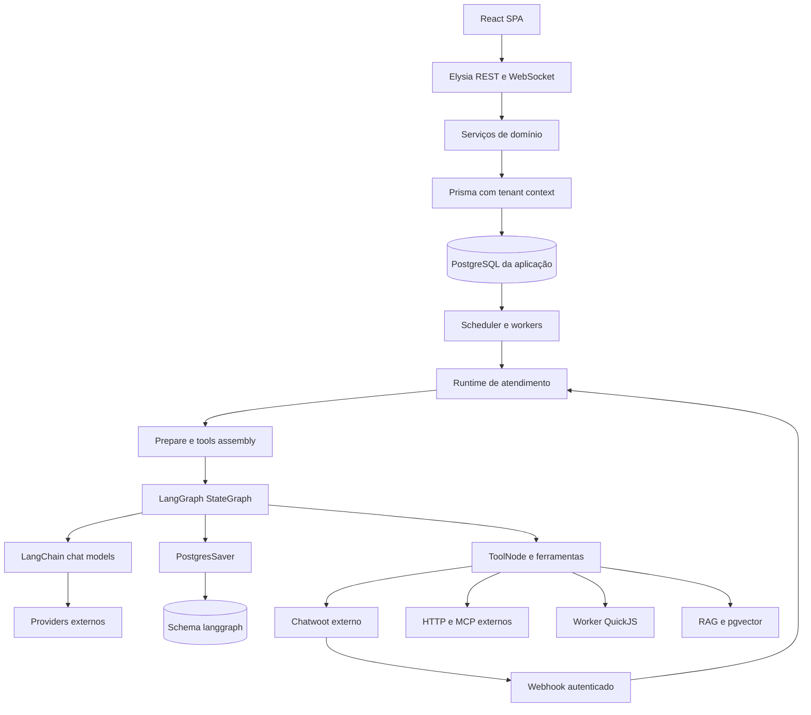
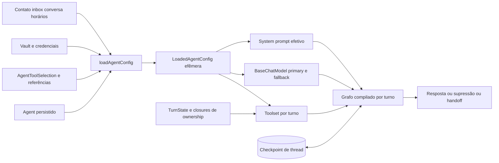
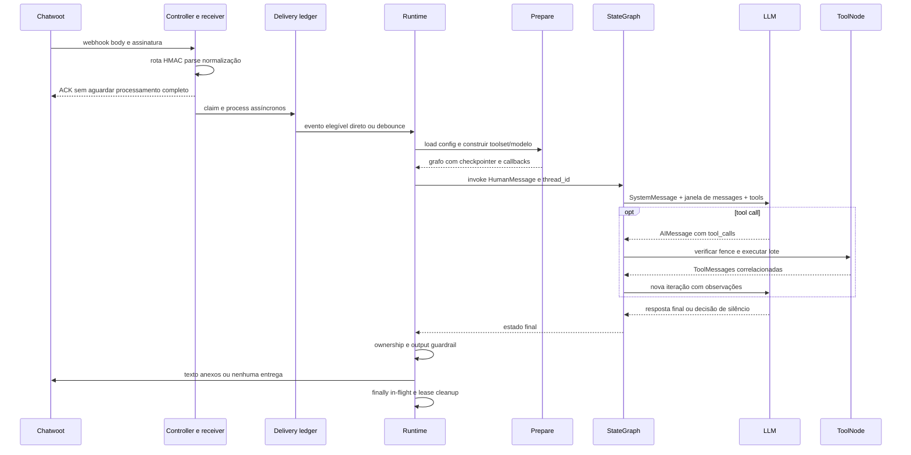
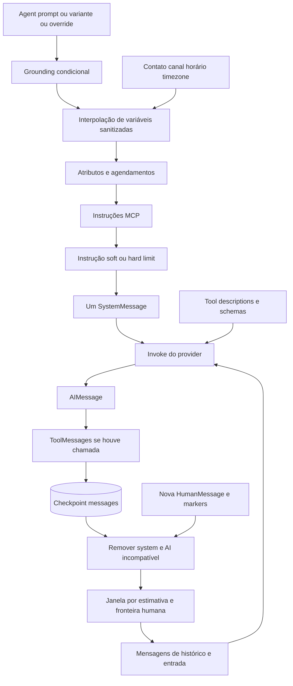
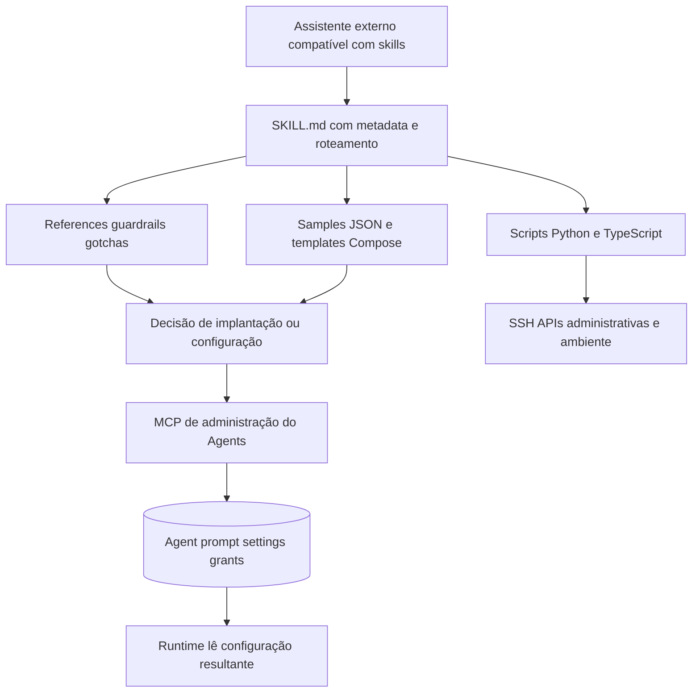
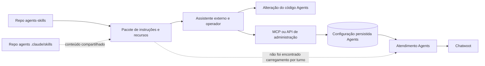
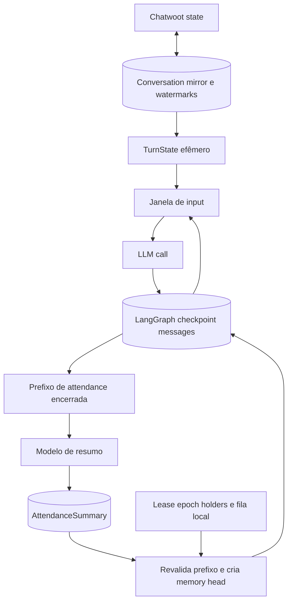

# Volume I — Evidence and Reverse Engineering

Arquitetura observada em **A: Fazer Agents** e **repositório agents-skills**. Nada neste volume descreve a implementação privada do CRM-Modelo. Consulte primeiro o [índice técnico](technical-index.md), depois o [ledger](evidence-ledger.md). Links E identificam registros completos de evidência.

## 1. Research methodology

O procedimento utilizado foi: hipótese → definição → implementação → referências → caller → callee → configuração/schema → teste → posição no runtime → interpretação delimitada. Exemplos e README só entraram depois do caminho executável. Para ausência, a conclusão é restrita ao snapshot e aos caminhos pesquisados: não encontrar `Skill` em um schema não prova sozinho que nenhum plugin possa existir; foi necessário verificar também montagem de prompt, montagem de ferramentas, imports, manifest e integração MCP.

Precedência aplicada: implementação > testes > tipos > schema/config > exemplos > documentação > README > marketing. Um comentário de código também é texto documental, não comportamento executável. As linhas citadas são do commit fixado; os snapshots podem diferir da implantação atual dos mantenedores.

HIGH: definição, construção e cadeia principal inspecionadas, frequentemente com teste. MEDIUM: mecanismo parcialmente rastreado ou inferência com limites claros. LOW: apenas cobertura estrutural ou alternativa não validada; o motivo deve acompanhar. Não se atribui confiança alta a ausência universal de feature em deploy privado.

Aquisição completa não significa leitura profunda uniforme. Foram excluídos do estudo semântico vendor, artefatos gerados sem função arquitetural e assets decorativos. Lockfile, client Prisma gerado e código instalado de ToolNode foram usados onde delegação mudava a resposta. O registro `reads.jsonl` mede arquivos processados pelo leitor, **não** prova leitura humana de todos os bytes: saídas podem ter sido filtradas ou truncadas.

## 2. Repository inventory

| Aspecto | agents | agents-skills |
|---|---|---|
| Arquivos versionados | 1.605 | 66 |
| Linhas textuais aproximadas | 577.698, incluindo lock/generated/docs | 6.994 |
| Arquivos `*.test.*` no inventário | 664 | 0 |
| Manifesto | `package.json`, `bun.lock`, `.bun-version`, `bunfig.toml` | manifests de plugin/marketplace; não há package runtime |
| Entradas | `src/index.ts`, `src/app.ts`, cliente SPA | três `SKILL.md`; scripts de operação |
| Dados | `prisma/schema.prisma`, migrations SQL, bootstrap de papéis | samples JSON de importação, templates Compose |
| Runtime relevante | `src/graph`, `src/modules`, API, features, lib | scripts Python/TS executados pelo operador/assistente externo |
| Build/CI | Bun build, TypeScript, Tailwind, OpenAPI, testes, publicação de imagem, worker CDN separado | distribuição de pacote de instruções; não há suíte de runtime própria |

[CODE] A possui frontend React 19, servidor Elysia sobre Bun, Prisma/PostgreSQL, pgvector, LangChain/LangGraph e QuickJS. O lock adquirido fixa, entre outros, LangGraph 1.4.12, core 1.2.9 e checkpoint-postgres 1.0.5. A versão do executável especificada é Bun **1.4.2**; os testes locais usaram **1.3.14**, divergência registrada. Manifest version `0.0.0` não identifica release implantado. [Manifest](sources/agents/package.json), [lock](sources/agents/bun.lock), [runtime pin](sources/agents/.bun-version).

[CODE] CI de testes configura PostgreSQL com pgvector e quatro shards; preload DOM precede setup. O `bunfig.toml` limita descoberta a `tests`, portanto arquivo de teste sob `src` não é automaticamente parte da execução usual. Build verifica tipos, worker e sincronização de OpenAPI/i18n; a existência dessas etapas não prova que o commit esteja verde em CI — resultado remoto não foi usado. [test workflow](sources/agents/.github/workflows/test.yml), [build workflow](sources/agents/.github/workflows/build-check.yml), [bunfig](sources/agents/bunfig.toml).

O índice enumera migrations, exemplos, prompts, templates, configuração, CI e scripts, além dos módulos de aplicação. Fontes permaneceram sem modificações da pesquisa; instalação e geração de dependências ocorreram na cópia temporária.

## 3. Dependency topology

[CODE] Diagrama 1 — dependências observadas, não infraestrutura proposta. E01, E11, E19, E21, E30.

Não há Redis/Kafka/Temporal no grafo de execução descrito acima. Templates que implantam **outros serviços**, como Chatwoot e Langfuse, podem conter outras dependências; não transportá-las para o runtime Agents por associação. Estado de aplicação e checkpoints podem compartilhar servidor PostgreSQL, mas são stores e clientes diferentes.

## 4. Architectural map

O [índice técnico](technical-index.md) contém Module, Path, Responsibility, Public/Internal API, Dependencies, Dependents, Runtime relevance e Confidence. São 103 agrupamentos estruturais de A, mais os três pacotes e a distribuição de B; os módulos críticos têm responsabilidade reconstruída e referência E. Para agrupamentos não profundamente rastreados, `UNKNOWN` impede que uma lista de arquivos se transforme em conclusão de runtime.

| Papel arquitetural comprovado | Implementação | Quem constrói / usa |
|---|---|---|
| Composição | `src/index.ts`, `src/app.ts` | processo Bun → app/handlers/workers |
| Orquestrador conversacional | `runAgentTurn`, `runLoadedTurn`, `runTurnBody` | webhook/debounce → prepare/grafo/entrega |
| Objeto persistido | Prisma `Agent` | serviço CRUD → loader de turno |
| Configuração carregada | `LoadedAgentConfig` em prepare | loader → builders |
| Factory de modelo | `createChatModel` | builder primary/fallback → SDK provider |
| Registry de jobs | handlers de scheduler | boot registra; tick despacha |
| Adapters de ferramentas | native/HTTP/MCP/CODE/RAG/document/toolpacks | grants → buildToolset → ToolNode |
| Storage de diálogo | PostgresSaver | compile → invoke/getState/updateState |
| Storage operacional | Prisma scoped + SQL específico | serviços → banco com RLS |
| Pub/sub local | realtime publisher | boot injeta Bun.publish; serviços emitem |

[INFERENCE, HIGH] A é um monólito modular com runtime de atendimento especializado e workers internos. A conclusão deriva de boot + chamadas + bancos, não da organização de diretórios. Não há necessidade de imaginá-lo como coleção de microsserviços para explicar o código. [E01](evidence-ledger.md#e 01), [E05](evidence-ledger.md#e 05), [E21](evidence-ledger.md#e 21).

## 5. Entrypoints

[CODE] Há dois tipos que não devem ser confundidos:

- Controle: REST de agentes e ferramentas; MCP para autoria/operação; console SPA. Persistem configuração, sem necessariamente executar modelo. POST `/v1/agents` exige papel administrativo de tenant e delega ao serviço. [E02](evidence-ledger.md#e 02).
- Execução: webhook Chatwoot; processamento diferido/debounce; nudges/follow-ups e recuperação por jobs; playground. Compartilham partes do prepare/grafo, mas não todos os gates e side effects. [E03–E07](evidence-ledger.md#e 03), [playground](sources/agents/src/modules/playground/service.ts), [debounce handler](sources/agents/src/modules/debounce/handler.ts).

O receiver valida rota e assinatura antes do parse JSON. O controller retorna ACK após iniciar processamento assíncrono não aguardado. A claim durável acontece em `recordAndProcessChatwootDelivery`, não em `receiveChatwootWebhook`. Recuperação de deliveries já persistidas não elimina, por si, a janela anterior à persistência. [CODE + INFERENCE, HIGH no ordering / MEDIUM no risco de crash] [controller:23–72](sources/agents/src/api/v1/chatwoot.controller.ts), [E03](evidence-ledger.md#e 03).

Playground não deve ser vendido como sandbox universal: natives de conversa e documentos têm simulação; mocks do operador podem substituir tools; outras categorias podem executar de verdade. O código monta o toolset, aplica mocks e só então constrói o grafo. [CODE, HIGH] [playground:237–450](sources/agents/src/modules/playground/service.ts).

## 6. Agent internal model

[CODE] Representação observada primeiro — Diagrama 2:

Não há uma classe única que reúna toda a anatomia. `Agent` no schema é registro editável; `LoadedAgentConfig` é snapshot efêmero; o grafo é objeto executável; o thread e a conversa têm vida própria. [E02](evidence-ledger.md#e 02), [E05](evidence-ledger.md#e 05), [E08](evidence-ledger.md#e 08), [E19](evidence-ledger.md#e 19).

Comparação posterior com o modelo conceitual pedido:

| Item | Existe / localização | Estado ou config; mutabilidade / persistência | Runtime |
|---|---|---|---|
| Identity | Agent.id, tenantId, name | configuração editável persistida | seleção e audit |
| Instructions | systemPrompt, variantes, overrides | prompt editável; override efêmero | assembly → SystemMessage |
| Model | modelConfig JSON | config persistida; SDK por turno | LLM invoke |
| Provider | discriminante + vault ref | config/credencial separadas | factory e transporte |
| Context | attrs, tempo, history, mensagem | mistura de config e estado | prompt + mensagens |
| Memory | AttendanceSummary + memory head | derivado persistido, compactável | thread em turns futuros |
| Knowledge | KB/chunks/documents | persistido fora de Agent | ferramenta RAG |
| Skills | não há entidade/carregador no caminho analisado | `SKILL.md` de autoria fora do runtime | alteração indireta de config, não execução |
| Tools | selections e defs/connections | config mutável persistida; objetos efêmeros | bind/invoke/result |
| Permissions | IAM de autor, grants, preconditions, tenancy | políticas em múltiplas camadas | edição e chamada; não uma ACL universal de Agent |
| Hooks | callbacks/status/flowlog | código e contexto efêmero | LLM/tools/entrega |
| Triggers | webhook, jobs, follow-up | bindings/settings + estado durável de jobs | antes do turno |
| Guardrails | settings + analyzer | config persistida, veredicto efêmero | input/output; erro analisador fail-open |
| Runtime | StateGraph + runtime.ts | estado efêmero e checkpoint persistido | orquestração completa |

[CODE] Não se localizou AgentVersion/AgentDeployment/AgentRun como modelos Prisma. `updatedAt`, auditoria, experimento de prompt e formato de exportação não são equivalentes a versionamento imutável de dependências. Isso limita replay exato após alterações. [INFERENCE, HIGH] [schema Agent](sources/agents/prisma/schema.prisma), [E18](evidence-ledger.md#e 18).

## 7. Agent lifecycle

[CODE] Criação: controller valida forma → serviço strict Zod valida valores/config e referências visíveis → transação cria Agent → audit → eventual armamento de follow-up. Default do serviço `mode=test` difere do default de banco `production`; o import explicitamente cria desabilitado e em teste. São caminhos distintos, não contradição automática. Cliente que escreve direto no banco contornaria semântica do serviço. [E02](evidence-ledger.md#e 02), [importAgent](sources/agents/src/modules/agents/transfer.ts).

Configuração de tools: normalização → locks de nomes e Agent → optimistic concurrency opcional → validação de alvos → substituição delete/create dentro da mesma transação → timestamp/audit → broadcast fora dela. A relação referencia IDs de definições, não cópias imutáveis. [E18](evidence-ledger.md#e 18).

Execução: binding de inbox encontra Agent → enabled/mode/monitoring e gates operacionais → load → tool/model/grafo por turno → invocação/checkpoint → entrega/supressão → cleanup. Desabilitar ou transferir atendimento durante um turno não desfaz efeitos já produzidos; fences tentam impedir próximas ações/entregas. [E04–E07](evidence-ledger.md#e 04).

## 8. Execution runtime

Os [oito casos rastreados](execution-cases.md) explicitam caller, input, validação, transformações, construção, invoke, mutação, persistência, eventos, saída, erro e cleanup. Diagrama 3 — caminho reativo observado:

[CODE] O estado base é `MessagesAnnotation`; grafo possui nós `agent` e `tools`. Com tools, `toolsCondition` decide continuar ou END; sem tools, ligação agent→END. `ToolNode` de dependência instalada executa lote por `Promise.all`, portanto não serializa efeitos entre ferramentas do mesmo lote. Essa parte foi verificada no código da dependência, não inferida da documentação LangGraph. [E09](evidence-ledger.md#e 09), [ToolNode instalado, snapshot auxiliar](dependency-runtime.md).

[CODE] Limite soft antecipa o fim; hard normalmente invoca modelo sem ferramentas. Exceção: protocolo de silêncio com `skip_reply` e ferramentas companheiras pode deixar apenas `skip_reply` disponível. Não basta observar uma tool call com esse nome: resultado efetivo e possíveis recusas importam. Os testes verificam que narrativa lateral é apagada sem destruir metadados/tool_calls assinados. [agent-node tests](sources/agents/tests/graph/agent-node.test.ts).

## 9. Prompt construction

[CODE, HIGH] O prompt efetivo não é só `Agent.systemPrompt`:

1. Escolhe `override.systemPrompt ?? experimentPrompt ?? agent.systemPrompt`.
2. `composeSystemPrompt` aplica trim e acrescenta grounding se `search_knowledge` foi concedida.
3. Constrói variáveis de contato/agente/canal/tempo/horários; dados textuais são sanitizados e limitados.
4. Interpola placeholders reconhecidos. Chaves desconhecidas permanecem literais.
5. Acrescenta seção de atributos e, quando disponível, agenda.
6. `buildModelAndGraph` acrescenta contexto/instruções de servidores MCP.
7. A cada chamada, `agentNode` usa **um novo SystemMessage**, eliminando system messages antigos do histórico; instruções de limite podem alterar esse texto nesse hop.

[E08](evidence-ledger.md#e 08), [E10](evidence-ledger.md#e 10), [E16](evidence-ledger.md#e 16), [E09](evidence-ledger.md#e 09).

Concatenação não implementa uma hierarquia de segurança. Estar mais tarde no mesmo SystemMessage não produz precedence determinística de autorização. Descrições de tools recebem base + orientação do operador + vocabulário contextual em certos natives; são transmitidas no contrato de tools do provider, não necessariamente no texto do system. [native:246–253](sources/agents/src/graph/tools/native.ts).

## 10. Context assembly

[CODE] Diagrama 4 — Context Assembly Pipeline:

| Fonte | Canal real / política |
|---|---|
| Instrução de sistema/agente/runtime | fundidas no SystemMessage corrente |
| Skill instructions | ausentes como fonte runtime direta; autoria pode gravar Agent.systemPrompt |
| Memória | memory head no histórico como HumanMessage, não banco vetorial universal |
| Conversa | checkpoint + ingest + entrada corrente + markers de attendance/handback |
| Conhecimento | resultado de search_knowledge, só quando invocado |
| Metadata | attrs interpolados/seções; additional_kwargs para stamps; callbacks para audit |
| Tool result | ToolMessage correlacionada ao tool_call_id |
| User message | HumanMessage renderizada; mídia pode passar por STT/vision e virar contexto textual |

[CODE] `selectHistoryWindow` estima tokens por `tokenx`, inclui JSON de tool_calls e overhead de mensagem, recorta prefixo antigo sem partir a última unidade humana. Não inclui system nem schemas de ferramentas no orçamento e mantém último turno mesmo maior que o teto. Consequentemente `maxHistoryTokens` não é `maxRequestTokens`. Nenhuma remoção de checkpoint acontece nessa seleção. [E31](evidence-ledger.md#e 31), [token-count](sources/agents/src/graph/token-count.ts).

Serialização para o wire é do adapter provider; uma lista abstrata de BaseMessage não demonstra bytes finais uniformes. Request ilustrativo e suas limitações estão no anexo de casos. Não foi capturado tráfego de produção ou token secreto.

## 11. Tools

### Definição até resultado

[CODE] Native é código + schema Zod; HTTP é definição persistida com campos de entrada e request template; CODE é definição persistida com corpo JavaScript; MCP vem do servidor externo; integrations expõem toolpacks; RAG e documentos têm builders próprios. `AgentToolSelection` relaciona o agente aos recursos e subsets permitidos. [E11–E17](evidence-ledger.md#e 11).

Diagrama 5 — end-to-end:

```mermaid
flowchart LR
  Def[Definição ou servidor MCP] --> Grant[AgentToolSelection]
  Grant --> Build[Builder por origem]
  Build --> Merge[Merge e dedupe de nomes]
  Merge --> Pre[Wrapper de precondições]
  Pre --> Bind[Model.bindTools]
  Bind --> Call[AIMessage.tool_calls]
  Call --> Fence[Fence do turno]
  Fence --> Node[ToolNode por nome]
  Node --> Parse[Zod via StructuredTool]
  Parse --> Exec[Função real e efeitos]
  Exec --> TM[ToolMessage com tool_call_id]
  TM --> LLM[Próxima chamada do modelo]
```

[CODE] Ordem de merge em prepare: native → document → HTTP → CODE → MCP → toolpacks → RAG. Nomes reservados de nativas desligadas também participam da proteção contra colisão. Dedupe mantém uma definição e informa perdas em log/flow; regras de precondição por nome que não encontram ferramenta geram aviso, mas não protegem outra coisa automaticamente. [E11](evidence-ledger.md#e 11).

[CODE] Schema HTTP é uma DSL de campos convertida a Zod — não aceitar como provado suporte irrestrito a todo JSON Schema. Campos `source=ai` vão ao modelo; valores de contexto/config/segredo são resolvidos no servidor. Path params são codificados; alterações indevidas de origem e hostname são verificadas; redirects não são seguidos livremente. Headers/body passam por transformações específicas e response template limita texto. [E14](evidence-ledger.md#e 14).

Argumentos são validados dentro de `StructuredTool` antes de `_call`; nome inexistente e parse error podem virar observação de erro via `ToolNode`. `failableTool` converte falha declarada para `ToolMessage.status=error`; exceções ordinárias são capturadas por ToolNode, com exceção de interrupções especiais da biblioteca. O modelo pode tentar corrigir argumentos na próxima iteração. Isso é raciocínio do modelo, não retry automático garantido da operação. [E15](evidence-ledger.md#e 15), [dependência](dependency-runtime.md).

### Governança realmente encontrada

| Controle | Observado | Limite |
|---|---|---|
| Grants | subsets, refs tenant-scoped, enabled | ausência de grant NATIVE permite defaults; [] desliga |
| Preconditions | wrapper relê attrs/conversa a cada chamada | erro de leitura recusa; não equivale a IAM completo |
| Turn fence | consulta stillWanted antes do lote | erro nesse check deixa tools executar nesse ponto |
| Credenciais | vault refs resolvidas servidor, scoped | modelos/providers recebem segredo; retorno/log exigem redaction |
| HTTP | URL/host/SSRF, timeout/body limits | nenhuma promessa exactly-once ou rollback remoto |
| CODE | Worker+QuickJS, 1 s, 32 MiB, stack 256 KiB, fila8 | não é isolamento universal de HTTP/MCP; teste de timing variável |
| MCP | conexão/OAuth, allowlist, namespace, cache por tenant | servidor externo é parte da trust boundary; stdio depende config |
| Aprovação | fila de sugestão de conhecimento | não há aprovação humana geral para toda write tool |

[CODE] Handoff é exemplo concreto de parcialidade: nota → abrir status → marcar handoff concluído → tentar assignment. Falha no assignment pode ser registrada sem reverter status nem transformar toda operação em falha. Teste afirma sucesso de handoff apesar da falha de assignment. [E37](evidence-ledger.md#e 37), [tests:840–870](sources/agents/tests/graph/tools.test.ts).

## 12. Skills

[DOC + CODE, HIGH] Neste ecossistema observado, skill é **pacote de assistência para um agente de desenvolvimento/operação externo**, contendo instruções, referências e eventualmente scripts/templates/samples. Não é sinônimo de tool do cliente final e não é uma entidade `Skill` persistida pelo Agents.

Diagrama 6 — significado operacional:

Setas Host→Entry e instrução→ação representam uso prescrito pelo pacote; o código do host que seleciona/lê SKILL.md não está nos repositórios, portanto esse mecanismo interno é UNKNOWN. O efeito final via configuração possui implementação verificável no Agents. [E34](evidence-ledger.md#e 34), [E36](evidence-ledger.md#e 36).

## 13. agents-skills

| Pacote | Intenção prescrita e conteúdo | Efeito material possível | Limite de evidência |
|---|---|---|---|
| agents-onboarding | instalação, tiers, DNS/SSH, Chatwoot, Agents, Langfuse, setup/MCP/import/bind/e 2e | scripts administram infraestrutura; JSON define agente/tools/settings | instrução não demonstra deploy bem-sucedido |
| agents-dev | obter código, layout/check, invariantes/edições, implementar e publicar imagem | orienta alteração de fonte de A | nenhum compilador de skill ou agente dev residente em A |
| agents-operation | segurança de produção, diagnosticar/reproduzir/ajustar/validar, simular carga | MCP muda config; script gera tráfego Chatwoot de teste | script de carga não é suíte automatizada de assertions |

[DOC] Os três entrypoints têm metadata e roteamento progressivo para referências. Recursos são caminhos relativos no pacote. Dependências operacionais são declaradas em instruções/templates: acesso SSH, APIs de implantação, Chatwoot e MCP, não dependências importadas por runtime Agents. [onboarding](sources/agents-skills/skills/agents-onboarding/SKILL.md), [dev](sources/agents-skills/skills/agents-dev/SKILL.md), [operation](sources/agents-skills/skills/agents-operation/SKILL.md).

[CODE] Scripts são código de verdade: `remote.py` valida argumentos, prepara ssh e envia conteúdo por stdin; helpers chamam APIs administrativas; `simulate-load.py` usa concorrência por threads e chamadas HTTP para gerar contatos/conversas/mensagens. Não foram executados: poderiam administrar instalações ou emitir mensagens externas. Código auxiliar não implica ferramenta concedida ao agente de atendimento. [E36](evidence-ledger.md#e 36), [load script](sources/agents-skills/skills/agents-operation/scripts/simulate-load.py).

[DOC] Samples importáveis demonstram a meta-layer: uma configuração de clínica extensa e outra de transportadora com HTTP/CEP. O import lê formato versionado do arquivo, remapeia recursos/credenciais e cria Agent; não instala um pacote Skill no banco. A versão do formato JSON e a versão do plugin não são versões imutáveis de Agent. [samples](sources/agents-skills/skills/agents-onboarding/samples/agents), [import procedure](sources/agents-skills/skills/agents-onboarding/references/08-agent-import.md), [transfer runtime](sources/agents/src/modules/agents/transfer.ts).

Lifecycle do pacote: distribuição → leitura seletiva por host externo → operação guiada → alteração de infraestrutura/configuração → runtime normal. Dependências semver de skills, resolver de conflitos entre skills instaladas, compatibility matrix e loader de skills em cada turno: **UNKNOWN/não encontrados nesse runtime**. A instalação pelo CLI citado na documentação tem implementação externa não adquirida; não se reconstrói esse CLI a partir do comando anunciado.

## 14. Cross-repository relationships

[CODE + DOC, HIGH] A inclui cópias de três skills em `.claude/skills`; comparação de conteúdo com B encontrou correspondência dos arquivos compartilhados, com quatro recursos adicionais em B (gerador de ambiente e três templates de implantação de Agents). Isso prova distribuição/vendoring de material de autoria; não package dependency de runtime. A não importa `agents-skills` em package.json, e os caminhos prepare/graph/tools não leem SKILL.md.

Diagrama 8 — arquitetura cruzada:

Respostas: A conhece material de B por vendoring/autoria, não import runtime; B conhece A por procedimentos, MCP, templates e samples; ligação direta de package runtime não; ligação por filesystem no host de skills sim, prescrita; CLI externo anunciado mas implementação UNKNOWN; runtime loading no atendimento não encontrado. A seta pontilhada final representa explicitamente **ausência de mecanismo encontrado**, não uma integração opcional comprovada.

## 15. Models and providers

[CODE] `ModelConfig` valida provider/model/baseURL/credential refs e parâmetros; factory resolve OpenAI, compatible, OpenRouter, Anthropic, Google e DeepSeek. O objeto comum é BaseChatModel, usado por `.invoke` e `.bindTools`; comportamento de transporte continua específico. [E30](evidence-ledger.md#e 30).

| Abstração | Genérico no app | Vazamento concreto |
|---|---|---|
| Invocação | BaseMessage → BaseChatModel.invoke → AIMessage | response metadata e content blocks variam |
| Tools | lista de StructuredTools | Gemini recebe conversão de schemas |
| Reasoning | campo configurável | OpenAI decide Responses vs Chat Completions e effort; monkey-patch de bindTools |
| Temperature | configuração comum | omitida em modelos OpenAI reasoning; Anthropic não a recebe nessa factory |
| Timeout | tentativa de orçamento por chamada/fallback | Google não recebe timeout no construtor mostrado; wrapper também controla prazo |
| Endpoint | baseURL possível | compatible exige baseURL; OpenRouter default específico |
| Structured output | usado em caminhos como guardrails | modo/parse específicos; resposta conversacional não é sempre JSON estruturado |
| Multimodal | STT/vision/TTS em módulos dedicados | isso não prova imagem/áudio bruto no invoke principal |
| Streaming | status/callbacks/realtime existem | principal caminho rastreado usa invoke, não stream de tokens ao cliente |

[CODE] Fallback não é load balancer multi-modelo: recurso configurado separadamente, credencial resolvida separadamente, estados transitórios/timeout/empty completion elegíveis; primary recebe retries0 e timeout 45 s quando fallback utilizável. Após fallback, esse modelo continua no restante do turno. 401/403/404 e conexão genérica sem classificação adequada não recebem retry cego por outro provider. [E32](evidence-ledger.md#e 32), [fallback tests](sources/agents/tests/graph/model-fallback.test.ts).

## 16. State

[CODE] Existem pelo menos cinco planos de estado, com donos diferentes:

| Plano | Dados | Local / duração | Não confundir com |
|---|---|---|---|
| LLM context | SystemMessage, janela de mensagens, schemas | request de um hop | histórico persistido completo |
| Runtime | pendingAttachments, resolveRequested, handoffState, fallback flag | closures do turno | registro durável AgentRun |
| Conversation state | owner/status/watermarks/test activation | mirror Prisma e Chatwoot | memory head |
| Persistent application state | Agent/config/tools/jobs/vault/KB/audit | tabelas PostgreSQL | checkpoint de raciocínio |
| Agent memory derivada | AttendanceSummary e memory head | banco + mensagens checkpoint | base de conhecimento vetorial |

Diagrama 7 — estado/memória:

## 17. Memory

[CODE] Memória existe, mas precisa de nome preciso: histórico persistido por thread, resumos de atendimentos e head de memória. Thread preferencialmente usa `contactInboxId`, permitindo reunir atendimentos da mesma relação; fallback usa conversation id, sempre com tenant/instance no identificador. Isso não significa compartilhamento geral entre todos os contatos/inboxes. [E19](evidence-ledger.md#e 19).

Compactação: job decide elegibilidade, espera grace de atendimento encerrado quando aplicável, drena ingest pendente, recusa thread ocupado, encontra prefixo fechado, reutiliza resumo existente ou invoca summarizer, salva AttendanceSummary, entra em fila, relê state, valida IDs do prefixo, reúne até 20 resumos e reescreve somente trecho confirmado. Mensagens novas fora do prefixo sobrevivem. [E20](evidence-ledger.md#e 20).

[CODE] Resumo filtra mensagens técnicas, diferencia cliente/humano, limita transcript e utiliza modelo com instruções específicas. Erro retorna resultado de falha sem reescrever thread. É transformação lossy: notas em tools e detalhes excluídos não reaparecem por mágica. Histórico de resumos salvo pode ser maior que o head apresentado. [E38](evidence-ledger.md#e 38).

[UNKNOWN] Não foi localizado sistema geral de memória semântica autobiográfica, CRUD de fatos com confiança/expiração ou retrieval de lembranças por relevância. Campos de contato e knowledge retrieval existem, mas classificá-los como essa memória seria contaminação conceitual.

## 18. Persistence

[CODE] Store transacional: Prisma + SQL manual para locking/RLS/vetor. Store de graph: PostgresSaver/pg.Pool no schema langgraph; inicialização memoiza a promise e chama setup. Se a primeira inicialização rejeitar, o código mostrado não limpa essa promise para reconstrução — [INFERENCE, MEDIUM] recuperação pode depender de restart; não testada com falha real. [E19](evidence-ledger.md#e 19).

Checkpoint não torna todo turno atomicamente durável com Chatwoot. Modelo pode terminar e checkpoint existir antes de envio; ferramenta pode mudar CRM remoto antes de local log; resumo pode ser salvo antes de rewrite. O código contém fences, watermarks, filas e recovery justamente para administrar essas fronteiras. [E07](evidence-ledger.md#e 07), [E20](evidence-ledger.md#e 20), [E37](evidence-ledger.md#e 37).

Jobs possuem status, claim token/sequência, tentativas e timestamps em `SchedulerJob`; deliveries possuem seus próprios ledgers. Arquivos/documentos e mídia têm storage e lifecycle específicos, não são todos blobs de Agent. Retention é job separado. [scheduler schema](sources/agents/prisma/schema.prisma), [scheduler service](sources/agents/src/modules/scheduler/service.ts), [document modules](sources/agents/src/modules/documents).

## 19. Events

[CODE] Há eventos de várias naturezas: flowlog operacional; callbacks LLM/tools; publicação WebSocket local; deliveries outbound duráveis para assinantes; scheduler jobs. Isso não forma automaticamente um event bus universal com ordenação/replay de todos os domínios. [E23–E25](evidence-ledger.md#e 23).

`emitOutbound(tx, event)` consulta assinaturas e cria rows PENDING por destinatário; worker tenta entrega e agenda backoff. A atomicidade com a mudança de negócio depende da transação passada pelo caller. Flowlog escreve assíncrono com erro capturado; realtime publica localmente e pode perder eventos se cliente desconectado. Não se deve usar nenhuma dessas três coisas como sinônimo das outras.

## 20. Async and concurrency

[CODE] Boot inicia loops/timers. Scheduler usa seleção `FOR UPDATE SKIP LOCKED`, claim_seq e estados persistidos; tick executa lotes via `Promise.allSettled`, com lanes/semaphores. Tools no mesmo AIMessage são paralelas via dependência ToolNode. CODE usa Worker e fila; script de carga B usa threads Python. São quatro mecanismos distintos. [E21](evidence-ledger.md#e 21), [dependency](dependency-runtime.md), [E17](evidence-ledger.md#e 17), [load script](sources/agents-skills/skills/agents-operation/scripts/simulate-load.py).

`markTurnOwning` usa lease, epoch e **contagem de holders**; não é mutex exclusivo de turnos. Queue local, fencing de episódio, watermarks e claims de entrega tratam outras races. Chamar tudo de “lock de conversa” ocultaria qual parte protege compactação e qual protege envio. [E33](evidence-ledger.md#e 33).

Cancelamento é cooperativo e em camadas: ainda desejado? agente ainda fala? mensagem mais nova? dono humano? Nem todos os checks têm a mesma política em erro. Tool boundary deixa prosseguir se sua consulta falha; precondition não consegue ler estado e recusa. Shutdown para timers e sai, sem prova de drain de todos os requests/LLMs. [E09](evidence-ledger.md#e 09), [E01](evidence-ledger.md#e 01).

## 21. Error handling

| Erro / camada | Representação e propagação | Visibilidade / recovery |
|---|---|---|
| CRUD inválido | validators → AppError/status HTTP | operador recebe erro; não executa LLM |
| Token/HMAC inválido | 401 uniforme no receiver | remetente; sem turno |
| Model config/credencial inválida no load | indisponibilidade/null ou erro conforme ramo | health/log/operador; não presumir mensagem ao cliente |
| Provider transitório | classificação runModelCall/fallback | tenta fallback quando elegível; senão relança |
| Tool args/schema | parsing exception capturada por ToolNode | ToolMessage de erro ao modelo; pode corrigir |
| HTTP status esperado | texto de resultado | não necessariamente erro |
| HTTP/status inválido ou execução declarada falha | toolFailure → ToolMessage error | modelo e tool flowlog |
| Exceção tool | ToolNode normaliza erro; interrupção especial pode propagar | próxima iteração ou falha do grafo |
| Precondition false/unreadable | recusa textual correlacionada | sem executar função; turno pode continuar |
| Guardrail analyzer indisponível | unanalyzed e warning | fail-open nesse ponto |
| TTS falha | catch → fallback texto | cliente pode receber texto |
| Envio parcial | outcome parcial e registros de erro | não repetir cego o burst completo |
| Summarizer falha | resultado de erro, sem rewrite | job/log e retry conforme scheduler |
| Job lança | worker fail/reschedule/dead-letter conforme estado | operacional, recuperação limitada por budget |
| Flowlog/realtime falha | warning/catch | pode não chegar ao usuário; não reverte operação |

Fontes: [E03](evidence-ledger.md#e 03), [E07](evidence-ledger.md#e 07), [E14–E15](evidence-ledger.md#e 14), [E21](evidence-ledger.md#e 21), [E25](evidence-ledger.md#e 25), [E28](evidence-ledger.md#e 28), [E32](evidence-ledger.md#e 32). Notas privadas de failed-turn têm caminho próprio e dedupe; não alegar que toda exceção sempre vira mensagem pública.

## 22. Security

[CODE] Existem controles reais: tenant context transacional, políticas RLS nas migrations, bootstrap de papel sem superuser/BYPASSRLS, vault, scopes/grants, SSRF, precondições, assinatura webhook e sandbox CODE. Não se conclui segurança apenas por presença. [E26](evidence-ledger.md#e 26), [E27](evidence-ledger.md#e 27), [E17](evidence-ledger.md#e 17).

| Superfície | Evidência | Risco delimitado, não exploit confirmado |
|---|---|---|
| MCP server instructions no SystemMessage | E16 | [INFERENCE, HIGH] fonte remota influencia instruções privilegiadas |
| Resultado de HTTP/RAG/MCP reinjetado | E14/E22/ToolNode | [INFERENCE, HIGH] indirect injection e conteúdo malicioso |
| Tool descrições editáveis | E11/E18 | [INFERENCE, MEDIUM] poisoning por autor com poder de configurar |
| Check ainda desejado falha aberto | E09 | [INFERENCE, HIGH] execução pode ocorrer sob incerteza de cancelamento |
| Guardrail falha aberto | E28 | [INFERENCE, HIGH] classificador indisponível não bloqueia |
| SSRF lookup separado da conexão | E27 | [INFERENCE, MEDIUM] DNS TOCTOU a investigar, sem exploração |
| Playground externo real | serviço playground | [INFERENCE, HIGH] operador pode supor dry-run indevidamente |
| Checkpointer pool separado | E19/E26 | [UNKNOWN] equivalência de RLS ao store Prisma não demonstrada |
| Handoff parcial | E37 | [INFERENCE, HIGH] UI/modelo pode interpretar sucesso maior que efeito efetivo |

Sem pentest, sem garantia de ausência de vulnerabilidade e sem alegação de vazamento efetivamente ocorrido. Propostas de correção de arquitetura estão exclusivamente nos Volumes III/IV.

## 23. Observability

[CODE] FlowContext carrega correlação de turno/agente/tenant/conversa; callbacks ligam chamadas de modelo e ferramenta a status, uso e flowlog. `withFlowStage` mede e registra sucesso/erro, relançando falha da operação. Langfuse é opcional; LlmUsage e ExecutionLog são persistidos no app por seus caminhos. O próprio logging pode falhar e ser capturado. [E25](evidence-ledger.md#e 25), [usage](sources/agents/src/graph/usage.ts), [observability](sources/agents/src/graph/observability.ts), [callbacks](sources/agents/src/graph/prepare.ts).

Não há razão para denominar ExecutionLog de AgentStep transacional: ele registra observação, não controla commit de efeito. Tampouco um trace prova custo faturável exato em todos os providers; metadados de uso dependem do adapter e de persistência bem-sucedida. [INFERENCE, HIGH].

## 24. Extension architecture

[CODE] Pontos efetivos: nova definição HTTP ou CODE; novo servidor MCP com subset; integração/toolpack registrada; documento/KB selecionado; provider branch; novo handler scheduler; configuração e prompts via REST/MCP; edição de código assistida por agents-dev. [E11](evidence-ledger.md#e 11), [E21](evidence-ledger.md#e 21), [E30](evidence-ledger.md#e 30).

Extensões por configuração podem mudar o comportamento de próximos turnos sem release do binário. Extensões por código alteram builder/registry/serviços e dependem de release. Skills de autoria não criam automaticamente um registry de skills no cliente. Esquema de plugin do assistente externo não é o schema de ToolDefinition.

## 25. Tests and behavioral validation

Ambiente: Bun 1.3.14 versus pin 1.4.2; dependências do lock instaladas sem scripts de lifecycle; Prisma client gerado; `NODE_ENV=test`, `ALLOW_NO_DB=1`; nenhum segredo real de provider. Não foi configurado PostgreSQL. Logs preservados integralmente, inclusive erros esperados dos testes.

| Execução | Resultado verificado | Interpretação |
|---|---|---|
| `bun test` no sandbox | exit 1; 7.118 linhas `(pass)`, 6.395 `(skip)`, 36 `(fail)` | contagem de ocorrências do log, **não total único de testes**; parte de skips pode reaparecer no resumo; falhas de DNS/bind/processo e duas verificações estáticas exigem reprodução |
| 9 arquivos centrais fora da restrição de bind local | 352 testes, 351 pass, 1 fail, 801 assertions | runtime com modelos/ferramentas de teste; nenhum e 2e real |
| Falha CODE repetida isoladamente | 1 pass, 0 fail; 69 filtered | falha não reproduzida isoladamente; timing/ambiente são hipótese, não causa provada |
| Dois arquivos de verificações estáticas repetidos | 62 testes, 61 pass, 1 fail | i18n passou; scanner de fixtures novamente excedeu timeout de 5 s; não falhou por assertion nesse resultado |

[log geral](evidence/tests-suite.log), [metadados gerais](evidence/tests-suite.json), [log focused](evidence/tests-focused.log), [repeat](evidence/tests-sandbox-repeat.log). A lista de argumentos incluía arquivo em `src`, mas Bun usa root `tests`: o resumo informa nove arquivos, não dez. Não inflar cobertura.

| Funcionalidade | Implementation says | Tests demonstrate | Documentation claims / interpretação final |
|---|---|---|---|
| System prompt | remove system histórico e prepende novo | `agent-node`: exatamente um system, conteúdo novo | [TEST] corroborado; não acumula system antigos |
| Silêncio | resultado skip efetivo controla término/narrativa | tests cobrem recusa, companhia, limite, metadados | [TEST] protocolo não reduzível ao nome da chamada |
| Tool error | failableTool conserva texto e status error | `tool-failure` verifica id/nome/status/plain invocation | [TEST] erro pode voltar ao LLM sem matar turno |
| Precondition | reconsulta estado e recusa se unreadable | `tool-precondition` testa recusa e continuação no ToolNode | [TEST] não confundir com tool exception |
| Histórico | recorte de input por unidade humana | `history-window` e `agent-node` verificam janela | [TEST] não é delete do checkpoint |
| Fallback | classificação seletiva, sticky | tabela de errors e modelos scripted em `model-fallback` | [TEST] não fallback para qualquer 4xx/rede |
| CODE | limits e Worker+QuickJS | testes de loops, stack, memory, async unsupported; um falhou no recorte | [TEST] contrato parcialmente corroborado, não certificação de sandbox |
| Handoff parcial | assignment error capturado depois de abrir | `tools.test.ts:840–870` asserts sucesso+sideeffect error | [TEST] fonte inspecionada; execução geral não substitui e 2e Chatwoot |
| NATIVE [] | filtro Set vazio remove tudo | builders e testes de seleção inspecionados | [DOC] B diz todas; prevalece código |
| RLS/claims/checkpoint | SQL e wrappers tenant/epoch | muitos testes existentes exigem DB e foram skipped | [UNKNOWN] validação dinâmica local pendente |

Erros de rede observados não autorizam classificar todas as 36 linhas fail como “só ambiente”. `i18n-extract conflict detection` passou na repetição isolada; o scanner `scheduler fixture` voltou a exceder5 s. [Repetição estática](evidence/tests-static-repeat.log). Uma nova execução com 20 s está documentada na [revisão final](validation.md); alterar o budget do teste é diagnóstico, não correção do produto nem aprovação da suíte completa. Não se alterou o produto para fazer testes passarem.

## 26. Contradictions and uncertainties

| ID | Inconsistência / risco de leitura | Resolução |
|---|---|---|
| C01 | B `03-adjust.md` diz allowlist vazia = todas; A native builder usa Set([]) | [CODE] [] explícito = nenhuma; ausência = default. [E13](evidence-ledger.md#e 13), [E35](evidence-ledger.md#e 35) |
| C02 | Schema Agent.mode default production; create service default test; import disabled/test | não conflito de runtime: três contratos/caminhos diferentes; não escrever direto no schema |
| C03 | Comentário de lane serial pode sugerir execução totalmente serial | worker usa Promise.allSettled; ToolNode Promise.all. Isso não elimina a disciplina single-replica mencionada para outros workers; paralelismo de lote não prova segurança multi-replica |
| C04 | “memória” poderia significar todo estado | separar histórico, runtime, mirror, summaries e KB |
| C05 | “skills” poderia significar pacote instalado no agente de atendimento | B é meta-layer de autoria; não loader runtime encontrado |
| C06 | “teste/playground” poderia significar zero side effect externo | algumas tools são reais sem mock explícito |
| C07 | Eventos/logging poderiam sugerir replay durável universal | outbound delivery ≠ flowlog ≠ realtime local |
| C08 | Limits poderiam sugerir teto rígido de tokens e chamadas | histórico ignora system/tools; lote paralelo precede recheck |
| U01 | Execução DB/RLS/concurrency sob múltiplos processos | UNKNOWN; testes existentes não rodados com DB |
| U02 | Request real de todos providers/streaming de tokens | UNKNOWN; principal invoke é observado, não tráfego real |
| U03 | Garantias do host que instala/lê skills | UNKNOWN; host/CLI fora das fontes |
| U04 | Manual audit de todos os módulos de A | parcial; inventário completo, tracing seletivo e explícito |
| U05 | Deploy privado CRM-Modelo ou compatibilidade com A | UNKNOWN; zero inferência por semelhança visual |

### Checkpoint antes da síntese

| Gate | Estado |
|---|---|
| Agent lifecycle | rastreado CRUD → load → execute → cleanup |
| LLM call path | rastreado invoke + factory + fallback; sem provider real |
| Tool path | rastreado definição → grant → schema → ToolNode → efeito → observação |
| Skill model | compreendido como pacote de autoria; host internals UNKNOWN |
| Prompt assembly | rastreado, incluindo MCP/context/window |
| State model | separado em cinco planos |
| Persistence | app/checkpoint/job/summary identificados; DB tests pendentes |
| Failure behavior | código e testes centrais inspecionados; limites registrados |
| Tests | geral tentou, focused executou, skips/fails preservados |
| Relação entre repos | vendoring/autoria/config; sem loading runtime encontrado |
| Unknowns | registrados, sem completar por plausibilidade |

A síntese a seguir usa somente esses achados delimitados. Pontos não validados entram como riscos/requisitos de teste da proposta, não como garantias herdadas.
