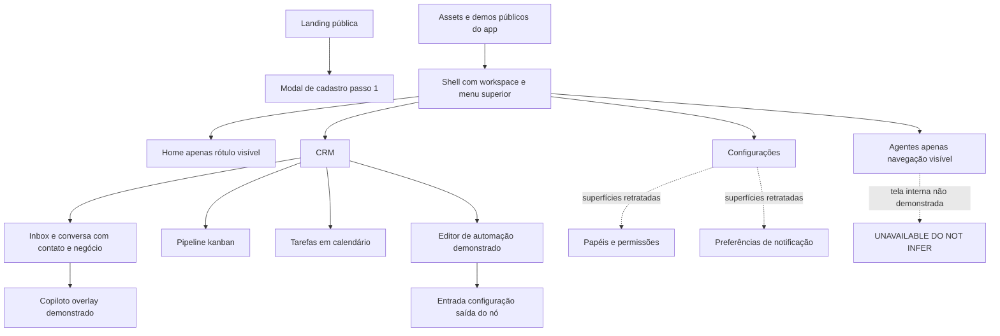

# Volume II — Product and UI Analysis

Camada **B: produto/UX público do CRM-Modelo**. Não há código-fonte privado do produto nesta pesquisa. `[UI]` comprova o que aparece na tela ou em demonstração pública; não comprova backend, persistência, segurança, qualidade do modelo ou disponibilidade para todo plano.

## 27. CRM-Modelo product model

[UI, HIGH] A superfície pública permite observar uma organização de trabalho que aproxima atendimento, contato, negócio e assistência de IA. A evidência mais forte não é o slogan: é a [imagem de conversa](https://crm-modelo.local/brand/crm-full.png), onde filtros de filas, lista, conversa, responsabilidade humana/IA e negócio vinculado estão simultaneamente visíveis. O [pipeline](https://crm-modelo.local/brand/pipeline-full.png) e as [tarefas](https://crm-modelo.local/brand/tasks-calendar.png) completam a visão comercial.

[UI, HIGH] Animações mostram operações demonstradas de copiloto e edição de automação; foram abertas no navegador, capturadas em quadros e interpretadas, não apenas citadas por nome. [Automação](https://crm-modelo.local/brand/automacao.gif), [copiloto](https://crm-modelo.local/brand/copilot.gif).

[DOC] O site anuncia CRM omnichannel com agentes e integrações. Esses anúncios contextualizam a oferta; **não** são prova de que cada integração/modelo anunciado funciona, de que há isolamento tenant ou de como o engine executa. [Site público](https://crm-modelo.local/).

[UNKNOWN] Não existe evidência nesta pesquisa de que CRM-Modelo usa Fazer Agents, agents-skills ou Chatwoot como backend. Semelhança de controles não autoriza essa conclusão. CRM observado visualmente e arquitetura técnica privada continuam separados.

## 28. Public surface inventory

Captura em Chromium headless, viewport1440×1000. Página inicial respondeu e o DOM foi preservado. Assets foram baixados dos URLs encontrados no DOM, sem autenticação. “Entrar”, “Teste Grátis” e “Agendar demo” foram clicados; nessa sessão os três abriram o mesmo primeiro passo de cadastro no URL raiz. Não houve preenchimento/envio de formulário, criação de conta ou tentativa de contornar login. [DOM](evidence/crm-modelo/surface.json), [ações](evidence/crm-modelo/actions.json).

| SCREEN-ID | Evidência | Nível de acesso | Tipo de prova |
|---|---|---|---|
| SYN-01 | home-viewport/home-full + DOM | público navegável | render real da landing |
| SYN-02 | action-0/1/2-viewport + actions.json | público navegável | modal acionado por clique |
| SYN-03 | crm-full/pipeline-full/tasks-calendar | asset público | shell de app retratado |
| SYN-04/05 | crm-full | asset público | inbox e conversa |
| SYN-06 | pipeline-full | asset público | kanban comercial |
| SYN-07 | crm-actions | asset público | seletor de ações/tools |
| SYN-08/09 | automacao.gif, quadros0 e 2 | demonstração pública | canvas e configuração de nó |
| SYN-10 | copilot.gif, quadros0 e 2 | demonstração pública | copiloto sobre conversa |
| SYN-11 | tasks-calendar | asset público | calendário de tarefas |
| SYN-12 | equipes | asset público | formulário de papel/permissões |
| SYN-13 | notifications | asset público | preferências de notificação |
| SYN-14 | disparos | asset público | etapa de configuração de envio |
| SYN-15 | lead-temp | asset público | indicador de temperatura do lead |
| SYN-U* | áreas autenticadas restantes | não acessível | UNAVAILABLE - DO NOT INFER |

Capturas full-page podem conter espaços de lazy loading; não foram usadas para concluir ausência de funcionalidades. Screenshots das páginas longas não substituem leitura dos assets em resolução original. Nomes de arquivos não foram tratados como classificação de tela.

### SYN-01 — landing pública

URL: [https://crm-modelo.local/](https://crm-modelo.local/). Access level: público. Visual evidence: [viewport](evidence/crm-modelo/home-viewport.png), [DOM](evidence/crm-modelo/surface.json). Layout: header, hero, demonstrações e seções verticais. Navigation: âncoras e CTAs do site; não é navigation autenticada. Components: texto, badges, imagem de produto, cards e logos. Primary CTA: Teste Grátis. Secondary actions: Agendar demo, Entrar. Displayed entities: conceitos de produto, não registros interativos de CRM. Interaction model: navegar landing/abrir modal. CRM implications: comunica conexão entre vendas e atendimento. Agent implications: IA apresentada junto à operação. Reusable UX principle: demonstrar resultado no contexto de trabalho. Confidence: HIGH para render e cliques; LOW para funcionalidades apenas anunciadas, pois não exercitadas.

### SYN-02 — entrada/cadastro

URL: raiz, sem navegação autenticada observada. Access level: público. Visual evidence: [modal em viewport](evidence/crm-modelo/action-0-viewport.png), [ações registradas](evidence/crm-modelo/actions.json). Layout: overlay escurecido/desfocado, modal central, header gradiente, progresso, seleção em dois cards e CTA inferior. Navigation: fechar; continuar visível, não acionado. Components: título Cadastro, indicador Etapa 1 de 6, pergunta de objetivo. Primary CTA: Continuar. Secondary actions: fechar, escolher implementação na empresa ou criação própria. Displayed entities: preferência de onboarding. Interaction model: etapa inicial de wizard; etapas posteriores UNKNOWN. CRM implications: segmenta intenção antes de pedir setup. Agent implications: nenhuma configuração de agente observada. Reusable UX principle: onboarding adaptativo por objetivo, com custo futuro de deixar claro o caminho de login. Confidence: HIGH.

Não concluir que “CRM-Modelo não possui login”: só que o botão Entrar acionou esse modal **nesta captura**.

## 29. Information architecture

[UI] Diagrama 9 — IA visível e limites. Ligações indicam agrupamento visual, não rotas técnicas inferidas:

[INFERENCE, MEDIUM] O produto parece tratar a conversa como superfície de trabalho principal e CRM como contexto adjacente. A inferência é apoiada pelo espaço, conteúdo e ações da imagem, não por analytics de uso. Não se conhece a navegação completa por click-through; atalhos e menus fechados podem ocultar destinos.

## 30. Visual design system observations

### SYN-03 — shell retratado

URL: [crm-full](https://crm-modelo.local/brand/crm-full.png), [pipeline](https://crm-modelo.local/brand/pipeline-full.png). Access level: assets públicos, app não autenticado. Visual evidence: imagens abertas em resolução legível. Layout: faixa superior horizontal com marca/workspace, Home, Agentes, CRM, Configurações e utilidades à direita; área de conteúdo abaixo varia por domínio. Navigation: menus com caret; não foi possível abrir menus do asset. Components: separadores finos, ícones, contadores, avatars, tabs e campos compactos. Primary CTA: depende do domínio; não há CTA universal comprovado. Secondary actions: utilidades/topbar. Displayed entities: workspace e módulos. Interaction model: shell persistente sugerido por repetição visual. CRM implications: contexto de workspace permanece visível. Agent implications: Agentes é área de primeiro nível visível no menu. Reusable UX principle: operações humanas e IA acessíveis na mesma aplicação. Confidence: HIGH para layout; MEDIUM para persistência entre rotas, pois baseada em imagens distintas.

[UI] Há variantes clara e escura nos materiais. A conversa clara usa linhas sutis, fundos claros, texto escuro e acentos roxos/azuis; alertas/estado humano em tom verde-azulado; notas privadas amarelas. Canvas/copiloto/papéis/disparos aparecem escuros. Isso comprova variantes nos assets, **não** mecanismo de tema, tokens, fonte exata, escala de espaçamento ou contraste WCAG medido.

[INFERENCE, MEDIUM] Densidade favorece operador desktop com múltiplas informações simultâneas; pode comprometer espaço de conversa e legibilidade em telas menores. Não foram obtidas telas mobile, focus rings, navegação por teclado ou auditoria de acessibilidade. Não copiar paleta/marca; adaptar hierarquia e função dos estados.

## 31. Navigation

[UI] A topbar diferencia módulos globais de filtros locais. Inbox possui filtros verticais de status/canais/setores/atendentes/marcadores; lista de conversas acrescenta tabs Todas/Minhas/Não atribuídas/AI. Pipeline possui seletor próprio de funil e controles locais. [Inbox](https://crm-modelo.local/brand/crm-full.png), [pipeline](https://crm-modelo.local/brand/pipeline-full.png).

[INFERENCE, MEDIUM] Essa separação reduz troca de contexto: entrar em CRM não exige abandonar agente/atendimento. Porém sobreposição de filtros e tabs pode tornar a causa de um item ausente difícil de explicar. Adaptação proposta no Volume IV: filtros ativos explícitos, contagem após filtro e “limpar tudo”; autorização nunca deduzida de uma tab.

Menu Agentes está visível, mas seu conteúdo/rotas internas são **UNAVAILABLE - DO NOT INFER**. Não atribuir caminhos `/app/agents/...` ao CRM-Modelo.

## 32. Dashboard

SCREEN-ID: SYN-U-DASH. URL: rota autenticada desconhecida. Access level: indisponível. Visual evidence: nenhum dashboard completo legível foi obtido. Layout/Navigation/Components/CTA/Displayed entities/Interaction model: **UNAVAILABLE - DO NOT INFER**. CRM/Agent implications: não extraídas. Reusable UX principle: nenhum derivado de tela não vista. Confidence: HIGH sobre a limitação da coleta, não sobre ausência no produto.

[UI] O arquivo público chamado [dashboard.png](https://crm-modelo.local/brand/dashboard.png) mostra uma inbox em perspectiva. Não foi classificado como dashboard de KPIs. Um frame minúsculo embutido na conversa não permite reconstruir analytics. Este é um caso explícito de firewall contra inferência por nome de asset.

## 33. Inbox

### SYN-04 — central de atendimento

URL: [crm-full.png](https://crm-modelo.local/brand/crm-full.png). Access level: asset público. Visual evidence: [cópia local](evidence/crm-modelo/crm-full.png). Layout: quatro zonas — filtros, lista, conversa, contexto do contato. Navigation: filtros de status/canais/setores/atendentes/marcadores; tabs de ownership na lista. Components: busca, botão novo, preview de mensagem, canal/avatar, contadores, seleção destacada. Primary CTA: abrir/atender uma conversa; botão “+” para iniciar ação visível. Secondary actions: filtrar, buscar, alternar fila. Displayed entities: conversas, contatos, canais, responsáveis e etiquetas. Interaction model: master-detail sugerido pela seleção; cliques no app não executados. CRM implications: fila operacional organizada por atributos reais do atendimento. Agent implications: tab AI torna trabalho de agentes inspecionável ao operador. Reusable UX principle: workload de IA deve ser visível junto ao humano, não escondido em console técnico. Confidence: HIGH visual, MEDIUM interação inferida.

Força: histórico e contexto comercial lado a lado. Fraqueza: largura de conversa concorre com três regiões auxiliares. Adaptação: painéis recolhíveis e layout responsivo com foco preservado. Não inferir virtualização de lista, estratégia realtime ou origem dos counts.

## 34. Conversations

### SYN-05 — conversa e composição

URL/access: mesmo asset público SYN-04. Visual evidence: centro e painel direito de [crm-full](https://crm-modelo.local/brand/crm-full.png); detalhe [agent-suggestion](https://crm-modelo.local/brand/agent-suggestion.png). Layout: header de contato/status, faixa de ownership, timeline central, composer inferior. Navigation: contato selecionado na lista; tabs Responder/Nota Privada/Copilot Sugestão. Components: bolhas de mensagem, datas, mídia, status, transferir/concluir; composer com formatação/anexo/microfone/envio. Primary CTA: enviar resposta; no header concluir atendimento. Secondary actions: transferir, devolver à IA, nota privada. Displayed entities: Message, Attachment, Contact, Conversation e responsável visíveis conceitualmente, sem afirmar nomes de tabelas. Interaction model: atendimento misto com responsabilidade explícita. CRM implications: contato e negócio relacionados no mesmo contexto. Agent implications: banner indica humano atendendo e ação para devolver à IA. Reusable UX principle: ownership deve ser inequívoco antes do envio. Confidence: HIGH visual.

[UI] A imagem agent-suggestion mostra nota privada e a opção de copiloto, mas não uma sugestão já aprovada nem um botão “aprovar e enviar” demonstrado. Não atribuir esse fluxo à imagem. Separar draft interno de mensagem ao cliente é proposta, ainda que inspirada na separação visível de canais de composição.

## 35. CRM

### SYN-06 — pipeline

URL: [pipeline-full.png](https://crm-modelo.local/brand/pipeline-full.png). Access level: asset público. Visual evidence: [local](evidence/crm-modelo/pipeline-full.png). Layout: seletor e toolbar sobre colunas horizontais; cada coluna tem count e cards. Navigation: funil selecionado, busca/filtros/view controls; scroll horizontal sugerido pelo corte. Components: importar, editar, colunas/estágios, criar negócio, amount, contato, tempo na etapa; ícone de raio por etapa. Primary CTA: novo negócio. Secondary actions: importar/editar/filtrar. Displayed entities: negócios e estágios com campos comerciais. Interaction model: kanban visual; drag-and-drop não foi executado, portanto mecanismo de movimento UNKNOWN. CRM implications: estágio e valor são dimensões nativas da operação. Agent implications: ícone de automação sugere acesso contextual, mas seu comportamento não foi clicado. Reusable UX principle: automação próxima do objeto/estágio que a motiva, com status explícito. Confidence: HIGH para elementos; LOW para gesto de movimentação, pois não testado.

### SYN-11 — tarefas

URL: [tasks-calendar.png](https://crm-modelo.local/brand/tasks-calendar.png). Access level: asset público. Visual evidence: calendário mensal aberto em resolução original. Layout: toolbar superior, tabs minhas/equipe e grade mensal; legendas inferiores. Navigation: mês, seletores de visão e busca. Components: novo task, alternância lista/grade/calendário, opções mês/semana/dia/roteiro, eventos com cores e badge de atraso. Primary CTA: nova tarefa. Secondary actions: mudar período/visão e filtrar. Displayed entities: tarefas vinculáveis a geral/conversa/negócio, conforme legenda. Interaction model: agenda mensal demonstrada; outras visões só rótulos. CRM implications: follow-up humano tem lugar próprio além da inbox. Agent implications: autoria por agente ou agendamento automático não comprovados pela imagem. Reusable UX principle: tarefas ligadas ao objeto e responsabilidade. Confidence: HIGH visual.

### SYN-15 — temperatura

URL: [lead-temp.png](https://crm-modelo.local/brand/lead-temp.png). Access level: asset público. Visual evidence: [local](evidence/crm-modelo/lead-temp.png). Layout: card compacto; título Lead, temperatura e barra0–100. Navigation: seção recolhível visível. Components: escala colorida, valor numérico, rótulo qualitativo e referência abaixo. Primary CTA: nenhum comprovado. Secondary actions: expandir/recolher sugerido pelo chevron. Displayed entities: score do lead e estado relacionado. Interaction model: resumo de qualificação; algoritmo/editabilidade UNKNOWN. CRM implications: score é distinguível de estágio do negócio. Agent implications: tool de score aparece no catálogo, mas ligação automática a este card não foi exercitada. Reusable UX principle: mostrar valor e rótulo, acrescentando explicação/proveniência na proposta. Confidence: HIGH visual; LOW mecanismo de cálculo.

Listas/formulários completos de contacts e companies: **SYN-U-CONTACTS / SYN-U-COMPANIES — UNAVAILABLE - DO NOT INFER**. O painel de contato não prova página de gestão cadastral completa.

## 36. Agents

Tela de listagem de agentes: **SYN-U-AGENTS — UNAVAILABLE - DO NOT INFER**. Menu superior e tab AI na inbox são evidências de produto, não prova de modelo de versionamento, deployment, memórias ou permisos por agente.

### SYN-10 — copiloto contextual

URL: [copilot.gif](https://crm-modelo.local/brand/copilot.gif). Access level: demonstração pública animada. Visual evidence: [quadro inicial](evidence/crm-modelo/copilot.gif-0.png), [quadro posterior](evidence/crm-modelo/copilot.gif-2.png), ambos vistos. Layout: janela sobreposta à direita da inbox, mantendo contexto por trás; header e composer próprios. Navigation: fechar/maximizar e botões superiores visíveis. Components: welcome state, mensagem do operador, resposta estruturada de resumo, composer e seletor de papel “Dono”. Primary CTA: enviar instrução ao copiloto. Secondary actions: controles do painel e anexos. Displayed entities: conversa consultada, contato e resumo de atendimento. Interaction model: animação passa de painel vazio para pergunta e resposta com seções; não foi uma consulta enviada pela pesquisa. CRM implications: assistência contextual sem abandonar o trabalho. Agent implications: distingue assistência ao operador de resposta autônoma ao cliente. Reusable UX principle: canais interno/externo e capacidade efetiva devem permanecer claros. Confidence: HIGH para sequência visual; UNKNOWN para execução real do modelo/tool.

[INFERENCE, MEDIUM] Vários resultados de contato aparecem antes do resumo; risco de ambiguidade de identidade merece cuidado. Não se conclui que a demonstração acessou contato errado. Adaptação proposta: fixar contexto atual e exigir seleção explícita quando homônimos forem buscados.

## 37. Agent configuration

SCREEN-ID: SYN-U-AGENT-CONFIG. URL: rota autenticada desconhecida. Access level: indisponível. Visual evidence: nenhuma tela completa de configuração de Agent. Layout/Navigation/Components/CTA/Displayed entities/Interaction model: **UNAVAILABLE - DO NOT INFER**. CRM implications/Agent implications/Reusable UX principle: não derivados. Confidence: não aplicável a comportamento; HIGH para limitação.

Não reconstruir tabs de prompt/modelo/memória/tools a partir dos requisitos do novo produto ou das rotas do Fazer Agents. No Volume IV, essas tabs são `[PROPOSAL]` e têm justificativa própria.

## 38. Tools

### SYN-07 — seletor de ações

URL: [crm-actions.png](https://crm-modelo.local/brand/crm-actions.png). Access level: asset público. Visual evidence: imagem aberta e lida. Layout: seletor com sidebar de categorias e grade de cards em duas colunas. Navigation: busca e categorias. Components: counts por categoria; cards com ícone, nome e descrição curta. Primary CTA: selecionar ação. Secondary actions: buscar/filtrar categoria. Displayed entities: ações como criar/mover/ganhar/perder negócio, qualificar lead, labels, notas, transferir conversa e devolver à IA. Interaction model: seleção de capacidade; configuração/executar ação não observados nesse asset. CRM implications: vocabulário da automação coincide com tarefas do operador. Agent implications: catálogo revela ações orientadas a domínio, não só endpoints. Reusable UX principle: apresentar efeito e entidade alvo, acrescentando risco/escopo/aprovação na proposta. Confidence: HIGH visual.

O count “Todos81” é snapshot da interface, não confirmação de 81 implementações funcionais. Categorias “APIs HTTP”, “Banco de Dados”, “Integrações” e outras não provam tecnologias internas. A imagem não demonstra schemas, credenciais, sandbox, versão de tools ou autorização; tudo isso é UNKNOWN para CRM-Modelo.

## 39. Skills/workflows

### SYN-08 — canvas de automação

URL: [automacao.gif](https://crm-modelo.local/brand/automacao.gif). Access level: demonstração pública. Visual evidence: [quadro0](evidence/crm-modelo/automacao.gif-0.png). Layout: canvas escuro pontilhado, nós/arestas, minimap, zoom, toolbar inferior; aviso superior de modo preview. Navigation: selecionar nó, zoom e canvas; somente animação observada. Components: gatilho de entrada no funil, ação de mensagem, término de tentativas, nota explicativa, indicador salvo/preview, adicionar nó, simular, atividade e publicar. Primary CTA: Publicar. Secondary actions: Simular, Adicionar nó, Atividade. Displayed entities: fluxo, nós, gatilho e ações. Interaction model: edição visual com passagem a modal de nó no quadro posterior. CRM implications: evento comercial é início de automação. Agent implications: campo posterior distingue template e prompt para IA; não provar agente autônomo aqui. Reusable UX principle: draft/simulação/publicação separados e observáveis. Confidence: HIGH visual; UNKNOWN durabilidade do engine.

### SYN-09 — nó de mensagem

URL/access: mesma animação pública. Visual evidence: [quadro2](evidence/crm-modelo/automacao.gif-2.png). Layout: modal quase fullscreen em três colunas — entrada/variáveis, configuração, saída/dados produzidos. Navigation: seleção de nó vem do canvas; fechar e Simular no topo. Components: busca de variáveis, árvore de evento/contato/negócio/organização/pipeline/stage; nome do nó, canal, destinatário, modo de conteúdo e template; saída JSON com marca de teste. Primary CTA: Simular. Secondary actions: fechar, selecionar canal/destinatário e copiar variável conforme rótulo. Displayed entities: evento de entrada, schema de nó e resultado de teste. Interaction model: ferramenta de inspeção de dados input→config→output; execução real privada não exercitada. CRM implications: dados comerciais são contexto de automação visível. Agent implications: modo de conteúdo menciona template literal ou prompt IA. Reusable UX principle: autor deve enxergar dados que a automação recebe e produz; preview precisa explicitar ausência/presença de efeitos. Confidence: HIGH visual.

Skills como biblioteca instalável/versionada: **SYN-U-SKILLS — UNAVAILABLE - DO NOT INFER**. O canvas não prova que “skill” seja uma entidade no CRM-Modelo; não importar nomenclatura dos repositórios.

## 40. Integrations

Tela de catálogo/conexão/OAuth: **SYN-U-INTEGRATIONS — UNAVAILABLE - DO NOT INFER**. Logos no site e categorias no seletor são exposição comercial/visual, não fluxos de conexão comprovados. Não afirmar escopo de credenciais, sincronização bidirecional ou health checks com base neles.

### SYN-14 — configuração de disparo

URL: [disparos.png](https://crm-modelo.local/brand/disparos.png). Access level: asset público. Visual evidence: screenshot escuro aberto e analisado. Layout: etapas/checklist à esquerda, configuração central e preview/timeline à direita. Navigation: etapas visíveis e progresso40%; sequência completa não executada. Components: enviar agora/agendar, cadência lenta/média/rápida/personalizada, opção de dedupe, prévia dos dados. Primary CTA: conclusão/envio não totalmente demonstrado no recorte; não inventado. Secondary actions: escolher timing, cadência e dedupe. Displayed entities: lote, destinatários/dados, canal e agenda. Interaction model: preparação por etapas; resultados do envio UNKNOWN. CRM implications: comunicação em lote requer checklist antes de execução. Agent implications: nenhuma chamada de agente comprovada nesse recorte. Reusable UX principle: preview, volume, dedupe e status de agendamento antes de confirmar envio. Confidence: HIGH visual.

[PROPOSAL] No novo produto, cadência não será apresentada como meio de contornar regras do provedor. Envios dependem de consentimento/base de tratamento adequada, regras atuais do canal, quotas e política de conta. Este documento não valida regras legais ou de canal do CRM-Modelo.

## 41. Analytics

SCREEN-ID: SYN-U-ANALYTICS. URL: desconhecida. Access level: não acessível. Visual evidence: contagens operacionais em listas e pipeline, mas nenhuma tela analítica completa. Layout/Navigation/Components/CTA/Interaction model: **UNAVAILABLE - DO NOT INFER** para analytics. CRM implications: counts visuais ajudam triagem, não medem conversão/custo/atribuição. Agent implications: custo/token/eficácia não observados. Reusable UX principle: não derivado de tela ausente.

Não converter count de conversas, valores nos cards e textos do site em dashboard de ROI real.

## 42. Settings

### SYN-12 — papéis e permissões

URL: [equipes.png](https://crm-modelo.local/brand/equipes.png). Access level: asset público. Visual evidence: tela escura com contadores e formulário. Layout: resumo superior e tabs; área central de criação. Navigation: papéis/atribuições conforme tabs visíveis. Components: nome de papel, busca/seletor de permissões, estado vazio, counts. Primary CTA: criar papel, conforme formulário. Secondary actions: buscar/adicionar permissão, trocar tab. Displayed entities: papéis/permissões/usuários/equipes como conceitos da tela. Interaction model: configuração de acesso, não permissão backend testada. CRM implications: diferentes operadores precisam de responsabilidades distintas. Agent implications: não há prova de vínculo Agent→Role nessa imagem. Reusable UX principle: tornar autoridade configurável/legível; no novo produto explicar alcance e testar enforcement. Confidence: HIGH visual; UNKNOWN enforcement.

### SYN-13 — preferências de notificação

URL: [notifications.png](https://crm-modelo.local/brand/notifications.png). Access level: asset público. Visual evidence: matriz de eventos/canais. Layout: linhas por evento, colunas in-app/email/canal externo. Navigation: seleção local; rota pai desconhecida. Components: checkboxes, dropdowns e labels de eventos. Primary CTA: alteração de preferência; botão de salvar não comprovado no recorte. Secondary actions: selecionar canal externo. Displayed entities: preferências para nova conversa/mensagem/transferência/handoff AI→humano e outros eventos. Interaction model: matriz configurável retratada. CRM implications: limitar ruído por evento e canal. Agent implications: handoff é evento relevante para humanos. Reusable UX principle: notifications têm política por evento, não um toggle global. Confidence: HIGH visual.

A imagem não é feed de notificações: é tela de preferências. Não deduzir delivery guarantees, WebSocket, fila ou storage pela tabela.

## 43. UX principles

Princípios extraídos somente das telas observadas; adaptações são explicitamente propostas.

| Padrão observado | Problema resolvido | Força | Fraqueza/limite | Recomendação de reutilização | Adaptação proposta |
|---|---|---|---|---|---|
| Quatro regiões de inbox (SYN-04) | alternância entre fila, conversa e CRM | contexto simultâneo | densidade/largura | reutilizar organização, não pixels | painéis recolhíveis, teclado, modo foco |
| Ownership humano/IA (SYN-05) | dúvida sobre quem deve responder | estado visível + ação de devolver | política de race não demonstrada | prioridade alta | owner epoch, indicador de run em voo e confirmação |
| Nota privada vs resposta (SYN-05) | mistura de comunicação interna/externa | modos visualmente distintos | erro de modo ainda possível | prioridade alta | draft com destinatário explícito e atalhos seguros |
| Copiloto overlay (SYN-10) | ajuda sem sair do caso | mantém contexto | sobrepõe área útil; identidade ambígua | reutilizar com ancoragem | painel lateral com contato fixado e plano de ação |
| Catálogo orientado a ações CRM (SYN-07) | operadores não pensam em endpoints | nomes de negócio legíveis | risco/escopo não visíveis | reutilizar vocabulário | cards read/write/destructive e escopo efetivo |
| Canvas preview/publicar (SYN-08) | testar antes de ativar | separa modos na superfície | garantia de dry-run desconhecida | reutilizar conceito | draft imutável publicado; mocks declarados |
| Nó input/config/output (SYN-09) | depurar transformação | dados visíveis nos dois lados | pode expor PII em preview | reutilizar com redaction | proveniência, schema, outputs truncados e permissão |
| Negócio junto à conversa (SYN-05/06) | atendimento sem informação comercial | reduz navegação | múltiplos negócios precisam seleção | reutilizar relação explícita | negócio ativo selecionado, nunca por nome ambíguo |
| Calendário minhas/equipe (SYN-11) | planejar responsabilidade temporal | visão compartilhada | outras visões não demonstradas | reutilizar filtros | SLA e tarefa vinculados a contact/deal/conversation |
| Matriz evento/canal (SYN-13) | ruído de notificações | granularidade | volume real não conhecido | reutilizar | defaults por papel e digest |
| Temperatura numérica+label (SYN-15) | resumir qualificação | leitura rápida | racional ausente | reutilizar com explicação | score, evidências, versão da regra e revisão humana |
| Wizard de intenção (SYN-02) | adequar onboarding | baixa exigência inicial | Entrar abriu cadastro nessa sessão | adaptar com cuidado | login separado; setup progressivo do workspace |

## 44. Access limitations

Não houve acesso autenticado, nem cliques reais dentro de inbox, pipeline, tools ou workflow do app: são imagens/demos públicas. As animações mostram transições gravadas, não respostas a inputs da pesquisa. Quantidades, datas e entidades de demonstração são snapshots e não benchmarks. Nomes/telefones pessoais visíveis não foram transcritos para o blueprint.

Ausências: dashboard analítico legível, lista/configuração de agentes, skill library, conexão de integrações, contacts/companies completas, billing, permissões efetivamente negadas, mobile, accessibility, loading/error/empty de todas as páginas, run timeline do agente, ferramentas executadas com credenciais, rotas privadas. Para cada uma: **UNAVAILABLE - DO NOT INFER**.

Toda rota do Volume IV é desenho novo. Todo mecanismo de segurança, tenancy, workflow durável e realtime do Volume IV é desenho novo. Nenhum desses foi atribuído ao CRM-Modelo com base no seu visual.
