# Volume IV — New CRM Agent Platform

**[PROPOSAL] Todas as seções e diagramas deste volume definem C, uma plataforma nova e independente.** Não são implementação encontrada em Fazer Agents nem backend deduzido do CRM-Modelo. Evidência inspira requisitos, mas não transfere garantias.

## 53. Product boundaries

O produto é dono de identidade/autorização de aplicação, organizações/workspaces, contatos/empresas/negócios, conversas/mensagens, agentes/versões/runs, ferramentas/skills, workflows, integrações, eventos, realtime e observabilidade. Um serviço externo pode fornecer autenticação federada, infraestrutura ou transporte de canal; **não** será o CRM oculto sob a interface.

O núcleo humano funciona sem LLM: cadastrar contato, mover negócio, responder conversa, atribuir tarefa e consultar histórico. Agentes são principals que usam os mesmos commands de domínio, com autorização mais restrita e comprovação de efeitos. Não há tabela comercial cuja única fonte da verdade seja o histórico do modelo.

Fora do núcleo inicial: infraestrutura de telefonia própria, provedor de e-mail próprio, treinamento de foundation model, browser agent genérico, execução de código arbitrário sem sandbox e ERP/contabilidade completos. Conectores e importadores podem integrar outros sistemas, mas nenhum deve fornecer obrigatoriamente Contacts/Conversations/Deals para que o CRM funcione.

Hipótese de dimensionamento inicial, **não benchmark**: até 50 organizações piloto, 200 operadores simultâneos no conjunto, 50 mensagens recebidas/s sustentadas e bursts de 200/s; capacidade de LLM governada por orçamento e quotas por tenant. Antes de compromisso comercial, teste de carga deve confirmar ou revisar esses números e a distribuição de hot conversations.

## 54. System context

Diagrama 10 — contexto proposto:

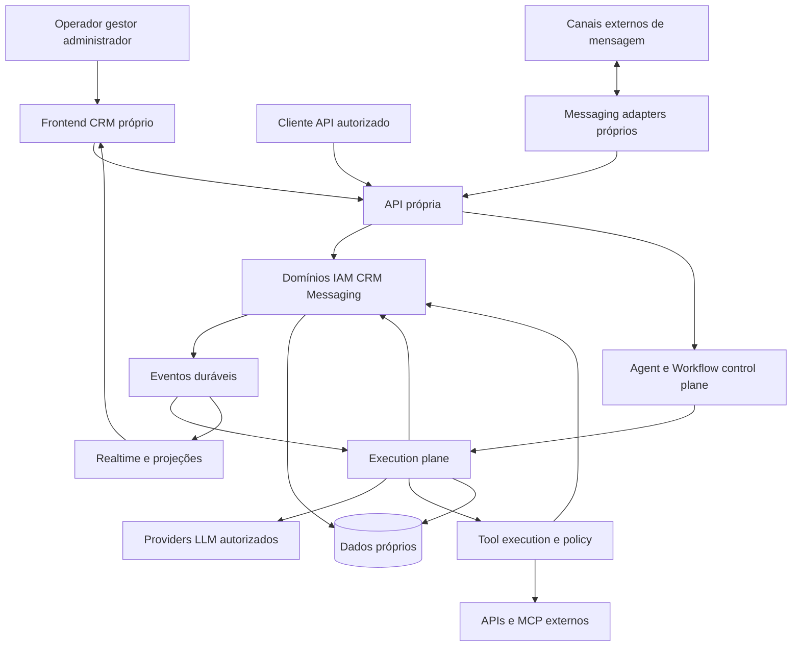

Fronteiras de confiança: browser e webhooks são não confiáveis; model/tool outputs são não confiáveis; workers recebem autoridade limitada por run; credential broker é zona privilegiada; banco e storage aplicam escopo além de validação na API. Observability recebe dados redigidos, não uma cópia irrestrita de tudo.

## 55. Domain architecture

Diagrama 11 — módulos lógicos, inicialmente monólito modular com processos especializados:

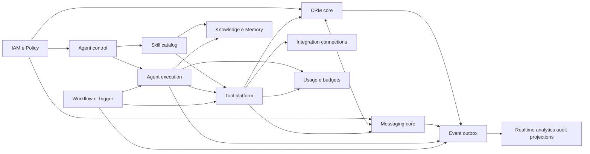

Regras de modularidade: cada módulo é dono de seus commands/queries e tabelas; tools internas invocam commands, não escrevem tabelas de CRM diretamente; controllers não contêm loop de agente; frontend não implementa política autoritativa; consumers não dependem de classes internas do produtor. Cross-domain transações são permitidas no monólito quando necessárias e explicitadas, mas side effects externos ficam fora delas.

API inicial orientada a recursos+commands, com schema único gerando validação e cliente tipado. Writes recebem `Idempotency-Key` onde há criação/efeito e `expectedRevision` onde há edição concorrente. A mesma chave com corpo diferente retorna conflito, não reaproveita resultado silenciosamente. Queries usam paginação por cursor e filtros autorizados. IDs opacos são strings na borda.

Contrato de erro: `code`, `category`, `message_safe`, `correlation_id`, `retry_after?`, `field_errors?`; respostas não revelam existência de recurso fora do escopo. Categorias: validation, forbidden, conflict, quota, dependency_unavailable, timeout, uncertain_effect, internal. Não exportar stack/provider payload ao operador comum.

O [dicionário lógico](domain-model.md) cobre todas as entidades requeridas, substituições justificadas, campos, relações, invariantes, lifecycle, constraints e transações.

## 56. Identity and tenancy

Organization é tenant econômico e de segurança. Workspace é compartimento operacional; usuário pode pertencer a vários, mas contexto ativo explícito só escolhe entre memberships autorizadas. Environment distingue teste/staging/produção dentro do workspace. Catálogo compartilhado em Organization compartilha **definição**, não dados de cliente ou credenciais.

Autenticação aceita identidade local/federada por adapter, mas autorização pertence ao produto. API deriva principal de sessão/token, resolve membership, seleciona scope autorizado e aplica policy. Cookie de sessão precisa proteção de transporte, CSRF quando pertinente, expiração/revogação e política de origem; API keys são hashes+scopes, nunca chave do provider LLM.

Banco compartilhado com escopo em todas as relações como baseline; RLS é defesa adicional, não substituto de policy de ação/campo. Workers também entram em escopo; não usar papel DBA na aplicação. Foreign keys compostas impedem relacionar Deal de A a Contact de B, mesmo com bug no serviço. Consultas administrativas cross-tenant exigem principal fleet separado, razão auditada e superfície fora da sessão normal.

Quando PostgreSQL for usado, owners/superusers/BYPASSRLS exigem cuidado: owners normalmente contornam RLS, a menos que FORCE seja aplicado; runtime deve ter papel restrito e testes de enforcement. Esse comportamento foi verificado na [documentação oficial de row security](https://www.postgresql.org/docs/17/ddl-rowsecurity.html). A proposta exige controles idênticos para checkpoints, não apenas para tabelas do CRM.

Isolamento adicional: bucket/object keys escopados e URLs assinadas após autorização; vetores filtrados por tenant/workspace **antes** de apresentar resultados; memória por subject+scope; caches incluem tenant/workspace/policy revision; credenciais por connection/environment/audience; quotas por org/workspace/agent; audit acessível por escopo e papel. Testes de negativa são obrigatórios para cada store, não só REST.

## 57. CRM

Contact e Company são entidades próprias, relacionadas N:N; ContactIdentity preserva origem/normalização de telefone/e-mail/canal. Dedupe propõe candidatos, não funde homônimos. Merge mantém redirects internos, histórico e mappings externos, reatribui relações em workflow auditado e exige revisão nos conflitos.

LeadProfile representa qualificação; Deal representa oportunidade comercial. Um contato pode ter diversos deals e uma empresa pode ter vários contatos. Pipeline/Stage têm ordem, tipo e política; mover Deal valida pipeline, revision e permissão; escreve history+event na mesma transação. Score não muda estágio sem command/regra explícita. Campos customizados têm definição tipada e política de leitura/escrita, inclusive para agentes.

Task/Note/Tag possuem autoria humana ou service principal e vínculos tipados a objetos. Notas privadas não são mensagens públicas. Um agente que cria tarefa usa `crm.task.create`, não injeta SQL nem escreve uma nota dizendo “criei” sem receipt.

Exemplo transacional de mudança de estágio:

```text
authorize(principal, deal.move, scopedDeal)
validate(expectedRevision, destinationStage belongsTo pipeline)
transaction:
  update Deal(stage, revision+1, stage_entered_at)
  append DealStageHistory(actor, reason, before, after)
  append DomainEvent(deal.stage_changed, aggregate_revision)
  append AuditLog(policy_decision)
commit → outbox delivery → projections/trigger evaluation
```

Relatórios de tempo em etapa vêm do histórico de transições, não de `updated_at`; mudanças cosméticas não alteram a métrica de ciclo comercial.

## 58. Messaging

O produto normaliza canais para um modelo próprio sem reduzir tudo ao denominador comum. Capability descriptor por Channel diz se suporta imagem, áudio, template, edit/delete, delivery/read receipts, threading, tamanho e idempotency key. Estados de canal podem ser diferentes; receipts originais são preservados com mapeamento explícito.

Inbound: resolver conexão confiável → verificar assinatura/timestamp conforme protocolo → gravar InboundReceipt deduplicada → ACK → normalizar/processar de forma recuperável → Message/Conversation → evento. Se normalização puder ocorrer em transação curta, receipt/message/event podem ser escritos juntos; se não, receipt durável garante recuperação. Sem ACK antes de alguma prova durável de recepção.

Outbound: command cria MessageIntent com conteúdo, autor, alvo, idempotency key e expected ownership_epoch; dispatcher revalida política/canal/consentimento/revogação/epoch; registra tentativa antes do I/O; chama adapter; persiste receipt ou uncertain_effect. Receipts tardios reconciliam estado, não geram nova mensagem duplicada. Provider accepted ≠ delivered ≠ read.

Handoff: transação muda owner/epoch e publica evento. Runs em voo passam a obsoletos para enviar/escrever onde policy exigir. Cancellation é pedido, não capacidade de retirar uma requisição já aceita externamente. UI mostra “assumido por humano; execução anterior encerrando” quando necessário.

Debounce é política de Trigger/Conversation, não concatenação sem identidade: burst guarda IDs/sequência das mensagens, deadline máximo, chave e geração; mensagem nova pode superseder draft, mas nunca apagar receipt de entrada. Anexos passam por quarantine, scan, validação MIME/tamanho e conversões em workers isolados. STT/vision geram derivados com provenance; original permanece conforme retenção.

## 59. Agent control plane

Responsável por autoria, versionamento, configuração, teste, publish, deployments, permissões, skills/tools/modelos/knowledge/memory policies/triggers/environments. Não executa diretamente write tool ao salvar uma configuração.

Diagrama 12 — control plane:

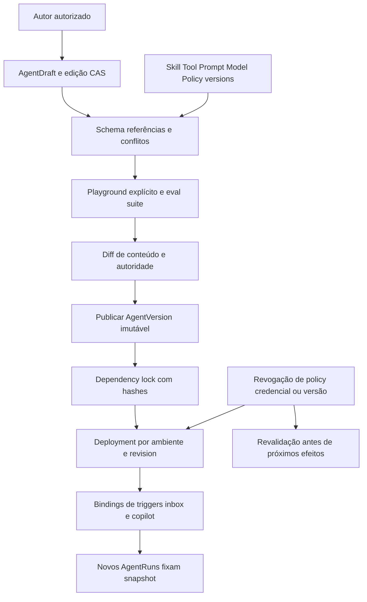

Publicação resolve árvore de dependências e rejeita: ciclo de skills; tool alias duplicado; required credential sem binding permitido; política conflitante; prompt com variável sem schema; provider sem capability requerida; references de outro workspace sem grant; ambiente teste usando credencial produção sem autorização explícita. Resultado inclui effective permissions e custo estimado de contexto.

AgentVersion congela **conteúdo e referências**, não segredo. Credential pode rotacionar sem reescrever AgentVersion, mas run registra geração/handle usado sem valor. Revogação atual sempre vence snapshot antigo. Deployment promotion exige diff de capacidades e dados compartilhados; rollback muda versão de runs novos e não reinterpreta os antigos.

Playground tem três modos explícitos: simulação sem efeitos (default), test connections isoladas, execução real autorizada. O UI lista quais ferramentas estão mockadas/reais antes do run. Testes/evals vinculam AgentVersion candidate + fixtures + esperado; nunca “verde” apenas porque respondeu algum texto.

## 60. Agent execution plane

Diagrama 13 — execução proposta:

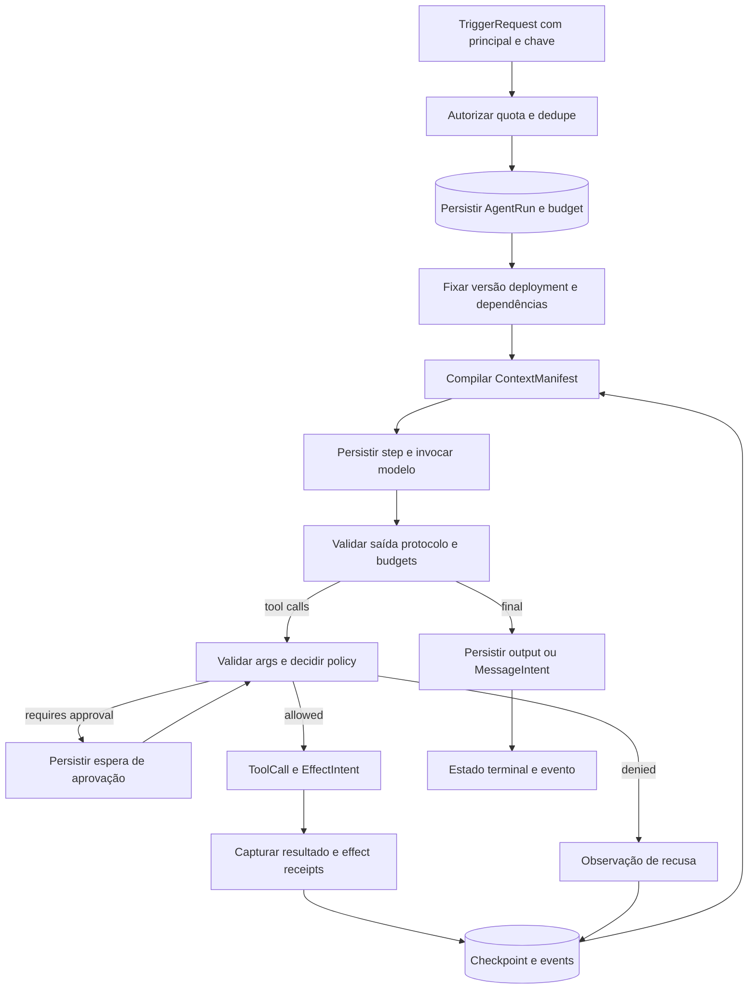

Algoritmo de cada step: adquirir lease/fence → ler checkpoint e estado atual → conferir cancel/revoke/budget/deadline → gravar step planned e tentativa → liberar transação → executar atividade → persistir resultado com CAS/fence → gravar checkpoint e evento. Nenhuma conexão de banco permanece em transação durante LLM/HTTP. Worker que perdeu lease não pode finalizar run nem lançar novo efeito, mas sua resposta tardia vira evidência para reconciliação.

Context compiler reúne políticas confiáveis de plataforma/workspace, AgentVersion, fragmentos de skills aprovados, estado comercial autorizado, memória relevante, retrieval permitido, janela de conversa e entrada corrente. Cada segmento tem origem, trust label, ordem, versão, contagem estimada/real quando disponível, regra de truncation e hash. Tool schemas também entram no orçamento. Conteúdo recuperado nunca pode ampliar privilégios.

Budget total por provider: `context_window - output_reserve - protocol_margin`. Primeiro reservar system/policy e tools mínimas; selecionar memória/retrieval; remover histórico por unidades protocolares inteiras; se mínimos+entrada atual não cabem, falhar com contexto excedido ou pedir redução — **não** apagar instrução de segurança silenciosamente. Schema de tool irrelevante não é exposto só porque existe no catálogo.

Diagrama 14 — state machine de AgentRun:

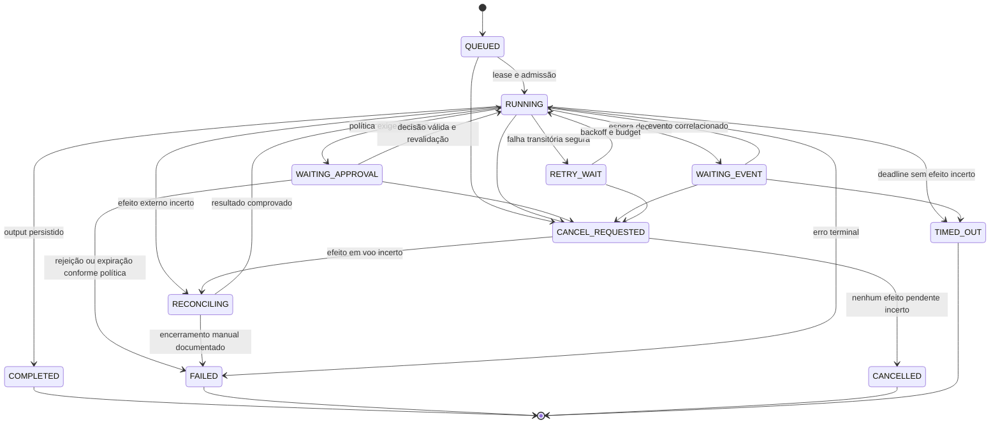

Reconciliation deve lembrar `desired_terminal_state` (cancelled/timed_out/failed). Depois de esclarecer efeito, não retoma loop se cancel foi solicitado; aplica o terminal desejado. Diagrama abstrai essas guardas; tabela de transição no código deverá explicitá-las. “FAILED” com efeito parcial conserva receipts e motivo, nunca declara rollback.

Retries por classe: erro de input/policy não retry; provider transient com cap e jitter; read tool retry limitado; write somente com idempotency contract ou prova de que não aconteceu; unknown write entra RECONCILING. Fallback só para endpoint permitido pelos mesmos requisitos de dados/capacidade. Reexecutar run terminal é novo run com parent/replay_of e autorização, não reset do histórico.

Cancellation propaga sinal e impede novos efeitos; timeout tem deadline do run, do step e do transporte. Checkpoints persistem cursor/input/output hashes, dependências, budgets, pending effects e decisions. Resumability não serializa stack/closure: replay usa resultados gravados; atividades não determinísticas (LLM, tempo, aleatório, HTTP) ficam fora da decisão determinística do workflow.

Streaming: tokens parciais são eventos efêmeros para operador autorizado, marcados draft/unvalidated. Não são a mensagem canônica nem output seguro aprovado. O resultado final validado substitui o draft por run_id/step_id/sequence. Falha/cancel retira ou marca draft sem fingir entrega. Streaming ao cliente externo exige política própria por canal e não faz parte do MVP.

## 61. Agent data model

Agent, Draft, Version, Deployment, Run, Step, Attempt, Checkpoint, RunMessage, ContextManifest e ModelCall têm responsabilidades distintas no [dicionário](domain-model.md). Dependency lock do run registra AgentVersion/SkillVersion/ToolVersion/PromptVersion/ModelPolicy/Knowledge revision/MemoryPolicy/PolicyVersion e runtime engine build.

Chaves de causalidade: `run_id`, `step_id`, `tool_call_id`, `effect_key`, `conversation_id`, `message_intent_id`, `trace_id`, `trigger_event_id`. Nenhuma delas substitui outra: trace identifica observabilidade, effect_key identifica operação idempotente, provider tool_call_id identifica protocolo de uma rodada.

Retenção: texto de prompts/outputs pode conter PII; manter encrypted content refs e prazo configurável, separado dos metadados mínimos para audit/metering. Replay completo pode tornar-se impossível após expurgo; UI informa “conteúdo expirado” e mantém integridade dos hashes/versões, sem prometer reprodução indiscriminada.

## 62. Model provider layer

Interface de domínio mínima: `generate`, `stream?`, `countTokens?`, `capabilities`, `normalizeError`, `normalizeUsage`. O request interno possui messages tipadas, tool specs, response schema opcional, limits, deadline e data policy. Adapters traduzem sem expor SDK classes ao CRM.

Capability matrix versionada por endpoint/modelo: tools, parallel calls, strict schema, structured output, image/audio, streaming, context size, usage reporting, data region e cancel behavior. Alguns campos são declarados pelo provider, outros validados por tests; UI diferencia ambos. Não confiar em regex de nome como único contrato de capacidade.

Resposta normalizada: texto/content blocks, tool calls validadas, finish_reason, usage_quality, provider_request_id, model_effective, raw_ref redigida. Tool calls inválidas são erro de protocolo corrigível com budget, não executadas parcialmente no parser. Structured output requerido que falha validação não entra no CRM como dado confiável.

Credenciais resolvidas just-in-time pelo broker; request sai somente para host permitido no endpoint. Fallback não contorna região/restrição de retenção nem troca para provider mais permissivo por indisponibilidade. Contract tests usam fixtures dos adapters e endpoints locais; canary real com dados sintéticos e limite financeiro precede habilitar modelo novo.

## 63. Tool platform

Contrato end-to-end: Tool → ToolVersion → schemas → ToolBinding → CredentialBinding → PolicyDecision → ToolCall → Attempt → EffectReceipt → ToolResult → audit. Catalogue UI descreve efeito e alvo, não só function signature. Classificação read/write/destructive é validada por executor e revisão, não declarada pelo modelo.

Autoridade efetiva é interseção de: tenant/workspace ativo; principal do deployment; permissões do autor que publicou; PolicyVersion; ToolBinding; credential audience/scopes; seleção de recurso; contexto do usuário/trigger; consentimento/regra do canal quando aplicável. `requested tools` de skill não concede nada. Policy indisponível implica deny/defer, não fail-open para write.

Resultado proposto:

```text
ToolResult {
  outcome: success | refused | failed | unknown_effect,
  effect_state: none | committed | partial | unknown,
  code, safe_message, output_schema_version, output_ref,
  effect_receipts[], retry_class, correlation_id
}
```

Args são parseados/canonicalizados antes de calcular action_digest. ApprovalRequest vincula tool version, args digest, resource revisions, target e policy; mudança de args/alvo/autoridade invalida aprovação. Para destructive, confirmação humana específica, prazo curto e separação de deveres configurável. O humano aprova **a ação**, não uma frase vaga do modelo.

Tool interna chama command de CRM/messaging sob principal e scope; transação grava mutação+effect receipt+event. Tool externa registra intenção antes de I/O e usa idempotency key estável quando provider suporta. Após timeout incerto, consulta status por referência; se API não oferece dedupe/status, bloqueia retry automático e pede reconciliação. Compensação é nova ação autorizada, não rollback fictício.

Pure tools podem executar localmente com limite de CPU/memória. Tools de código de terceiros, quando habilitadas em fase posterior, rodam em processo/container isolado sem mounts de host, sem secrets e com egress negado por default; credenciais por proxy e capabilities. Não conceder shell/SSH do servidor como ferramenta do cliente.

Para MCP: discovery em controle, snapshot/revisão de schemas/descriptions, namespace estável, allowlist explícita, mudança de schema bloqueia publish/exec conforme policy; runtime não aceita servidor mudar silenciosamente a assinatura de tool aprovada. Remote instructions são conteúdo não confiável a revisar, nunca override de política.

## 64. Skill platform

Skill nova é pacote declarativo de capacidade reutilizável, **não** cópia direta das skills administrativas B. Pode conter instructions, tool requirements, knowledge refs, workflow refs, policy constraints, resources e configuration schema. Scripts arbitrários não executam no loader: comportamento executável deve ser ToolVersion revisada/sandboxada ou AuthoringRecipe fora do plano de atendimento.

Versionar e instalar explicitamente. Semver pode comunicar compatibilidade, mas lock usa versão exata+hash. Resolver constrói DAG de dependências, rejeita ciclos e incompatibilidades com runtime/tool/schema. Não há upgrade silencioso de instalação ligada a AgentVersion publicado.

Escopos: organização pode publicar catálogo para workspaces; workspace instala e configura; AgentVersion vincula instalação. Compartilhar SkillVersion não compartilha automaticamente KB privada, workflow run ou CredentialBinding. Import/export remove secrets e exige resolução local das capabilities.

Precedence de conteúdo: plataforma/políticas determinísticas → workspace restrictions → instruções aprovadas do AgentVersion → fragmentos de skill em slots declarados → contexto externo não confiável. Isso organiza prompt, mas **segurança é policy engine**, não ordem textual. Conflitos entre skills (`tool alias`, campos, instruções mutuamente exclusivas) falham publicação ou exigem resolução explícita; não last-write-wins oculto.

Exemplo proposto: skill “qualificar lead” exige leitura de Contact/Conversation, tool `crm.lead.qualify` com schema de evidências, política de score e workflow opcional de tarefa para humano. Não exige mover Deal, enviar mensagem ou criar cobrança; essas capacidades precisariam de grants separados.

## 65. Knowledge

Pipeline: upload/conector → quarantine/scan → parse isolado → classificação/ACL → chunk versionado → embedding → index build → publicação atômica da revisão. Failed ingestion não substitui versão anterior pronta por conteúdo parcial. Objetos armazenam original; chunks mantêm offsets/citações e hash de origem.

Retrieval recebe principal/tenant/workspace/KB grants antes da consulta; combina filtros de acesso e revisão; semantic ranking nunca decide autorização. Limitar query/result size, aplicar score policy e retorno estruturado com citations. Documento externo com instruções hostis é dado, não policy. Cache inclui escopo/revisão/policy.

Modelo de embedding/dimensão fazem parte do perfil; migração usa índice paralelo e teste de recall/custo, não mistura vetores incompatíveis na mesma coluna sem identificação. Deletion/revocation remove acesso imediatamente e agenda expurgo de derivados/caches. Runs registram quais trechos realmente entraram no contexto.

## 66. Memory

Separar: histórico canônico de conversa, resumos de episódio, fatos de memória com evidência e estado operacional. Preferências do contato podem ser MemoryFact ou campo de domínio após validação; saldo, consentimento e permissão vêm de autoridade determinística atual, nunca de lembrança do LLM.

Writes de memória recebem subject/scope/source/confidence/validity/expiry/policy. Regras decidem auto-save, aprovação humana ou rejeição; dados sensíveis proibidos por política não podem ser gravados apenas porque o usuário pediu “lembre”. Contradição cria nova revision e marca anterior superseded, não merge textual sem autoria.

Resumo é derivado com range e source hash; pode ser recompilado após correção/expurgo. Não destruir log canônico como requisito para reduzir tokens: retention e context compression são políticas separadas. Retrieval de memória e KB têm finalidades distintas e filtros próprios. Cross-agent memory só quando mesma finalidade/subject/scope e policy permitirem.

## 67. Workflow engine

WorkflowVersion é spec tipado, validado e imutável; WorkflowRun é execução durável. Canvas é cliente editor desse spec, não engine no browser. Node types iniciais: trigger, condition, transform declarativo, agent invocation, tool invocation, branch, wait, approval, completion. Loops somente explícitos com bound e budget; sem JS livre embutido em expressão de condição no MVP.

Diagrama 15 — workflow proposto:

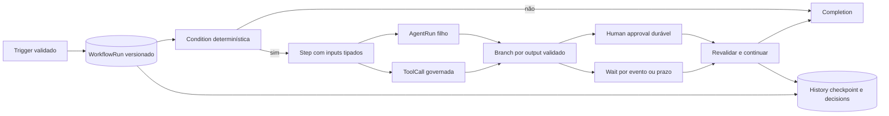

Execução durável é requisito porque waits/aprovações ultrapassam lifetime de processo. Decisões/outputs são persistidos; código de orquestração replayable não faz HTTP nem chama LLM diretamente. Activities representam operações não determinísticas com retry/idempotency próprios. Temporal é candidato forte, não parte do sistema observado: documentação distingue workflows, activities e políticas de retry. Defaults de activity retry não substituem política de side effects; devem ser limitados explicitamente. [Workflow](https://docs.temporal.io/workflows), [Activity](https://docs.temporal.io/activities), [retry policies](https://docs.temporal.io/encyclopedia/retry-policies).

Wait registra subscription tenant-scoped + deadline antes de aguardar. Evento/timeout/cancel disputam CAS, só um resolve. Evento que chega antes de o worker voltar deve ser consumível por histórico/receipt. Child AgentRun tem budget e principal restrito; falha/retry do parent não duplica child porque chave é workflowRun+node+iteration.

Version upgrade: runs antigos continuam versão congelada; migração explícita de run exige mapping de nodes/checkpoint e teste de replay. Publicar novo canvas não muda estrutura sob uma execução suspensa.

## 68. Automation engine

Não construir motor concorrente de “automations”: Trigger e Schedule são ingressos comuns para AgentRun/WorkflowRun. Rule simples compila para workflow pequeno ou solicita agent deployment. Event filter é tipado e auditável, não eval de expressão arbitrária.

Regras anti-loop: event contém causation/correlation/origin; trigger guarda dedupe key; limite de profundidade causal e budget por cadeia; default impede auto-reacionar ao próprio efeito quando não explicitado. Alteração de Deal por agente pode disparar workflow humano, mas não cascata infinita invisível.

Schedule guarda timezone, regra local, instante planejado e política DST/misfire. Produto oferece skip, execute-once ou bounded catch-up. Nunca disparar todo backlog histórico ao ativar regra; effective_at e reprocessamento de histórico são ações separadas com preview de volume e autorização.

## 69. Event architecture

Diagrama 16 — transação e distribuição:

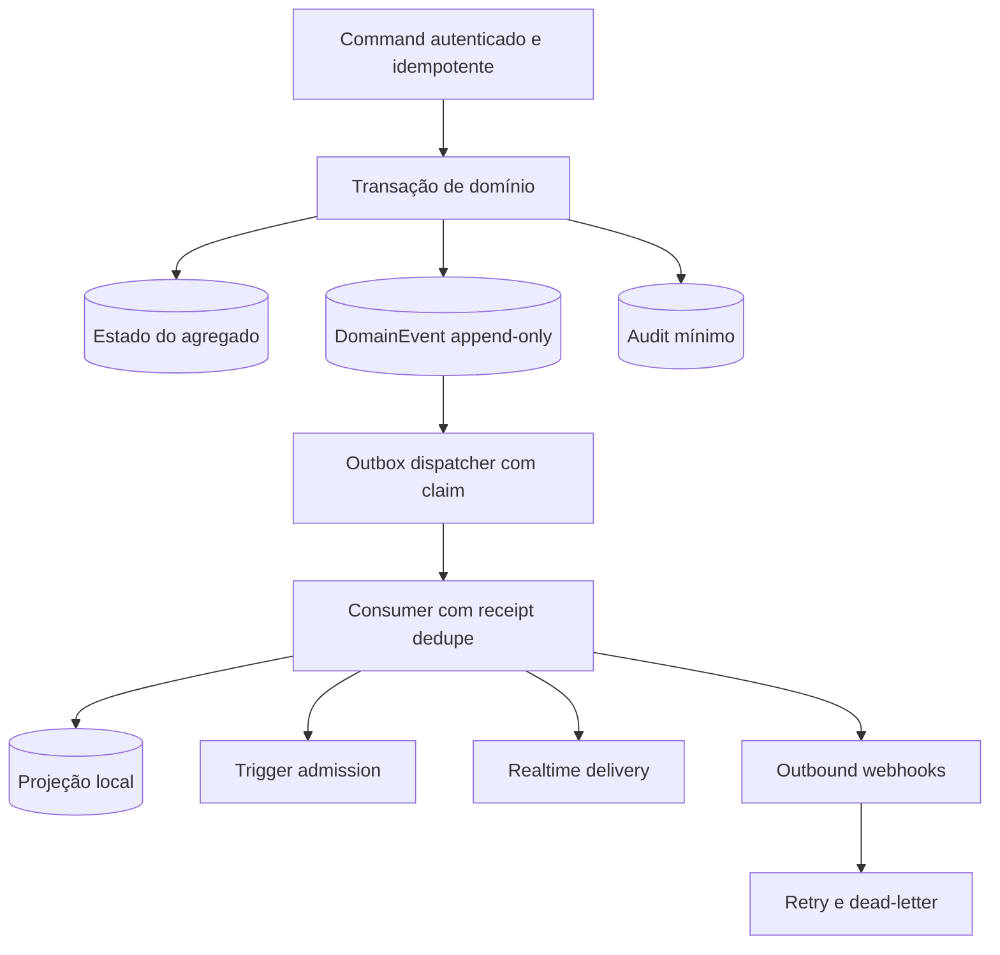

Envelope canônico proposto:

```json
{
  "event_id": "evt_opaque",
  "type": "deal.stage_changed",
  "schema_version": 1,
  "organization_id": "org_opaque",
  "workspace_id": "ws_opaque",
  "aggregate": {"type": "deal", "id": "deal_opaque", "revision": 12},
  "actor": {"principal_id": "principal_opaque", "run_id": "run_optional"},
  "occurred_at": "2026-09-09T15:00:00Z",
  "correlation_id": "corr_opaque",
  "causation_id": "command_or_prior_event",
  "payload": {"from_stage_id": "stage_a", "to_stage_id": "stage_b"}
}
```

Nomes propostos: `message.received`, `message.send_requested`, `message.delivery_updated`, `conversation.created`, `conversation.owner_changed`, `contact.updated`, `deal.stage_changed`, `agent.run.requested/started/completed/failed`, `agent.step.completed`, `tool.call.requested/completed/reconciliation_required`, `workflow.started/completed`, `approval.requested/decided`, `knowledge.revision_published`. Schemas versionados e compatibilidade testada; event “completed” sempre define se refere a execução, efeito ou delivery.

Garantias: at-least-once; ordering por aggregate revision quando necessário; consumidor deduplica por event_id. Outbox não garante exactly-once externo. Event sourcing completo não é obrigatório: estado transacional é canônico; events suportam projeções/integração/audit de mudanças definidas. Replay de analytics não deve redisparar mensagens; consumers de efeitos exigem modo replay explícito e negação por default.

## 70. Realtime

Diagrama 19 — mutation → transaction → event → delivery → reconciliation:

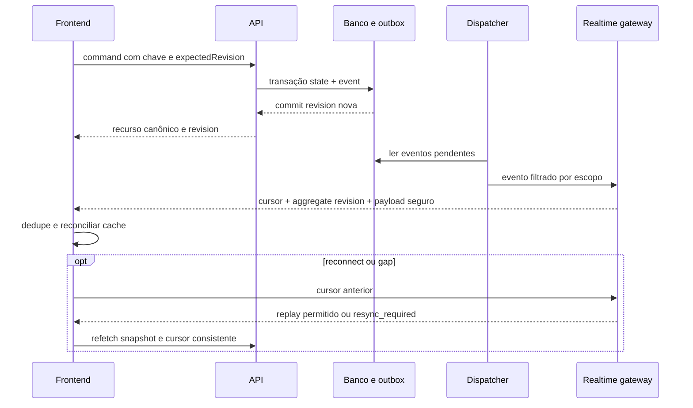

WebSocket é candidato para comunicação bidirecional/presença; SSE basta para feed unidirecional; decidir após requisitos de presença e teste de infra. Contrato não depende do transporte: canal autenticado por workspace e recursos, cursor, event_id, aggregate_revision, versioned payload e limites de backlog.

Client reconciliation: command response e event podem chegar em qualquer ordem; mesma revision não aplica duas vezes; event antigo ignora; gap faz refetch; exclusão remove cache e relações; mudança de workspace fecha conexão e limpa cache scoped; revogação invalida subscribe e mensagens futuras. Não transmitir payload a tópico “tenant” quando permission de campo/recurso é mais restrita.

Messages/conversations/CRM seguem eventos canônicos; runs/tool calls/workflows seguem timeline persistida. Tokens e presença são canais efêmeros separados, sem replay financeiro nem garantia de retenção. Slow client recebe resync em vez de buffer ilimitado. Múltiplas réplicas exigem fanout compartilhado ou consumo durável por gateway; publish em memória isolado não atende requisito.

## 71. Storage

Modelo lógico já definido; agora requisitos de storage:

| Classe | Requisito | Solução candidata inicial / evolução |
|---|---|---|
| Transacional | FKs, CAS, transações, tenancy, índices | PostgreSQL com papel restrito/RLS e migrations revisadas |
| Events/outbox/receipts | append, dedupe, ordenação por agregado, replay limitado | tabelas transacionais particionáveis; transporte externo só se medição exigir |
| Run/checkpoint | atomic step transitions e state refs duráveis | tabelas próprias; engine history separado quando Temporal usado, espelho de domínio reconciliável |
| Files | objetos grandes, quarantine, lifecycle, URLs curtas | object storage compatível com API S3, separado do banco |
| Search | filtros/ACL, texto e consistência eventual | índices de texto inicialmente no banco; motor externo após limites medidos |
| Vectors | dimensão/modelo/revisão, isolamento, nearest neighbors | pgvector como candidato, benchmark antes de produção |
| Cache | acelerar sem autoridade única | cache local scoped inicial; distribuído quando multi-replica exigir coerência |
| Queues | admissão, fairness, leases, retries | outbox/DB jobs mínimos ou task queues do engine durável |
| Analytics | agregações históricas sem bloquear OLTP | projeções/materializações; warehouse separado quando custo/latência justificar |

Diagrama 17 — persistência proposta:

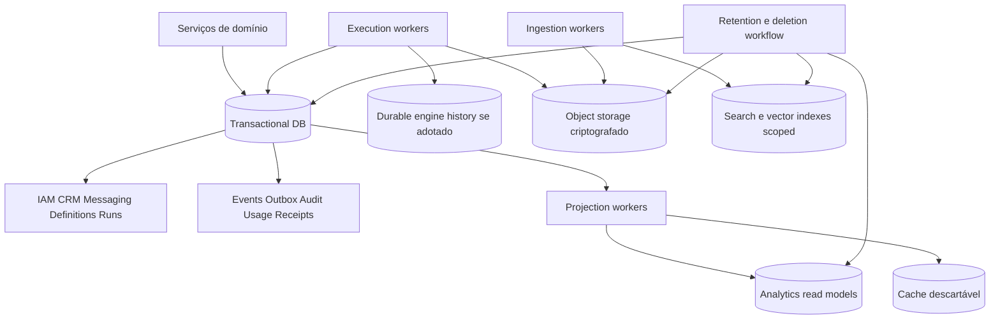

Backups são por store e consistência temporal documentada. Restore drill reconcilia outbox, pending effects e engine history antes de retomar envios. Cache nunca é única fonte de dedupe/approval. Transações não incluem upload/LLM; publicar metadados de arquivo somente depois de objeto confirmado e scan policy.

## 72. Search

Busca operacional de contato/conversa/negócio é distinta de retrieval para LLM. Query API aplica tenant, workspace, resource ACL e field ACL antes de devolver hits/snippets/counts; count de resultado também pode vazar existência. Index update segue outbox; resultado pode carregar revision e link para recurso canônico; recurso removido/revogado é filtrado na leitura mesmo antes de reindexar.

Busca semântica nunca devolve “todos tenants depois filtra no front”. Relevância híbrida pode combinar texto/vetor, mas deve ser medida com dataset representativo e etiquetas de acesso. Evals verificam recall e **zero hits cross-tenant** em consultas maliciosas/ambíguas. Não recomendar banco vetorial dedicado antes de medir dimensão, volume, recall, filtros e custo de operação.

## 73. Integrations

Integration define adapter/capacidades; Connection representa instalação em workspace/environment; ExternalAccount identifica conta real; CredentialBinding guarda autoridade; mappings ligam IDs externos a internos. Esse desenho evita o acoplamento a IDs Chatwoot observado em A.

Conectores têm: auth flow, validação de scopes, token refresh/revoke, assinatura webhook, normalize inbound, dispatch outbound, dedupe, cursor de sync, rate-limit budget, circuit breaker, status reconcile e health. Webhooks duplicados/atrasados/fora de ordem são normais; sync periódico recupera lacunas quando API permitir.

Credencial nunca entra em prompt/log/export. Broker injeta token no destino aprovado; ferramentas não recebem lista geral de secrets. Para HTTP configurável, URL é policy-bound e egress proxy bloqueia redes privadas/link-local/metadata e revalida redirects/DNS na conexão; limites de resposta/tempo/tamanho por binding.

Import de CRM externo é projeto de migração: staging, mapping, dedupe, preview, validação, commit em lotes e rollback lógico/reconciliation. Não transforma sistema externo em requisito para operar após import.

## 74. Frontend

IA proposta prioriza trabalho humano e mantém configuração da plataforma separada. As rotas abaixo **não são rotas observadas no CRM-Modelo**. Org/workspace explícitos no contexto e preferencialmente no caminho eliminam links ambíguos entre workspaces.

```text
/app/:org/:workspace/overview
/app/:org/:workspace/inbox/:conversationId?
/app/:org/:workspace/contacts/:contactId?
/app/:org/:workspace/companies/:companyId?
/app/:org/:workspace/deals               # view=board|table; pipeline=...
/app/:org/:workspace/tasks               # view=list|calendar
/app/:org/:workspace/agents
/app/:org/:workspace/agents/:agentId/overview
/app/:org/:workspace/agents/:agentId/build # prompt/model/context/skills/tools tabs
/app/:org/:workspace/agents/:agentId/test
/app/:org/:workspace/agents/:agentId/deployments
/app/:org/:workspace/agents/:agentId/runs/:runId?
/app/:org/:workspace/library/skills/:skillId?
/app/:org/:workspace/library/tools/:toolId?
/app/:org/:workspace/library/knowledge/:kbId?
/app/:org/:workspace/workflows/:workflowId?
/app/:org/:workspace/automations         # triggers/schedules, sem engine duplicado
/app/:org/:workspace/approvals
/app/:org/:workspace/integrations/:connectionId?
/app/:org/:workspace/analytics
/app/:org/:workspace/settings
/app/:org/settings                      # membros, billing, policies org
```

Pipeline config fica no contexto de deals/settings, não página obrigatória separada que duplica navegação. Agent build usa uma composição com snapshot/diff comum, evitando que tabs de tools/skills/knowledge publiquem versões contraditórias independentemente.

Diagrama 18 — frontend proposto:

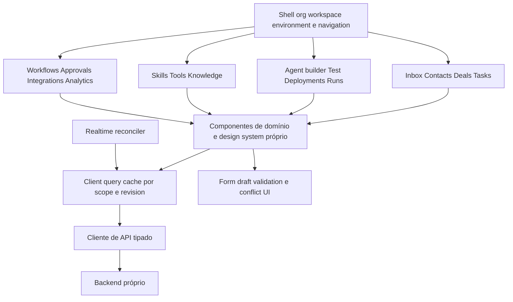

Frontend React é candidato pela composição de UI interativa e possibilidade de reusar componentes de domínio; não resolve sozinho routing/data cache. A documentação oficial alerta para o custo de montar uma aplicação sem framework e assumir essas decisões. Selecionar router/query/form stack em spike com vertical slice de inbox, não por popularidade. [React — tradeoffs de app from scratch](https://react.dev/learn/build-a-react-app-from-scratch).

Estrutura de código proposta: `app/shell`, `features/{inbox,crm,agents,workflows,...}`, `domain-view-models`, `api-client`, `realtime`, `ui`, `test-fixtures`. Componentes visuais não importam ORM; view model preserva distinguir message draft/delivery/state. Server state em cache; form drafts isolados; URL guarda filtros compartilháveis; estado transitório de pane local.

Inbox: lista virtualizável/paginada, timeline com scroll ancorado, composer por conversa, sidebar recolhível de contact/deal, ownership banner, copilot interno. Run detail: timeline de step/call/retrieval/approval, versões, custos, dados redigidos e receipt de efeitos. Tool builder: schema/input sample/output sample, risco, scope, egress e credential binding; versão publicada não editada in-place. Workflow node: input/config/output inspirado em SYN-09, com preview seguro e diferenças entre mock/test/live.

UX de falhas: pending/failed/unknown diferentes; optimistic update reversível só em mudanças locais de baixo risco, nunca fingir send/approval/tool success. 409 oferece diff/reload/merge, não sobrescreve mudanças alheias. Dirty draft avisa ao trocar workspace/versão. Acessibilidade: teclado, focus management, labels, aria-live moderado, contraste medido, redução de movimento e alternativa tabular ao canvas. Mobile usa master-detail sequencial; não espremer quatro colunas.

## 75. Security

Threat model: adversário pode controlar mensagem de cliente, documento recuperado, resposta HTTP/MCP, metadata de arquivo e parte do prompt/config se tiver papel de autor; pode induzir agente a usar credencial privilegiada ou acessar outro tenant. Modelo é planejador não confiável. Autorização e limites são código determinístico fora do prompt.

| Ameaça | Controle preventivo | Detecção/validação | Falha segura |
|---|---|---|---|
| Prompt injection direta | mensagens como dados, policy engine e tools mínimas | adversarial evals com pedidos de elevar escopo | deny de ação, sem depender da recusa textual LLM |
| Indirect injection em RAG/HTTP | trust labels, output schema, não promover a system, conteúdo limitado | fixtures de documentos/results hostis | interromper ação que requer authority ausente |
| Tool poisoning | versão/hash/schema aprovado, discovery no control plane | diff de capability e mudança remota | bloquear binding incompatível |
| Confused deputy | principal do run + resource selector + credential audience | tentativa de trocar target IDs e conta externa | negar cross-scope mesmo com token válido |
| Privilege escalation | interseção de grants, publish rights, deny precedence | testes de autor menos privilegiado e chained skills | publish/exec recusado |
| Secret leakage | broker/proxy, handles, redaction, egress allowlist | canary secrets sintéticos em evals e logs | bloquear output/egress e incidente |
| SSRF | resolver/conectar com política, egress proxy, privados/metadata bloqueados | DNS rebinding, redirects e IPv6 cases em ambiente de teste | nenhuma conexão ao alvo proibido |
| Arbitrary code execution | sem código externo MVP; sandbox process/container depois | escape attempts, resource exhaustion tests | kill isolado, sem mounts/secrets/network |
| Destructive action | classificação, digest approval, dual control quando requerido | invalidar aprovação após mudança de args/revision | não executar sem decisão válida |
| Tenant leakage | FKs compostas, RLS, ACL em search/cache/files/checkpoints | negative tests entre dois tenants em cada store | deny, sem fallback para scope global |
| Event spoofing/replay | assinatura/correlation trusted, receipts e nonce conforme canal | duplicatas/body mismatch/delay | quarantine ou dedupe |
| Exfiltração via observability | payload redigido, acesso restrito, retenção | revisão de atributos e fixture PII | telemetry mínima, sem bloquear audit obrigatório de write |

Approval não é prompt “peça permissão”: é objeto persistido com decision autenticada. Tool scopes não vêm do LLM. Sandbox não substitui autorização. Segurança de conhecimento inclui malware/parser, não só injection textual. Quotas se aplicam antes de reservar modelo/ferramenta, inclusive recursão de workflow.

Revogação: desativar workspace/connection/principal ou negar policy cancela novas execuções e invalida efeitos pendentes após recheck; operações em voo entram reconciliação. Atualização de policy registra motivo e versão, evitando replay que reintroduza privilégio antigo. Logs de segurança são separados de transcript acessível ao autor de prompt.

Privacidade/compliance: classificar dados, finalidade, consentimentos quando aplicáveis, retenção/export/delete e fornecedores; submeter decisões legais ao responsável apropriado. Este blueprint não conclui conformidade LGPD por nome de controle e não fixa prazo legal sem análise específica.

## 76. Observability

Hierarquia lógica proposta:

```text
Trace / correlation chain
└── AgentRun
    ├── context.compile
    ├── llm.call (provider/model/attempt)
    ├── tool.call (binding/version/effect_state)
    ├── retrieval (scope/revisions)
    ├── workflow.step (link ao parent)
    ├── approval.wait
    ├── message.dispatch
    └── event.publish / consume
```

OpenTelemetry é candidato vendor-neutral para spans/context propagation. Spans e links representam causalidade, inclusive trabalho assíncrono que não cabe numa única chamada síncrona; isso é distinto do ledger de domínio. [Traces e span context](https://opentelemetry.io/docs/concepts/signals/traces/).

Atributos mínimos: org/workspace IDs conforme política de cardinalidade, run/step IDs em traces/logs, agent/tool/prompt/model versions, outcome/error_class, duration, queue_wait, tokens_in/out, usage_quality, estimated/confirmed cost, policy decision code, checkpoint_no, external receipt state. Não colocar contato/telefone/prompt/token secreto em labels de métricas.

Métricas: p50/p95/p99 de admissão/context/model/tool/delivery; queue oldest age; retries por classe; percentage unknown_effect; approval wait; cancellation latency; provider fallback; input/output tokens por modelo; cap exceeded; outbox lag; dropped realtime/resync; dead letters; isolation denials; spend e reconciliation gap. Separar falha de modelo, falha de operação e resultado comercial.

SLOs iniciais como alvos a medir: API não-LLM p95≤300 ms em carga piloto; inbound ACK durável p95≤500 ms; run admitido começa p95≤2 s quando há quota; UI recebe evento canônico p95≤1 s após commit em conexão saudável. Tempo de provider e aprovação humana têm SLIs próprios; não prometer resposta total em 2 s.

Timeline de execução usa registros duráveis de run/steps/receipts e pode ser reconstruída mesmo se collector de traces falhar. Audit obrigatório de write deve fazer parte da transação local; telemetry detalhada pode degradar sob backpressure sem perder recibo de efeito. Evals ligam desempenho a versões e datasets, com revisão humana de fatos/recusas apropriadas.

## 77. Billing and metering

Subscription define entitlements por organização; quotas podem subdividir workspace/deployment. UsageRecord registra evento de consumo com origem única (ModelCall ou efeito), unidade, rate_version e qualidade estimated/confirmed. Não faturar log textual nem somar callback duplicado.

BudgetReservation antecede chamada/cadeia; concorrência reserva atomicamente para não permitir vários runs gastarem o mesmo saldo. Ao finalizar, settle com usage real quando disponível, liberar saldo restante; provider timeout com possível cobrança vira provisão estimada/reconciliação, não zero arbitrário. Retry do mesmo modelo pode gerar consumo adicional real; registrar tentativas sem duplicar o mesmo receipt.

UI mostra consumo/custo estimado, atraso de confirmação e limites; admin decide caps/alertas. Billing webhook usa assinatura/receipt/dedupe igual a outros inbound. Mudança de plano cria nova versão de entitlement; cancelamento não apaga usage/audit. Preços não são recomendados aqui: dependem de providers, margens, impostos e validação comercial futura.

## 78. Deployment

Diagrama 20 — implantação lógica proposta:

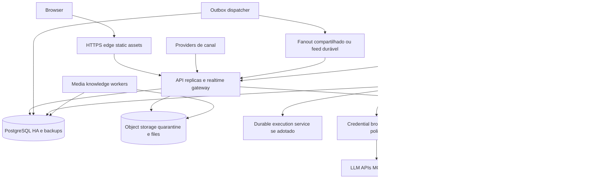

Começar com um código modular e deploys separados para API/realtime, workers de execução e ingestão. Escalar por fila/latência/conexões e limites de provider, não somente CPU. Credential broker/egress é fronteira de privilégio; sandbox de código é pool independente quando existir. Kubernetes não é requisito inicial; containers gerenciados ou VMs podem satisfazer isolamento/health/restart se testes comprovarem.

Health: liveness não depende de provider externo; readiness confirma capacidade de aceitar writes/receipts; drain retira worker da admissão, termina ou checkpointa steps e permite reconciliação de in-flight; não matar processo supondo que abort reverte HTTP. Migrations expand/contract, backfills por lote, compatibilidade de versões antigas do worker e replay tests antes de substituir engine code.

Backups com restore drill periódico, proteção de chaves, testes de expurgo e disaster recovery. Objetivos iniciais a negociar: RPO≤5min para desastre regional e RTO≤60min em piloto; receipt já confirmado deve ter durabilidade coerente com o tier vendido. Se implantação escolhida não entrega esses objetivos, reduzir promessa ou investir em HA antes de produção.

Sem dependência operacional de Fazer Agents, CRM-Modelo ou Chatwoot. Conectores/importadores para qualquer um seriam opcionais, com contratos e autorização próprios.
